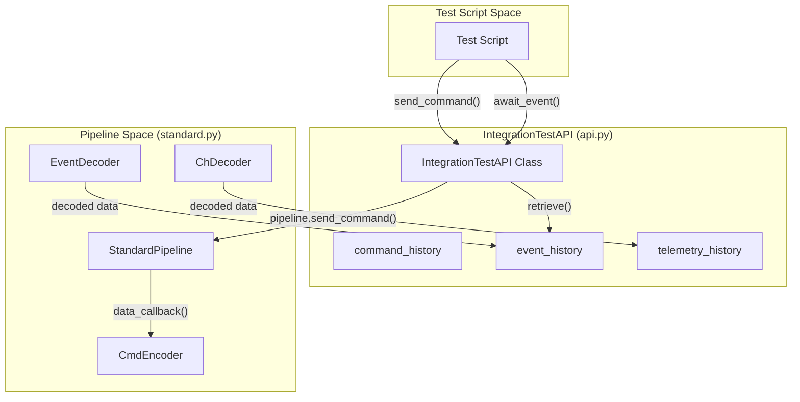
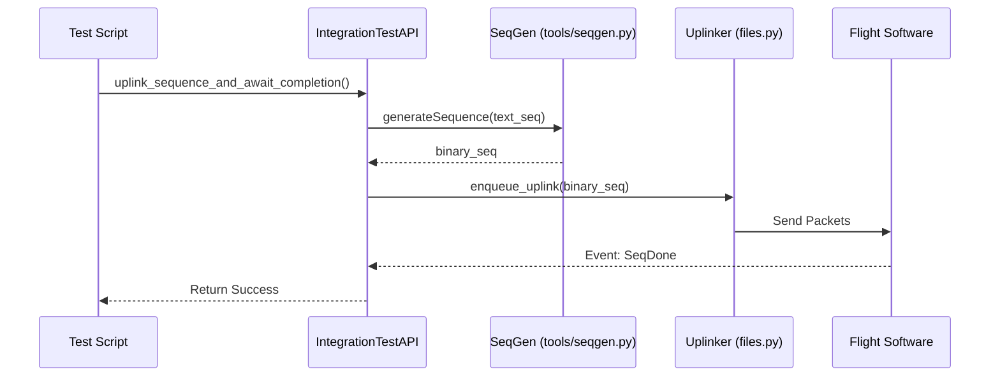

# Page: IntegrationTestAPI

# IntegrationTestAPI

<details>
<summary>Relevant source files</summary>

The following files were used as context for generating this wiki page:

- [src/fprime_gds/common/data_types/pkt_data.py](src/fprime_gds/common/data_types/pkt_data.py)
- [src/fprime_gds/common/pipeline/encoding.py](src/fprime_gds/common/pipeline/encoding.py)
- [src/fprime_gds/common/pipeline/standard.py](src/fprime_gds/common/pipeline/standard.py)
- [src/fprime_gds/common/testing_fw/__init__.py](src/fprime_gds/common/testing_fw/__init__.py)
- [src/fprime_gds/common/testing_fw/api.py](src/fprime_gds/common/testing_fw/api.py)
- [src/fprime_gds/common/testing_fw/predicates.py](src/fprime_gds/common/testing_fw/predicates.py)
- [src/fprime_gds/common/testing_fw/pytest_integration.py](src/fprime_gds/common/testing_fw/pytest_integration.py)
- [test/fprime_gds/common/history/chronohistory_unit_test.py](test/fprime_gds/common/history/chronohistory_unit_test.py)
- [test/fprime_gds/common/history/testhistory_unit_test.py](test/fprime_gds/common/history/testhistory_unit_test.py)
- [test/fprime_gds/common/testing_fw/UnitTestDictionary.xml](test/fprime_gds/common/testing_fw/UnitTestDictionary.xml)
- [test/fprime_gds/common/testing_fw/api_unit_test.py](test/fprime_gds/common/testing_fw/api_unit_test.py)
- [test/fprime_gds/common/testing_fw/predicate_unit_test.py](test/fprime_gds/common/testing_fw/predicate_unit_test.py)

</details>


The `IntegrationTestAPI` provides a high-level interface for writing automated integration tests against an F´ deployment. It abstracts the complexities of the GDS pipeline, allowing developers to send commands, await specific events or telemetry states, and perform file uplinks using a synchronous, predicate-based search model.

## Overview and Initialization

The `IntegrationTestAPI` acts as a `DataHandler` that registers itself with a `StandardPipeline` to consume decoded command, event, and telemetry data [src/fprime_gds/common/testing_fw/api.py:29-37](). Upon initialization, it creates private test histories (either `ChronologicalHistory` or `TestHistory`) to store incoming data specifically for the test session, ensuring that test searches do not interfere with the global GDS state [src/fprime_gds/common/testing_fw/api.py:54-66]().

### Search Lifecycle
Most "await" functions in the API follow a standard lifecycle:
1.  **Predicate Construction**: The user provides a search criteria (e.g., an event name or a telemetry value range).
2.  **History Search**: The API searches its internal `test_history` for items matching the predicate.
3.  **SIGALRM / Timeout Await**: If no match is found, the API utilizes a timeout mechanism (often involving `signal.alarm` or polling) to wait for new data to arrive via the pipeline [src/fprime_gds/common/testing_fw/api.py:11-12]().
4.  **Completion**: Once the predicate is satisfied or the timeout expires, the function returns the found items or raises an `AssertionError`.

### Code Entity Relationship
The following diagram illustrates how the `IntegrationTestAPI` bridges high-level test calls to the underlying pipeline components.

**API to Pipeline Mapping**

Sources: [src/fprime_gds/common/testing_fw/api.py:29-66](), [src/fprime_gds/common/pipeline/standard.py:29-55](), [src/fprime_gds/common/pipeline/encoding.py:20-42]()

---

## Core Command and Telemetry API

### Command Dispatch
*   **`send_command(command, args)`**: Encapsulates the pipeline call to send a command. It logs the action to the `TestLogger` and returns the `CmdData` object [src/fprime_gds/common/testing_fw/api.py:214-230]().
*   **`send_and_await_event(command, args, event_pred)`**: A convenience wrapper that sends a command and immediately begins an `await_event` search [src/fprime_gds/common/testing_fw/api.py:232-252]().

### Event and Telemetry Awaiters
These functions block execution until a condition is met or a timeout occurs.

| Function | Description | Source |
| :--- | :--- | :--- |
| `await_event(event_pred, timeout, count)` | Blocks until `count` events matching `event_pred` are found. | [api.py:348-371]() |
| `assert_event(event_pred, timeout, count)` | Similar to `await_event` but raises a logged `AssertionError` on failure. | [api.py:373-395]() |
| `await_telemetry(ch_pred, timeout, count)` | Blocks until `count` telemetry updates matching `ch_pred` are found. | [api.py:465-488]() |
| `assert_telemetry_count(ch_pred, count, timeout)` | Asserts that exactly `count` items matching the predicate exist. | [api.py:514-536]() |

### Time Management
The API tracks `latest_time` to allow searches relative to "now".
*   **`get_latest_time()`**: Queries the aggregate histories for the most recent FSW timestamp [src/fprime_gds/common/testing_fw/api.py:137-156]().
*   **`IntegrationTestAPI.NOW`**: A constant used to start searches from the current point in time, ignoring historical data [src/fprime_gds/common/testing_fw/api.py:35]().

Sources: [src/fprime_gds/common/testing_fw/api.py:348-536]()

---

## File and Sequence Operations

The API provides methods to interface with the `FileUplinker` and sequence generation tools.

*   **`uplink_file(local_path, destination_path)`**: Initiates a file uplink via the pipeline's `files.uplinker`. It blocks until the transfer state reaches `FINISHED` or `CANCELLED` [src/fprime_gds/common/testing_fw/api.py:618-644]().
*   **`uplink_sequence_and_await_completion(sequence_path, timeout)`**: 
    1.  Translates a `.seq` file into a binary `.bin` file using `generateSequence` [src/fprime_gds/common/testing_fw/api.py:656-666]().
    2.  Uplinks the binary file to the FSW [src/fprime_gds/common/testing_fw/api.py:674-676]().
    3.  Awaits a specific event (e.g., `Svc.SeqDone`) to signal execution completion [src/fprime_gds/common/testing_fw/api.py:680-694]().

**Uplink Data Flow**

Sources: [src/fprime_gds/common/testing_fw/api.py:646-702](), [src/fprime_gds/common/tools/seqgen.py:25]()

---

## Predicate Construction Helpers

The API includes factory methods to simplify the creation of complex predicates from the `predicates` module.

*   **`get_event_pred(name, args, severity)`**: Constructs an `event_predicate`. If `name` is a string, it looks up the ID in the dictionary [src/fprime_gds/common/testing_fw/api.py:734-758]().
*   **`get_ch_pred(name, value)`**: Constructs a `telemetry_predicate`. If `value` is not a predicate, it wraps it in an `equal_to` predicate [src/fprime_gds/common/testing_fw/api.py:760-781]().

### Logic Composition
Users can combine predicates using logic classes:
*   `satisfies_all([p1, p2])`: Logical AND [src/fprime_gds/common/testing_fw/predicates.py:274]().
*   `satisfies_any([p1, p2])`: Logical OR [src/fprime_gds/common/testing_fw/predicates.py:307]().
*   `invert(p1)`: Logical NOT [src/fprime_gds/common/testing_fw/predicates.py:340]().

Sources: [src/fprime_gds/common/testing_fw/api.py:734-781](), [src/fprime_gds/common/testing_fw/predicates.py:270-360]()

---

## Pytest Integration

The framework provides a `pytest` plugin to automate API setup and teardown.

1.  **`fprime_test_api_session`**: A session-scoped fixture that initializes the `StandardPipeline`, connects to the GDS, and creates the `IntegrationTestAPI` instance [src/fprime_gds/common/testing_fw/pytest_integration.py:74-112]().
2.  **`fprime_test_api`**: A function-scoped fixture that calls `api.start_test_case()`, which clears histories and logs the test name, ensuring a clean slate for every individual test [src/fprime_gds/common/testing_fw/pytest_integration.py:130-150]().

**Example Usage:**
```python
def test_component_logic(fprime_test_api):
    fprime_test_api.send_command("CMD_NAME", [arg1, arg2])
    fprime_test_api.assert_event(fprime_test_api.get_event_pred("EVENT_NAME"))
```

Sources: [src/fprime_gds/common/testing_fw/pytest_integration.py:74-151]()
