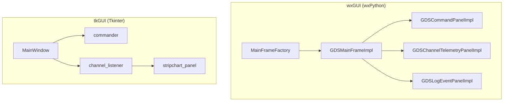
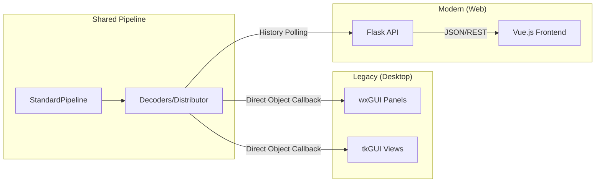

# Page: Legacy GUIs (wxGUI & tkGUI)

# Legacy GUIs (wxGUI & tkGUI)

Relevant source files

The following files were used as context for generating this wiki page:

- [src/fprime_gds/common/data_types/file_data.py](src/fprime_gds/common/data_types/file_data.py)
- [src/fprime_gds/common/decoders/file_decoder.py](src/fprime_gds/common/decoders/file_decoder.py)
- [src/fprime_gds/executables/__init__.py](src/fprime_gds/executables/__init__.py)

The F´ GDS includes two legacy desktop GUI implementations: **wxGUI** (built with wxPython) and **tkGUI** (built with Tkinter). While the modern GDS primarily utilizes a Flask-based web interface, these legacy implementations provide traditional desktop-based visualization and commanding capabilities. They are structured around panels and views that subscribe to data from the GDS pipeline.

### Overview of Legacy Implementations

The legacy GUIs serve as alternative frontends to the same underlying GDS pipeline. They interface with the `StandardPipeline` or the `tcpserver` to receive telemetry (channels and events) and dispatch commands.

| Feature | wxGUI (wxPython) | tkGUI (Tkinter) |
|:---|:---|:---|
| **Primary Class** | `GDSMainFrameImpl` | `GSEMain` / `MainWindow` |
| **Architecture** | Model-View-Controller (MVC) | Controller-based views |
| **Commanding** | `GDSCommandPanelImpl` | `commander`, `command_loader` |
| **Telemetry** | `GDSChannelTelemetryPanelImpl` | `channel_listener`, `stripchart_panel` |
| **Event Logs** | `GDSLogEventPanelImpl` | `log_panel` |

### Code Entity Mapping

The following diagram maps the conceptual GUI components to their specific implementation classes and files within the codebase.

**Legacy GUI Component Mapping**

**Sources:** Documentation derived from `fprime_gds/wxgui` and `fprime_gds/tkgui` structures (referenced in section 10.1 and 10.2).

---

### wxGUI Panels & MainFrameFactory

The wxPython implementation is built using a factory pattern to manage the lifecycle of the main application window and its constituent panels. It uses a dependency-injection style via `MainFrameFactory` to assemble the UI.

*   **Main Frame:** The `GDSMainFrameImpl` acts as the primary container, managing tabs for commanding, telemetry, and logging.
*   **Commanding:** `GDSCommandPanelImpl` handles user input for command mnemonics and arguments, facilitating command dispatch through the encoder pipeline.
*   **Telemetry & Filtering:** `GDSChannelTelemetryPanelImpl` displays real-time channel updates, while `GDSChannelFilterDialogImpl` allows users to prune the visible data set.
*   **Event Logging:** `GDSLogEventPanelImpl` provides a scrolling view of system events, often color-coded by severity.

For details, see [wxGUI Panels & MainFrameFactory](#10.1).

---

### tkGUI Views & Controllers

The Tkinter implementation (tkGUI) is often used for lightweight or specialized GSE (Ground Support Equipment) tasks. It relies on a set of controllers to bridge the gap between the binary data stream and the visual elements.

*   **Controllers:** The `channel_listener` and `commander` act as the logic layer, handling the subscription to the `Distributor` and the invocation of the `Encoder`.
*   **Views:** Specialized frames like `stripchart_panel` provide graphical representations of telemetry over time, while `seq_panel` handles the execution of command sequences.
*   **Integration:** It utilizes `gse_api` tools to interface with the broader F´ ecosystem, including sequence generation utilities.

For details, see [tkGUI Views & Controllers](#10.2).

---

### Relationship to Modern Web UI

The legacy GUIs and the modern Flask-based Web UI share the same backend decoders and data types. For instance, file data received by the GDS is processed by the `FileDecoder` [src/fprime_gds/common/decoders/file_decoder.py:24-25](), which produces `FilePacketType` objects like `StartPacketData` or `DataPacketData` [src/fprime_gds/common/data_types/file_data.py:26-65]().

While the legacy GUIs render these objects directly in desktop widgets, the modern UI serves them via the Flask REST API.

**Data Flow Comparison**

**Sources:**
- `src/fprime_gds/common/decoders/file_decoder.py:24-72`
- `src/fprime_gds/common/data_types/file_data.py:14-133`
