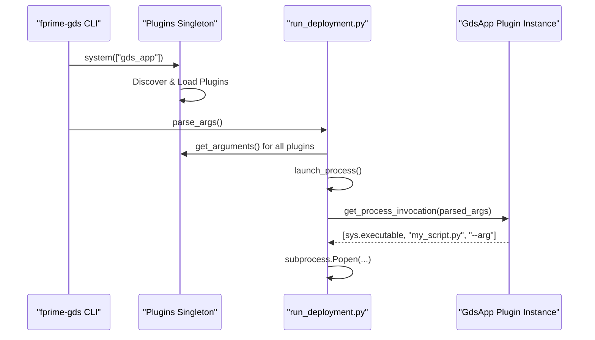

# Page: Plugin Architecture

# Plugin Architecture

<details>
<summary>Relevant source files</summary>

The following files were used as context for generating this wiki page:

- [.github/actions/codeql/security-pack.yml](.github/actions/codeql/security-pack.yml)
- [.github/actions/spelling/excludes.txt](.github/actions/spelling/excludes.txt)
- [.github/actions/spelling/patterns.txt](.github/actions/spelling/patterns.txt)
- [.github/workflows/codeql-security-scan.yml](.github/workflows/codeql-security-scan.yml)
- [.github/workflows/fprime-gds-tests.yml](.github/workflows/fprime-gds-tests.yml)
- [.github/workflows/gds-cli-tests.yml](.github/workflows/gds-cli-tests.yml)
- [.github/workflows/publish.yml](.github/workflows/publish.yml)
- [.github/workflows/spelling.yml](.github/workflows/spelling.yml)
- [src/fprime_gds/common/communication/adapters/base.py](src/fprime_gds/common/communication/adapters/base.py)
- [src/fprime_gds/common/communication/ccsds/__init__.py](src/fprime_gds/common/communication/ccsds/__init__.py)
- [src/fprime_gds/common/communication/ccsds/chain.py](src/fprime_gds/common/communication/ccsds/chain.py)
- [src/fprime_gds/common/communication/checksum.py](src/fprime_gds/common/communication/checksum.py)
- [src/fprime_gds/common/communication/framing.py](src/fprime_gds/common/communication/framing.py)
- [src/fprime_gds/common/handlers.py](src/fprime_gds/common/handlers.py)
- [src/fprime_gds/common/pipeline/histories.py](src/fprime_gds/common/pipeline/histories.py)
- [src/fprime_gds/executables/apps.py](src/fprime_gds/executables/apps.py)
- [src/fprime_gds/executables/cli.py](src/fprime_gds/executables/cli.py)
- [src/fprime_gds/executables/comm.py](src/fprime_gds/executables/comm.py)
- [src/fprime_gds/executables/run_deployment.py](src/fprime_gds/executables/run_deployment.py)
- [src/fprime_gds/executables/utils.py](src/fprime_gds/executables/utils.py)
- [src/fprime_gds/flask/logs.py](src/fprime_gds/flask/logs.py)
- [src/fprime_gds/plugin/__init__.py](src/fprime_gds/plugin/__init__.py)
- [src/fprime_gds/plugin/definitions.py](src/fprime_gds/plugin/definitions.py)
- [src/fprime_gds/plugin/system.py](src/fprime_gds/plugin/system.py)
- [test/fprime_gds/executables/test_run_deployment.py](test/fprime_gds/executables/test_run_deployment.py)
- [test/fprime_gds/test_plugins.py](test/fprime_gds/test_plugins.py)

</details>


The F´ GDS utilizes a robust plugin architecture based on the `pluggy` library to allow developers to extend the system without modifying the core codebase. This architecture supports extending communication protocols, framing formats, background applications, and data handling logic.

## Plugins Singleton and Lifecycle

The plugin system is managed by a `Plugins` singleton defined in `fprime_gds.plugin.system`. This class is responsible for discovering plugins, managing their registration, and providing access to plugin classes and instances.

### Plugin Discovery
Plugins are discovered through three primary mechanisms:
1.  **Built-in Plugins**: Hardcoded implementations within the `fprime-gds` package.
2.  **Entry Points**: Python packages installed in the environment that define `fprime_gds` entry points in their `setup.py` or `pyproject.toml`.
3.  **Environment Variable**: The `FPRIME_GDS_EXTRA_PLUGINS` environment variable can point to additional directories containing plugin implementations.

### Selection vs. Feature Categories
Plugins are divided into two functional categories:
*   **Selection Plugins**: These represent interchangeable implementations where only one can be active at a time for a specific role (e.g., `communication` adapters or `framing` protocols). Users select these via CLI arguments like `--communication-selection` [src/fprime_gds/executables/comm.py:50-85]().
*   **Feature Plugins**: These represent additive functionality. Multiple feature plugins can run simultaneously (e.g., multiple `gds_app` plugins or `data_handler` plugins).

### Plugin Discovery and Loading Flow
The following diagram illustrates how the `Plugins` singleton initializes and discovers extensions.

**Plugin Discovery Flow**
```mermaid
graph TD
    subgraph "Initialization Space"
        "Plugins.system(categories)"["Plugins.system(categories)"]
        "load_plugins()"["_load_plugins()"]
    end

    subgraph "Discovery Space"
        "EntryPoints"["pkg_resources Entry Points"]
        "EnvVar"["FPRIME_GDS_EXTRA_PLUGINS"]
        "BuiltIn"["Internal GDS Modules"]
    end

    subgraph "Registration Space"
        "PluginManager"["pluggy.PluginManager"]
        "Registry"["Plugins._plugins (Dict)"]
    end

    "Plugins.system(categories)" --> "load_plugins()"
    "load_plugins()" --> "EntryPoints"
    "load_plugins()" --> "EnvVar"
    "load_plugins()" --> "BuiltIn"
    
    "EntryPoints" --> "PluginManager"
    "EnvVar" --> "PluginManager"
    "BuiltIn" --> "PluginManager"
    
    "PluginManager" -- "Hook Call" --> "Registry"
```
**Sources:** [src/fprime_gds/plugin/system.py:20-100](), [src/fprime_gds/executables/comm.py:51-51]()

---

## Plugin Implementation Interfaces

Plugins are defined by implementing specific "hook" functions decorated with `@gds_plugin_implementation`. The core system defines "specifications" using `@gds_plugin_specification`.

### 1. Communication Plugins
Used to implement new "wire" protocols (e.g., BlueTooth, SpaceWire).
*   **Base Class**: `fprime_gds.common.communication.adapters.base.BaseAdapter` [src/fprime_gds/common/communication/adapters/base.py:16-68]()
*   **Registration Hook**: `register_communication_plugin` [src/fprime_gds/common/communication/adapters/base.py:52-66]()
*   **Key Methods**: `read()`, `write()`, `open()`, `close()`.

### 2. Framing Plugins
Used to implement packet encapsulation (e.g., CCSDS, SLIP).
*   **Base Class**: `fprime_gds.common.communication.framing.FramerDeframer` [src/fprime_gds/common/communication/framing.py:29-105]()
*   **Registration Hook**: `register_framing_plugin` [src/fprime_gds/common/communication/framing.py:88-103]()
*   **Key Methods**: `frame()`, `deframe()`.

### 3. GDS App Plugins
Used to launch auxiliary processes or functions alongside the GDS.
*   **Base Classes**: 
    *   `GdsFunction`: Runs a Python function in the main process [src/fprime_gds/executables/apps.py:55-89]().
    *   `GdsApp`: Launches a completely separate subprocess [src/fprime_gds/executables/apps.py:91-169]().
*   **Registration Hook**: `register_gds_app_plugin` or `register_gds_function_plugin`.

### 4. Data Handler Plugins
Used to process telemetry or events as they arrive in the pipeline.
*   **Base Class**: `fprime_gds.common.handlers.DataHandler` [src/fprime_gds/common/handlers.py:10-30]()
*   **Registration Hook**: `register_data_handler_plugin`.

---

## Plugin Execution and Data Flow

When `run_deployment.py` starts, it uses `PluginArgumentParser` to collect CLI arguments defined by all discovered plugins [src/fprime_gds/executables/run_deployment.py:36-53](). 

**Component Interaction Diagram**

**Sources:** [src/fprime_gds/executables/run_deployment.py:192-209](), [src/fprime_gds/executables/cli.py:71-86](), [src/fprime_gds/executables/apps.py:116-123]()

### Handling Arguments
Plugins can define their own command-line arguments by implementing the `get_arguments` class method. This method returns a dictionary mapping flag tuples to `argparse` keyword arguments [test/fprime_gds/test_plugins.py:104-113]().

The `ParserBase.safe_add_argument` utility ensures that if multiple plugins define the same flag, the GDS does not crash, though the first registered plugin typically takes precedence [src/fprime_gds/executables/cli.py:88-105]().

---

## Example Implementation: Framing Plugin

To implement a custom framer, a developer creates a class that inherits from `FramerDeframer` and provides the registration hook.

```python
from fprime_gds.common.communication.framing import FramerDeframer
from fprime_gds.plugin.definitions import gds_plugin_implementation

class MyCustomFramer(FramerDeframer):
    def frame(self, data: bytes) -> bytes:
        return b"START" + data + b"END"

    def deframe(self, data: bytes, no_copy=False):
        # Implementation of deframing logic
        pass

    @classmethod
    @gds_plugin_implementation
    def register_framing_plugin(cls):
        return cls
```
**Sources:** [src/fprime_gds/common/communication/framing.py:29-105](), [test/fprime_gds/test_plugins.py:60-80]()

### Error Handling in Plugins
The plugin system validates that returned classes are non-abstract and inherit from the correct base class. If a plugin fails these checks, a `PluginsNotLoadedException` may be raised during system initialization [src/fprime_gds/plugin/system.py:37-37](), [test/fprime_gds/test_plugins.py:32-58]().
