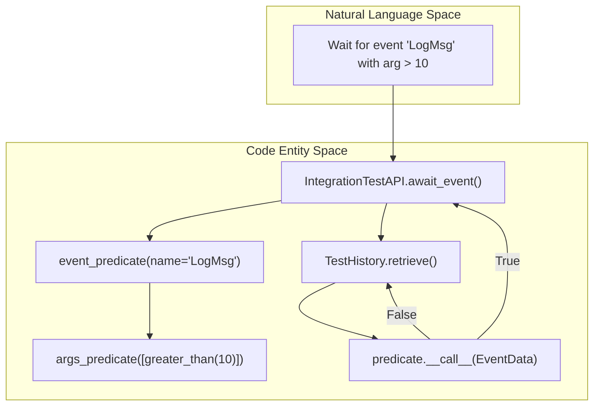
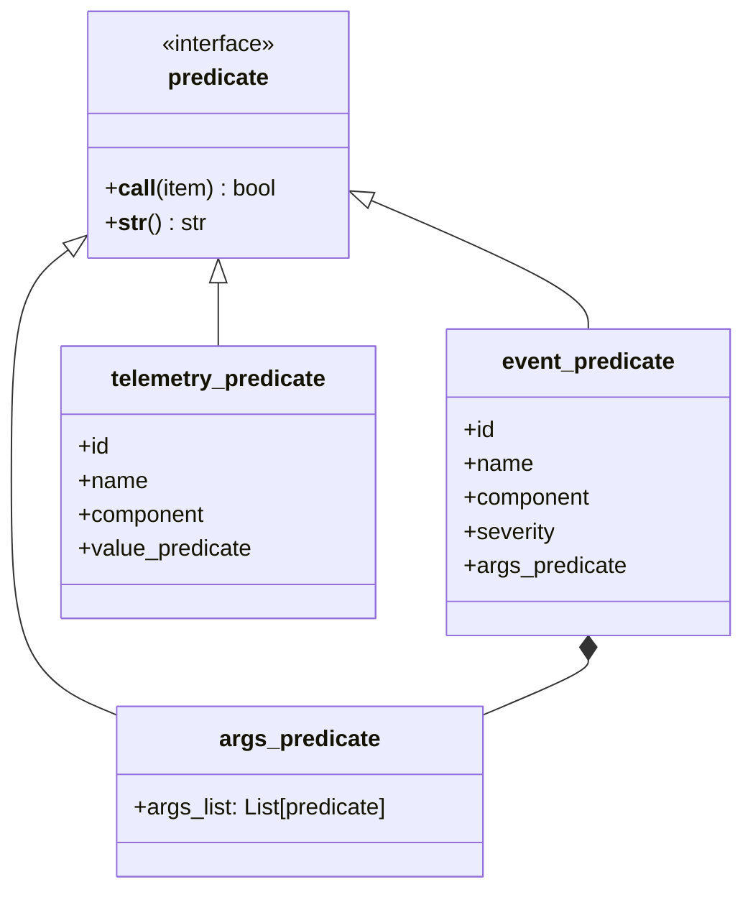

# Page: Predicate Engine

# Predicate Engine

Relevant source files

The following files were used as context for generating this wiki page:

- [src/fprime_gds/common/pipeline/encoding.py](src/fprime_gds/common/pipeline/encoding.py)
- [src/fprime_gds/common/pipeline/standard.py](src/fprime_gds/common/pipeline/standard.py)
- [src/fprime_gds/common/testing_fw/__init__.py](src/fprime_gds/common/testing_fw/__init__.py)
- [src/fprime_gds/common/testing_fw/api.py](src/fprime_gds/common/testing_fw/api.py)
- [src/fprime_gds/common/testing_fw/predicates.py](src/fprime_gds/common/testing_fw/predicates.py)
- [src/fprime_gds/common/testing_fw/pytest_integration.py](src/fprime_gds/common/testing_fw/pytest_integration.py)

The Predicate Engine is a functional filtering and search framework within the F´ GDS Integration Test Framework. It provides a library of callable objects used to evaluate telemetry, events, and command history against specific criteria. These predicates are the primary mechanism for the `IntegrationTestAPI` to search histories and define "wait" conditions during integration testing [src/fprime_gds/common/testing_fw/predicates.py:1-8]().

## Core Architecture

All predicates derive from a base `predicate` class, which enforces a callable interface and a descriptive string representation [src/fprime_gds/common/testing_fw/predicates.py:18-38]().

### Predicate Interface
A valid predicate must implement:
*   `__call__(self, item)`: Evaluates the item and returns a boolean [src/fprime_gds/common/testing_fw/predicates.py:19-25]().
*   `__str__(self)`: Returns a human-readable description of the logic for logging purposes [src/fprime_gds/common/testing_fw/predicates.py:27-31]().

The helper function `is_predicate` is used to validate that an object meets these requirements, even if it does not explicitly inherit from the base class [src/fprime_gds/common/testing_fw/predicates.py:40-54]().

### Predicate Categories

| Category | Classes | Purpose |
| :--- | :--- | :--- |
| **Comparison** | `equal_to`, `less_than`, `within_range` | Compare values against constants [src/fprime_gds/common/testing_fw/predicates.py:71-248](). |
| **Logic** | `satisfies_all`, `satisfies_any`, `invert` | Compose multiple predicates using AND/OR/NOT logic [src/fprime_gds/common/testing_fw/predicates.py:251-361](). |
| **F´ Data** | `event_predicate`, `telemetry_predicate` | Filter specific F´ objects by ID, component, or arguments [src/fprime_gds/common/testing_fw/predicates.py:364-547](). |

**Sources:** [src/fprime_gds/common/testing_fw/predicates.py:18-547]()

## Data Flow: Predicate Evaluation

The diagram below illustrates how a predicate is utilized by the `IntegrationTestAPI` to find specific data within a `TestHistory`.

### Predicate Search Flow

**Sources:** [src/fprime_gds/common/testing_fw/api.py:29-67](), [src/fprime_gds/common/testing_fw/predicates.py:364-460]()

## Comparison and Logic Predicates

Comparison predicates wrap standard Python operators in a way that handles `TypeError` gracefully, returning `False` if types are incompatible rather than crashing the test execution [src/fprime_gds/common/testing_fw/predicates.py:86-90]().

Logic predicates allow for complex boolean composition:
*   **`satisfies_all` (AND)**: Takes a list of predicates and returns `True` only if every predicate in the list returns `True` for the item [src/fprime_gds/common/testing_fw/predicates.py:251-289]().
*   **`satisfies_any` (OR)**: Returns `True` if at least one predicate in the list is satisfied [src/fprime_gds/common/testing_fw/predicates.py:292-330]().
*   **`invert` (NOT)**: Negates the result of a single child predicate [src/fprime_gds/common/testing_fw/predicates.py:333-361]().

**Sources:** [src/fprime_gds/common/testing_fw/predicates.py:71-361]()

## F´-Specific Predicates

These predicates are designed to inspect the structure of `EventData` and `ChData` objects.

### event_predicate
Used to filter events based on metadata or content. It can check:
*   **ID**: The numeric opcode of the event.
*   **Name**: The string name from the dictionary.
*   **Component**: The name of the component that emitted the event.
*   **Severity**: The `EventSeverity` level.
*   **Arguments**: Uses an `args_predicate` to inspect the event's payload.

[src/fprime_gds/common/testing_fw/predicates.py:364-428]()

### telemetry_predicate
Used to filter channel telemetry. It evaluates:
*   **ID**: The numeric channel ID.
*   **Name**: The channel name.
*   **Component**: The source component.
*   **Value**: A predicate to evaluate the channel's current value.

[src/fprime_gds/common/testing_fw/predicates.py:463-520]()

### args_predicate
The `args_predicate` is a specialized container for evaluating a list of arguments. It accepts a list where each element can be a raw value (for equality check) or another predicate [src/fprime_gds/common/testing_fw/predicates.py:523-547]().

### Object Mapping

**Sources:** [src/fprime_gds/common/testing_fw/predicates.py:364-547]()

## Usage in IntegrationTestAPI

The `IntegrationTestAPI` provides factory methods like `get_event_pred` and `get_telemetry_pred` to simplify the construction of these complex objects [src/fprime_gds/common/testing_fw/api.py:85-86]().

When a user calls `await_event(predicate)`, the API:
1.  Enters a loop, retrieving new data from the `event_history` [src/fprime_gds/common/testing_fw/api.py:59-65]().
2.  Passes each new `EventData` object to the predicate's `__call__` method.
3.  If `True` is returned, the search is successful.
4.  If a timeout occurs (managed via `signal.SIGALRM`), the search fails.

**Sources:** [src/fprime_gds/common/testing_fw/api.py:11-35](), [src/fprime_gds/common/testing_fw/api.py:54-67]()
