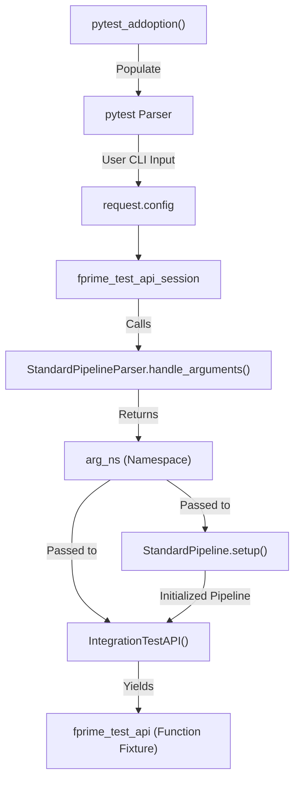
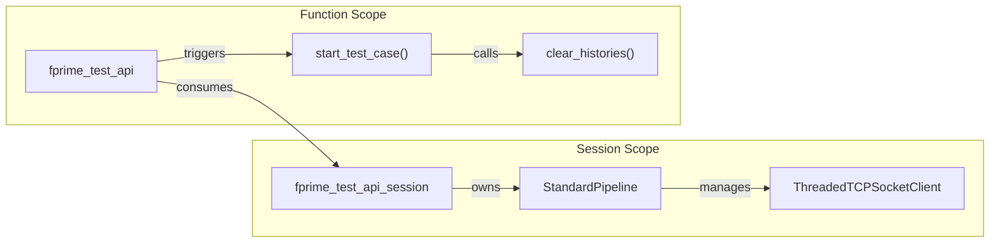

# Page: pytest Integration

# pytest Integration

<details>
<summary>Relevant source files</summary>

The following files were used as context for generating this wiki page:

- [.github/actions/codeql/security-pack.yml](.github/actions/codeql/security-pack.yml)
- [.github/actions/spelling/excludes.txt](.github/actions/spelling/excludes.txt)
- [.github/actions/spelling/patterns.txt](.github/actions/spelling/patterns.txt)
- [.github/workflows/codeql-security-scan.yml](.github/workflows/codeql-security-scan.yml)
- [.github/workflows/fprime-gds-tests.yml](.github/workflows/fprime-gds-tests.yml)
- [.github/workflows/gds-cli-tests.yml](.github/workflows/gds-cli-tests.yml)
- [.github/workflows/publish.yml](.github/workflows/publish.yml)
- [.github/workflows/spelling.yml](.github/workflows/spelling.yml)
- [src/fprime_gds/common/communication/ccsds/__init__.py](src/fprime_gds/common/communication/ccsds/__init__.py)
- [src/fprime_gds/common/communication/ccsds/chain.py](src/fprime_gds/common/communication/ccsds/chain.py)
- [src/fprime_gds/common/pipeline/encoding.py](src/fprime_gds/common/pipeline/encoding.py)
- [src/fprime_gds/common/pipeline/standard.py](src/fprime_gds/common/pipeline/standard.py)
- [src/fprime_gds/common/testing_fw/__init__.py](src/fprime_gds/common/testing_fw/__init__.py)
- [src/fprime_gds/common/testing_fw/api.py](src/fprime_gds/common/testing_fw/api.py)
- [src/fprime_gds/common/testing_fw/predicates.py](src/fprime_gds/common/testing_fw/predicates.py)
- [src/fprime_gds/common/testing_fw/pytest_integration.py](src/fprime_gds/common/testing_fw/pytest_integration.py)
- [src/fprime_gds/flask/logs.py](src/fprime_gds/flask/logs.py)

</details>


The `pytest` integration provides a seamless bridge between the standard `pytest` testing framework and the F´ GDS `IntegrationTestAPI`. It leverages `pytest` fixtures to automate the lifecycle of the GDS pipeline and the test API, allowing developers to write integration tests with minimal boilerplate.

## Overview of pytest_integration.py

The integration is primarily implemented in `src/fprime_gds/common/testing_fw/pytest_integration.py`. It uses `pytest` hooks to extend the command-line interface and defines two core fixtures: `fprime_test_api_session` and `fprime_test_api` [src/fprime_gds/common/testing_fw/pytest_integration.py:1-16]().

### Data Flow: CLI to Test API
The following diagram illustrates how command-line arguments are transformed into a live API session.

**CLI Argument to API Initialization Flow**

**Sources:** [src/fprime_gds/common/testing_fw/pytest_integration.py:27-40](), [src/fprime_gds/common/testing_fw/pytest_integration.py:92-109]()

## Configuration and CLI Extensions

The plugin extends `pytest` by injecting GDS-specific arguments. It reuses the `StandardPipelineParser` to ensure consistency between the GDS standalone tools and the test environment [src/fprime_gds/common/testing_fw/pytest_integration.py:37-40]().

### Custom Options
In addition to standard pipeline arguments (like `--logs`, `--ip-address`, `--port`), the plugin adds:
* `--junit-xml-file`: Specifies the filename for JUnit reports [src/fprime_gds/common/testing_fw/pytest_integration.py:43-48]().
* `--gen-junitxml`: A flag to enable report generation [src/fprime_gds/common/testing_fw/pytest_integration.py:49-54]().
* `--deployment-config`: Path to a JSON file for mapping deployment components [src/fprime_gds/common/testing_fw/pytest_integration.py:56-61]().

**Sources:** [src/fprime_gds/common/testing_fw/pytest_integration.py:27-61]()

## Fixture Lifecycle

The integration provides two scopes of fixtures to balance performance (reusing connections) with test isolation (clearing history per test).

### 1. fprime_test_api_session (Session Scope)
This fixture manages the heavyweight resources. It is created once per test session [src/fprime_gds/common/testing_fw/pytest_integration.py:73-74]().
* **Setup**: Initializes the `StandardPipeline`, connects to the middleware, and calls `IntegrationTestAPI.setup()` [src/fprime_gds/common/testing_fw/pytest_integration.py:92-109]().
* **Teardown**: Ensures the API is torn down and the pipeline is disconnected, even if tests fail [src/fprime_gds/common/testing_fw/pytest_integration.py:114-126]().

### 2. fprime_test_api (Function Scope)
This is the primary fixture used by test authors. It depends on the session fixture [src/fprime_gds/common/testing_fw/pytest_integration.py:129-130]().
* **Isolation**: For every test function, it increments a `SEQUENCE_COUNTER` and calls `IntegrationTestAPI.start_test_case()` [src/fprime_gds/common/testing_fw/pytest_integration.py:147-149]().
* **Behavior**: `start_test_case` clears the API's local histories and logs a "[STARTING CASE]" message to the `TestLogger` [src/fprime_gds/common/testing_fw/api.py:113-126]().

**Fixture Relationship and Code Entities**

**Sources:** [src/fprime_gds/common/testing_fw/pytest_integration.py:73-151](), [src/fprime_gds/common/testing_fw/api.py:113-126]()

## CI/CD Integration

The `fprime-gds` repository uses these integrations in GitHub Actions to validate the GDS stack.

### Workflow Configuration
Tests are executed across multiple Python versions (3.9 through 3.13) [.github/workflows/fprime-gds-tests.yml:18-20](). The CI environment installs the package in editable mode (`pip install -e .`) and runs `pytest` [.github/workflows/fprime-gds-tests.yml:31-34]().

### Example Usage in CI
When running in CI, the following command structure is typically used to point the tests at a specific dictionary:
```bash
pytest --dictionary ./path/to/Dictionary.xml --logs ./test-logs --ip-address 127.0.0.1 --port 50050
```
This configuration allows the `fprime_test_api_session` to automatically discover the FSW deployment and establish the communication bridge [src/fprime_gds/common/testing_fw/pytest_integration.py:97-101]().

**Sources:** [.github/workflows/fprime-gds-tests.yml:1-34](), [src/fprime_gds/common/testing_fw/pytest_integration.py:92-102]()

## Implementation Detail: Argument Handling

The `pytest_addoption` function performs a critical transformation on `StandardPipelineParser` arguments. Because `pytest` reserves short flags (e.g., `-p`), the integration filters out all but the long-form options (`--`) to avoid namespace collisions [src/fprime_gds/common/testing_fw/pytest_integration.py:37-40]().

| Function | Responsibility |
| :--- | :--- |
| `pytest_addoption` | Maps GDS `argparse` specs to `pytest` options. |
| `pytest_configure` | Sets the `xmlpath` for JUnit reports based on the GDS `--logs` path. |
| `fprime_test_api_session` | Orchestrates `StandardPipeline` and `IntegrationTestAPI` lifecycle. |
| `fprime_test_api` | Resets state and logs start of individual test nodes. |

**Sources:** [src/fprime_gds/common/testing_fw/pytest_integration.py:27-151]()
