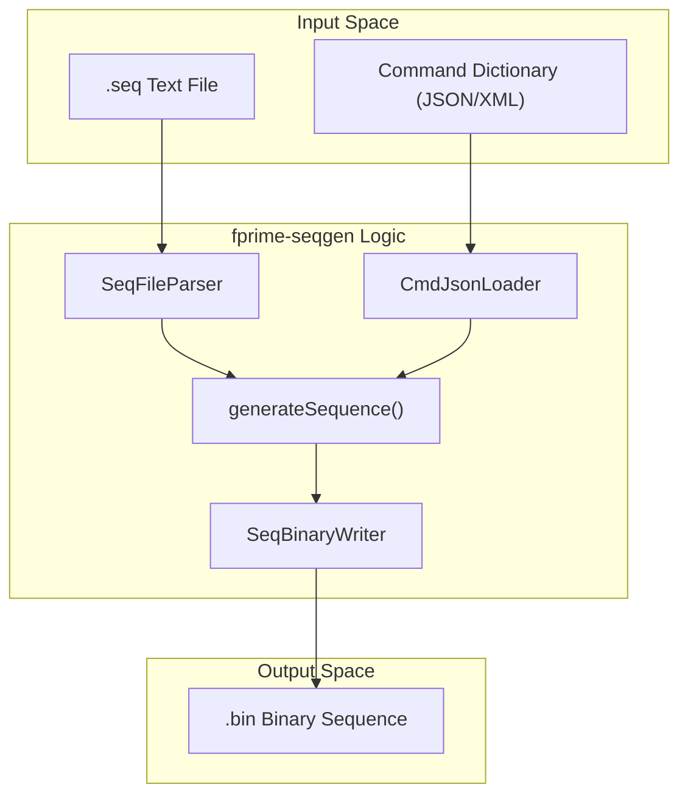
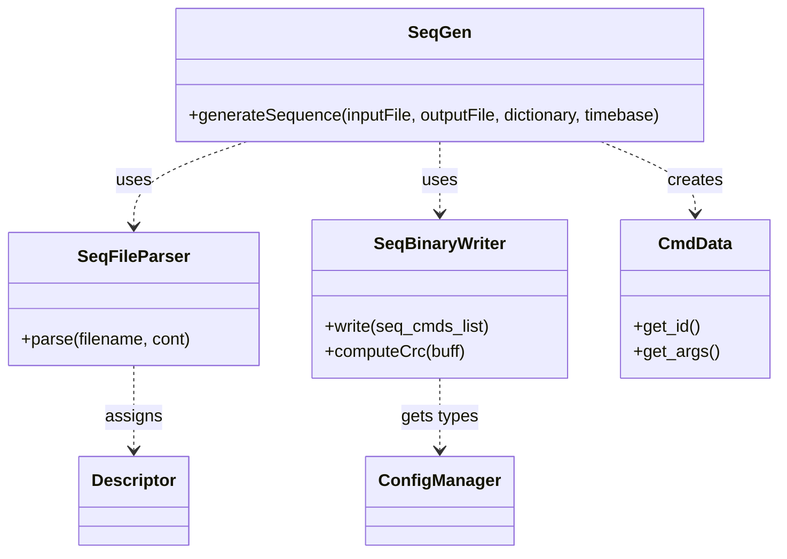

# Page: Sequence Generator (fprime-seqgen)

# Sequence Generator (fprime-seqgen)

<details>
<summary>Relevant source files</summary>

The following files were used as context for generating this wiki page:

- [examples/simple_sequence.bin](examples/simple_sequence.bin)
- [examples/simple_sequence.seq](examples/simple_sequence.seq)
- [src/fprime_gds/common/encoders/seq_writer.py](src/fprime_gds/common/encoders/seq_writer.py)
- [src/fprime_gds/common/loaders/ch_json_loader.py](src/fprime_gds/common/loaders/ch_json_loader.py)
- [src/fprime_gds/common/loaders/cmd_json_loader.py](src/fprime_gds/common/loaders/cmd_json_loader.py)
- [src/fprime_gds/common/loaders/event_json_loader.py](src/fprime_gds/common/loaders/event_json_loader.py)
- [src/fprime_gds/common/parsers/seq_file_parser.py](src/fprime_gds/common/parsers/seq_file_parser.py)
- [src/fprime_gds/common/tools/seqgen.py](src/fprime_gds/common/tools/seqgen.py)
- [test/fprime_gds/common/tools/expected/simple_expected.bin](test/fprime_gds/common/tools/expected/simple_expected.bin)
- [test/fprime_gds/common/tools/input/simple_bad_sequence.seq](test/fprime_gds/common/tools/input/simple_bad_sequence.seq)
- [test/fprime_gds/common/tools/input/simple_sequence.seq](test/fprime_gds/common/tools/input/simple_sequence.seq)
- [test/fprime_gds/common/tools/resources/simple_dictionary.xml](test/fprime_gds/common/tools/resources/simple_dictionary.xml)
- [test/fprime_gds/common/tools/seqgen_unit_test.py](test/fprime_gds/common/tools/seqgen_unit_test.py)

</details>


The `fprime-seqgen` tool is a sequence compiler for F´ that converts human-readable `.seq` text files into binary sequence files compatible with the F´ `Svc/CmdSequencer` component [src/fprime_gds/common/tools/seqgen.py:5-7](). It validates commands against a provided ground dictionary and handles time-tagging, argument serialization, and CRC generation.

## System Architecture and Data Flow

The sequence generation process involves parsing a text file, cross-referencing commands with the dictionary, and serializing the resulting data into a binary format.

### Sequence Generation Pipeline
The following diagram illustrates the flow from a `.seq` source file to the final `.bin` output.

**Sequence Generation Data Flow**

Sources: [src/fprime_gds/common/tools/seqgen.py:44-121](), [src/fprime_gds/common/parsers/seq_file_parser.py:8-17]()

## SeqFileParser

The `SeqFileParser` class is responsible for decomposing the text-based sequence file into discrete command components [src/fprime_gds/common/parsers/seq_file_parser.py:8-9]().

### Key Parsing Features
*   **Comment Removal:** It identifies and strips trailing comments starting with `;`, ensuring that semicolons within quoted strings are preserved [src/fprime_gds/common/parsers/seq_file_parser.py:30-48]().
*   **Tokenization:** It splits command lines using spaces or commas as delimiters, while ignoring delimiters inside quotes [src/fprime_gds/common/parsers/seq_file_parser.py:50-69]().
*   **Type Inference:** Arguments are converted to Python types (int, float, bool, or string) based on their syntax [src/fprime_gds/common/parsers/seq_file_parser.py:71-102]().

### Time Descriptors
The parser supports two types of time descriptors [src/fprime_gds/common/parsers/seq_file_parser.py:104-173]():

| Descriptor | Type | Format Examples | Description |
| :--- | :--- | :--- | :--- |
| **A** | `ABSOLUTE` | `A2015-075T22:32:40.123` | Specific UTC time for execution. |
| **R** | `RELATIVE` | `R00:00:01.050` | Delay relative to the previous command's completion. |

Sources: [src/fprime_gds/common/parsers/seq_file_parser.py:153-173](), [examples/simple_sequence.seq:6-13]()

## SeqBinaryWriter

The `SeqBinaryWriter` serializes the list of `CmdData` objects into the F´ binary sequence format [src/fprime_gds/common/encoders/seq_writer.py:16-19]().

### Binary Format Structure
The output file consists of a global header, followed by multiple command records, and ends with a CRC-32 checksum.

| Section | Data Type | Description |
| :--- | :--- | :--- |
| **File Header** | `U32` | Total sequence size in bytes [src/fprime_gds/common/encoders/seq_writer.py:139-141](). |
| | `U32` | Total number of command records [src/fprime_gds/common/encoders/seq_writer.py:142](). |
| | `TimeBase` | Mission-specific timebase (default `0xFFFF`) [src/fprime_gds/common/encoders/seq_writer.py:143](). |
| | `U8` | Time context (default `0xFF`) [src/fprime_gds/common/encoders/seq_writer.py:144](). |
| **Command Record** | `U8` | Descriptor (Relative/Absolute) [src/fprime_gds/common/encoders/seq_writer.py:55-58](). |
| | `U32`, `U32` | Time tag (Seconds, Microseconds) [src/fprime_gds/common/encoders/seq_writer.py:43-53](). |
| | `U32` | Length of the command packet [src/fprime_gds/common/encoders/seq_writer.py:71-73](). |
| | `Varies` | Serialized command opcode and arguments [src/fprime_gds/common/encoders/seq_writer.py:60-69](). |
| **Footer** | `U32` | CRC-32 of the entire sequence [src/fprime_gds/common/encoders/seq_writer.py:147-151](). |

Sources: [src/fprime_gds/common/encoders/seq_writer.py:36-157]()

## Implementation and Integration

The primary entry point is the `generateSequence()` function, which orchestrates the parser and writer [src/fprime_gds/common/tools/seqgen.py:44]().

**Code Entity Association**


### Flask and Uplinker Integration
The `fprime-seqgen` tool is often used in conjunction with the GDS Web UI and the `FileUplinker`.
1.  **Sequence Creation:** Users author `.seq` files or generate them via the UI.
2.  **Generation:** The `generateSequence()` function is called to produce a `.bin` file [src/fprime_gds/common/tools/seqgen.py:177]().
3.  **Uplink:** The resulting binary is queued in the `FileUplinker` to be sent to the FSW `Svc/FileUplink` component, which then hands it off to `Svc/CmdSequencer`.

### CLI Usage
The tool can be executed via the command line using `SeqGenParser`, which inherits from `ParserBase` to include dictionary loading arguments [src/fprime_gds/common/tools/seqgen.py:126-145]().

```bash
fprime-seqgen -d /path/to/dictionary.json sequence.seq output.bin --timebase 0x1
```
Sources: [src/fprime_gds/common/tools/seqgen.py:152-181](), [src/fprime_gds/executables/cli.py:27]()
