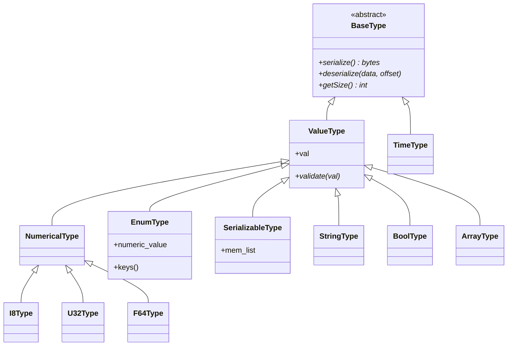
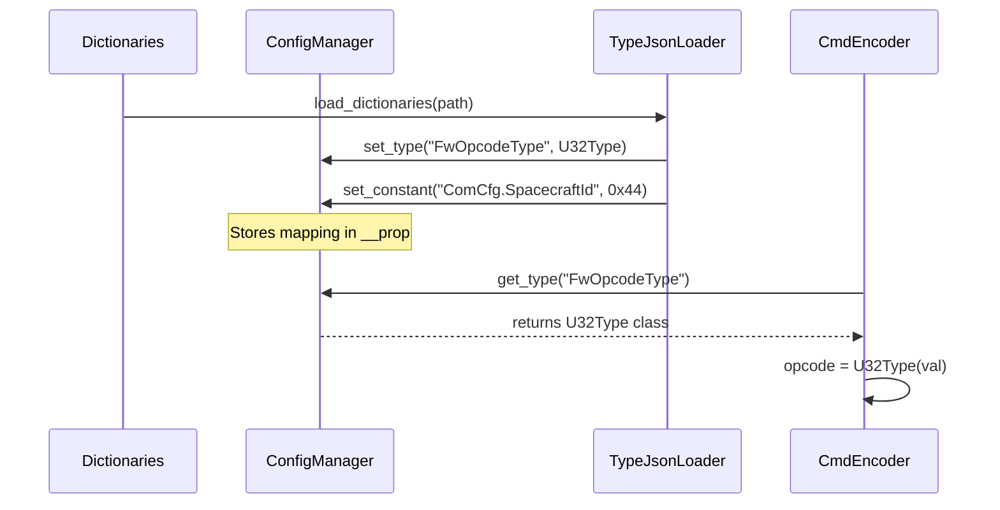

# Page: Serialization Type System

# Serialization Type System

Relevant source files

The following files were used as context for generating this wiki page:

- [.github/resources/RefTopologyAppDictionary.xml](.github/resources/RefTopologyAppDictionary.xml)
- [.gitignore](.gitignore)
- [src/fprime_gds/common/communication/ccsds/space_data_link.py](src/fprime_gds/common/communication/ccsds/space_data_link.py)
- [src/fprime_gds/common/communication/ccsds/space_packet.py](src/fprime_gds/common/communication/ccsds/space_packet.py)
- [src/fprime_gds/common/data_types/cmd_data.py](src/fprime_gds/common/data_types/cmd_data.py)
- [src/fprime_gds/common/dp/__init__.py](src/fprime_gds/common/dp/__init__.py)
- [src/fprime_gds/common/dp/common.py](src/fprime_gds/common/dp/common.py)
- [src/fprime_gds/common/dp/decoder.py](src/fprime_gds/common/dp/decoder.py)
- [src/fprime_gds/common/dp/validator.py](src/fprime_gds/common/dp/validator.py)
- [src/fprime_gds/common/encoders/encoder.py](src/fprime_gds/common/encoders/encoder.py)
- [src/fprime_gds/common/loaders/dp_json_loader.py](src/fprime_gds/common/loaders/dp_json_loader.py)
- [src/fprime_gds/common/loaders/xml_loader.py](src/fprime_gds/common/loaders/xml_loader.py)
- [src/fprime_gds/common/models/common/command.py](src/fprime_gds/common/models/common/command.py)
- [src/fprime_gds/common/models/dictionaries.py](src/fprime_gds/common/models/dictionaries.py)
- [src/fprime_gds/common/models/serialize/numerical_types.py](src/fprime_gds/common/models/serialize/numerical_types.py)
- [src/fprime_gds/common/models/serialize/time_type.py](src/fprime_gds/common/models/serialize/time_type.py)
- [src/fprime_gds/common/models/serialize/type_base.py](src/fprime_gds/common/models/serialize/type_base.py)
- [src/fprime_gds/common/utils/config_manager.py](src/fprime_gds/common/utils/config_manager.py)
- [test/fprime_gds/common/communication/ccsds/test_space_data_link.py](test/fprime_gds/common/communication/ccsds/test_space_data_link.py)
- [test/fprime_gds/common/communication/ccsds/test_space_packet.py](test/fprime_gds/common/communication/ccsds/test_space_packet.py)

The F´ GDS Serialization Type System provides a Python-based mirroring of the F´ C++ type system. It enables the GDS to serialize (encode) and deserialize (decode) binary data exchanged with flight software (FSW) while maintaining strict type safety and architectural consistency.

## BaseType and ValueType Hierarchy

All data types in the GDS inherit from a common base class hierarchy. This structure ensures that every type provides a consistent interface for binary conversion and value management.

### Class Relationships
The hierarchy is rooted in `BaseType`, which defines the interface for serialization. `ValueType` extends this by adding a `.val` property to hold the Python representation of the data.

**Type System Architecture**

*Sources: [src/fprime_gds/common/models/serialize/type_base.py:1-50](), [src/fprime_gds/common/models/serialize/numerical_types.py:1-40]()*

### Core Implementation
*   **BaseType**: The abstract base class requiring implementation of `serialize()`, `deserialize()`, and `getSize()`. [src/fprime_gds/common/models/serialize/type_base.py:11-40]()
*   **Numerical Types**: Includes signed/unsigned integers (`I8`–`I64`, `U8`–`U64`) and floating-point numbers (`F32`, `F64`). These use Python's `struct` module to pack/unpack values into FSW-compatible binary formats. [src/fprime_gds/common/models/serialize/numerical_types.py:44-250]()
*   **BoolType**: Serializes a boolean as a 1-byte value (0 or 1). [src/fprime_gds/common/models/serialize/bool_type.py:1-30]()
*   **StringType**: Handles variable-length strings, prefixed by a size token (defined by `FwSizeStoreType`). [src/fprime_gds/common/models/serialize/string_type.py:1-45]()

## Complex and Recursive Types

F´ supports complex data structures that are recursively composed of primitive types.

### EnumType
`EnumType` maps string constants to integer values. It is dynamic; the GDS creates specific Enum classes at runtime based on the dictionary definitions.
*   **Construction**: `EnumType.construct_type(name, enum_dict)` creates a new class representing a specific FSW enum. [src/fprime_gds/common/models/serialize/enum_type.py:120-150]()
*   **Validation**: Ensures that assigned values exist within the defined set of keys. [src/fprime_gds/common/models/serialize/enum_type.py:85-100]()

### SerializableType (Structs)
Represents F´ "Serializables" (structs). It maintains an internal list of member types. When `serialize()` is called, it iterates through its members and concatenates their binary outputs.
*   **Member Management**: The `mem_list` contains tuples of `(name, value, type)`. [src/fprime_gds/common/models/serialize/serializable_type.py:20-60]()

### ArrayType
Represents fixed-size arrays of a single type.
*   **Implementation**: It wraps a list of `BaseType` objects and ensures the length matches the FSW definition during serialization. [src/fprime_gds/common/models/serialize/array_type.py:15-55]()

## TimeType

The `TimeType` is a specialized class used for F´ time tags. It does not inherit from `ValueType` because it represents a multi-field structure (Time Base, Context, Seconds, Microseconds).

| Field | Type | Description |
| :--- | :--- | :--- |
| **Time Base** | `EnumType` | The clock source (e.g., `TB_SC_TIME`, `TB_FPGA_TIME`) |
| **Context** | `U8` | Deployment-specific context byte |
| **Seconds** | `U32` | Seconds since the epoch defined by Time Base |
| **Microseconds** | `U32` | Microseconds [0-999999] |

*Sources: [src/fprime_gds/common/models/serialize/time_type.py:59-101](), [src/fprime_gds/common/models/serialize/time_type.py:177-190]()*

## ConfigManager and Type Widths

F´ is designed to be portable across 16, 32, and 64-bit architectures. The `ConfigManager` acts as a singleton registry that defines the specific widths of architectural types (e.g., `FwChanIdType`, `FwOpcodeType`) for a given deployment.

**Dynamic Type Resolution Flow**

*Sources: [src/fprime_gds/common/utils/config_manager.py:43-74](), [src/fprime_gds/common/utils/config_manager.py:87-112](), [src/fprime_gds/common/models/dictionaries.py:92-96]()*

## Data Flow: From String to Binary

The serialization system is heavily used when sending commands. The `CmdData` class utilizes the type system to convert human-readable input (from the UI or CLI) into the binary format required by the FSW.

1.  **Input**: User provides a string or number for a command argument.
2.  **Conversion**: `CmdData.convert_arg_value` identifies the target `ValueType` (e.g., `BoolType`, `I32Type`) and parses the input. [src/fprime_gds/common/data_types/cmd_data.py:164-194]()
3.  **Validation**: The `ValueType` validates that the value is within range for that specific F´ type. [src/fprime_gds/common/models/serialize/numerical_types.py:70-85]()
4.  **Serialization**: The `Command.serialize()` method iterates through all arguments, calling their respective `serialize()` methods to produce a contiguous byte buffer. [src/fprime_gds/common/models/common/command.py:83-94]()

**Code-to-Entity Mapping**
| System Concept | Code Entity | File Path |
| :--- | :--- | :--- |
| **Type Registry** | `ConfigManager` | `src/fprime_gds/common/utils/config_manager.py` |
| **Primitive Mapping** | `PRIMITIVE_TYPE_MAP` | `src/fprime_gds/common/loaders/xml_loader.py` |
| **Serialization Interface** | `BaseType` | `src/fprime_gds/common/models/serialize/type_base.py` |
| **Runtime Data Object** | `CmdData` | `src/fprime_gds/common/data_types/cmd_data.py` |

*Sources: [src/fprime_gds/common/loaders/xml_loader.py:50-62](), [src/fprime_gds/common/data_types/cmd_data.py:148-161]()*
