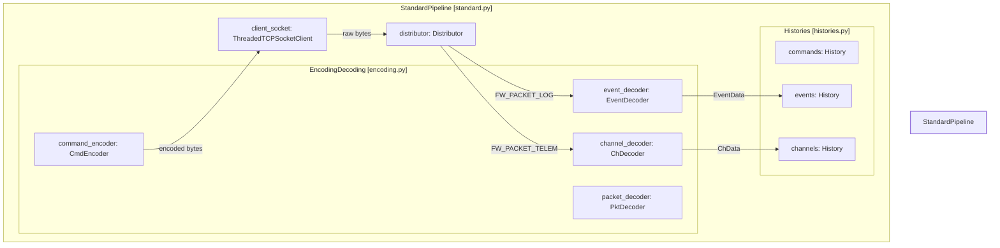
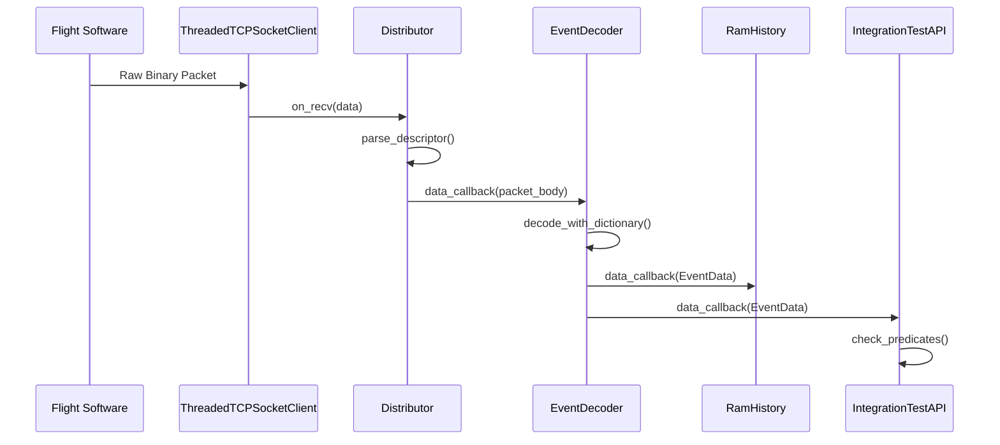

# Page: StandardPipeline

# StandardPipeline

Relevant source files

The following files were used as context for generating this wiki page:

- [setup.py](setup.py)
- [src/fastentrypoints.py](src/fastentrypoints.py)
- [src/fprime_gds/common/history/__init__.py](src/fprime_gds/common/history/__init__.py)
- [src/fprime_gds/common/pipeline/__init__.py](src/fprime_gds/common/pipeline/__init__.py)
- [src/fprime_gds/common/pipeline/encoding.py](src/fprime_gds/common/pipeline/encoding.py)
- [src/fprime_gds/common/pipeline/standard.py](src/fprime_gds/common/pipeline/standard.py)
- [src/fprime_gds/common/testing_fw/__init__.py](src/fprime_gds/common/testing_fw/__init__.py)
- [src/fprime_gds/common/testing_fw/api.py](src/fprime_gds/common/testing_fw/api.py)
- [src/fprime_gds/common/testing_fw/predicates.py](src/fprime_gds/common/testing_fw/predicates.py)
- [src/fprime_gds/common/testing_fw/pytest_integration.py](src/fprime_gds/common/testing_fw/pytest_integration.py)
- [src/fprime_gds/flask/__init__.py](src/fprime_gds/flask/__init__.py)
- [src/fprime_gds/flask/app.py](src/fprime_gds/flask/app.py)
- [src/fprime_gds/flask/components.py](src/fprime_gds/flask/components.py)
- [src/fprime_gds/flask/default_settings.py](src/fprime_gds/flask/default_settings.py)

The `StandardPipeline` is the central orchestration class of the F´ GDS. It encapsulates the lifecycle of data processing, from the low-level middleware connection to the high-level decoding and storage of telemetry, events, and commands. It serves as a unified interface for GDS applications (like the Flask Web UI or the Integration Test API) to interact with the flight software (FSW) data stream.

### 1. Purpose and Lifecycle

The `StandardPipeline` manages the instantiation and interconnection of the distributor, coders, histories, and filing systems. Its lifecycle consists of four primary stages:

1.  **Setup**: Instantiates core objects (Distributor, Coders, Histories, Filing) and configures them using dictionaries and file storage paths [src/fprime_gds/common/pipeline/standard.py:57-110]().
2.  **Register**: Allows external consumers (GUIs, loggers, or test scripts) to register for specific data types (e.g., events, channels) [src/fprime_gds/common/pipeline/standard.py:34]().
3.  **Run**: Connects to the middleware (typically via a `ThreadedTCPSocketClient`) and begins processing the data stream [src/fprime_gds/common/pipeline/standard.py:157-184]().
4.  **Terminate**: Shuts down the pipeline and closes connections [src/fprime_gds/common/pipeline/standard.py:36]().

**Sources:** [src/fprime_gds/common/pipeline/standard.py:29-40](), [src/fprime_gds/common/pipeline/standard.py:57-110]()

---

### 2. Pipeline Composition and Data Flow

The pipeline is composed of several sub-modules, each handled by a dedicated class. The `StandardPipeline` acts as a facade for these components.

| Component | Class / Module | Responsibility |
| :--- | :--- | :--- |
| **Distributor** | `fprime_gds.common.distributor.distributor.Distributor` | Routes raw packets from the middleware to the correct decoders based on packet descriptors [src/fprime_gds/common/pipeline/standard.py:79](). |
| **Coders** | `encoding.EncodingDecoding` | Manages all encoders (Command, File) and decoders (Event, Channel, File, Packet) [src/fprime_gds/common/pipeline/encoding.py:20-30](). |
| **Histories** | `histories.Histories` | Stores processed data objects for retrieval by the UI or API [src/fprime_gds/common/pipeline/standard.py:53](). |
| **Filing** | `files.Filing` | Manages file uplink and downlink operations [src/fprime_gds/common/pipeline/standard.py:54](). |
| **Transport** | `ThreadedTCPSocketClient` | The middleware adapter that provides the raw byte stream [src/fprime_gds/common/pipeline/standard.py:80](). |

#### Entity Mapping: Pipeline Architecture
The following diagram maps the high-level pipeline concepts to their specific implementation classes and registration methods.

**Sources:** [src/fprime_gds/common/pipeline/standard.py:79-106](), [src/fprime_gds/common/pipeline/encoding.py:45-81]()

---

### 3. Setup and Connection Logic

#### Coder Initialization
The `setup_coders` method in `EncodingDecoding` is critical. It uses the provided `dictionaries` to initialize decoders with the correct IDs and metadata [src/fprime_gds/common/pipeline/encoding.py:59-70](). It then registers these decoders with the `Distributor` using specific packet type strings like `FW_PACKET_LOG` and `FW_PACKET_TELEM` [src/fprime_gds/common/pipeline/encoding.py:76-80]().

#### Middleware Connection
The `connect` method establishes the link to the GDS middleware (e.g., `fprime-gds` TCP server). It allows the pipeline to identify itself using a `RoutingTag` (usually `GUI` for the pipeline) and specifies the target (usually `FSW`) [src/fprime_gds/common/pipeline/standard.py:157-164]().

**Sources:** [src/fprime_gds/common/pipeline/encoding.py:45-81](), [src/fprime_gds/common/pipeline/standard.py:157-184]()

---

### 4. Logging Configuration

The pipeline includes a built-in `DataLogger` that captures all traffic. When `setup_logging` is called, the pipeline registers a `DataLogger` instance as a consumer for channels, events, commands, and packets [src/fprime_gds/common/pipeline/standard.py:140-155]().

- **Dated Directories**: Logs are stored in a subdirectory named with a timestamp (ISO 8601 format) [src/fprime_gds/common/pipeline/standard.py:125-138]().
- **CSV Support**: The logger is configured by default to output in CSV format with verbose messaging [src/fprime_gds/common/pipeline/standard.py:147-149]().

**Sources:** [src/fprime_gds/common/pipeline/standard.py:125-155]()

---

### 5. Specialized Implementations

#### Flask Integration
In the web-based GDS, `FlaskEndpointRamHistory` is used as the history implementation [src/fprime_gds/flask/components.py:92](). This specialized history tracks "seen counts" and session tokens to ensure the Vue.js frontend receives consistent data updates during polling [src/fprime_gds/flask/components.py:18-28]().

#### Integration Test API
The `IntegrationTestAPI` wraps a `StandardPipeline` to provide synchronous search and assertion capabilities. It registers its own `TestHistory` or `ChronologicalHistory` instances to the pipeline's coders to capture data for automated verification [src/fprime_gds/common/testing_fw/api.py:54-66]().

#### Data Flow: Middleware to History
This diagram traces a single Event Record (EVR) from the socket through the pipeline components.

**Sources:** [src/fprime_gds/common/pipeline/standard.py:106](), [src/fprime_gds/common/pipeline/encoding.py:76](), [src/fprime_gds/common/testing_fw/api.py:99]()

---

### 6. Key Functions and Classes

| Class/Function | File | Description |
| :--- | :--- | :--- |
| `StandardPipeline` | [src/fprime_gds/common/pipeline/standard.py:29]() | Main container for GDS logic. |
| `EncodingDecoding` | [src/fprime_gds/common/pipeline/encoding.py:20]() | Container for encoders and decoders. |
| `setup_pipelined_components` | [src/fprime_gds/flask/components.py:74]() | Factory function for creating the singleton pipeline used by Flask. |
| `IntegrationTestAPI.__init__` | [src/fprime_gds/common/testing_fw/api.py:37]() | Attaches test-specific histories to an existing pipeline. |
| `StandardPipeline.setup` | [src/fprime_gds/common/pipeline/standard.py:57]() | Primary initialization logic for all sub-components. |

**Sources:** [src/fprime_gds/common/pipeline/standard.py](), [src/fprime_gds/common/pipeline/encoding.py](), [src/fprime_gds/flask/components.py](), [src/fprime_gds/common/testing_fw/api.py]()
