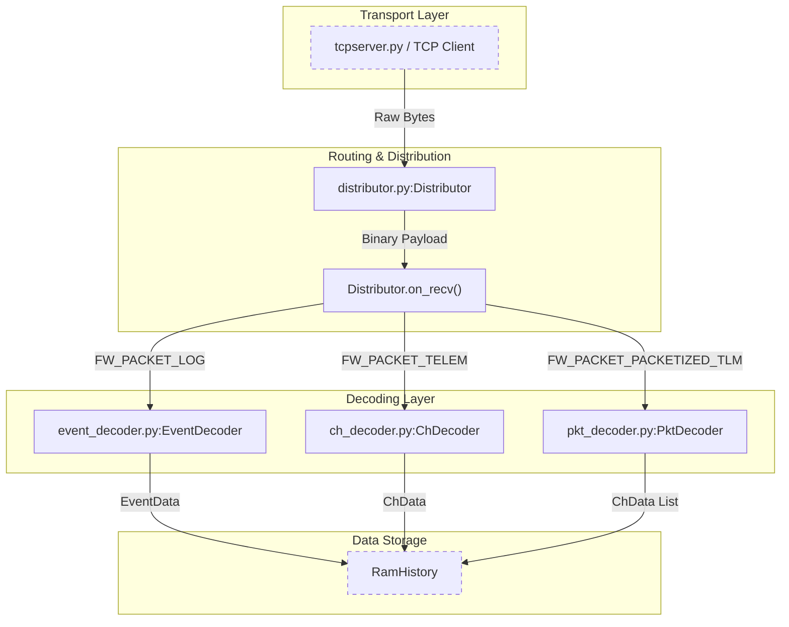
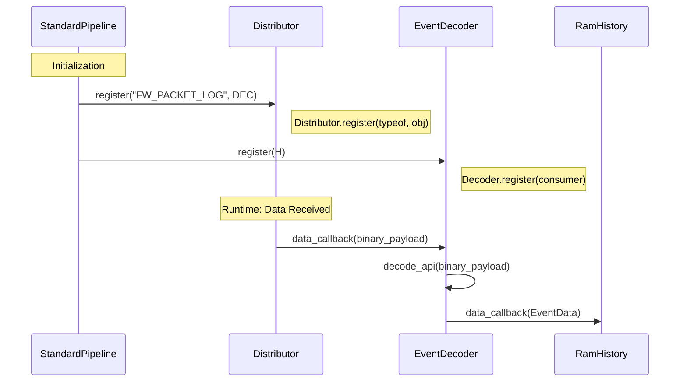

# Page: System Architecture & Data Flow

# System Architecture & Data Flow

Relevant source files

The following files were used as context for generating this wiki page:

- [.github/ISSUE_TEMPLATE/config.yml](.github/ISSUE_TEMPLATE/config.yml)
- [.github/pull_request_template.md](.github/pull_request_template.md)
- [README.md](README.md)
- [src/fprime_gds/common/decoders/ch_decoder.py](src/fprime_gds/common/decoders/ch_decoder.py)
- [src/fprime_gds/common/decoders/event_decoder.py](src/fprime_gds/common/decoders/event_decoder.py)
- [src/fprime_gds/common/decoders/pkt_decoder.py](src/fprime_gds/common/decoders/pkt_decoder.py)
- [src/fprime_gds/common/distributor/distributor.py](src/fprime_gds/common/distributor/distributor.py)
- [src/fprime_gds/common/encoders/ch_encoder.py](src/fprime_gds/common/encoders/ch_encoder.py)
- [src/fprime_gds/common/encoders/cmd_encoder.py](src/fprime_gds/common/encoders/cmd_encoder.py)
- [src/fprime_gds/common/encoders/event_encoder.py](src/fprime_gds/common/encoders/event_encoder.py)
- [src/fprime_gds/common/encoders/pkt_encoder.py](src/fprime_gds/common/encoders/pkt_encoder.py)
- [src/fprime_gds/common/pipeline/router.py](src/fprime_gds/common/pipeline/router.py)

The F´ GDS is designed as a modular, distributed system built on a **publisher/subscriber** (Pub/Sub) pattern [README.md:14-15](). It facilitates bidirectional communication between a Flight Software (FSW) deployment and ground users. The architecture is decoupled into a data processing pipeline (Distributor, Decoders, Encoders) and a presentation layer (Flask REST API and Vue.js Web UI) [README.md:17-28]().

## End-to-End Data Flow Overview

Data moves through the system in a series of transformations, from raw binary packets to structured JSON objects consumed by the browser.

### Downlink Flow (FSW to UI)
1.  **TCP Client**: Receives raw binary data from the FSW via the `ThreadedTCPServer` [README.md:61-64]().
2.  **Distributor**: Buffers the raw bytes, parses the framing (length and descriptor), and routes the message payload to specific decoders [src/fprime_gds/common/distributor/distributor.py:28-34]().
3.  **Decoders**: Classes like `EventDecoder` and `ChDecoder` use dictionaries to transform binary payloads into high-level Data Objects (e.g., `EventData`, `ChData`) [src/fprime_gds/common/decoders/event_decoder.py:31-32]().
4.  **Histories**: Data objects are stored in memory-backed histories (e.g., `RamHistory`) which provide a searchable record for the API [README.md:41-43]().
5.  **Flask REST API**: Exposes endpoints that the Web UI polls to retrieve new data objects serialized as JSON.
6.  **Web UI**: The Vue.js frontend renders the data in tables, charts, and logs.

### Uplink Flow (UI to FSW)
1.  **Web UI**: User triggers a command (e.g., clicking "Send").
2.  **Flask REST API**: Receives the command request and arguments.
3.  **Encoders**: `CmdEncoder` takes a `CmdData` object and serializes it into the F´ binary command format [src/fprime_gds/common/encoders/cmd_encoder.py:52-53]().
4.  **TCP Client**: Prepends routing tokens (like `A5A5` and `FSW`) and sends the binary packet back to the server [src/fprime_gds/common/encoders/cmd_encoder.py:8-14]().

## Pipeline Component Architecture

The following diagram maps the conceptual data flow to specific classes and methods within the codebase.

### Data Processing Pipeline

**Sources:** [src/fprime_gds/common/distributor/distributor.py:167-190](), [src/fprime_gds/common/decoders/event_decoder.py:51-96](), [src/fprime_gds/common/decoders/ch_decoder.py:46-90](), [README.md:17-29]().

## Binary Packet Format

The `Distributor` expects binary data in a specific framed format before routing to decoders.

| Field | Size | Description |
| :--- | :--- | :--- |
| **Length** | 4 Bytes (configurable) | Total length of the message including descriptor [src/fprime_gds/common/distributor/distributor.py:146-149]() |
| **Type Descriptor** | 4 Bytes | Identifies the message type (Event, Channel, etc.) [src/fprime_gds/common/distributor/distributor.py:151-153]() |
| **Message Data** | Variable | The actual payload to be decoded [src/fprime_gds/common/distributor/distributor.py:156]() |

**Sources:** [README.md:73-81](), [src/fprime_gds/common/distributor/distributor.py:131-158]().

## Publisher/Subscriber Registration

The system uses a registration pattern where consumers (like GUI panels or histories) register with producers (like Decoders) [README.md:14-16]().

*   **Distributor Registration**: Decoders register with the `Distributor` for specific `FwPacketDescriptorType` values (e.g., `FW_PACKET_LOG`) [src/fprime_gds/common/distributor/distributor.py:59-67]().
*   **Decoder Registration**: Consumers register with a `Decoder` to receive parsed data objects [README.md:115-124]().
*   **Encoder Registration**: The `TCP Client` registers with `Encoders` to receive serialized binary data for uplink [README.md:126-129]().

### Registration Logic in Code

**Sources:** [src/fprime_gds/common/distributor/distributor.py:59-67](), [src/fprime_gds/common/decoders/event_decoder.py:51-64](), [README.md:39-43]().

## Command & Telemetry Encoding

Encoders perform the inverse of decoders, converting high-level objects into FSW-compatible binary.

*   **CmdEncoder**: Serializes `CmdData`. It prepends a command descriptor (`0x5A5A5A5A`), calculates length, and appends the opcode and serialized arguments [src/fprime_gds/common/encoders/cmd_encoder.py:69-101]().
*   **ChEncoder**: Serializes `ChData` for telemetry, including the channel ID, timestamp, and value [src/fprime_gds/common/encoders/ch_encoder.py:58-88]().
*   **EventEncoder**: Serializes `EventData`, converting event IDs and arguments into a binary log packet [src/fprime_gds/common/encoders/event_encoder.py:61-91]().

**Sources:** [src/fprime_gds/common/encoders/cmd_encoder.py:7-36](), [src/fprime_gds/common/encoders/ch_encoder.py:7-27](), [src/fprime_gds/common/encoders/event_encoder.py:7-32]().
