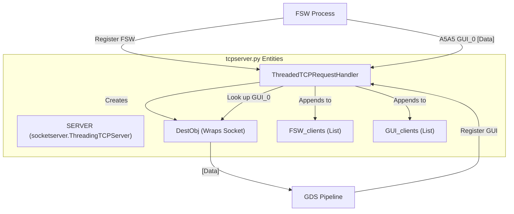
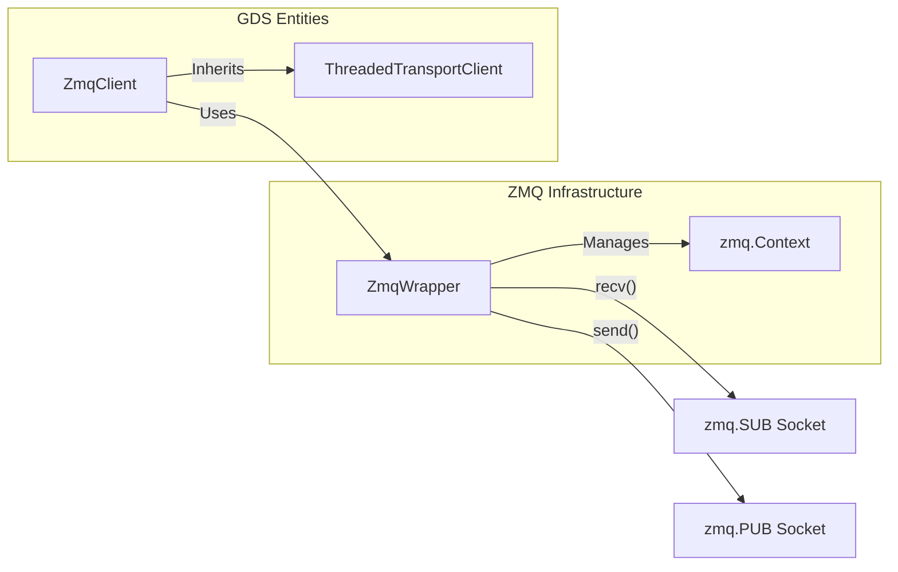

# Page: TCP Server & Middleware

# TCP Server & Middleware

Relevant source files

The following files were used as context for generating this wiki page:

- [src/fprime_gds/common/data_types/sys_data.py](src/fprime_gds/common/data_types/sys_data.py)
- [src/fprime_gds/common/files/downlinker.py](src/fprime_gds/common/files/downlinker.py)
- [src/fprime_gds/common/files/helpers.py](src/fprime_gds/common/files/helpers.py)
- [src/fprime_gds/common/files/uplinker.py](src/fprime_gds/common/files/uplinker.py)
- [src/fprime_gds/common/pipeline/files.py](src/fprime_gds/common/pipeline/files.py)
- [src/fprime_gds/common/transport.py](src/fprime_gds/common/transport.py)
- [src/fprime_gds/common/zmq_transport.py](src/fprime_gds/common/zmq_transport.py)
- [src/fprime_gds/executables/tcpserver.py](src/fprime_gds/executables/tcpserver.py)
- [src/fprime_gds/flask/sequence.py](src/fprime_gds/flask/sequence.py)
- [src/fprime_gds/flask/static/js/uploader.js](src/fprime_gds/flask/static/js/uploader.js)
- [src/fprime_gds/flask/static/js/vue-support/downlink.js](src/fprime_gds/flask/static/js/vue-support/downlink.js)
- [src/fprime_gds/flask/static/js/vue-support/uplink.js](src/fprime_gds/flask/static/js/vue-support/uplink.js)
- [src/fprime_gds/flask/updown.py](src/fprime_gds/flask/updown.py)

The TCP Server and Middleware layer provides the central communication hub for the F´ GDS. It manages the multiplexing of data between Flight Software (FSW) and various Ground Data System (GDS) clients (GUIs, CLI tools, and the Flask backend). This layer ensures that binary packets are routed to the correct destinations using a registration protocol and routing tokens.

## ThreadedTCPServer (tcpserver.py)

The `ThreadedTCPServer` is implemented using the `socketserver.ThreadingTCPServer` framework [src/fprime_gds/executables/tcpserver.py:45-60](). It handles concurrent client connections by instantiating a `ThreadedTCPRequestHandler` for each new connection in its own thread [src/fprime_gds/executables/tcpserver.py:53-53]().

### Client Registration Protocol
Clients must register before they can send or receive routed data. The registration follows a specific string-based handshake:

1.  **Registration String**: Clients send `Register <name>` followed by a newline [src/fprime_gds/executables/tcpserver.py:55-55]().
2.  **Client Types**: The server identifies clients based on the presence of "FSW" or "GUI" in the name [src/fprime_gds/executables/tcpserver.py:139-152]().
3.  **ID Assignment**: The server assigns a unique integer ID to each client and appends it to the name (e.g., `GUI_0`) to handle multiple instances of the same client type [src/fprime_gds/executables/tcpserver.py:143-152]().
4.  **Destination Objects**: Upon registration, a `DestObj` is created to wrap the client's socket and manage its outgoing message queue [src/fprime_gds/executables/tcpserver.py:154-154]().

### A5A5 Routing Tokens
Once registered, data is moved through the server using a specific framing format:
`A5A5 <destination_name> <binary_data>`

*   **Header**: A 9-byte header consisting of the string `A5A5 ` followed by the destination name [src/fprime_gds/executables/tcpserver.py:168-174]().
*   **Routing**: The server parses the destination name, looks up the corresponding `DestObj`, and forwards only the `<binary_data>` portion to that client's socket [src/fprime_gds/executables/tcpserver.py:56-57]().

### System Entity Mapping: TCP Server Logic
The following diagram maps the logical communication flow to the specific classes and lists in `tcpserver.py`.

Sources: [src/fprime_gds/executables/tcpserver.py:25-33](), [src/fprime_gds/executables/tcpserver.py:45-60](), [src/fprime_gds/executables/tcpserver.py:131-160]()

---

## Multi-Client Multiplexing

The middleware facilitates a many-to-many relationship between ground components and flight deployments.

| Feature | Implementation Detail |
| :--- | :--- |
| **Concurrency** | Uses `socketserver.StreamRequestHandler` with `allow_reuse_address = True` [src/fprime_gds/executables/tcpserver.py:62-62](). |
| **Command Queuing** | Each handler maintains a `cmdQueue` to process partial or concatenated socket reads [src/fprime_gds/executables/tcpserver.py:73-124](). |
| **Broadcast** | While A5A5 targets specific clients, the architecture allows for middleware-level broadcasting if multiple clients register with the same role prefix [src/fprime_gds/executables/tcpserver.py:136-152](). |
| **Cleanup** | On socket closure, the server removes the client from `FSW_clients`/`GUI_clients` and deletes its `DestObj` entry [src/fprime_gds/executables/tcpserver.py:100-108](). |

Sources: [src/fprime_gds/executables/tcpserver.py:62-112]()

---

## ZMQ Transport Alternative

The `zmq_transport.py` module provides a ZeroMQ-based alternative to the `ThreadedTCPServer`. It was introduced to improve performance (up to 1GB/s per thread), prevent packet reordering at high data rates, and allow communication without traditional TCP sockets [src/fprime_gds/common/zmq_transport.py:3-9]().

### ZmqWrapper and ZmqClient
*   **ZmqWrapper**: Encapsulates the ZeroMQ context and sockets. It supports both `PUB/SUB` patterns for data distribution [src/fprime_gds/common/zmq_transport.py:29-41]().
*   **Configuration**: Sockets are configured with `transport_url`, `sub_topic`, and `pub_topic`. Sockets are created on their governing threads to comply with ZMQ thread-safety requirements [src/fprime_gds/common/zmq_transport.py:43-54]().
*   **Server/Client Roles**: Unlike standard TCP, ZMQ allows any node to be the "server" (the one that `binds` to a port) while others `connect`. The `make_server()` method toggles this behavior [src/fprime_gds/common/zmq_transport.py:62-71]().

### Data Flow: ZMQ Middleware
This diagram illustrates how `ZmqClient` integrates into the GDS transport hierarchy.

Sources: [src/fprime_gds/common/zmq_transport.py:29-163](), [src/fprime_gds/common/transport.py:100-107]()

---

## File Uplink & Downlink Integration

The middleware layer also handles file transfers via the `Filing` composition class, which coordinates the `FileUplinker` and `FileDownlinker` [src/fprime_gds/common/pipeline/files.py:15-25]().

### Handshaking and Throttling
File uplink requires a handshake protocol to prevent overwhelming the FSW:
1.  The `FileUplinker` sends a file chunk [src/fprime_gds/common/files/uplinker.py:150-150]().
2.  It then waits for a `FW_PACKET_HAND` (Handshake) packet from the FSW [src/fprime_gds/common/pipeline/files.py:47-47]().
3.  The `UplinkQueue` manages the state of queued files, using a `threading.Semaphore` to block the uplink thread until the current file transfer is complete or a handshake is received [src/fprime_gds/common/files/uplinker.py:31-53]().

### State Management
Both the uplinker and downlinker utilize `FileStates` (IDLE, RUNNING, CANCELED, END_WAIT, ERROR) to track transfer progress [src/fprime_gds/common/files/helpers.py:71-81]().

| Component | Role | Source |
| :--- | :--- | :--- |
| **FileUplinker** | Chunks files and handles handshakes. | [src/fprime_gds/common/files/uplinker.py:144-167]() |
| **FileDownlinker** | Reconstructs files from `START`, `DATA`, and `END` packets. | [src/fprime_gds/common/files/downlinker.py:31-55]() |
| **TransmitFile** | Manages file descriptors, checksums (CFDP), and logging. | [src/fprime_gds/common/files/helpers.py:114-135]() |
| **Timeout** | Provides a threaded timer for detecting stalled transfers. | [src/fprime_gds/common/files/helpers.py:23-46]() |

Sources: [src/fprime_gds/common/files/uplinker.py:31-167](), [src/fprime_gds/common/files/downlinker.py:31-116](), [src/fprime_gds/common/files/helpers.py:1-135]()
