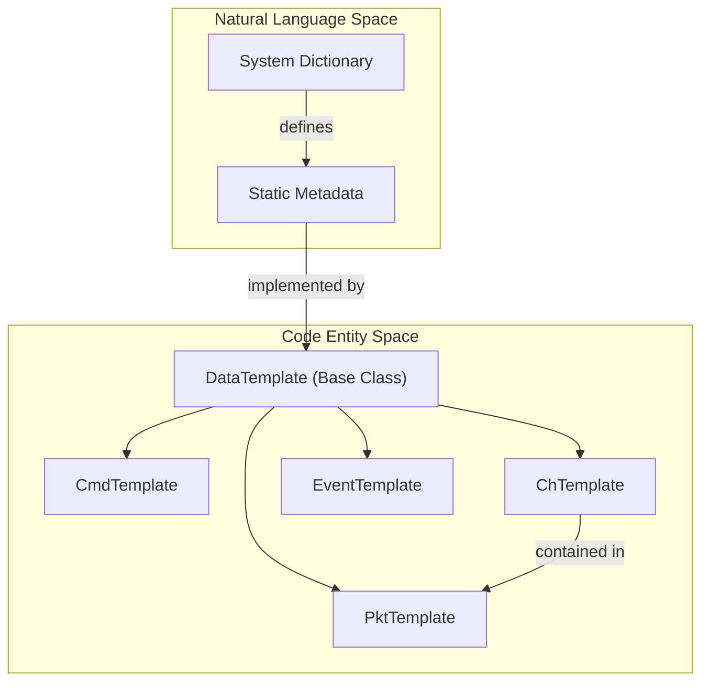
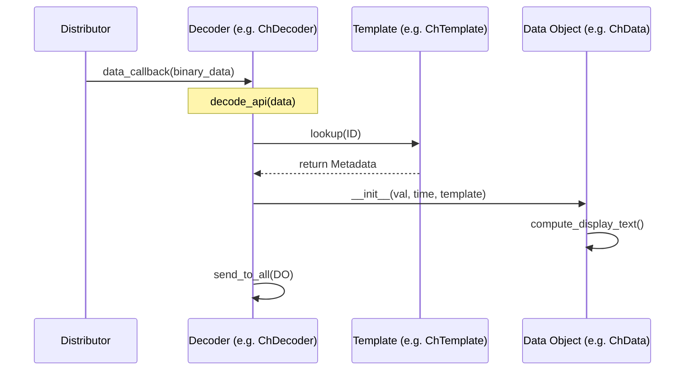

# Page: Templates & Data Objects

# Templates & Data Objects

Relevant source files

The following files were used as context for generating this wiki page:

- [src/fprime_gds/common/data_types/ch_data.py](src/fprime_gds/common/data_types/ch_data.py)
- [src/fprime_gds/common/data_types/event_data.py](src/fprime_gds/common/data_types/event_data.py)
- [src/fprime_gds/common/data_types/exceptions.py](src/fprime_gds/common/data_types/exceptions.py)
- [src/fprime_gds/common/decoders/decoder.py](src/fprime_gds/common/decoders/decoder.py)
- [src/fprime_gds/common/templates/ch_template.py](src/fprime_gds/common/templates/ch_template.py)
- [src/fprime_gds/common/templates/cmd_template.py](src/fprime_gds/common/templates/cmd_template.py)
- [src/fprime_gds/common/templates/data_template.py](src/fprime_gds/common/templates/data_template.py)
- [src/fprime_gds/common/templates/event_template.py](src/fprime_gds/common/templates/event_template.py)
- [src/fprime_gds/common/templates/pkt_template.py](src/fprime_gds/common/templates/pkt_template.py)
- [src/fprime_gds/common/utils/string_util.py](src/fprime_gds/common/utils/string_util.py)
- [test/fprime_gds/common/data_types/test_cmd_data.py](test/fprime_gds/common/data_types/test_cmd_data.py)
- [test/fprime_gds/common/utils/test_string_util.py](test/fprime_gds/common/utils/test_string_util.py)

The F´ GDS uses a two-tier model for representing system data: **Templates** and **Data Objects**. Templates serve as static metadata holders, defined by the project dictionary, while Data Objects represent runtime instances of that data (e.g., a specific telemetry reading or a dispatched command) containing timestamps, actual values, and formatting logic.

## Metadata Templates

Templates are derived from the `DataTemplate` base class [src/fprime_gds/common/templates/data_template.py:13-32](). They are typically instantiated by dictionary loaders and stored in the GDS to provide context for incoming binary streams.

### Core Template Classes

| Class | Purpose | Key Metadata Fields |
| :--- | :--- | :--- |
| `CmdTemplate` | Describes a command type | Opcode, mnemonic, component, argument list [src/fprime_gds/common/templates/cmd_template.py:23-75]() |
| `ChTemplate` | Describes a telemetry channel | ID, name, component, type object, format string, limits (red/orange/yellow) [src/fprime_gds/common/templates/ch_template.py:19-88]() |
| `EventTemplate` | Describes an event (EVR) | ID, name, component, severity, format string, arguments [src/fprime_gds/common/templates/event_template.py:21-81]() |
| `PktTemplate` | Describes a telemetry packet | ID, name, list of `ChTemplate` objects [src/fprime_gds/common/templates/pkt_template.py:19-51]() |

### Template Relationship Diagram
This diagram shows how static metadata entities defined in the code relate to the F´ system concepts.

Title: Metadata Entity Relationships

Sources: [src/fprime_gds/common/templates/data_template.py:13-32](), [src/fprime_gds/common/templates/cmd_template.py:23-24](), [src/fprime_gds/common/templates/ch_template.py:19-20](), [src/fprime_gds/common/templates/event_template.py:21-22](), [src/fprime_gds/common/templates/pkt_template.py:19-22]()

---

## Runtime Data Objects

Data objects are the "live" counterparts to templates. They inherit from `SysData` and encapsulate the template, the raw value (as a `BaseType` derivative), and the FSW timestamp.

### Key Data Classes

*   **`ChData`**: Stores a channel reading. It includes the `val_obj` (the actual data), the `time` (FSW time), and an `ert` (Earth Received Time) timestamp [src/fprime_gds/common/data_types/ch_data.py:25-47]().
*   **`EventData`**: Stores an event message. It processes the event's arguments and applies the template's format string to generate `display_text` [src/fprime_gds/common/data_types/event_data.py:22-67]().
*   **`CmdData`**: Stores a command instance, including its arguments and status.

### Data Flow: From Bytes to Objects
Decoders use templates to transform binary data into these rich objects.

Title: Decoding Data Flow

Sources: [src/fprime_gds/common/decoders/decoder.py:45-64](), [src/fprime_gds/common/data_types/ch_data.py:25-47]()

---

## String Formatting & Display

A critical role of data objects is converting raw values into human-readable strings using format specifiers defined in the dictionary.

### String Utilities
The GDS provides `string_util.py` to handle the conversion of FPP-style and C-style format strings into Python-compatible format strings:
*   `preprocess_fpp_format_str`: Converts `{x}` to `{:x}` [src/fprime_gds/common/utils/string_util.py:40-52]().
*   `preprocess_c_style_format_str`: Converts `%0.2f` to `{:.2f}` while handling flags, width, and precision [src/fprime_gds/common/utils/string_util.py:55-110]().
*   `format_string_template`: A wrapper around Python's `.format()` that safely handles single values or tuples [src/fprime_gds/common/utils/string_util.py:17-37]().

### Display Text Logic
*   **Channels**: `ChData` uses `_compute_display_text` to apply the template's `fmt_str`. If the value is a complex type (Serializable or Array), it uses the type's internal `formatted_val` [src/fprime_gds/common/data_types/ch_data.py:62-82]().
*   **Events**: `EventData` generates `display_text` by applying the `format_str` to the argument tuple. It also handles specialized decoding for hashed file names in assertions if `FPRIME_HASHES_TXT_FILE` is set [src/fprime_gds/common/data_types/event_data.py:49-67]().

---

## Serialization and Export

Data objects provide multiple methods for exporting data to different formats, used by the REST API and CLI tools.

| Method | Output | Usage |
| :--- | :--- | :--- |
| `get_dict()` | Python `dict` | Used by the Flask JSON encoder for the Web UI [src/fprime_gds/common/data_types/ch_data.py:141-158]() |
| `get_str()` | Formatted `str` | Used by the GDS CLI for terminal output [src/fprime_gds/common/data_types/event_data.py:133-161]() |
| `get_csv_header()` | CSV Header `str` | Static method for generating CSV log files [src/fprime_gds/common/data_types/ch_data.py:128-139]() |

### Implementation Detail: Hashed File Decoding
For specific assertion events, the GDS can resolve numeric file hashes back to source file paths by searching a provided hash map file [src/fprime_gds/common/data_types/event_data.py:69-89]().

Sources:
- [src/fprime_gds/common/data_types/ch_data.py:20-197]()
- [src/fprime_gds/common/data_types/event_data.py:17-194]()
- [src/fprime_gds/common/templates/cmd_template.py:23-185]()
- [src/fprime_gds/common/utils/string_util.py:17-110]()
- [src/fprime_gds/common/decoders/decoder.py:45-78]()
