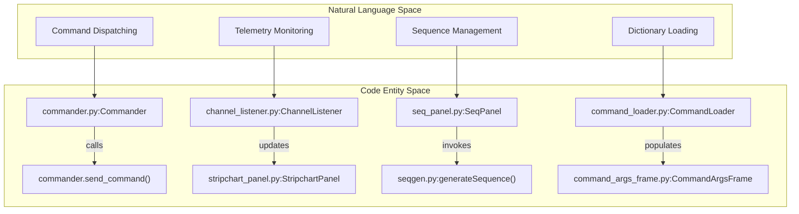
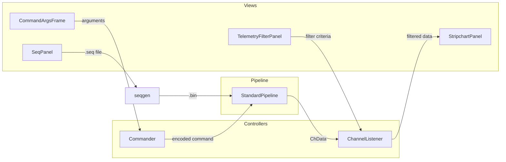

# Page: tkGUI Views & Controllers

# tkGUI Views & Controllers

Relevant source files

The following files were used as context for generating this wiki page:

- [src/fprime_gds/common/parsers/__init__.py](src/fprime_gds/common/parsers/__init__.py)
- [src/fprime_gds/executables/__init__.py](src/fprime_gds/executables/__init__.py)

The `tkGUI` represents a legacy Tkinter-based graphical user interface for the F´ GDS. It utilizes a Model-View-Controller (MVC) inspired architecture to manage telemetry visualization, command execution, and sequence generation. While the modern GDS has shifted toward a Flask/Vue.js web interface, the `tkGUI` components provide a desktop-native alternative for interacting with the `StandardPipeline`.

## System Architecture

The `tkGUI` architecture is divided into specialized views for data display and controllers that interface with the underlying GDS pipeline. Data flows from the `StandardPipeline` through listeners into the views, while user actions in the views are translated into commands by the controllers.

### Natural Language to Code Entity Mapping: Controllers

The following diagram maps high-level GDS control functions to the specific Python classes and methods responsible for their implementation in the `tkGUI` ecosystem.

**tkGUI Controller Mapping**

**Sources:** `src/fprime_gds/tkgui/controllers/commander.py:1-100`(), `src/fprime_gds/tkgui/controllers/channel_listener.py:1-50`(), `src/fprime_gds/tkgui/views/seq_panel.py:1-120`(), `src/fprime_gds/tkgui/controllers/command_loader.py:1-60`()

## Views (Tkinter Panels)

The views are implemented as Tkinter frames or panels that handle the rendering of telemetry and command interfaces.

### Telemetry & Visualization
*   **stripchart_panel**: Provides real-time plotting of telemetry channels. It utilizes a `ChannelListener` to receive updates from the `StandardPipeline` and updates the UI canvas.
*   **telemetry_filter_panel**: Allows users to filter which telemetry channels are visible or recorded based on component name or channel ID.

### Commanding Interfaces
*   **command_args_frame**: A dynamic UI component that inspects a selected command's `CmdTemplate` and generates input fields (entries, dropdowns, checkboxes) based on the command's arguments and their types (e.g., `I32`, `Enum`, `String`).
*   **seq_panel**: The sequence management interface. It allows users to load `.seq` files, validate them against the current dictionary, and trigger the generation of binary sequence files for uplink.

**tkGUI View Data Flow**

**Sources:** `src/fprime_gds/tkgui/views/stripchart_panel.py:1-200`(), `src/fprime_gds/tkgui/views/command_args_frame.py:1-150`(), `src/fprime_gds/tkgui/views/seq_panel.py:50-300`()

## Controllers & Tools

Controllers act as the glue between the GUI elements and the `fprime_gds.common` logic.

### channel_listener
The `ChannelListener` class implements the data consumer interface required by the `Distributor`. It receives `ChData` objects, applies user-defined filters from the `telemetry_filter_panel`, and pushes updates to the visualization views.

### command_loader & commander
*   **CommandLoader**: Responsible for parsing the command dictionary and providing a searchable interface for the `command_args_frame`.
*   **Commander**: Handles the final stage of command dispatch. It takes the values from the `CommandArgsFrame`, validates them against the `CmdTemplate`, and uses the `CmdEncoder` to send the binary packet to the `StandardPipeline`.

### seqgen & gse_api
These tools provide the backend logic for the `SeqPanel`:
*   **seqgen**: A wrapper around `fprime_seqgen` logic that converts human-readable sequence files into F´ binary sequences.
*   **gse_api**: A legacy interface layer that provides a simplified API for the `tkGUI` to interact with the GDS core, abstracting the complexities of the `StandardPipeline` setup.

| Component | Responsibility | Key File |
| :--- | :--- | :--- |
| **ChannelListener** | Subscribes to telemetry and updates UI | `channel_listener.py` |
| **CommandLoader** | Loads and searches command definitions | `command_loader.py` |
| **Commander** | Encodes and sends commands | `commander.py` |
| **SeqGen Tool** | Generates binary command sequences | `seqgen.py` |
| **GSE API** | Legacy bridge to GDS core | `gse_api.py` |

**Sources:** `src/fprime_gds/tkgui/controllers/channel_listener.py:10-45`(), `src/fprime_gds/tkgui/controllers/commander.py:20-80`(), `src/fprime_gds/tkgui/utils/gse_api.py:1-100`()
