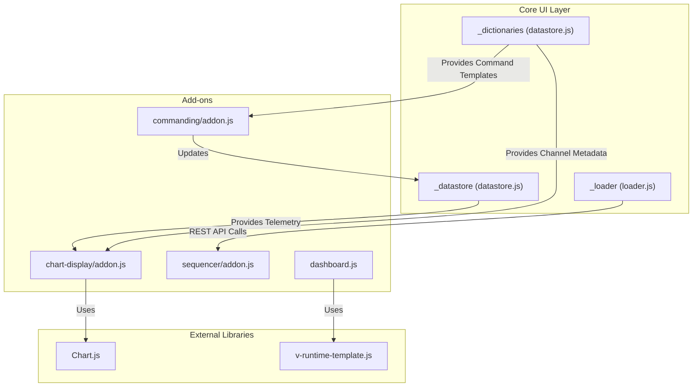
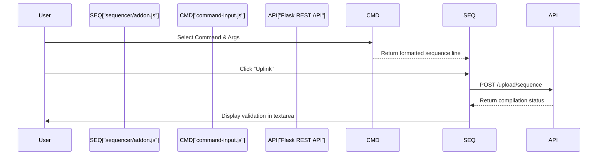

# Page: UI Add-ons & Extensions

# UI Add-ons & Extensions

Relevant source files

The following files were used as context for generating this wiki page:

- [src/fprime_gds/common/communication/adapters/ip.py](src/fprime_gds/common/communication/adapters/ip.py)
- [src/fprime_gds/common/communication/adapters/uart.py](src/fprime_gds/common/communication/adapters/uart.py)
- [src/fprime_gds/flask/resource.py](src/fprime_gds/flask/resource.py)
- [src/fprime_gds/flask/static/addons/advanced-settings/addon-templates.js](src/fprime_gds/flask/static/addons/advanced-settings/addon-templates.js)
- [src/fprime_gds/flask/static/addons/advanced-settings/addon.js](src/fprime_gds/flask/static/addons/advanced-settings/addon.js)
- [src/fprime_gds/flask/static/addons/channel-render/addon.js](src/fprime_gds/flask/static/addons/channel-render/addon.js)
- [src/fprime_gds/flask/static/addons/channel-render/channel-render-template.js](src/fprime_gds/flask/static/addons/channel-render/channel-render-template.js)
- [src/fprime_gds/flask/static/addons/channel-render/channel-render.js](src/fprime_gds/flask/static/addons/channel-render/channel-render.js)
- [src/fprime_gds/flask/static/addons/chart-display/addon-templates.js](src/fprime_gds/flask/static/addons/chart-display/addon-templates.js)
- [src/fprime_gds/flask/static/addons/chart-display/addon.js](src/fprime_gds/flask/static/addons/chart-display/addon.js)
- [src/fprime_gds/flask/static/addons/chart-display/config.js](src/fprime_gds/flask/static/addons/chart-display/config.js)
- [src/fprime_gds/flask/static/addons/chart-display/modified-vendor/flat.js](src/fprime_gds/flask/static/addons/chart-display/modified-vendor/flat.js)
- [src/fprime_gds/flask/static/addons/commanding/addon.js](src/fprime_gds/flask/static/addons/commanding/addon.js)
- [src/fprime_gds/flask/static/addons/commanding/command-history-template.js](src/fprime_gds/flask/static/addons/commanding/command-history-template.js)
- [src/fprime_gds/flask/static/addons/commanding/command-history.js](src/fprime_gds/flask/static/addons/commanding/command-history.js)
- [src/fprime_gds/flask/static/addons/commanding/command-input.js](src/fprime_gds/flask/static/addons/commanding/command-input.js)
- [src/fprime_gds/flask/static/addons/commanding/command-string-template.js](src/fprime_gds/flask/static/addons/commanding/command-string-template.js)
- [src/fprime_gds/flask/static/addons/commanding/command-string.js](src/fprime_gds/flask/static/addons/commanding/command-string.js)
- [src/fprime_gds/flask/static/addons/enabled.js](src/fprime_gds/flask/static/addons/enabled.js)
- [src/fprime_gds/flask/static/addons/packet-selection/addon.js](src/fprime_gds/flask/static/addons/packet-selection/addon.js)
- [src/fprime_gds/flask/static/addons/packet-selection/packet-selection-template.js](src/fprime_gds/flask/static/addons/packet-selection/packet-selection-template.js)
- [src/fprime_gds/flask/static/addons/packet-selection/packet-selection.js](src/fprime_gds/flask/static/addons/packet-selection/packet-selection.js)
- [src/fprime_gds/flask/static/addons/sequencer/addon-templates.js](src/fprime_gds/flask/static/addons/sequencer/addon-templates.js)
- [src/fprime_gds/flask/static/addons/sequencer/addon.js](src/fprime_gds/flask/static/addons/sequencer/addon.js)
- [src/fprime_gds/flask/static/addons/sequencer/autocomplete.js](src/fprime_gds/flask/static/addons/sequencer/autocomplete.js)
- [src/fprime_gds/flask/static/css/fpstyle.css](src/fprime_gds/flask/static/css/fpstyle.css)
- [src/fprime_gds/flask/static/js/config_init.js](src/fprime_gds/flask/static/js/config_init.js)
- [src/fprime_gds/flask/static/js/json.js](src/fprime_gds/flask/static/js/json.js)
- [src/fprime_gds/flask/static/js/settings.js](src/fprime_gds/flask/static/js/settings.js)
- [src/fprime_gds/flask/static/js/validate.js](src/fprime_gds/flask/static/js/validate.js)
- [src/fprime_gds/flask/static/js/vue-support/dashboard-box.js](src/fprime_gds/flask/static/js/vue-support/dashboard-box.js)
- [src/fprime_gds/flask/static/js/vue-support/dashboard-row.js](src/fprime_gds/flask/static/js/vue-support/dashboard-row.js)
- [src/fprime_gds/flask/static/js/vue-support/dashboard.js](src/fprime_gds/flask/static/js/vue-support/dashboard.js)
- [src/fprime_gds/flask/static/js/vue-support/log.js](src/fprime_gds/flask/static/js/vue-support/log.js)
- [src/fprime_gds/flask/static/third-party/css/all.min.css](src/fprime_gds/flask/static/third-party/css/all.min.css)
- [src/fprime_gds/flask/static/third-party/js/v-runtime-template.js](src/fprime_gds/flask/static/third-party/js/v-runtime-template.js)
- [src/fprime_gds/flask/static/third-party/webfonts/fa-brands-400.eot](src/fprime_gds/flask/static/third-party/webfonts/fa-brands-400.eot)
- [src/fprime_gds/flask/static/third-party/webfonts/fa-brands-400.svg](src/fprime_gds/flask/static/third-party/webfonts/fa-brands-400.svg)
- [src/fprime_gds/flask/static/third-party/webfonts/fa-brands-400.ttf](src/fprime_gds/flask/static/third-party/webfonts/fa-brands-400.ttf)
- [src/fprime_gds/flask/static/third-party/webfonts/fa-brands-400.woff](src/fprime_gds/flask/static/third-party/webfonts/fa-brands-400.woff)
- [src/fprime_gds/flask/static/third-party/webfonts/fa-brands-400.woff2](src/fprime_gds/flask/static/third-party/webfonts/fa-brands-400.woff2)
- [src/fprime_gds/flask/static/third-party/webfonts/fa-regular-400.eot](src/fprime_gds/flask/static/third-party/webfonts/fa-regular-400.eot)
- [src/fprime_gds/flask/static/third-party/webfonts/fa-regular-400.svg](src/fprime_gds/flask/static/third-party/webfonts/fa-regular-400.svg)

The F´ GDS Web UI is designed as a modular system where core functionality is extended through a set of Vue.js add-ons. These add-ons handle specialized tasks such as commanding, telemetry visualization (charts), sequence generation, and customizable dashboard layouts.

## Add-on Registration & Lifecycle

The UI determines which features are available through the `enabled.js` configuration. This file acts as the registry for all active extensions.

*   **`enabled.js`**: Imports and registers Vue components globally. It defines the set of tabs and panels available in the main navigation [src/fprime_gds/flask/static/addons/enabled.js]().
*   **Data Flow**: Add-ons typically consume data from the global `_datastore` and `_dictionaries` objects [src/fprime_gds/flask/static/js/datastore.js]().

### UI Component Relationships

The following diagram illustrates how various UI add-ons relate to the core data structures and external libraries.

**UI Add-on Architecture**

Sources: [src/fprime_gds/flask/static/addons/chart-display/addon.js:14-18](), [src/fprime_gds/flask/static/js/vue-support/dashboard.js:9-12](), [src/fprime_gds/flask/static/addons/commanding/command-history.js:8-12]()

---

## Commanding Add-on

The commanding system provides the interface for selecting, configuring, and dispatching commands to the flight software.

### Command Input & Arguments
The `command-input` component allows users to search for commands defined in the dictionary. It dynamically renders input fields based on the command's argument types (Integer, Float, String, Enum, Struct, or Array).

*   **Validation**: The `validate.js` module performs client-side checks. `validate_scalar_input` handles basic types, while `validate_array_or_struct_input` recursively validates complex types [src/fprime_gds/flask/static/js/validate.js:74-163]().
*   **Enum Handling**: `validate_enum_input` ensures the provided value matches one of the allowed keys in the `ENUM_DICT` [src/fprime_gds/flask/static/js/validate.js:56-67]().

### Command History
The `command-history` component displays a table of previously sent commands.
*   **Data Source**: It tracks `_datastore.command_history` [src/fprime_gds/flask/static/addons/commanding/command-history.js:59]().
*   **Interaction**: Double-clicking a history row calls `clickAction`, which invokes `selectCmd` on the parent to re-populate the command input with the historical arguments [src/fprime_gds/flask/static/addons/commanding/command-history.js:100-109]().

Sources: [src/fprime_gds/flask/static/js/validate.js:10-127](), [src/fprime_gds/flask/static/addons/commanding/command-history.js:22-111]()

---

## Chart Display Add-on

The chart add-on integrates `Chart.js` to provide real-time telemetry visualization.

### Implementation Details
*   **Components**: `chart-wrapper` manages a collection of `chart-display` instances [src/fprime_gds/flask/static/addons/chart-display/addon.js:33-88]().
*   **Data Integration**: Each chart registers as a consumer of "channels" in the `_datastore` [src/fprime_gds/flask/static/addons/chart-display/addon.js:150]().
*   **Time Modes**: Supports three modes for the X-axis:
    1.  `realtime`: Scrolls based on workstation time.
    2.  `anchored`: Centers around all data points using channel timestamps.
    3.  `ert`: Uses Earth Received Time (ground station timestamp) [src/fprime_gds/flask/static/addons/chart-display/addon.js:117-119]().

### Synchronization
The `SiblingSet` class (in `sibling.js`) manages synchronization between multiple charts. If "Lock Scale" is enabled, zooming or panning on one chart triggers `syncToAll`, updating the scales of all other charts in the wrapper [src/fprime_gds/flask/static/addons/chart-display/addon.js:154-155]().

Sources: [src/fprime_gds/flask/static/addons/chart-display/addon.js:93-173](), [src/fprime_gds/flask/static/addons/chart-display/addon-templates.js:9-80]()

---

## Dashboard Add-on (XML-Configured)

The Dashboard provides a flexible layout where users can define their own UI structure using an XML-like syntax.

### Dynamic Rendering
It utilizes `v-runtime-template` to compile user-provided strings into Vue templates at runtime.
*   **`configureDashboard`**: Wraps the user's XML/HTML in a `fp-flex-repeater` div and assigns it to `userTemplate` [src/fprime_gds/flask/static/js/vue-support/dashboard.js:54-57]().
*   **Persistence**: Layouts are stored in the browser's `localStorage` under the key `dashboardConfigurationText` for persistence across sessions [src/fprime_gds/flask/static/js/vue-support/dashboard.js:66-68]().

### Layout Components
*   **`dashboard-box`**: A container component with a title and configurable background/border colors [src/fprime_gds/flask/static/js/vue-support/dashboard-box.js:8-28]().
*   **`dashboard-row`**: A layout helper for organizing boxes into rows [src/fprime_gds/flask/static/js/vue-support/dashboard-row.js:1-10]().

Sources: [src/fprime_gds/flask/static/js/vue-support/dashboard.js:14-85](), [src/fprime_gds/flask/static/js/vue-support/dashboard-box.js:1-28]()

---

## Specialized Extensions

### Sequencer Add-on
Provides an interface for creating and uplinking command sequences (`.seq` files).
*   **Integration**: Includes an embedded `command-input` (Command Builder) to help users construct individual sequence lines [src/fprime_gds/flask/static/addons/sequencer/addon-templates.js:47-52]().
*   **Uplink**: Interfaces with the GDS REST API to send sequences to the `FileUplinker` [src/fprime_gds/flask/static/addons/sequencer/addon-templates.js:16-19]().

### Packet Selection
The `packet-selection` add-on allows users to filter telemetry based on defined Packets rather than individual Channels. This is useful for high-bandwidth deployments where data is grouped into binary packets.

### Advanced Settings
The `_settings` object (defined in `settings.js`) manages global UI behavior:
*   `event_buffer_size` and `command_buffer_size`.
*   `polling_intervals`: Configures how frequently the `loader.js` engine requests updates for various data types [src/fprime_gds/flask/static/js/settings.js:9-31]().

### Channel Render
The `channel-render` add-on provides specialized formatting for telemetry values, such as applying units or converting raw values to human-readable strings based on the dictionary metadata.

### Data Flow Mapping

**Natural Language to Code Entity Mapping**
| Feature | Code Entity (Component/Class) | Source File |
| :--- | :--- | :--- |
| **Command Validation** | `validate_input` | [src/fprime_gds/flask/static/js/validate.js:170]() |
| **Dashboard Layout** | `configureDashboard` | [src/fprime_gds/flask/static/js/vue-support/dashboard.js:54]() |
| **Chart Refresh** | `onRefresh` (callback) | [src/fprime_gds/flask/static/addons/chart-display/addon.js:159]() |
| **Log Polling** | `update` (method) | [src/fprime_gds/flask/static/js/vue-support/log.js:54]() |
| **History Storage** | `_datastore.command_history` | [src/fprime_gds/flask/static/addons/commanding/command-history.js:59]() |

**Sequence Compilation Flow**

Sources: [src/fprime_gds/flask/static/addons/sequencer/addon-templates.js:47-63](), [src/fprime_gds/flask/static/addons/sequencer/addon.js:1-50]()
