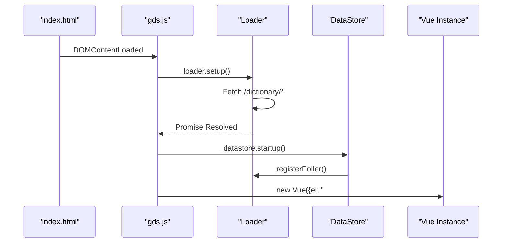
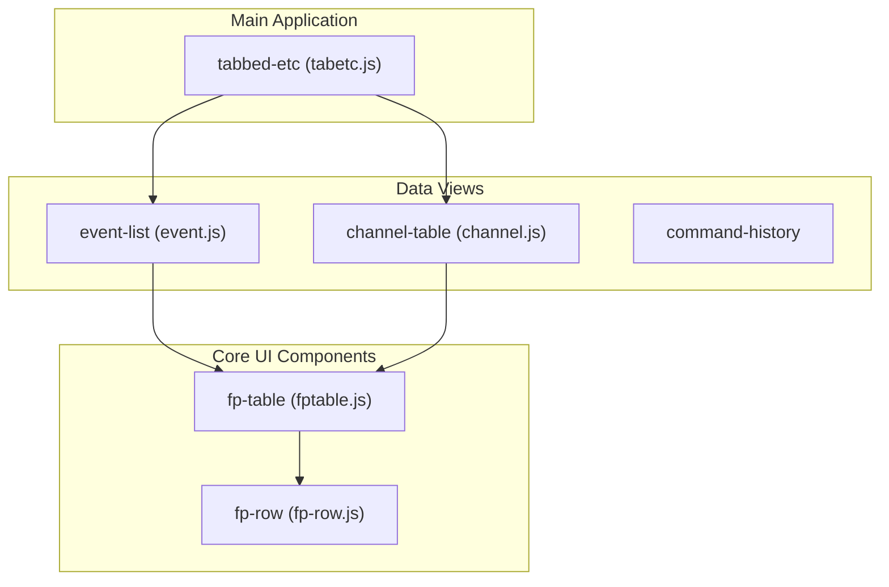

# Page: Web UI (Vue.js Frontend)

# Web UI (Vue.js Frontend)

Relevant source files

The following files were used as context for generating this wiki page:

- [src/fprime_gds/flask/static/index.html](src/fprime_gds/flask/static/index.html)
- [src/fprime_gds/flask/static/js/config.js](src/fprime_gds/flask/static/js/config.js)
- [src/fprime_gds/flask/static/js/datastore.js](src/fprime_gds/flask/static/js/datastore.js)
- [src/fprime_gds/flask/static/js/gds.js](src/fprime_gds/flask/static/js/gds.js)
- [src/fprime_gds/flask/static/js/loader.js](src/fprime_gds/flask/static/js/loader.js)
- [src/fprime_gds/flask/static/js/vue-support/channel.js](src/fprime_gds/flask/static/js/vue-support/channel.js)
- [src/fprime_gds/flask/static/js/vue-support/event.js](src/fprime_gds/flask/static/js/vue-support/event.js)
- [src/fprime_gds/flask/static/js/vue-support/fptable.js](src/fprime_gds/flask/static/js/vue-support/fptable.js)
- [src/fprime_gds/flask/static/js/vue-support/tabetc.js](src/fprime_gds/flask/static/js/vue-support/tabetc.js)
- [src/fprime_gds/flask/static/js/vue-support/utils.js](src/fprime_gds/flask/static/js/vue-support/utils.js)

The F´ GDS Web UI is a single-page application (SPA) built using **Vue.js**. It provides a real-time interface for commanding, telemetry monitoring, event logging, and file management. The frontend is designed to be lightweight, hosting its own dependencies to eliminate internet requirements during field operations [src/fprime_gds/flask/static/index.html:32-35]().

## Architecture Overview

The frontend architecture follows a unidirectional data flow: the `Loader` fetches data from the Flask REST API, which is then processed by the `DataStore` and distributed to reactive Vue components.

### Core Data Flow
The system uses a polling mechanism to synchronize state with the backend.

1.  **Loader**: Manages HTTP requests to REST endpoints (e.g., `/events`, `/channels`). It handles initial dictionary loading and periodic polling [src/fprime_gds/flask/static/js/loader.js:64-135]().
2.  **DataStore**: Acts as the central "source of truth." It maintains the current state of telemetry, events, and command history [src/fprime_gds/flask/static/js/datastore.js:190-195]().
3.  **HistoryHelpers**: Specialized classes within the datastore that manage how new data is merged (e.g., appending to a list vs. updating a map of latest values) [src/fprime_gds/flask/static/js/datastore.js:22-176]().
4.  **Vue Components**: Reactive UI elements that automatically re-render when the `DataStore` updates.

### System Initialization
The entry point for the application is `gds.js`. It ensures dictionaries are loaded before initializing the Vue application and starting the data pollers.

**Sources:** [src/fprime_gds/flask/static/js/gds.js:32-35](), [src/fprime_gds/flask/static/js/loader.js:146-170](), [src/fprime_gds/flask/static/js/datastore.js:203-210]()

## Tab Structure and Navigation

The UI is organized into tabs managed by the `tabbed-etc` component [src/fprime_gds/flask/static/js/vue-support/tabetc.js:28-29](). Each tab corresponds to a major GDS functional area:

| Tab Name | Component | Description |
| :--- | :--- | :--- |
| **Commanding** | `command-input` | Searchable command dictionary and argument entry. |
| **Events** | `event-list` | Real-time color-coded event log. |
| **Channels** | `channel-table` | Latest values for all telemetry channels. |
| **Uplink/Downlink**| `uplink` / `downlink` | File transfer management and progress tracking. |
| **Charts** | `chart-wrapper` | Real-time visualization of telemetry trends. |
| **Logs** | `logging` | Access to GDS and deployment-level text logs. |
| **Dashboard** | `dashboard` | User-defined layouts for mission-specific views. |

The `tabbed-etc` component also manages the **Global Status Header**, which displays the project logo, connection status (the "Orb"), and summary counts for fatal errors or warnings [src/fprime_gds/flask/static/index.html:64-102]().

**Sources:** [src/fprime_gds/flask/static/js/vue-support/tabetc.js:38-50](), [src/fprime_gds/flask/static/index.html:106-118]()

## Component Hierarchy

The UI relies on a set of core components that provide standardized behaviors like filtering and infinite scrolling.

**Sources:** [src/fprime_gds/flask/static/js/vue-support/event.js:21](), [src/fprime_gds/flask/static/js/vue-support/channel.js:18](), [src/fprime_gds/flask/static/js/vue-support/fptable.js:79]()

### Core UI Components
For detailed information on the polling engine, datastore mechanics, and the `fp-table` implementation, see **[Core UI Components](#5.1)**.

*   **`loader.js`**: Implements `registerPoller` and concurrency control to prevent overlapping requests [src/fprime_gds/flask/static/js/loader.js:216-240]().
*   **`datastore.js`**: Contains `ListHistory` (for events) and `MappedHistory` (for channels) to manage data retention and updates [src/fprime_gds/flask/static/js/datastore.js:87-176]().
*   **`fptable.js`**: A generic, high-performance table component supporting views, filtering, and "infinite" scroll via the `ScrollHandler` [src/fprime_gds/flask/static/js/vue-support/fptable.js:79-182]().

## UI Add-ons & Extensions

The GDS supports an extensible add-on system located in the `addons/` directory. These are registered in `enabled.js` and provide advanced functionality. For details, see **[UI Add-ons & Extensions](#5.2)**.

Key add-ons include:
*   **Commanding**: Provides `command-input` for selecting commands and `command-history` for tracking dispatched instructions.
*   **Charts**: Integration with `Chart.js` for plotting telemetry [src/fprime_gds/flask/static/index.html:112]().
*   **Dashboard**: Allows loading XML-configured layouts to create custom "glass cockpits" [src/fprime_gds/flask/static/js/vue-support/tabetc.js:48]().
*   **Sequencer**: Interface for loading and executing `.seq` command sequences [src/fprime_gds/flask/static/index.html:115]().

**Sources:** [src/fprime_gds/flask/static/js/gds.js:12](), [src/fprime_gds/flask/static/js/vue-support/tabetc.js:11-17]()
