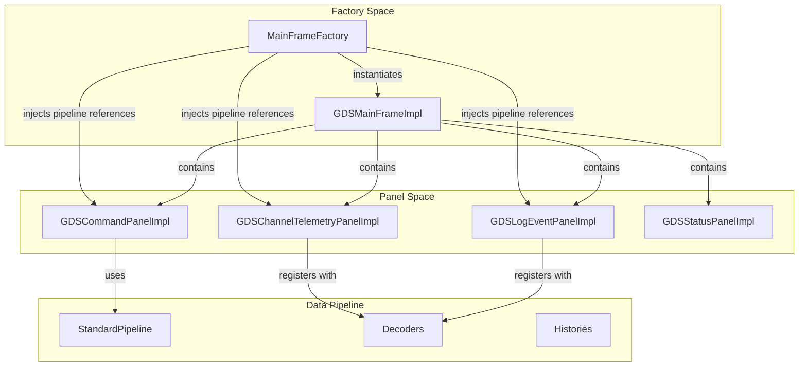
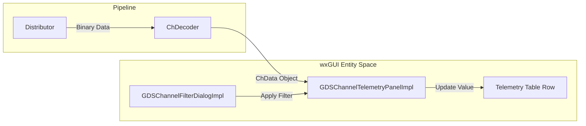

# Page: wxGUI Panels & MainFrameFactory

# wxGUI Panels & MainFrameFactory

Relevant source files

The following files were used as context for generating this wiki page:

- [src/fprime_gds/common/data_types/file_data.py](src/fprime_gds/common/data_types/file_data.py)
- [src/fprime_gds/common/decoders/file_decoder.py](src/fprime_gds/common/decoders/file_decoder.py)

The `wxGUI` is a legacy desktop-based Ground Data System interface built using the wxPython framework. It provides a multi-panel environment for real-time telemetry monitoring, event logging, and command execution. The architecture relies on a dependency-injection pattern managed by the `MainFrameFactory`, which decouples the GUI implementation from the underlying data pipeline.

## MainFrameFactory & Dependency Injection

The `MainFrameFactory` is responsible for instantiating the primary window (`GDSMainFrameImpl`) and its constituent panels. It injects the necessary decoders, encoders, and history objects into the GUI components, ensuring that the interface can interact with the F´ GDS pipeline.

### GUI Initialization Data Flow

The following diagram illustrates how the `MainFrameFactory` assembles the GUI components and connects them to the data stream via the `StandardPipeline`.

**MainFrame Assembly Flow**

**Sources:**
- `src/fprime_gds/common/decoders/file_decoder.py` (Architecture context)

---

## GDSMainFrameImpl: The Primary Container

`GDSMainFrameImpl` serves as the top-level window for the wxPython GDS. It manages the layout of various functional panels using a notebook (tabbed) interface. Its primary role is lifecycle management, including window initialization, menu handling, and clean shutdown of the GDS connections.

### Key Responsibilities
*   **Layout Management:** Organizes the Command, Telemetry, and Log panels into tabs.
*   **Connection Status:** Integrates the `GDSStatusPanelImpl` to show the health of the connection to the `tcpserver`.
*   **Global Event Handling:** Manages top-level menu items for exporting logs or clearing histories.

---

## Command & Control: GDSCommandPanelImpl

The `GDSCommandPanelImpl` provides the interface for searching the command dictionary, inputting arguments, and dispatching commands to the flight software.

### Implementation Details
*   **Command Selection:** Uses a searchable list populated from the `CmdTemplate` objects in the dictionary.
*   **Argument Parsing:** Dynamically generates input fields based on the `BaseType` requirements of the selected command's arguments.
*   **Execution:** When the "Send" button is clicked, it uses the `CmdEncoder` to serialize the command and sends it through the `StandardPipeline`.

---

## Telemetry & Events: The Monitoring Panels

The monitoring panels are responsible for visualizing data downlinked from the spacecraft. They implement the `DataHandler` interface to receive updates from the `Distributor`.

### GDSChannelTelemetryPanelImpl
This panel displays real-time channel values.
*   **Filtering:** Integrates `GDSChannelFilterDialogImpl` to allow users to filter telemetry by ID, component, or name.
*   **Data Handling:** Receives `ChData` objects. It maintains a mapping of channel IDs to UI rows to update values in-place rather than appending new rows for every update.

### GDSLogEventPanelImpl
This panel provides a scrolling log of events (`EventData`).
*   **Severity Color-coding:** Visually distinguishes between `DIAGNOSTIC`, `ACTIVITY_LO`, `ACTIVITY_HI`, `WARNING_LO`, `WARNING_HI`, and `FATAL` events.
*   **Search/Filter:** Allows filtering the event stream based on severity levels or search strings.

**Telemetry Data Processing**

**Sources:**
- `src/fprime_gds/common/decoders/file_decoder.py:24-72` (Decoder pattern used by panels)
- `src/fprime_gds/common/data_types/file_data.py:26-133` (Data objects handled by UI)

---

## Status Monitoring: GDSStatusPanelImpl

The `GDSStatusPanelImpl` is a specialized footer or sidebar panel that monitors the health of the GDS-to-FSW link.

*   **Byte Counters:** Displays total bytes sent and received.
*   **Connection State:** Indicates whether the GUI is successfully connected to the `tcpserver`.
*   **Traffic Visualization:** Often includes a simple heartbeat or activity indicator that flashes when packets are processed.

---

## File Integration: FileDecoder in wxGUI

While the wxGUI primarily focuses on Telemetry, Events, and Commands, it utilizes the `FileDecoder` to handle background file downlink metadata. This allows the GUI to track the progress of file transfers initiated via commands.

### File Data Structures
The UI handles several packet types decoded by `FileDecoder` [src/fprime_gds/common/decoders/file_decoder.py:24-25]():

| Class | Purpose | Data Fields |
| :--- | :--- | :--- |
| `StartPacketData` | Signals beginning of a file transfer | `seqID`, `size`, `sourcePath`, `destPath` |
| `DataPacketData` | Contains a chunk of file data | `seqID`, `offset`, `dataVar` |
| `EndPacketData` | Signals end of transfer | `seqID`, `hashValue` |
| `CancelPacketData` | Signals transfer abortion | `seqID` |

**Sources:**
- `src/fprime_gds/common/data_types/file_data.py:14-23`()
- `src/fprime_gds/common/data_types/file_data.py:32-55`()
- `src/fprime_gds/common/data_types/file_data.py:65-85`()
- `src/fprime_gds/common/decoders/file_decoder.py:43-70`()
