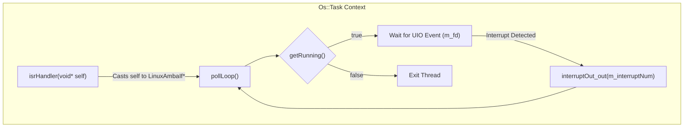
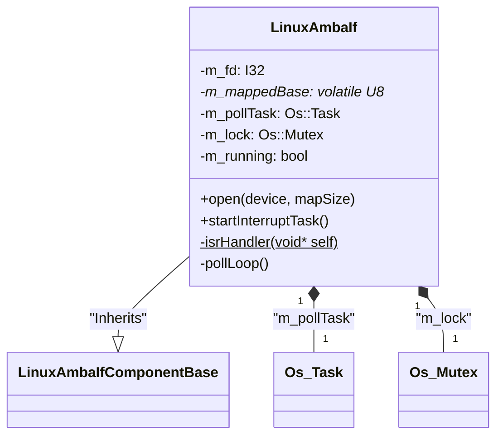

# C++ Class Interface (Header)

Relevant source files

The following files were used as context for generating this wiki page:

- [fprime-pfsoc-linux/Components/PfSocLinuxDrv/LinuxAmbaIf/LinuxAmbaIf.hpp](fprime-pfsoc-linux/Components/PfSocLinuxDrv/LinuxAmbaIf/LinuxAmbaIf.hpp)

The `LinuxAmbaIf` component is a C++ class within the `PfSocLinuxDrv` namespace that implements the bridge between F´ port invocations and Linux User Space I/O (UIO) system calls. This page documents the header definition, member variables, and the lifecycle API used to manage hardware access and interrupt service routines.

### Class Definition and Inheritance

The class inherits from `LinuxAmbaIfComponentBase`, which is the C++ class generated by the F´ autocoder from the component's FPP model.

| Entity | Type | Description |
|:---|:---|:---|
| `PfSocLinuxDrv::LinuxAmbaIf` | Class | The implementation class for the AMBA interface driver [fprime-pfsoc-linux/Components/PfSocLinuxDrv/LinuxAmbaIf/LinuxAmbaIf.hpp:10-10](). |
| `LinuxAmbaIfComponentBase` | Base Class | Autocoded F´ component base class providing port and command dispatching [fprime-pfsoc-linux/Components/PfSocLinuxDrv/LinuxAmbaIf/LinuxAmbaIf.hpp:10-10](). |

**Sources:**
- [fprime-pfsoc-linux/Components/PfSocLinuxDrv/LinuxAmbaIf/LinuxAmbaIf.hpp:8-10]()

---

### Public Lifecycle API

The public interface defines how the component is initialized and how the background interrupt thread is managed.

#### Constructor and Initialization
*   **`LinuxAmbaIf(const char* const compName)`**: Initializes the component with the standard F´ component name [fprime-pfsoc-linux/Components/PfSocLinuxDrv/LinuxAmbaIf/LinuxAmbaIf.hpp:15-15]().
*   **`open(const char* device, FwSizeType mapSize)`**: Performs the primary hardware initialization. It opens the specified Linux UIO device (e.g., `/dev/uio0`) and performs an `mmap` of the hardware register region into the process memory space [fprime-pfsoc-linux/Components/PfSocLinuxDrv/LinuxAmbaIf/LinuxAmbaIf.hpp:24-24]().

#### Interrupt Task Management
The component uses an internal `Os::Task` to poll for hardware interrupts without blocking the main F´ execution threads.
*   **`startInterruptTask(...)`**: Spawns the background thread. It accepts the interrupt number to report, task priority, stack size, and CPU affinity [fprime-pfsoc-linux/Components/PfSocLinuxDrv/LinuxAmbaIf/LinuxAmbaIf.hpp:31-34]().
*   **`stopInterruptTask()`**: Signals the internal loop to terminate by updating the `m_running` state [fprime-pfsoc-linux/Components/PfSocLinuxDrv/LinuxAmbaIf/LinuxAmbaIf.hpp:37-37]().
*   **`joinInterruptTask()`**: Blocks until the background task has fully exited [fprime-pfsoc-linux/Components/PfSocLinuxDrv/LinuxAmbaIf/LinuxAmbaIf.hpp:40-40]().

**Sources:**
- [fprime-pfsoc-linux/Components/PfSocLinuxDrv/LinuxAmbaIf/LinuxAmbaIf.hpp:15-40]()

---

### Private Member Variables

The state of the driver is maintained through several private variables that track file descriptors, memory mappings, and thread synchronization primitives.

| Variable | Type | Purpose |
|:---|:---|:---|
| `m_fd` | `I32` | File descriptor for the opened UIO device [fprime-pfsoc-linux/Components/PfSocLinuxDrv/LinuxAmbaIf/LinuxAmbaIf.hpp:85-85](). |
| `m_mappedBase` | `volatile U8*` | Pointer to the start of the mmap'd register region [fprime-pfsoc-linux/Components/PfSocLinuxDrv/LinuxAmbaIf/LinuxAmbaIf.hpp:86-86](). |
| `m_mapSize` | `FwSizeType` | The size of the hardware register space in bytes [fprime-pfsoc-linux/Components/PfSocLinuxDrv/LinuxAmbaIf/LinuxAmbaIf.hpp:87-87](). |
| `m_interruptNum` | `U32` | The ID reported via the `interruptOut` port when a UIO event occurs [fprime-pfsoc-linux/Components/PfSocLinuxDrv/LinuxAmbaIf/LinuxAmbaIf.hpp:88-88](). |
| `m_running` | `bool` | Flag indicating if the poll loop should continue [fprime-pfsoc-linux/Components/PfSocLinuxDrv/LinuxAmbaIf/LinuxAmbaIf.hpp:89-89](). |
| `m_lock` | `Os::Mutex` | Mutex used to protect the `m_running` flag [fprime-pfsoc-linux/Components/PfSocLinuxDrv/LinuxAmbaIf/LinuxAmbaIf.hpp:90-90](). |
| `m_pollTask` | `Os::Task` | The F´ OS abstraction for the background interrupt thread [fprime-pfsoc-linux/Components/PfSocLinuxDrv/LinuxAmbaIf/LinuxAmbaIf.hpp:91-91](). |
| `m_configured` | `bool` | Boolean indicating if `open()` was called successfully [fprime-pfsoc-linux/Components/PfSocLinuxDrv/LinuxAmbaIf/LinuxAmbaIf.hpp:94-94](). |

**Sources:**
- [fprime-pfsoc-linux/Components/PfSocLinuxDrv/LinuxAmbaIf/LinuxAmbaIf.hpp:85-94]()

---

### Port and Command Handlers

The class overrides the protected virtual functions generated by the F´ autocoder to provide the actual logic for register access and command processing.

#### Register Access Overrides
These handlers translate port calls into direct memory accesses against `m_mappedBase`.
*   `write32In_handler`: 32-bit register write [fprime-pfsoc-linux/Components/PfSocLinuxDrv/LinuxAmbaIf/LinuxAmbaIf.hpp:49-49]().
*   `write64In_handler`: 64-bit register write [fprime-pfsoc-linux/Components/PfSocLinuxDrv/LinuxAmbaIf/LinuxAmbaIf.hpp:52-52]().
*   `read32In_handler`: 32-bit register read [fprime-pfsoc-linux/Components/PfSocLinuxDrv/LinuxAmbaIf/LinuxAmbaIf.hpp:55-55]().
*   `read64In_handler`: 64-bit register read [fprime-pfsoc-linux/Components/PfSocLinuxDrv/LinuxAmbaIf/LinuxAmbaIf.hpp:58-58]().

#### Command Handlers
*   `CLEAR_EVENT_THROTTLE_cmdHandler`: Resets the throttle counters for component events [fprime-pfsoc-linux/Components/PfSocLinuxDrv/LinuxAmbaIf/LinuxAmbaIf.hpp:65-65]().

**Sources:**
- [fprime-pfsoc-linux/Components/PfSocLinuxDrv/LinuxAmbaIf/LinuxAmbaIf.hpp:48-65]()

---

### Interrupt Handling Architecture

The component uses a "trampoline" pattern to bridge the C-style function pointer requirement of `Os::Task` with the C++ instance methods of the class.

#### Data Flow: Interrupt Polling
The diagram below shows the relationship between the static trampoline and the instance methods.

**Interrupt Task Trampoline Flow**

#### Key Methods
*   **`isrHandler(void* self)`**: A static method that serves as the entry point for `Os::Task`. It receives a `void*` pointer to the `LinuxAmbaIf` instance and calls the non-static `pollLoop()` [fprime-pfsoc-linux/Components/PfSocLinuxDrv/LinuxAmbaIf/LinuxAmbaIf.hpp:73-73]().
*   **`pollLoop()`**: Contains the loop that blocks on the UIO file descriptor and emits F´ port calls upon hardware triggers [fprime-pfsoc-linux/Components/PfSocLinuxDrv/LinuxAmbaIf/LinuxAmbaIf.hpp:76-76]().
*   **`getRunning()`**: A thread-safe helper that uses `m_lock` to check the `m_running` status [fprime-pfsoc-linux/Components/PfSocLinuxDrv/LinuxAmbaIf/LinuxAmbaIf.hpp:79-79]().

**Code Entity Mapping**

**Sources:**
- [fprime-pfsoc-linux/Components/PfSocLinuxDrv/LinuxAmbaIf/LinuxAmbaIf.hpp:71-91]()
