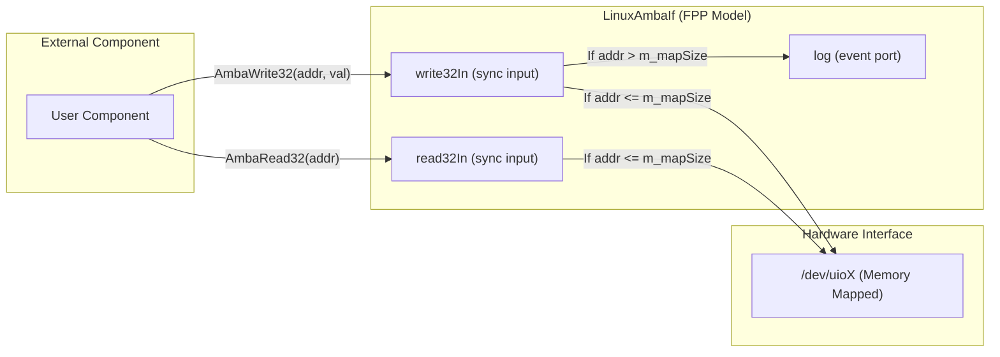
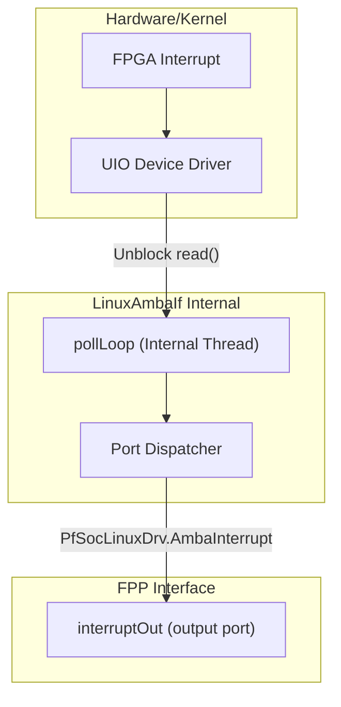

# Component Model & Interface (FPP)

Relevant source files

The following files were used as context for generating this wiki page:

- [fprime-pfsoc-linux/Components/PfSocLinuxDrv/LinuxAmbaIf/CMakeLists.txt](fprime-pfsoc-linux/Components/PfSocLinuxDrv/LinuxAmbaIf/CMakeLists.txt)
- [fprime-pfsoc-linux/Components/PfSocLinuxDrv/LinuxAmbaIf/LinuxAmbaIf.fpp](fprime-pfsoc-linux/Components/PfSocLinuxDrv/LinuxAmbaIf/LinuxAmbaIf.fpp)

This page provides a detailed technical reference for the `LinuxAmbaIf.fpp` file, which defines the formal model for the `LinuxAmbaIf` component. This component serves as a passive bridge between the F´ framework and Linux User Space I/O (UIO) for AMBA/AXI bus access on the PolarFire SoC.

## Component Overview

The `LinuxAmbaIf` component is defined as a `passive` component within the `PfSocLinuxDrv` module [fprime-pfsoc-linux/Components/PfSocLinuxDrv/LinuxAmbaIf/LinuxAmbaIf.fpp:1-5](). Being passive, it executes within the thread context of the caller for register access operations, ensuring low-latency interaction with FPGA peripherals. The component is restricted to the Linux platform via its build configuration [fprime-pfsoc-linux/Components/PfSocLinuxDrv/LinuxAmbaIf/CMakeLists.txt:7]().

### Constants and Alignment
To ensure hardware compatibility and prevent bus errors, the component defines explicit alignment constants based on standard F´ types:
*   `ALIGN_32`: 4 bytes, calculated as `sizeof(U32)` [fprime-pfsoc-linux/Components/PfSocLinuxDrv/LinuxAmbaIf/LinuxAmbaIf.fpp:12]().
*   `ALIGN_64`: 8 bytes, calculated as `sizeof(U64)` [fprime-pfsoc-linux/Components/PfSocLinuxDrv/LinuxAmbaIf/LinuxAmbaIf.fpp:15]().

**Sources:** [fprime-pfsoc-linux/Components/PfSocLinuxDrv/LinuxAmbaIf/LinuxAmbaIf.fpp:1-15](), [fprime-pfsoc-linux/Components/PfSocLinuxDrv/LinuxAmbaIf/CMakeLists.txt:7-15]()

## Port Interface

The component exposes a set of synchronous input ports for bus transactions and an output port for interrupt notifications.

### Bus Access Ports (Sync Input)
These ports allow external components to perform memory-mapped I/O operations. All input ports are `sync`, meaning the operation completes before the function returns to the caller.

| Port Name | Port Type | Description |
|-----------|-----------|-------------|
| `write32In` | `PfSocLinuxDrv.AmbaWrite32` | Performs a 32-bit write to a specific offset [fprime-pfsoc-linux/Components/PfSocLinuxDrv/LinuxAmbaIf/LinuxAmbaIf.fpp:22](). |
| `write64In` | `PfSocLinuxDrv.AmbaWrite64` | Performs a 64-bit write to a specific offset [fprime-pfsoc-linux/Components/PfSocLinuxDrv/LinuxAmbaIf/LinuxAmbaIf.fpp:25](). |
| `read32In` | `PfSocLinuxDrv.AmbaRead32` | Performs a 32-bit read; returns value as `U64` [fprime-pfsoc-linux/Components/PfSocLinuxDrv/LinuxAmbaIf/LinuxAmbaIf.fpp:28](). |
| `read64In` | `PfSocLinuxDrv.AmbaRead64` | Performs a 64-bit read; returns value as `U64` [fprime-pfsoc-linux/Components/PfSocLinuxDrv/LinuxAmbaIf/LinuxAmbaIf.fpp:31](). |

### Interrupt Notification (Output)
The `interruptOut` port [fprime-pfsoc-linux/Components/PfSocLinuxDrv/LinuxAmbaIf/LinuxAmbaIf.fpp:34]() uses the `PfSocLinuxDrv.AmbaInterrupt` type. It is triggered when the internal polling task detects a UIO interrupt event.

### Framework Ports
Standard F´ framework ports are included to support command processing, telemetry, and logging [fprime-pfsoc-linux/Components/PfSocLinuxDrv/LinuxAmbaIf/LinuxAmbaIf.fpp:41-59]():
*   **Commanding**: `cmdRegOut`, `cmdIn`, `cmdResponseOut`.
*   **Logging**: `log` (Event), `logTextOut` (Textual Event).
*   **Telemetry**: `tlmOut`.
*   **Time**: `timeCaller`.

**Sources:** [fprime-pfsoc-linux/Components/PfSocLinuxDrv/LinuxAmbaIf/LinuxAmbaIf.fpp:21-60]()

## Functional Commands

The component provides a single management command:

### CLEAR_EVENT_THROTTLE
*   **Opcode**: `0x00`
*   **Type**: `sync`
*   **Description**: Resets all event throttle counters [fprime-pfsoc-linux/Components/PfSocLinuxDrv/LinuxAmbaIf/LinuxAmbaIf.fpp:66-67](). This is useful if the component has entered a degraded state (e.g., repeated out-of-bounds accesses) and the operator needs to resume full visibility of error events after resolving the root cause.

**Sources:** [fprime-pfsoc-linux/Components/PfSocLinuxDrv/LinuxAmbaIf/LinuxAmbaIf.fpp:62-68]()

## Events and Error Handling

`LinuxAmbaIf` defines seven specific events, all categorized as `warning high` severity. These events monitor for invalid driver states or illegal bus access attempts.

### Event List and Throttling
All events share a common throttle configuration: **10 occurrences every 10 seconds** [fprime-pfsoc-linux/Components/PfSocLinuxDrv/LinuxAmbaIf/LinuxAmbaIf.fpp:79, 87, 95, 103, 111, 119, 125]().

| Event Name | Description | Data Argument |
|------------|-------------|---------------|
| `WriteDeviceNotOpened` | Write attempted before `open()` called [fprime-pfsoc-linux/Components/PfSocLinuxDrv/LinuxAmbaIf/LinuxAmbaIf.fpp:74]() | `addr` (U64) |
| `ReadDeviceNotOpened` | Read attempted before `open()` called [fprime-pfsoc-linux/Components/PfSocLinuxDrv/LinuxAmbaIf/LinuxAmbaIf.fpp:82]() | `addr` (U64) |
| `Write32OutOfBounds` | 32-bit write offset exceeds mmap size [fprime-pfsoc-linux/Components/PfSocLinuxDrv/LinuxAmbaIf/LinuxAmbaIf.fpp:90]() | `addr` (U64) |
| `Write64OutOfBounds` | 64-bit write offset exceeds mmap size [fprime-pfsoc-linux/Components/PfSocLinuxDrv/LinuxAmbaIf/LinuxAmbaIf.fpp:98]() | `addr` (U64) |
| `Read32OutOfBounds` | 32-bit read offset exceeds mmap size [fprime-pfsoc-linux/Components/PfSocLinuxDrv/LinuxAmbaIf/LinuxAmbaIf.fpp:106]() | `addr` (U64) |
| `Read64OutOfBounds` | 64-bit read offset exceeds mmap size [fprime-pfsoc-linux/Components/PfSocLinuxDrv/LinuxAmbaIf/LinuxAmbaIf.fpp:114]() | `addr` (U64) |
| `AlreadyConfigured` | Duplicate call to `open()` detected [fprime-pfsoc-linux/Components/PfSocLinuxDrv/LinuxAmbaIf/LinuxAmbaIf.fpp:122]() | N/A |

**Sources:** [fprime-pfsoc-linux/Components/PfSocLinuxDrv/LinuxAmbaIf/LinuxAmbaIf.fpp:70-127]()

## Data Flow Diagrams

### Register Access Flow
The following diagram illustrates how an external component uses the `LinuxAmbaIf` ports to interact with hardware.

**Diagram: FPP Port Mapping to Hardware Access**

**Sources:** [fprime-pfsoc-linux/Components/PfSocLinuxDrv/LinuxAmbaIf/LinuxAmbaIf.fpp:21-31, 89-112]()

### Interrupt Dispatch Flow
The following diagram illustrates the path from a hardware interrupt to the F´ port output.

**Diagram: UIO Interrupt to FPP Port**

**Sources:** [fprime-pfsoc-linux/Components/PfSocLinuxDrv/LinuxAmbaIf/LinuxAmbaIf.fpp:33-34]()
