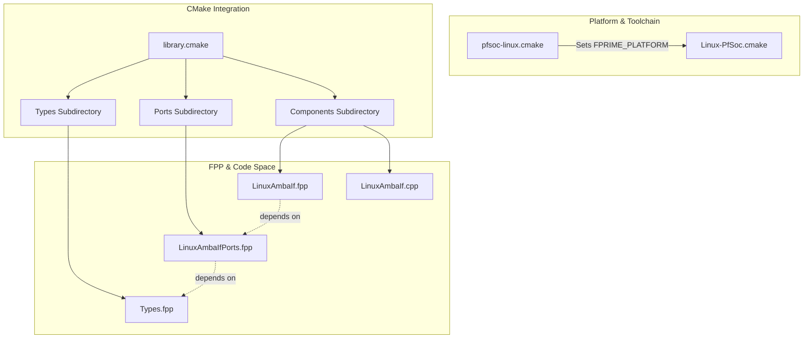
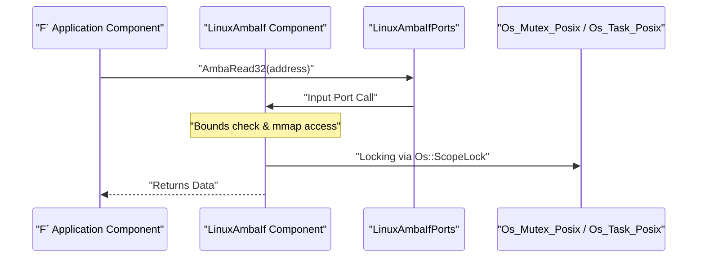

# Getting Started & Build Integration

Relevant source files

The following files were used as context for generating this wiki page:

- [cmake/platform/Linux-PfSoc.cmake](cmake/platform/Linux-PfSoc.cmake)
- [cmake/toolchain/pfsoc-linux.cmake](cmake/toolchain/pfsoc-linux.cmake)
- [library.cmake](library.cmake)

This page describes the integration process for the `fprime-pfsoc-linux` library into an F´ deployment. It covers the CMake configuration, platform constraints, and the architectural hierarchy required to bridge F´ software to PolarFire SoC hardware via Linux.

## Integration via library.cmake

The library is integrated into an F´ project by including its `library.cmake` file. This file acts as the entry point for the build system, ensuring that all necessary modules are added to the F´ build graph in the correct order [library.cmake:1-7]().

The integration uses the `add_fprime_subdirectory` macro to register three distinct layers of the library. This macro allows the F´ build system to process the `.fpp` and `.cpp` files within each directory, generating the necessary autocoded C++ classes and linking them into the deployment binary.

### Build Hierarchy
The library follows a strict three-layer module hierarchy to manage dependencies and ensure that types and ports are available to the components that implement them:

1.  **Types Layer**: Defines shared data structures used across the driver [library.cmake:4-4]().
2.  **Ports Layer**: Defines the interface contracts (F´ Ports) for AMBA/AXI communication [library.cmake:5-5]().
3.  **Components Layer**: Contains the actual C++ implementation of the driver logic [library.cmake:6-6]().

**Sources:** [library.cmake:1-7]()

## Platform and Toolchain Configuration

The `fprime-pfsoc-linux` library is specifically designed for the Microchip PolarFire SoC running a Linux distribution. It relies on Linux-specific features, such as the Userspace I/O (UIO) framework and `mmap` for register access.

### Platform Definition
The platform is defined in `Linux-PfSoc.cmake`, which configures the F´ framework to use POSIX-compliant implementations for core OS services such as files, mutexes, and tasks [cmake/platform/Linux-PfSoc.cmake:1-27](). It also sets the `TGT_OS_TYPE_LINUX` compile definition [cmake/platform/Linux-PfSoc.cmake:29-29]().

### Toolchain Integration
To build for the PolarFire SoC target, the `pfsoc-linux.cmake` toolchain file is used. This file sets the `FPRIME_PLATFORM` to `Linux-PfSoc` [cmake/toolchain/pfsoc-linux.cmake:40-40]() and specifies the cross-compilers and root paths for the target environment [cmake/toolchain/pfsoc-linux.cmake:43-48]().

**Sources:** [cmake/platform/Linux-PfSoc.cmake:1-30](), [cmake/toolchain/pfsoc-linux.cmake:37-57]()

## Data Flow and Module Hierarchy

The library's architecture is structured to decouple the low-level hardware interface from the high-level F´ component logic. This is achieved through the three-layer hierarchy mentioned above.

### Code Entity Relationship Diagram
The following diagram illustrates how the build system connects the FPP definitions to the final C++ implementation modules and the specific platform configuration.

**Diagram: Build System Entity Mapping**

**Sources:** [library.cmake:4-6](), [cmake/toolchain/pfsoc-linux.cmake:40-40](), [cmake/platform/Linux-PfSoc.cmake:11-27]()

### Layer Implementation Details

| Layer | Responsibility | Reference |
| :--- | :--- | :--- |
| **Types** | Defines basic types and constants used by the driver. | [library.cmake:4-4]() |
| **Ports** | Defines the `AmbaRead` and `AmbaWrite` port signatures. | [library.cmake:5-5]() |
| **Components** | Implements the `LinuxAmbaIf` component logic. | [library.cmake:6-6]() |

### Architectural Data Flow
This diagram shows how a request moves from the high-level Application Component down through the Ports to the hardware interface, utilizing the platform-specific POSIX implementations.

**Diagram: Layered Data Flow**

**Sources:** [library.cmake:4-6](), [cmake/platform/Linux-PfSoc.cmake:17-20]()
