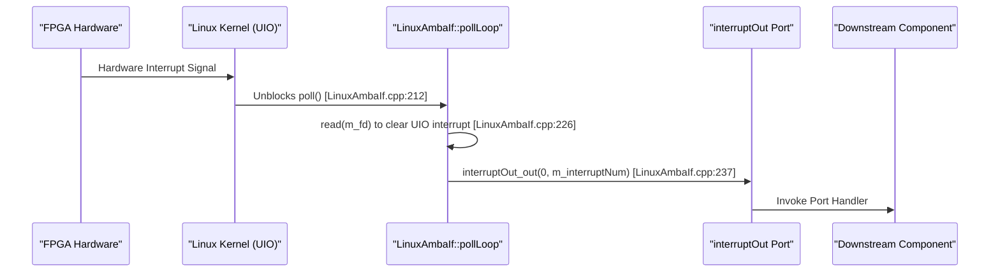

# Glossary

<details>
<summary>Relevant source files</summary>

The following files were used as context for generating this wiki page:

- [README.md](README.md)
- [cmake/platform/Linux-PfSoc.cmake](cmake/platform/Linux-PfSoc.cmake)
- [cmake/platform/unix/Platform/PlatformTypes.fpp](cmake/platform/unix/Platform/PlatformTypes.fpp)
- [cmake/platform/unix/Platform/PlatformTypes.h](cmake/platform/unix/Platform/PlatformTypes.h)
- [cmake/toolchain/pfsoc-linux.cmake](cmake/toolchain/pfsoc-linux.cmake)
- [fprime-pfsoc-linux/Components/PfSocLinuxDrv/LinuxAmbaIf/LinuxAmbaIf.cpp](fprime-pfsoc-linux/Components/PfSocLinuxDrv/LinuxAmbaIf/LinuxAmbaIf.cpp)
- [fprime-pfsoc-linux/Components/PfSocLinuxDrv/LinuxAmbaIf/LinuxAmbaIf.fpp](fprime-pfsoc-linux/Components/PfSocLinuxDrv/LinuxAmbaIf/LinuxAmbaIf.fpp)

</details>


This glossary defines the technical terms, framework concepts, and hardware-specific acronyms used within the `fprime-pfsoc-linux` library. It serves as a reference for onboarding engineers to understand how F´ concepts map to Linux kernel subsystems and PolarFire SoC hardware.

## Core Concepts & Terms

### AMBA (Advanced Microcontroller Bus Architecture)
The standard interconnect protocol used in the PolarFire SoC for communication between the microprocessor subsystem (MSS) and the FPGA fabric. This library provides ports to interact with AMBA-mapped registers.
*   **Implementation**: Ports like `AmbaWrite32` and `AmbaRead64` facilitate these transactions [fprime-pfsoc-linux/Components/PfSocLinuxDrv/LinuxAmbaIf/LinuxAmbaIf.fpp:22-31]().
*   **Alignment**: The hardware requires 32-bit and 64-bit alignment for bus access, enforced in the driver via `LinuxAmbaIf_ALIGN_32` and `LinuxAmbaIf_ALIGN_64` [fprime-pfsoc-linux/Components/PfSocLinuxDrv/LinuxAmbaIf/LinuxAmbaIf.cpp:115-135]().

### FPP (F Prime Prime)
The modeling language used to define F´ components, ports, and types. FPP files are translated into C++ code by the F´ autocoder.
*   **Components**: Defined in `.fpp` files [fprime-pfsoc-linux/Components/PfSocLinuxDrv/LinuxAmbaIf/LinuxAmbaIf.fpp:5]().
*   **Platform Types**: Platform-specific type aliases are also defined in FPP [cmake/platform/unix/Platform/PlatformTypes.fpp:11-35]().

### Passive Component
An F´ component that does not have its own execution thread for handling input ports. Instead, it executes in the thread of the caller.
*   **Entity**: `LinuxAmbaIf` is defined as a passive component [fprime-pfsoc-linux/Components/PfSocLinuxDrv/LinuxAmbaIf/LinuxAmbaIf.fpp:5]().
*   **Exception**: While the component is passive, it spawns an internal `Os::Task` specifically for interrupt polling [fprime-pfsoc-linux/Components/PfSocLinuxDrv/LinuxAmbaIf/LinuxAmbaIf.cpp:93-94]().

### UIO (Userspace I/O)
A Linux kernel subsystem that allows device drivers to be implemented in userspace. It exposes hardware registers via a file descriptor that can be memory-mapped (`mmap`) and provides interrupt notification via `poll()` or `read()`.
*   **Usage**: `LinuxAmbaIf` uses UIO to bridge FPGA hardware to F´ [fprime-pfsoc-linux/Components/PfSocLinuxDrv/LinuxAmbaIf/LinuxAmbaIf.cpp:55-75]().

---

## Code Entity Mapping

The following diagram bridges the high-level system concepts to the specific C++ classes and FPP models used in the codebase.

**System to Code Entity Mapping**
```mermaid
graph TD
    subgraph "Natural Language Space"
        A["Hardware Register Access"]
        B["Interrupt Notification"]
        C["UIO Device Management"]
        D["Platform Configuration"]
    end

    subgraph "Code Entity Space"
        A --> E["LinuxAmbaIf::read32In_handler"]
        A --> F["LinuxAmbaIf::write32In_handler"]
        B --> G["LinuxAmbaIf::isrHandler"]
        B --> H["interruptOut (Output Port)"]
        C --> I["LinuxAmbaIf::open()"]
        C --> J["m_fd (File Descriptor)"]
        D --> K["Linux-PfSoc.cmake"]
    end

    E --- [fprime-pfsoc-linux/Components/PfSocLinuxDrv/LinuxAmbaIf/LinuxAmbaIf.cpp:146]
    F --- [fprime-pfsoc-linux/Components/PfSocLinuxDrv/LinuxAmbaIf/LinuxAmbaIf.cpp:110]
    G --- [fprime-pfsoc-linux/Components/PfSocLinuxDrv/LinuxAmbaIf/LinuxAmbaIf.cpp:201]
    H --- [fprime-pfsoc-linux/Components/PfSocLinuxDrv/LinuxAmbaIf/LinuxAmbaIf.fpp:34]
    I --- [fprime-pfsoc-linux/Components/PfSocLinuxDrv/LinuxAmbaIf/LinuxAmbaIf.cpp:46]
    K --- [cmake/platform/Linux-PfSoc.cmake:2]
```
**Sources**: [fprime-pfsoc-linux/Components/PfSocLinuxDrv/LinuxAmbaIf/LinuxAmbaIf.cpp:46-201](), [fprime-pfsoc-linux/Components/PfSocLinuxDrv/LinuxAmbaIf/LinuxAmbaIf.fpp:22-34](), [cmake/platform/Linux-PfSoc.cmake:1-30]()

---

## Detailed Definitions

| Term | Definition | Code Pointer |
| :--- | :--- | :--- |
| `m_mappedBase` | A `volatile U8*` pointer to the start of the memory-mapped UIO register region. | [fprime-pfsoc-linux/Components/PfSocLinuxDrv/LinuxAmbaIf/LinuxAmbaIf.cpp:75]() |
| `m_pollTask` | An `Os::Task` object that runs the `pollLoop` to wait for hardware interrupts. | [fprime-pfsoc-linux/Components/PfSocLinuxDrv/LinuxAmbaIf/LinuxAmbaIf.cpp:94]() |
| `isrHandler` | A static "trampoline" function used to transition from a C-style thread callback to the `LinuxAmbaIf` class instance. | [fprime-pfsoc-linux/Components/PfSocLinuxDrv/LinuxAmbaIf/LinuxAmbaIf.cpp:201]() |
| `pollLoop` | The main execution loop for the interrupt task; it blocks on the UIO file descriptor using `poll()`. | [fprime-pfsoc-linux/Components/PfSocLinuxDrv/LinuxAmbaIf/LinuxAmbaIf.cpp:212]() |
| `Event Throttle` | An F´ mechanism to limit the frequency of specific events. `LinuxAmbaIf` throttles all warning events to 10 every 10 seconds. | [fprime-pfsoc-linux/Components/PfSocLinuxDrv/LinuxAmbaIf/LinuxAmbaIf.fpp:79]() |
| `CLEAR_EVENT_THROTTLE` | A command that resets the throttle counters, allowing suppressed events to be emitted again. | [fprime-pfsoc-linux/Components/PfSocLinuxDrv/LinuxAmbaIf/LinuxAmbaIf.cpp:186]() |
| `PlatformSizeType` | A platform-specific type alias for memory buffer and file sizes, defined as `U64` for PfSoc. | [cmake/platform/unix/Platform/PlatformTypes.fpp:11]() |

---

## Data Flow: Interrupt Handling

This diagram illustrates the flow of data from a hardware interrupt signal in the PolarFire SoC FPGA fabric, through the Linux UIO driver, and finally into the F´ component architecture.

**Interrupt Data Flow**

**Sources**: [fprime-pfsoc-linux/Components/PfSocLinuxDrv/LinuxAmbaIf/LinuxAmbaIf.cpp:212-240](), [fprime-pfsoc-linux/Components/PfSocLinuxDrv/LinuxAmbaIf/LinuxAmbaIf.fpp:34]()
