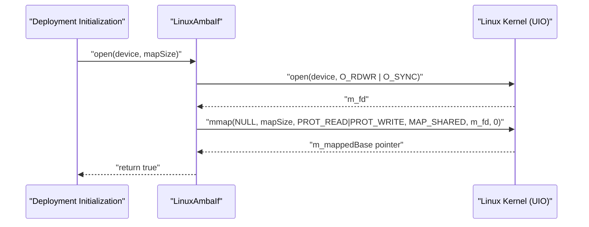
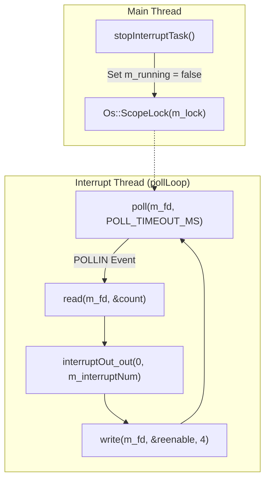

# Implementation: Register Access & Interrupt Handling

Relevant source files

The following files were used as context for generating this wiki page:

- [fprime-pfsoc-linux/Components/PfSocLinuxDrv/LinuxAmbaIf/LinuxAmbaIf.cpp](fprime-pfsoc-linux/Components/PfSocLinuxDrv/LinuxAmbaIf/LinuxAmbaIf.cpp)

This page provides a detailed technical walkthrough of the `LinuxAmbaIf` component implementation. It covers the lifecycle of the UIO device connection, the logic governing register read/write operations, and the high-performance interrupt polling loop.

## Lifecycle: Open and Memory Mapping

The `LinuxAmbaIf` component interacts with FPGA hardware through the Linux Userspace I/O (UIO) subsystem. The initialization process is handled by the `open()` method, which establishes a memory-mapped interface to the hardware registers.

### The open() / mmap Sequence
1.  **Device Access**: The component opens the specified UIO device (e.g., `/dev/uio0`) using `O_RDWR | O_SYNC` flags to ensure unbuffered, direct access to hardware memory [fprime-pfsoc-linux/Components/PfSocLinuxDrv/LinuxAmbaIf/LinuxAmbaIf.cpp:54-57]().
2.  **Memory Mapping**: It calls `::mmap` to map the hardware register space into the process's virtual address space. It uses `PROT_READ | PROT_WRITE` and `MAP_SHARED` to allow bidirectional communication with the FPGA [fprime-pfsoc-linux/Components/PfSocLinuxDrv/LinuxAmbaIf/LinuxAmbaIf.cpp:59-66]().
3.  **State Management**: Upon success, the base pointer is stored in `m_mappedBase` and the `m_configured` flag is set to `true` [fprime-pfsoc-linux/Components/PfSocLinuxDrv/LinuxAmbaIf/LinuxAmbaIf.cpp:74-76]().

### Resource Cleanup
The destructor `~LinuxAmbaIf()` ensures that resources are released in reverse order: `::munmap` is called on the memory region before `::close` is called on the file descriptor [fprime-pfsoc-linux/Components/PfSocLinuxDrv/LinuxAmbaIf/LinuxAmbaIf.cpp:30-39]().

**Hardware Mapping Flow**

Sources: [fprime-pfsoc-linux/Components/PfSocLinuxDrv/LinuxAmbaIf/LinuxAmbaIf.cpp:45-78](), [fprime-pfsoc-linux/Components/PfSocLinuxDrv/LinuxAmbaIf/LinuxAmbaIf.cpp:31-40]()

## Register Access Logic

The component provides four primary handlers for AMBA/AXI register access: `write32`, `write64`, `read32`, and `read64`. Each handler performs strict validation before attempting memory access.

### Validation Steps
Every access undergoes three checks:
1.  **Configuration Check**: Ensures `open()` was called successfully [fprime-pfsoc-linux/Components/PfSocLinuxDrv/LinuxAmbaIf/LinuxAmbaIf.cpp:110-113]().
2.  **Alignment Check**: Verifies that the offset `addr` is aligned to the data width (4 bytes for 32-bit, 8 bytes for 64-bit) using constants like `LinuxAmbaIf_ALIGN_32` [fprime-pfsoc-linux/Components/PfSocLinuxDrv/LinuxAmbaIf/LinuxAmbaIf.cpp:114-117]().
3.  **Bounds Check**: Ensures the access (base + offset + width) does not exceed `m_mapSize` [fprime-pfsoc-linux/Components/PfSocLinuxDrv/LinuxAmbaIf/LinuxAmbaIf.cpp:118-121]().

If any check fails, a `WARNING_HI` event is emitted and the operation is aborted.

### Execution
Once validated, the component calculates the target address using pointer arithmetic on `m_mappedBase` and performs a volatile memory access to prevent compiler optimizations from removing the hardware interaction [fprime-pfsoc-linux/Components/PfSocLinuxDrv/LinuxAmbaIf/LinuxAmbaIf.cpp:123-124]().

**Register Access Component Entity Map**
| Code Entity | Role | Logic |
|:---|:---|:---|
| `write32In_handler` | 32-bit Write | `*(volatile U32*)(m_mappedBase + addr) = value` [fprime-pfsoc-linux/Components/PfSocLinuxDrv/LinuxAmbaIf/LinuxAmbaIf.cpp:109-125]() |
| `write64In_handler` | 64-bit Write | `*(volatile U64*)(m_mappedBase + addr) = value` [fprime-pfsoc-linux/Components/PfSocLinuxDrv/LinuxAmbaIf/LinuxAmbaIf.cpp:127-143]() |
| `read32In_handler` | 32-bit Read | `return (U64)*(volatile U32*)(m_mappedBase + addr)` [fprime-pfsoc-linux/Components/PfSocLinuxDrv/LinuxAmbaIf/LinuxAmbaIf.cpp:145-161]() |
| `read64In_handler` | 64-bit Read | `return *(volatile U64*)(m_mappedBase + addr)` [fprime-pfsoc-linux/Components/PfSocLinuxDrv/LinuxAmbaIf/LinuxAmbaIf.cpp:163-179]() |

Sources: [fprime-pfsoc-linux/Components/PfSocLinuxDrv/LinuxAmbaIf/LinuxAmbaIf.cpp:109-179]()

## Interrupt Handling Subsystem

The interrupt subsystem uses a dedicated background thread to monitor the UIO file descriptor for hardware events.

### Thread Management
- **`startInterruptTask`**: Spawns an `Os::Task` that executes the `isrHandler` trampoline [fprime-pfsoc-linux/Components/PfSocLinuxDrv/LinuxAmbaIf/LinuxAmbaIf.cpp:80-94]().
- **`isrHandler`**: A static method that casts the `void* self` pointer back to a `LinuxAmbaIf` instance and enters the `pollLoop` [fprime-pfsoc-linux/Components/PfSocLinuxDrv/LinuxAmbaIf/LinuxAmbaIf.cpp:200-204]().
- **Thread Safety**: The `m_running` flag is protected by `m_lock` (an `Os::Mutex`) and accessed via `getRunning()` to ensure safe shutdown [fprime-pfsoc-linux/Components/PfSocLinuxDrv/LinuxAmbaIf/LinuxAmbaIf.cpp:206-209]().

### The UIO Poll Protocol
The `pollLoop` follows the standard Linux UIO interrupt protocol:
1.  **Poll**: Block on `::poll()` waiting for `POLLIN` on `m_fd`. A timeout `POLL_TIMEOUT_MS` (500ms) is used to allow the thread to check `m_running` and exit gracefully [fprime-pfsoc-linux/Components/PfSocLinuxDrv/LinuxAmbaIf/LinuxAmbaIf.cpp:211-217]().
2.  **Read/Acknowledge**: When an interrupt occurs, the kernel increments an internal counter. The user space must `::read()` from `m_fd` to acknowledge the event.
3.  **Dispatch**: The component invokes the `interruptOut` port with the configured `m_interruptNum`.
4.  **Re-enable**: Writing back to the UIO file descriptor re-enables the interrupt in the kernel.

**Interrupt Dispatch Flow**

Sources: [fprime-pfsoc-linux/Components/PfSocLinuxDrv/LinuxAmbaIf/LinuxAmbaIf.cpp:80-103, 200-218]()

## Command Handling

The component implements the `CLEAR_EVENT_THROTTLE` command. Because many events in this component (like out-of-bounds access) are likely to occur in high-frequency loops, F´ event throttling is used to prevent telemetry saturation.

The `CLEAR_EVENT_THROTTLE_cmdHandler` manually resets the throttle counters for all seven `WARNING_HI` events by calling their respective `_ThrottleClear` methods [fprime-pfsoc-linux/Components/PfSocLinuxDrv/LinuxAmbaIf/LinuxAmbaIf.cpp:185-194]().

Sources: [fprime-pfsoc-linux/Components/PfSocLinuxDrv/LinuxAmbaIf/LinuxAmbaIf.cpp:185-194]()
