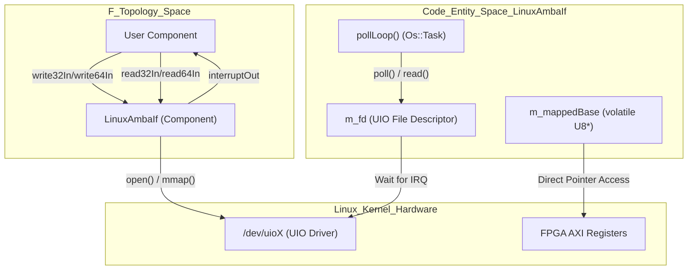
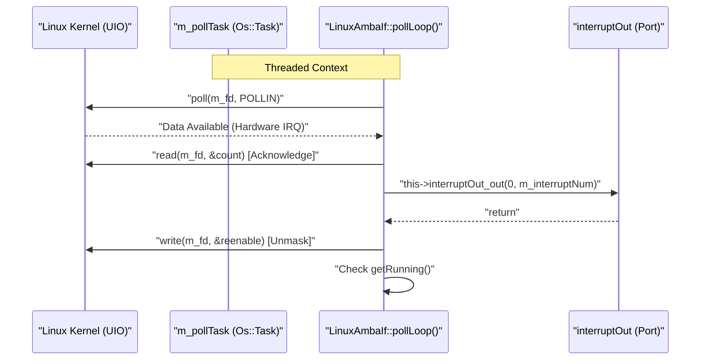

# LinuxAmbaIf Component

Relevant source files

The following files were used as context for generating this wiki page:

- [fprime-pfsoc-linux/Components/PfSocLinuxDrv/LinuxAmbaIf/LinuxAmbaIf.cpp](fprime-pfsoc-linux/Components/PfSocLinuxDrv/LinuxAmbaIf/LinuxAmbaIf.cpp)
- [fprime-pfsoc-linux/Components/PfSocLinuxDrv/LinuxAmbaIf/LinuxAmbaIf.fpp](fprime-pfsoc-linux/Components/PfSocLinuxDrv/LinuxAmbaIf/LinuxAmbaIf.fpp)
- [fprime-pfsoc-linux/Components/PfSocLinuxDrv/LinuxAmbaIf/LinuxAmbaIf.hpp](fprime-pfsoc-linux/Components/PfSocLinuxDrv/LinuxAmbaIf/LinuxAmbaIf.hpp)

The `LinuxAmbaIf` component is the primary hardware abstraction layer in the `fprime-pfsoc-linux` library. It is a **passive** F´ component designed to bridge the gap between high-level F´ software and FPGA-based peripherals on the Microchip PolarFire SoC. It leverages the Linux **Userspace I/O (UIO)** framework to provide memory-mapped access to AMBA/AXI registers and handle hardware interrupts without requiring custom kernel drivers [fprime-pfsoc-linux/Components/PfSocLinuxDrv/LinuxAmbaIf/LinuxAmbaIf.fpp:3-5]().

### Component Role and Responsibility

`LinuxAmbaIf` acts as a proxy for hardware interaction. Instead of every component calling `mmap()` or `poll()` on device files, they connect to the `LinuxAmbaIf` ports. This centralizes register access logic, alignment enforcement, and interrupt dispatching.

**Key Responsibilities:**
- **Memory Mapping:** Maps UIO device register regions into the process address space using `mmap` [fprime-pfsoc-linux/Components/PfSocLinuxDrv/LinuxAmbaIf/LinuxAmbaIf.cpp:59-75]().
- **Register Access:** Provides synchronous 32-bit and 64-bit read/write operations with bounds checking [fprime-pfsoc-linux/Components/PfSocLinuxDrv/LinuxAmbaIf/LinuxAmbaIf.cpp:109-179]().
- **Interrupt Servicing:** Manages a dedicated background thread (`m_pollTask`) that waits on UIO interrupts and dispatches them back into the F´ topology [fprime-pfsoc-linux/Components/PfSocLinuxDrv/LinuxAmbaIf/LinuxAmbaIf.cpp:81-95](), [fprime-pfsoc-linux/Components/PfSocLinuxDrv/LinuxAmbaIf/LinuxAmbaIf.cpp:211-230]().
- **Safety & Health:** Monitors for out-of-bounds access or unconfigured usage, reporting issues via F´ Events [fprime-pfsoc-linux/Components/PfSocLinuxDrv/LinuxAmbaIf/LinuxAmbaIf.fpp:73-120]().

### High-Level Architecture

The following diagram illustrates how `LinuxAmbaIf` bridges the F´ framework to the Linux UIO subsystem.

**Diagram: System Context and Data Flow**

Sources: [fprime-pfsoc-linux/Components/PfSocLinuxDrv/LinuxAmbaIf/LinuxAmbaIf.hpp:85-91](), [fprime-pfsoc-linux/Components/PfSocLinuxDrv/LinuxAmbaIf/LinuxAmbaIf.cpp:54-75]()

---

### Component Model & Interface (FPP)
The component is defined in `LinuxAmbaIf.fpp`. It defines the constants for 32-bit (`ALIGN_32`) and 64-bit (`ALIGN_64`) alignment, the synchronous ports used for bus transactions, and the telemetry/event/command ports required by the F´ framework [fprime-pfsoc-linux/Components/PfSocLinuxDrv/LinuxAmbaIf/LinuxAmbaIf.fpp:11-60](). It also defines a set of `WARNING_HIGH` events used to signal hardware interface errors, such as `Write32OutOfBounds` [fprime-pfsoc-linux/Components/PfSocLinuxDrv/LinuxAmbaIf/LinuxAmbaIf.fpp:89-95]().

For details, see [Component Model & Interface (FPP)](#3.1).

Sources: [fprime-pfsoc-linux/Components/PfSocLinuxDrv/LinuxAmbaIf/LinuxAmbaIf.fpp:5-127]()

### C++ Class Interface (Header)
The C++ implementation is encapsulated in the `PfSocLinuxDrv::LinuxAmbaIf` class [fprime-pfsoc-linux/Components/PfSocLinuxDrv/LinuxAmbaIf/LinuxAmbaIf.hpp:10](). The header defines the lifecycle API, including `open()` for initialization and `startInterruptTask()` for spawning the IRQ listener thread [fprime-pfsoc-linux/Components/PfSocLinuxDrv/LinuxAmbaIf/LinuxAmbaIf.hpp:24-34](). It utilizes an `Os::Task` for polling and an `Os::Mutex` to ensure thread-safe control of the interrupt loop [fprime-pfsoc-linux/Components/PfSocLinuxDrv/LinuxAmbaIf/LinuxAmbaIf.hpp:90-91]().

For details, see [C++ Class Interface (Header)](#3.2).

Sources: [fprime-pfsoc-linux/Components/PfSocLinuxDrv/LinuxAmbaIf/LinuxAmbaIf.hpp:10-96]()

### Implementation: Register Access & Interrupt Handling
The core logic resides in `LinuxAmbaIf.cpp`. This includes the `pollLoop()` which follows the UIO protocol: polling the file descriptor, performing a blocking read to acknowledge the interrupt, and then re-enabling the interrupt via a write [fprime-pfsoc-linux/Components/PfSocLinuxDrv/LinuxAmbaIf/LinuxAmbaIf.cpp:211-230](). The register access handlers (`read32In_handler`, `write32In_handler`, etc.) perform pointer arithmetic on `m_mappedBase` and use `volatile` qualifiers to ensure hardware-consistent access [fprime-pfsoc-linux/Components/PfSocLinuxDrv/LinuxAmbaIf/LinuxAmbaIf.cpp:110-180]().

For details, see [Implementation: Register Access & Interrupt Handling](#3.3).

Sources: [fprime-pfsoc-linux/Components/PfSocLinuxDrv/LinuxAmbaIf/LinuxAmbaIf.cpp:109-230]()

---

### Component Interaction Logic

The following diagram maps the logical flow of a hardware interrupt from the kernel through the component's internal C++ methods.

**Diagram: Interrupt Dispatch Sequence**

Sources: [fprime-pfsoc-linux/Components/PfSocLinuxDrv/LinuxAmbaIf/LinuxAmbaIf.cpp:211-230](), [fprime-pfsoc-linux/Components/PfSocLinuxDrv/LinuxAmbaIf/LinuxAmbaIf.hpp:71-79]()
