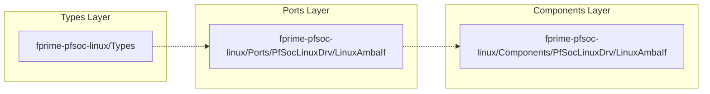

# Overview

<details>
<summary>Relevant source files</summary>

The following files were used as context for generating this wiki page:

- [README.md](README.md)
- [library.cmake](library.cmake)

</details>


`fprime-pfsoc-linux` is an F´ library designed to provide hardware abstraction drivers and services specifically for the Microchip PolarFire SoC (PFSOC) platform running Linux [README.md:1-3](). It bridges the gap between high-level F´ flight software and low-level FPGA peripherals by leveraging the Linux Userspace I/O (UIO) subsystem.

The library exists to provide a standardized, reusable interface for interacting with AMBA/AXI bus registers and handling hardware interrupts without requiring custom kernel drivers for every FPGA core.

## Target Hardware and Platform
The library is designed for the **Microchip PolarFire SoC**, a platform that combines a RISC-V CPU subsystem with a programmable FPGA fabric. 
- **Operating System:** Linux.
- **Hardware Interface:** The library primarily utilizes the Linux UIO driver to map hardware registers into the process's memory space and to receive interrupts from the FPGA [README.md:15-17]().

## Functional Scope
The primary component provided in this library is the `LinuxAmbaIf`. It acts as a passive F´ component that enables other software components to perform the following operations on FPGA peripherals:
- 32-bit and 64-bit register reads and writes.
- Synchronous interrupt handling via a dedicated poll task.
- Telemetry and event reporting for bus access errors (e.g., alignment issues or out-of-bounds access).

For more information on the build system and how to include this library in your deployment, see [Getting Started & Build Integration](#1.1).

## System Integration Model
The following diagram illustrates how `fprime-pfsoc-linux` fits into a standard F´ deployment, bridging the "Natural Language Space" of hardware requirements to the "Code Entity Space" of F´ components.

**F´ to PolarFire SoC Hardware Bridge**
```mermaid
graph TD
    subgraph "F´ Deployment"
        [UserComponent] -- "AmbaRead/Write" --> [LinuxAmbaIf]
        [LinuxAmbaIf] -- "Interrupt" --> [UserComponent]
    end

    subgraph "fprime-pfsoc-linux Library"
        [LinuxAmbaIf] -- "mmap()" --> [UIO_Device_Node]
        [LinuxAmbaIf] -- "poll()" --> [UIO_Interrupt]
    end

    subgraph "PolarFire SoC Hardware"
        [UIO_Device_Node] <--> [AXI_Interconnect]
        [AXI_Interconnect] <--> [FPGA_Peripheral]
        [FPGA_Peripheral] -- "IRQ" --> [UIO_Interrupt]
    end

    style [LinuxAmbaIf] stroke-width:2px
```
Sources: [README.md:15-17](), [library.cmake:4-6]()

## Architectural Hierarchy
The library is organized into a three-layer hierarchy to ensure modularity and clean dependency management. This structure separates data definitions (Types) from interface definitions (Ports) and implementation logic (Components).

| Layer | Namespace/Path | Purpose |
| :--- | :--- | :--- |
| **Types** | `PfSocLinuxDrv` | Defines shared data structures and status codes used across the library [README.md:11](). |
| **Ports** | `PfSocLinuxDrv` / `PfSocLinuxSvc` | Defines the FPP port signatures for AMBA operations and interrupts [README.md:9-10](). |
| **Components** | `PfSocLinuxDrv` / `PfSocLinuxSvc` | Contains the actual C++ implementations, such as `LinuxAmbaIf` [README.md:7-8](). |

The library distinguishes between **Drivers** (`PfSocLinuxDrv`), which interact directly with hardware, and **Services** (`PfSocLinuxSvc`), which provide higher-level system functions [README.md:7-10]().

For a detailed breakdown of the file system and namespace organization, see [Repository Structure](#1.2).

**Code Entity Relationship**

Sources: [library.cmake:4-6](), [README.md:7-11]()
