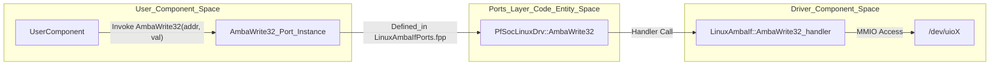
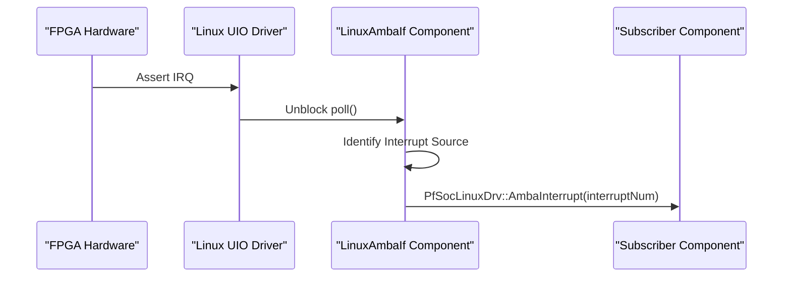

# Port Definitions (Ports Layer)

Relevant source files

The following files were used as context for generating this wiki page:

- [fprime-pfsoc-linux/Ports/PfSocLinuxDrv/LinuxAmbaIf/CMakeLists.txt](fprime-pfsoc-linux/Ports/PfSocLinuxDrv/LinuxAmbaIf/CMakeLists.txt)
- [fprime-pfsoc-linux/Ports/PfSocLinuxDrv/LinuxAmbaIf/LinuxAmbaIfPorts.fpp](fprime-pfsoc-linux/Ports/PfSocLinuxDrv/LinuxAmbaIf/LinuxAmbaIfPorts.fpp)

The Ports Layer serves as the standardized communication interface between high-level F´ components and the underlying hardware drivers. By defining specific ports for AMBA (Advanced Microcontroller Bus Architecture) operations, the library decouples the functional logic of a component from the low-level details of Linux UIO (Userspace I/O) memory mapping and interrupt handling.

## Purpose and Scope

The ports defined in `LinuxAmbaIfPorts.fpp` establish a contract for memory-mapped I/O (MMIO) and interrupt signaling [fprime-pfsoc-linux/Ports/PfSocLinuxDrv/LinuxAmbaIf/LinuxAmbaIfPorts.fpp:1-30](). This layer ensures that any component requiring access to FPGA fabric registers or status signals can do so using a uniform API, regardless of the specific memory offsets or driver implementation details.

All ports are contained within the `PfSocLinuxDrv` module namespace [fprime-pfsoc-linux/Ports/PfSocLinuxDrv/LinuxAmbaIf/LinuxAmbaIfPorts.fpp:1-1]().

## Port Signatures and Semantics

The library defines five primary ports to handle 32-bit and 64-bit data transactions and asynchronous interrupt notifications.

### Register Access Ports (Sync)

These ports are designed for synchronous register interaction. The read ports utilize return values to provide immediate data to the caller.

| Port Name | Direction | Parameters | Return Type | Description |
|:---|:---|:---|:---|:---|
| `AmbaWrite32` | Input | `addr: U64`, `value: U32` | N/A | Writes a 32-bit value to a specified 64-bit offset [fprime-pfsoc-linux/Ports/PfSocLinuxDrv/LinuxAmbaIf/LinuxAmbaIfPorts.fpp:4-7](). |
| `AmbaWrite64` | Input | `addr: U64`, `value: U64` | N/A | Writes a 64-bit value to a specified 64-bit offset [fprime-pfsoc-linux/Ports/PfSocLinuxDrv/LinuxAmbaIf/LinuxAmbaIfPorts.fpp:10-13](). |
| `AmbaRead32` | Input | `addr: U64` | `U64` | Reads 32 bits from an offset; returns as a 64-bit container [fprime-pfsoc-linux/Ports/PfSocLinuxDrv/LinuxAmbaIf/LinuxAmbaIfPorts.fpp:16-18](). |
| `AmbaRead64` | Input | `addr: U64` | `U64` | Reads 64 bits from an offset; returns as a 64-bit value [fprime-pfsoc-linux/Ports/PfSocLinuxDrv/LinuxAmbaIf/LinuxAmbaIfPorts.fpp:21-23](). |

### Event Notification Ports (Async)

The interrupt port allows the driver to signal hardware events back to the application layer.

| Port Name | Direction | Parameters | Description |
|:---|:---|:---|:---|
| `AmbaInterrupt` | Output | `interruptNum: U32` | Signals that a hardware interrupt has occurred [fprime-pfsoc-linux/Ports/PfSocLinuxDrv/LinuxAmbaIf/LinuxAmbaIfPorts.fpp:26-28](). |

**Sources:**
- [fprime-pfsoc-linux/Ports/PfSocLinuxDrv/LinuxAmbaIf/LinuxAmbaIfPorts.fpp:1-30]()

## Data Flow and Decoupling

The Ports Layer acts as a bridge. A user component (e.g., a Telemetry Controller) invokes a port like `AmbaRead32`. The `LinuxAmbaIf` component implements the handler for this port, performing the actual memory dereferencing via its UIO-mapped region.

### Port Interaction Diagram

This diagram illustrates how the `LinuxAmbaIfPorts.fpp` definitions bridge the "Natural Language" requirements of hardware access to the "Code Entities" in the F´ framework.

**Logic to Driver Mapping**

**Sources:**
- [fprime-pfsoc-linux/Ports/PfSocLinuxDrv/LinuxAmbaIf/LinuxAmbaIfPorts.fpp:1-30]()

## Implementation Details

The ports are defined using the F´ Prime (FPP) modeling language. When the build system processes `LinuxAmbaIfPorts.fpp`, it generates C++ classes that represent these interfaces. The `CMakeLists.txt` file ensures these definitions are registered within the F´ build system [fprime-pfsoc-linux/Ports/PfSocLinuxDrv/LinuxAmbaIf/CMakeLists.txt:1-4]().

### Interrupt Propagation

The `AmbaInterrupt` port is specifically used by the driver's internal polling thread. When the Linux UIO driver detects a hardware signal, the driver component emits a call through this port.

**Interrupt Data Flow**

### Parameter Semantics
*   **`addr` (U64):** Represents the 64-bit AMBA bus address or offset from the base address of the UIO device memory region [fprime-pfsoc-linux/Ports/PfSocLinuxDrv/LinuxAmbaIf/LinuxAmbaIfPorts.fpp:5,11,17,22]().
*   **`value` (U32/U64):** The data payload to be written. For `AmbaWrite32`, this is a 32-bit value [fprime-pfsoc-linux/Ports/PfSocLinuxDrv/LinuxAmbaIf/LinuxAmbaIfPorts.fpp:6](). For `AmbaWrite64`, this is a 64-bit value [fprime-pfsoc-linux/Ports/PfSocLinuxDrv/LinuxAmbaIf/LinuxAmbaIfPorts.fpp:12]().
*   **Return Values:** `AmbaRead32` returns the read value as a `U64` container [fprime-pfsoc-linux/Ports/PfSocLinuxDrv/LinuxAmbaIf/LinuxAmbaIfPorts.fpp:18](), while `AmbaRead64` returns the full 64-bit value [fprime-pfsoc-linux/Ports/PfSocLinuxDrv/LinuxAmbaIf/LinuxAmbaIfPorts.fpp:23]().
*   **`interruptNum` (U32):** An identifier for the specific interrupt number triggered by the AMBA bus peripheral [fprime-pfsoc-linux/Ports/PfSocLinuxDrv/LinuxAmbaIf/LinuxAmbaIfPorts.fpp:27]().

**Sources:**
- [fprime-pfsoc-linux/Ports/PfSocLinuxDrv/LinuxAmbaIf/LinuxAmbaIfPorts.fpp:1-30]()
- [fprime-pfsoc-linux/Ports/PfSocLinuxDrv/LinuxAmbaIf/CMakeLists.txt:1-5]()
