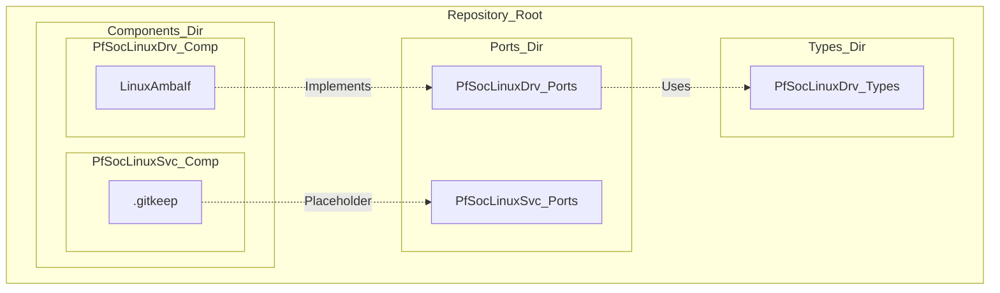
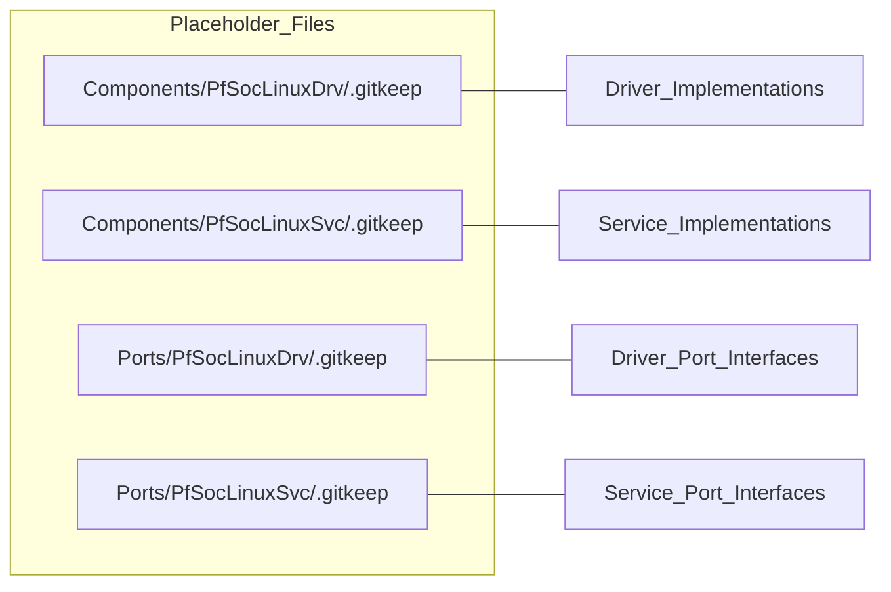

# Repository Structure

Relevant source files

The following files were used as context for generating this wiki page:

- [README.md](README.md)
- [fprime-pfsoc-linux/Components/PfSocLinuxDrv/.gitkeep](fprime-pfsoc-linux/Components/PfSocLinuxDrv/.gitkeep)
- [fprime-pfsoc-linux/Components/PfSocLinuxSvc/.gitkeep](fprime-pfsoc-linux/Components/PfSocLinuxSvc/.gitkeep)
- [fprime-pfsoc-linux/Ports/PfSocLinuxDrv/.gitkeep](fprime-pfsoc-linux/Ports/PfSocLinuxDrv/.gitkeep)
- [fprime-pfsoc-linux/Ports/PfSocLinuxSvc/.gitkeep](fprime-pfsoc-linux/Ports/PfSocLinuxSvc/.gitkeep)

This page describes the physical and logical organization of the `fprime-pfsoc-linux` repository. The library is structured to follow standard F´ conventions while categorizing functionality into drivers (low-level hardware access) and services (high-level platform management).

## Directory Layout

The repository is organized into three primary architectural layers: `Types`, `Ports`, and `Components`. This separation ensures that data contracts are defined independently of the components that implement them, facilitating better modularity and testability.

| Directory | Namespace | Purpose |
| :--- | :--- | :--- |
| `Types/` | `PfSocLinuxDrv` | Common data structures and types shared across the library [README.md:11-11](). |
| `Ports/` | `PfSocLinuxDrv` / `PfSocLinuxSvc` | F´ Port definitions for communication between components [README.md:9-10](). |
| `Components/` | `PfSocLinuxDrv` / `PfSocLinuxSvc` | C++ implementations of drivers and services [README.md:7-8](). |

### Namespace Strategy
The library utilizes two distinct namespaces to categorize its contents:
1.  **`PfSocLinuxDrv`**: Reserved for low-level driver components that interface directly with hardware or Linux kernel subsystems (e.g., UIO, I2C, SPI) [README.md:7,9]().
2.  **`PfSocLinuxSvc`**: Reserved for higher-level platform services that provide system-wide utility but may not directly toggle hardware pins (e.g., health monitoring, platform-specific telemetry) [README.md:8,10]().

**Sources:** [README.md:5-11]()

## Architectural Hierarchy

The relationship between the directories follows a strict dependency flow: Components depend on Ports, and Ports depend on Types.

### 1. Types Layer
Located at the root of the library tree, the `Types/` directory contains FPP files defining shared constants, enums, and arrays. This layer provides the "vocabulary" used by the rest of the system [README.md:11-11]().

### 2. Ports Layer
The `Ports/` directory is subdivided into `PfSocLinuxDrv/` and `PfSocLinuxSvc/`. These directories contain `.fpp` files that define the interface signatures (Input/Output ports) used to connect components within the F´ topology [README.md:9-10]().

### 3. Components Layer
The `Components/` directory contains the functional logic.
*   **`PfSocLinuxDrv/LinuxAmbaIf`**: The primary driver implementation providing UIO-based AMBA/AXI bus access [README.md:15-16]().
*   **Future Expansion**: The repository includes `.gitkeep` files in several subdirectories to maintain the structure for future contributions [fprime-pfsoc-linux/Components/PfSocLinuxDrv/.gitkeep:1-1]().

### Structural Visualization

The following diagram bridges the filesystem structure to the logical F´ entities defined within the code.

**Entity Mapping: Filesystem to F´ Modules**

**Sources:** [README.md:5-11](), [fprime-pfsoc-linux/Components/PfSocLinuxSvc/.gitkeep:1-1]()

## Placeholder Directories

To support the long-term growth of the PolarFire SoC ecosystem, the repository includes placeholder directories marked with `.gitkeep`. These markers ensure that the namespace-aligned directory structure is preserved in version control even when no components or ports are currently implemented for a specific category.

**Placeholder Resource Mapping**

*   **`fprime-pfsoc-linux/Components/PfSocLinuxDrv/.gitkeep`**: Placeholder for future hardware drivers [fprime-pfsoc-linux/Components/PfSocLinuxDrv/.gitkeep:1-1]().
*   **`fprime-pfsoc-linux/Components/PfSocLinuxSvc/.gitkeep`**: Placeholder for future system services [fprime-pfsoc-linux/Components/PfSocLinuxSvc/.gitkeep:1-1]().
*   **`fprime-pfsoc-linux/Ports/PfSocLinuxDrv/.gitkeep`**: Placeholder for future driver port definitions [fprime-pfsoc-linux/Ports/PfSocLinuxDrv/.gitkeep:1-1]().
*   **`fprime-pfsoc-linux/Ports/PfSocLinuxSvc/.gitkeep`**: Placeholder for future service port definitions [fprime-pfsoc-linux/Ports/PfSocLinuxSvc/.gitkeep:1-1]().

**Sources:** [fprime-pfsoc-linux/Components/PfSocLinuxDrv/.gitkeep:1-1](), [fprime-pfsoc-linux/Components/PfSocLinuxSvc/.gitkeep:1-1](), [fprime-pfsoc-linux/Ports/PfSocLinuxDrv/.gitkeep:1-1](), [fprime-pfsoc-linux/Ports/PfSocLinuxSvc/.gitkeep:1-1]()
