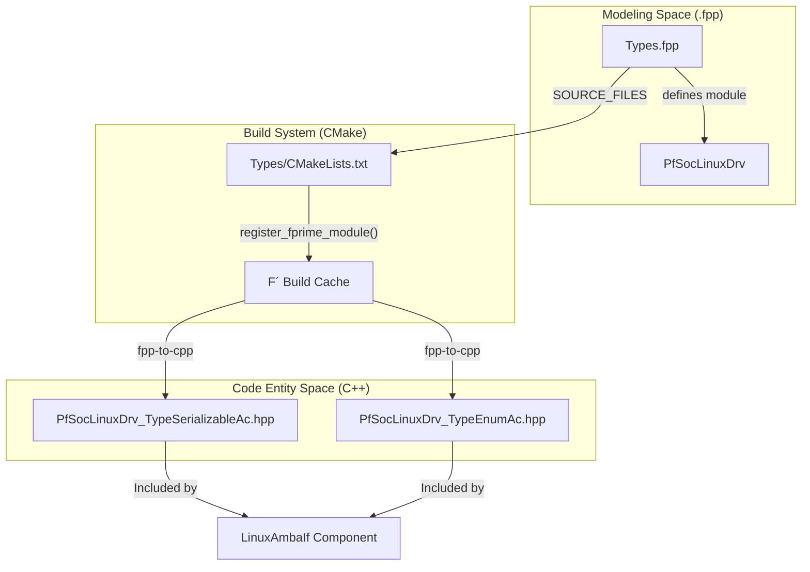
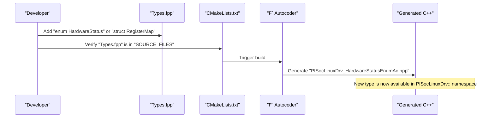

# Type Definitions (Types Layer)

Relevant source files

The following files were used as context for generating this wiki page:

- [fprime-pfsoc-linux/Types/CMakeLists.txt](fprime-pfsoc-linux/Types/CMakeLists.txt)
- [fprime-pfsoc-linux/Types/Types.fpp](fprime-pfsoc-linux/Types/Types.fpp)

The Types layer serves as the foundation of the `fprime-pfsoc-linux` library, providing a centralized location for shared data structures, enums, and constants used across the driver ecosystem. By defining these in the `PfSocLinuxDrv` module, the library ensures a consistent data contract between hardware-interfacing components and the software that consumes their telemetry or sends commands.

## Role as Shared Data-Contract Layer

The `Types` directory is the most basic building block in the three-layer hierarchy (Types → Ports → Components). Its primary role is to encapsulate PolarFire SoC-specific data types that do not belong to a specific port or component but are required by multiple entities within the `PfSocLinuxDrv` namespace [fprime-pfsoc-linux/Types/Types.fpp:1-3]().

### Data Flow and Autocoder Pipeline

The F´ framework uses the `fpp-to-cpp` autocoder to transform high-level modeling files (`.fpp`) into C++ header and implementation files. The following diagram illustrates how definitions in the Types layer propagate through the build system to become usable C++ code.

**Figure 1: FPP Autocoder Pipeline for Types**

Sources: [fprime-pfsoc-linux/Types/Types.fpp:1-3](), [fprime-pfsoc-linux/Types/CMakeLists.txt:1-4]()

## Implementation Details

The module is declared using the FPP modeling language within the `PfSocLinuxDrv` namespace [fprime-pfsoc-linux/Types/Types.fpp:1-1](). This namespace prevents naming collisions with other F´ libraries or the standard F´ framework types.

### Build Integration
The types are integrated into the F´ build system via the `register_fprime_module()` macro (implied by the F´ build system structure) in `Types/CMakeLists.txt` [fprime-pfsoc-linux/Types/CMakeLists.txt:4-4](). This ensures that any component depending on `PfSocLinuxDrv` will have the necessary headers generated during the build process.

| Entity | Path | Role |
| :--- | :--- | :--- |
| **Module Name** | `PfSocLinuxDrv` | Root namespace for all driver-related types [fprime-pfsoc-linux/Types/Types.fpp:1-1]() |
| **Source File** | `Types.fpp` | FPP definition file for serializables and enums [fprime-pfsoc-linux/Types/CMakeLists.txt:2-2]() |
| **Build Script** | `CMakeLists.txt` | Defines the `SOURCE_FILES` and registers the module [fprime-pfsoc-linux/Types/CMakeLists.txt:1-4]() |

Sources: [fprime-pfsoc-linux/Types/Types.fpp:1-3](), [fprime-pfsoc-linux/Types/CMakeLists.txt:1-4]()

## Adding New Types for Hardware Interfaces

To support new hardware interfaces on the PolarFire SoC (such as specific FPGA fabric IP cores), developers should add definitions to `Types.fpp`. This file acts as the single source of truth for the `PfSocLinuxDrv` data layer [fprime-pfsoc-linux/Types/Types.fpp:1-3]().

**Figure 2: Adding a New Type to the Driver Layer**

### Supported FPP Constructs
When expanding `Types.fpp`, the following constructs are typically used:
1.  **Enums**: For hardware states or error codes (e.g., `enum UioStatus { OPEN, CLOSED, ERROR }`).
2.  **Serializables**: For complex data structures passed across ports (e.g., a struct representing a block of FPGA registers).
3.  **Arrays**: For fixed-size hardware buffers.

Sources: [fprime-pfsoc-linux/Types/Types.fpp:1-3](), [fprime-pfsoc-linux/Types/CMakeLists.txt:1-4]()
