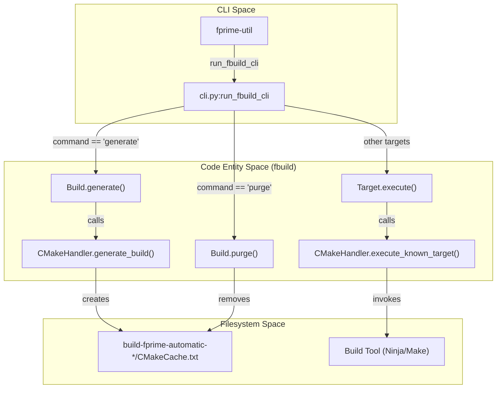
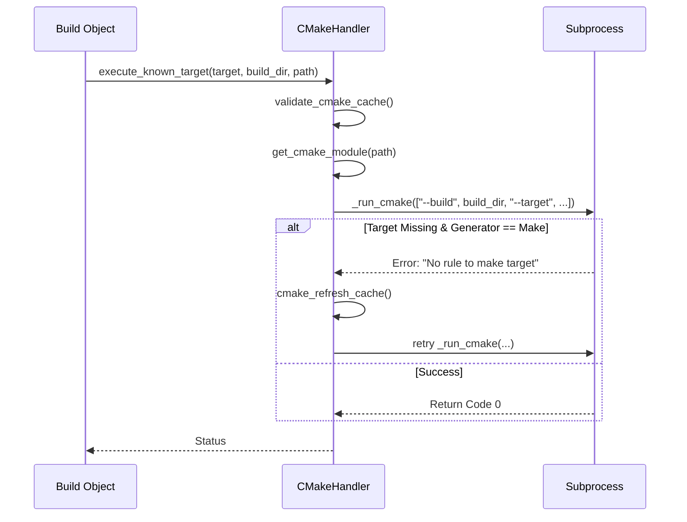

# Page: Build Commands: generate, build, purge

# Build Commands: generate, build, purge

Relevant source files

The following files were used as context for generating this wiki page:

- [src/fprime/fbuild/builder.py](src/fprime/fbuild/builder.py)
- [src/fprime/fbuild/cli.py](src/fprime/fbuild/cli.py)
- [src/fprime/fbuild/cmake.py](src/fprime/fbuild/cmake.py)
- [src/fprime/fbuild/settings.py](src/fprime/fbuild/settings.py)
- [src/fprime/util/build_helper.py](src/fprime/util/build_helper.py)
- [test/fprime/fbuild/test_build.py](test/fprime/fbuild/test_build.py)
- [test/fprime/fbuild/test_settings.py](test/fprime/fbuild/test_settings.py)

This section covers the core lifecycle commands of the `fprime-util` toolsuite: `generate`, `build`, and `purge`. These commands interface with the underlying `fbuild` subsystem to manage CMake cache initialization, target execution, and build artifact cleanup.

## Build Lifecycle Overview

The build lifecycle is managed by the `Build` class in `fprime.fbuild.builder`. It orchestrates the transition from a project's source state to a configured build directory and finally to compiled artifacts.

### Build Entity Relationship
The following diagram illustrates how the CLI commands map to internal class methods and the underlying CMake filesystem.

**Figure 1: Build Command Data Flow**

**Sources:** [src/fprime/fbuild/cli.py:38-91](), [src/fprime/fbuild/builder.py:28-53]()

---

## The `generate` Command

The `generate` command initializes the CMake build cache. It is responsible for toolchain selection, build generator selection (Ninja vs. Make), and configuring F´-specific build options like sanitizers.

### Toolchain and Generator Selection
1.  **Toolchain Resolution**: The `Build.find_toolchain()` method locates the appropriate `.cmake` file based on the platform name provided via `--platform` or the `default_toolchain` setting in `settings.ini` [src/fprime/fbuild/cli.py:58-60]().
2.  **Generator Selection**: By default, `fprime-tools` selects **Ninja** as the CMAKE_GENERATOR [src/fprime/fbuild/cli.py:74](). If the `--make` flag is provided, it defaults to the system's standard Unix Makefiles [src/fprime/fbuild/cli.py:69-71]().
3.  **Sanitizer Flags**: If `--disable-sanitizers` is passed, the tool injects `OFF` values for `ENABLE_SANITIZER_LEAK`, `ENABLE_SANITIZER_ADDRESS`, and `ENABLE_SANITIZER_UNDEFINED_BEHAVIOR` into the CMake arguments [src/fprime/fbuild/cli.py:61-65]().

### Cache Invention vs. Loading
The `load_build` helper in `build_helper.py` determines if a build needs to be "invented" (new directory) or "loaded" (existing directory):
*   **Invent**: Used during `generate`. It calculates the directory name (e.g., `build-fprime-automatic-native`) and ensures it doesn't already exist unless `--force` is used [src/fprime/util/build_helper.py:110-111](), [src/fprime/fbuild/builder.py:77-101]().
*   **Load**: Used for all other commands. It validates that the directory contains a `.fprime-build-dir` or `CMakeCache.txt` [src/fprime/fbuild/builder.py:102-146]().

**Sources:** [src/fprime/fbuild/cli.py:53-76](), [src/fprime/fbuild/builder.py:77-146](), [src/fprime/util/build_helper.py:83-120]()

---

## The `build` and Target Execution

The `build` command (and other functional targets like `check` or `impl`) maps to the `execute_known_target` method of the `CMakeHandler`.

### Target Dispatch Pipeline
When a build target is invoked, the system follows this sequence:
1.  **Target Discovery**: `get_target(parsed)` matches the CLI mnemonic to a `Target` object [src/fprime/fbuild/cli.py:20-35]().
2.  **Module Resolution**: `CMakeHandler.get_cmake_module(path, build_dir)` converts the current working directory into a CMake module name (e.g., `Svc_CmdDispatcher`) [src/fprime/fbuild/cmake.py:114]().
3.  **Execution**: The `CMakeHandler` runs `cmake --build <dir> --target <module_target>` [src/fprime/fbuild/cmake.py:101-128]().

### Automatic Cache Refresh
If a build fails because a target is missing (common when new files are added but `generate` wasn't re-run), `CMakeHandler` catches the "No rule to make target" error, triggers `cmake_refresh_cache`, and retries the build once [src/fprime/fbuild/cmake.py:137-159]().

**Sources:** [src/fprime/fbuild/cmake.py:68-160](), [src/fprime/fbuild/cli.py:82-91]()

---

## The `purge` Command

The `purge` command handles the removal of build and installation directories.

### Purge Lifecycle
The `purge` command is unique because it can operate on multiple build caches simultaneously using `Build.get_build_list` [src/fprime/fbuild/cli.py:95-97]().

| Step | Action | Logic |
| :--- | :--- | :--- |
| **Build Dir** | `purge_build.purge()` | Deletes the `build-fprime-automatic-*` directory [src/fprime/fbuild/cli.py:114](). |
| **Install Dir** | `purge_build.purge_install()` | Identifies the `install_destination` from `settings.ini` and removes it if it exists [src/fprime/fbuild/cli.py:116-128](). |
| **Interactive** | `confirm()` | Unless `--force` is provided, the user is prompted before each deletion [src/fprime/fbuild/cli.py:111-125](). |

**Sources:** [src/fprime/fbuild/cli.py:94-134](), [src/fprime/fbuild/builder.py:214-231]()

---

## Implementation Detail: `CMakeHandler`

The `CMakeHandler` is the low-level class that wraps the `cmake` executable.

**Figure 2: CMakeHandler Execution Flow**

### Key Methods
*   `validate_cmake_cache(cmake_args, build_dir)`: Ensures the existing cache matches the requested toolchain and flags to prevent inconsistent builds [src/fprime/fbuild/cmake.py:54-67]().
*   `_run_cmake(arguments, ...)`: The central bottleneck for all CMake subprocess calls. It handles environment variable merging (e.g., `VERBOSE=1`) and output streaming [src/fprime/fbuild/cmake.py:131-136]().

**Sources:** [src/fprime/fbuild/cmake.py:26-160]()
