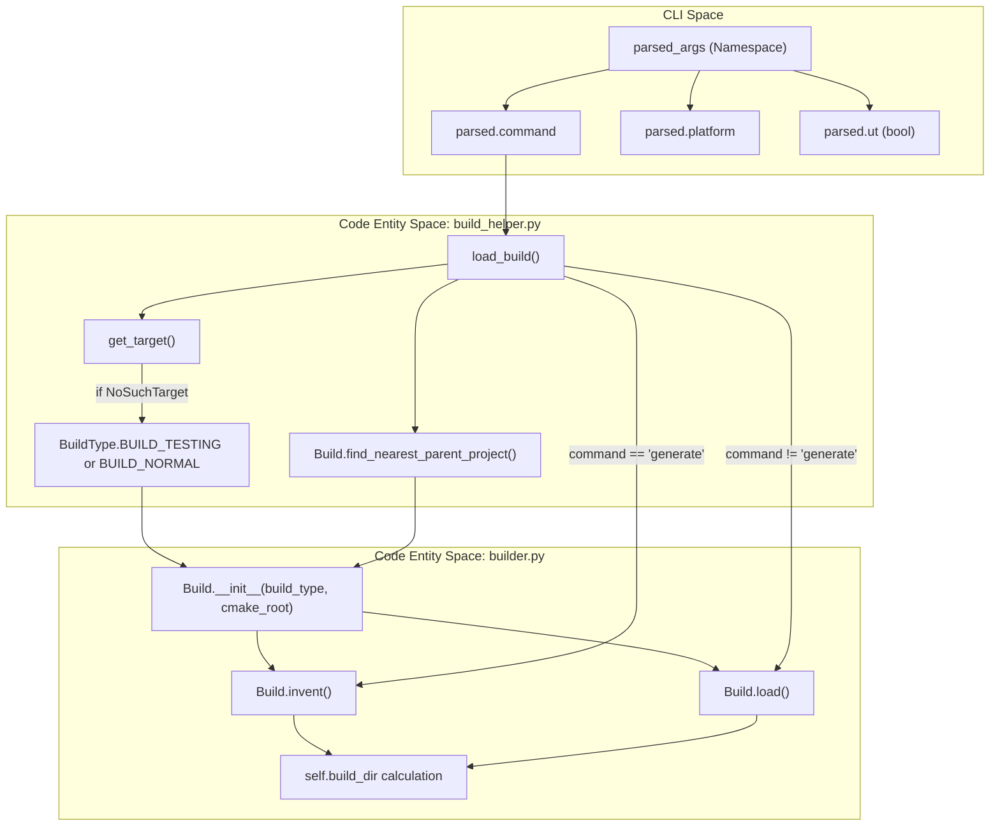
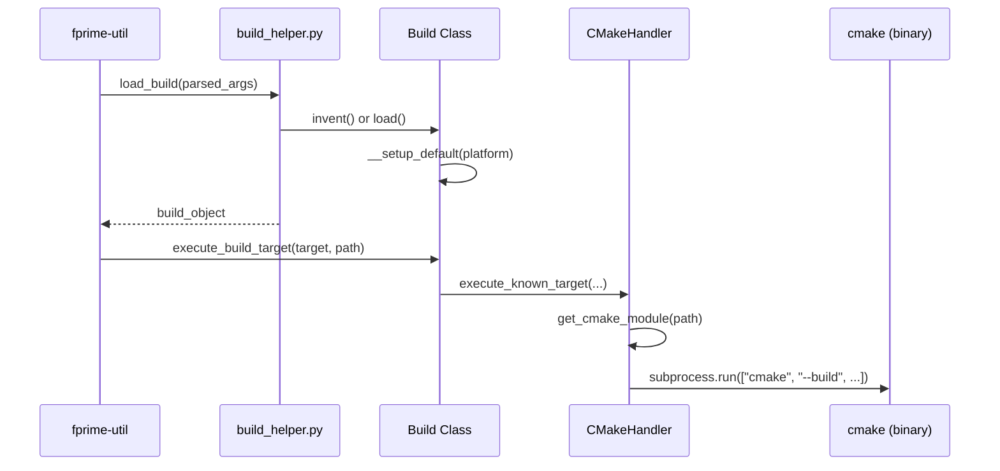

# Page: Build Lifecycle: Build Class and build_helper

# Build Lifecycle: Build Class and build_helper

Relevant source files

The following files were used as context for generating this wiki page:

- [src/fprime/fbuild/builder.py](src/fprime/fbuild/builder.py)
- [src/fprime/fbuild/cmake.py](src/fprime/fbuild/cmake.py)
- [src/fprime/fbuild/settings.py](src/fprime/fbuild/settings.py)
- [src/fprime/util/build_helper.py](src/fprime/util/build_helper.py)
- [test/fprime/fbuild/test_build.py](test/fprime/fbuild/test_build.py)
- [test/fprime/fbuild/test_settings.py](test/fprime/fbuild/test_settings.py)

The build lifecycle in `fprime-tools` is managed by the `Build` class, which provides a high-level Python abstraction over the underlying CMake build system. This subsystem handles the transition from user CLI commands to concrete build artifacts by managing build configurations, toolchain selection, and directory conventions.

## The Build Class

The `Build` class `[src/fprime/fbuild/builder.py:28-53]()` represents a specific build configuration. It tracks the build type (e.g., normal or testing), the project root, and the target platform. It acts as a coordinator between `IniSettings` and the `CMakeHandler`.

### Key Methods and Lifecycle

| Method | Purpose |
| :--- | :--- |
| `__init__` | Initializes the build with a `BuildType` and project path. Instantiates a `CMakeHandler` `[src/fprime/fbuild/builder.py:58-72]()`. |
| `find_nearest_parent_project` | Static method that recurses up the directory tree to find a directory containing a `CMakeLists.txt` with a `project()` call `[src/fprime/fbuild/builder.py:284-307]()`. |
| `invent` | Prepares a new build directory. Used during the `generate` phase. It ensures the directory does not already exist unless `force` is true `[src/fprime/fbuild/builder.py:77-101]()`. |
| `load` | Loads an existing build cache. Validates that the directory contains either `.fprime-build-dir` or `CMakeCache.txt` `[src/fprime/fbuild/builder.py:102-145]()`. |
| `generate` | Orchestrates the CMake generation process by calling `self.cmake.generate_build` `[src/fprime/fbuild/builder.py:202-228]()`. |
| `execute_build_target` | Dispatches a specific target (e.g., `build`, `check`) to the `CMakeHandler` `[src/fprime/fbuild/builder.py:230-261]()`. |

### Build Directory Naming Conventions
By default, `fprime-tools` uses a standardized naming convention for build directories to prevent collisions between different platforms and build types:
`build-fprime-automatic-{platform}{suffix}` `[src/fprime/fbuild/builder.py:56]()`.
The `{suffix}` is typically `-ut` for testing builds `[src/fprime/fbuild/builder.py:317-318]()`.

**Sources:** `[src/fprime/fbuild/builder.py]()`, `[src/fprime/fbuild/cmake.py]()`

## Build Helper and Factory Logic

The `build_helper.py` module provides the `load_build` factory function, which is the primary entry point for CLI commands to obtain a configured `Build` instance.

### `load_build` Workflow
1. **Target Identification**: It determines the `BuildType` by checking if the user requested a unit test (`--ut`) or a specific target `[src/fprime/util/build_helper.py:89-94]()`.
2. **Root Discovery**: It locates the CMake project root using `Build.find_nearest_parent_project` if no root was explicitly provided `[src/fprime/util/build_helper.py:95-99]()`.
3. **State Initialization**:
    - If the command is `generate`, it calls `build.invent()` `[src/fprime/util/build_helper.py:110-111]()`.
    - Otherwise, it calls `build.load()` to reconnect to an existing cache `[src/fprime/util/build_helper.py:113-117]()`.
4. **Tool Validation**: It invokes `validate_tools_from_requirements` to ensure the installed versions of `fpp` and other dependencies match the project's `requirements.txt` `[src/fprime/util/build_helper.py:118]()`.

### Code Entity Mapping: CLI to Builder
The following diagram illustrates how CLI inputs are transformed into a `Build` object state.

**CLI to Build State Mapping**

**Sources:** `[src/fprime/util/build_helper.py:83-120]()`, `[src/fprime/fbuild/builder.py:58-145]()`

## Build Types and Hashes

### BuildType Enum
The system distinguishes between different build intents using the `BuildType` enum `[src/fprime/fbuild/types.py]()`:
*   `BUILD_NORMAL`: Standard production/deployment build.
*   `BUILD_TESTING`: Build configured for unit testing (includes `UT` targets).

### Hash Lookup (hashes.txt)
F´ generates a `hashes.txt` file during the build process that maps build-time metadata to specific file hashes. The `Build` class provides `find_hashed_file(hash_value)` to reverse-lookup these values `[src/fprime/fbuild/builder.py:169-188]()`.

**Implementation Details:**
1. It locates `hashes.txt` within the `build_dir` `[src/fprime/fbuild/builder.py:180]()`.
2. It performs a case-insensitive search for the hex string of the provided hash `[src/fprime/fbuild/builder.py:183-185]()`.
3. This is primarily used by the `fprime-util hash-to-file` command to identify which source file produced a specific assertion or error hash.

**Build Execution Data Flow**

**Sources:** `[src/fprime/fbuild/builder.py:169-188]()`, `[src/fprime/fbuild/cmake.py:68-160]()`, `[src/fprime/util/build_helper.py:83-120]()`

## Implementation Details: `__setup_default`

The `Build` class internal method `__setup_default` `[src/fprime/fbuild/builder.py:309-338]()` is responsible for finalizing the build environment before execution. It:
1. Loads settings via `IniSettings.load` `[src/fprime/fbuild/builder.py:311]()`.
2. Resolves the platform: if `None` is provided, it pulls `default_toolchain` (or `default_ut_toolchain` for testing) from the settings `[src/fprime/fbuild/builder.py:314-321]()`.
3. Constructs the final `build_dir` path using the automatic naming convention if no explicit path was provided `[src/fprime/fbuild/builder.py:323-338]()`.

**Sources:** `[src/fprime/fbuild/builder.py:309-338]()`, `[src/fprime/fbuild/settings.py:187-210]()`
