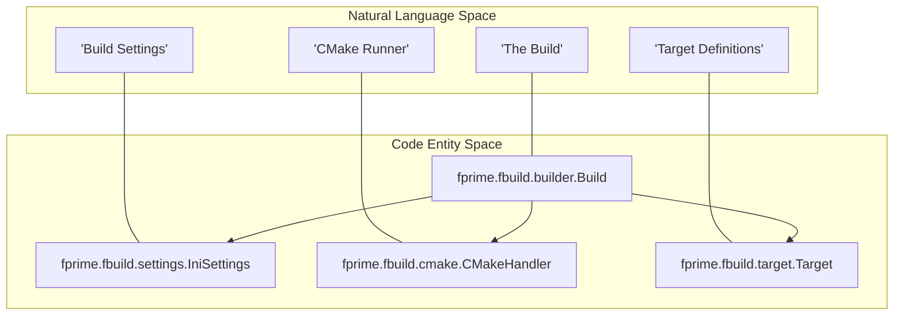
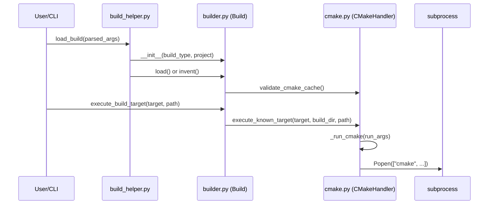

# Page: Build System: fbuild Subsystem

# Build System: fbuild Subsystem

Relevant source files

The following files were used as context for generating this wiki page:

- [src/fprime/fbuild/__init__.py](src/fprime/fbuild/__init__.py)
- [src/fprime/fbuild/builder.py](src/fprime/fbuild/builder.py)
- [src/fprime/fbuild/cmake.py](src/fprime/fbuild/cmake.py)
- [src/fprime/fbuild/settings.py](src/fprime/fbuild/settings.py)
- [src/fprime/util/build_helper.py](src/fprime/util/build_helper.py)
- [test/fprime/fbuild/cmake-data/external/CMakeCache.txt](test/fprime/fbuild/cmake-data/external/CMakeCache.txt)
- [test/fprime/fbuild/cmake-data/grand-unified/CMakeCache.txt](test/fprime/fbuild/cmake-data/grand-unified/CMakeCache.txt)
- [test/fprime/fbuild/cmake-data/subdir/CMakeCache.txt](test/fprime/fbuild/cmake-data/subdir/CMakeCache.txt)
- [test/fprime/fbuild/cmake-data/testbuild/subdir1/build-fprime-automatic-abcdefg/CMakeCache.txt](test/fprime/fbuild/cmake-data/testbuild/subdir1/build-fprime-automatic-abcdefg/CMakeCache.txt)
- [test/fprime/fbuild/cmake-data/testbuild/subdir1/subdir2/subdir3/build-fprime-automatic-default/CMakeCache.txt](test/fprime/fbuild/cmake-data/testbuild/subdir1/subdir2/subdir3/build-fprime-automatic-default/CMakeCache.txt)
- [test/fprime/fbuild/test_build.py](test/fprime/fbuild/test_build.py)
- [test/fprime/fbuild/test_settings.py](test/fprime/fbuild/test_settings.py)

The `fbuild` subsystem is the core Python abstraction layer that bridges high-level user commands to the underlying CMake build system. It provides a structured way to manage build configurations, interact with the CMake CLI, handle project-specific settings via `settings.ini`, and define extensible build targets.

## System Architecture

The `fbuild` package is organized into several key components that handle different levels of the build process. At the highest level, the `Build` class coordinates the lifecycle, while the `CMakeHandler` manages the raw execution of CMake commands.

### Code Entity Map: High-Level Orchestration

This diagram shows how natural language build concepts map to specific classes and files in the `fbuild` subsystem.

**Sources:** [src/fprime/fbuild/builder.py:28-72](), [src/fprime/fbuild/cmake.py:26-49](), [src/fprime/fbuild/settings.py:78-112]()

## Core Components

### 1. Build Lifecycle and Helpers
The `Build` class represents a specific build configuration, including its `BuildType` (Normal vs. Testing), target platform, and project root [src/fprime/fbuild/builder.py:28-53](). The `build_helper.py` module provides factory functions like `load_build` to instantiate these objects based on CLI arguments [src/fprime/util/build_helper.py:83-119]().

**Key Responsibilities:**
*   **Inventing/Loading:** Creating new build directories or loading existing ones [src/fprime/fbuild/builder.py:77-145]().
*   **Project Discovery:** Finding the nearest parent project containing a `CMakeLists.txt` [src/fprime/fbuild/builder.py:194-205]().
*   **Hash Lookup:** Resolving file paths from assertion hashes using `hashes.txt` [src/fprime/fbuild/builder.py:169-192]().

For details, see [Build Lifecycle: Build Class and build_helper](#3.1).

### 2. CMakeHandler: Low-Level Integration
The `CMakeHandler` is the specialized wrapper for the `cmake` executable. It handles the generation of the build cache and the execution of specific build targets [src/fprime/fbuild/cmake.py:26-49]().

**Key Responsibilities:**
*   **Target Execution:** Running `cmake --build` with appropriate flags [src/fprime/fbuild/cmake.py:68-136]().
*   **Module Resolution:** Mapping filesystem paths to CMake module names [src/fprime/fbuild/cmake.py:114-121]().
*   **Cache Management:** Validating and refreshing the `CMakeCache.txt` [src/fprime/fbuild/cmake.py:54-66]().

For details, see [CMakeHandler: Low-Level CMake Integration](#3.2).

### 3. Settings and Configuration
The `IniSettings` class parses `settings.ini` files to configure the build environment. It supports environment variable interpolation and platform-specific overrides [src/fprime/fbuild/settings.py:19-47]().

**Key Responsibilities:**
*   **Path Validation:** Ensuring `framework_path` and `project_root` exist [src/fprime/fbuild/settings.py:114-143]().
*   **Default Values:** Providing fallbacks for toolchains and library locations [src/fprime/fbuild/settings.py:84-111]().

For details, see [Settings and Configuration: IniSettings and settings.ini](#3.3).

### 4. Target and Action Framework
F´ uses an extensible target system to define what "building" means for different contexts (e.g., compiling code, running tests, or generating implementation templates).

**Key Responsibilities:**
*   **Target Dispatch:** Matching CLI mnemonics (like `check` or `build`) to `Target` objects [src/fprime/fbuild/target.py:17-25]().
*   **Scope Management:** Handling `GLOBAL` vs `LOCAL` target execution [src/fprime/fbuild/target.py:17-17]().

For details, see [Target and Action Framework](#3.4).

## Build Invocation Flow

The following diagram illustrates the flow from a user command to the execution of a CMake target.

**Sources:** [src/fprime/util/build_helper.py:83-119](), [src/fprime/fbuild/builder.py:102-145](), [src/fprime/fbuild/cmake.py:68-136]()

## Related Files
| Component | Primary File | Role |
|---|---|---|
| **Orchestrator** | `src/fprime/fbuild/builder.py` | High-level build state and logic [src/fprime/fbuild/builder.py:1-25]() |
| **CMake Wrapper** | `src/fprime/fbuild/cmake.py` | Subprocess management for CMake [src/fprime/fbuild/cmake.py:1-9]() |
| **Configuration** | `src/fprime/fbuild/settings.py` | `settings.ini` parsing and validation [src/fprime/fbuild/settings.py:1-8]() |
| **CLI Integration** | `src/fprime/util/build_helper.py` | CLI-to-Build object factory [src/fprime/util/build_helper.py:1-15]() |

**Sources:** [src/fprime/fbuild/builder.py:1-25](), [src/fprime/fbuild/cmake.py:1-9](), [src/fprime/fbuild/settings.py:1-8](), [src/fprime/util/build_helper.py:1-15]()
