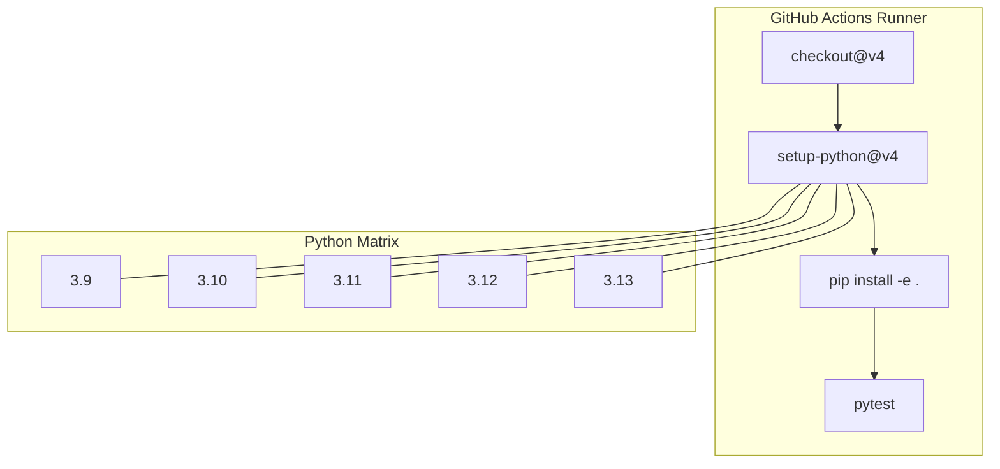
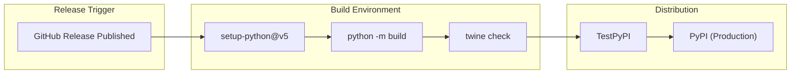

# Page: CI/CD Pipelines

# CI/CD Pipelines

Relevant source files

The following files were used as context for generating this wiki page:

- [.github/actions/codeql/security-pack.yml](.github/actions/codeql/security-pack.yml)
- [.github/actions/spelling/allow.txt](.github/actions/spelling/allow.txt)
- [.github/actions/spelling/excludes.txt](.github/actions/spelling/excludes.txt)
- [.github/actions/spelling/expect.txt](.github/actions/spelling/expect.txt)
- [.github/actions/spelling/patterns.txt](.github/actions/spelling/patterns.txt)
- [.github/pull_request_template.md](.github/pull_request_template.md)
- [.github/workflows/codeql-security-scan.yml](.github/workflows/codeql-security-scan.yml)
- [.github/workflows/format.yml](.github/workflows/format.yml)
- [.github/workflows/fprime-tools-ci.yml](.github/workflows/fprime-tools-ci.yml)
- [.github/workflows/integration-tests.yml](.github/workflows/integration-tests.yml)
- [.github/workflows/publish.yml](.github/workflows/publish.yml)
- [.github/workflows/spelling.yml](.github/workflows/spelling.yml)
- [pyproject.toml](pyproject.toml)
- [setup.py](setup.py)
- [src/fprime/common/error.py](src/fprime/common/error.py)
- [test/fprime/fbuild/test_cmake.py](test/fprime/fbuild/test_cmake.py)

The `fprime-tools` repository utilizes GitHub Actions to automate testing, integration validation, security scanning, and package distribution. These pipelines ensure that the Python-based tooling remains compatible with multiple Python versions and various releases of the F´ framework.

## Pipeline Overview

The CI/CD infrastructure is defined in `.github/workflows/` and covers the following functional areas:

| Workflow | Purpose | Trigger |
| :--- | :--- | :--- |
| `fprime-tools test` | Unit testing via `pytest` across Python 3.9–3.13 | Push/PR to `devel` |
| `Integration Tests` | End-to-end build validation with `fprime` core | Push/PR to `devel` |
| `Format Python` | Style enforcement using `black` | Push/PR |
| `Spell checking` | Documentation and code orthography | Push/PR |
| `CodeQL Security Scan` | Static Analysis Security Testing (SAST) | Push/PR to `devel` |
| `Build and Publish` | Distribution to PyPI and TestPyPI | Release published |

Sources: [.github/workflows/fprime-tools-ci.yml:1-7](), [.github/workflows/integration-tests.yml:1-7](), [.github/workflows/publish.yml:1-5](), [.github/workflows/format.yml:1-3](), [.github/workflows/codeql-security-scan.yml:1-10]()

## Core Test Matrix (fprime-tools-ci)

The primary CI job, `fprime-tools-tests`, executes the `pytest` suite against a matrix of supported Python versions. This ensures that the `fprime-util` entry point and underlying `fbuild`/`fpp` libraries function correctly across the environment spectrum defined in `pyproject.toml`.

### Data Flow: CI Execution

Sources: [.github/workflows/fprime-tools-ci.yml:13-34](), [pyproject.toml:23-28]()

## Integration Testing

The `integration-tests` workflow validates the tools against the actual `fprime` framework. It clones the `nasa/fprime` repository and performs real build operations using `fprime-util`.

### Framework Compatibility Matrix
The workflow tests combinations of Python versions and F´ framework tags. Some combinations (like Python 3.13 with older F´ versions) are explicitly excluded due to known dependency incompatibilities.

*   **F´ Versions:** `v3.4.3`, `v3.5.1`, `v3.6.0`, `devel`
*   **Generators:** Both `Make` and `Ninja` are validated.

### Implementation Details
The workflow performs three distinct validation phases in the `fprime/Ref` (Reference Application) directory:
1.  **Standard Make Build:** `fprime-util generate --make` followed by `fprime-util build` [[.github/workflows/integration-tests.yml:51-52]]().
2.  **Ninja Build:** `fprime-util generate --build-cache ./build-ninja` followed by `fprime-util build` [[.github/workflows/integration-tests.yml:57-58]]().
3.  **Unit Test Generation:** Validates the `--ut` flag and CMake definitions like `-DFPRIME_ENABLE_AUTOCODER_UTS=OFF` [[.github/workflows/integration-tests.yml:64]]().

Verification is performed using `fprime-util hash-to-file` to ensure specific framework files (e.g., `Fw/Types/Assert.cpp` at hash `0x72ad3277`) are correctly located within the generated build cache [[.github/workflows/integration-tests.yml:53-59]]().

### Visualizer Integration
A specialized job, `visualizer-integration`, ensures the `fprime-util visualize` command functions. It launches the Flask-based visualizer and uses `timeout 20s` to capture the logs, then greps for successful layout generation and server startup strings [[.github/workflows/integration-tests.yml:69-98]]().

Sources: [.github/workflows/integration-tests.yml:14-66](), [.github/workflows/integration-tests.yml:69-99]()

## Static Analysis and Security

### CodeQL Security Scan
The `analyze` job uses Semantic Code Analysis to identify vulnerabilities. It initializes the CodeQL engine with a specific security pack located at `.github/actions/codeql/security-pack.yml` and performs analysis on the Python codebase [[.github/workflows/codeql-security-scan.yml:16-45]]().

### Formatting and Spelling
*   **Format Check:** Uses `black==25.1.0` to verify that code adheres to the project's style guidelines. It runs with `--check --diff` to fail the CI if formatting is incorrect [[.github/workflows/format.yml:5-17]]().
*   **Spell Check:** Utilizes `check-spelling/check-spelling`. It incorporates custom dictionaries for technical terms like `fbuild`, `fpp`, `autocoder`, and `jpl` [[.github/actions/spelling/allow.txt:1-55]](), [[.github/actions/spelling/expect.txt:1-107]]().

Sources: [.github/workflows/codeql-security-scan.yml:35-45](), [.github/workflows/format.yml:14-17](), [.github/workflows/spelling.yml:20-33]()

## Publishing Workflow

The `publish` workflow automates the release of `fprime-tools` to the Python Package Index (PyPI).

### Distribution Pipeline
1.  **Build:** Generates source distributions and wheels using the `build` module [[.github/workflows/publish.yml:25]]().
2.  **Verification:** Uses `twine check` to ensure package metadata is valid [[.github/workflows/publish.yml:27]]().
3.  **TestPyPI:** First uploads to TestPyPI to verify the upload process [[.github/workflows/publish.yml:28-31]]().
4.  **PyPI:** Final deployment to the production PyPI repository using Trusted Publishing (id-token permissions) [[.github/workflows/publish.yml:34-36]]().

### Release Logic Diagram

Sources: [.github/workflows/publish.yml:1-36](), [pyproject.toml:1-16]()
