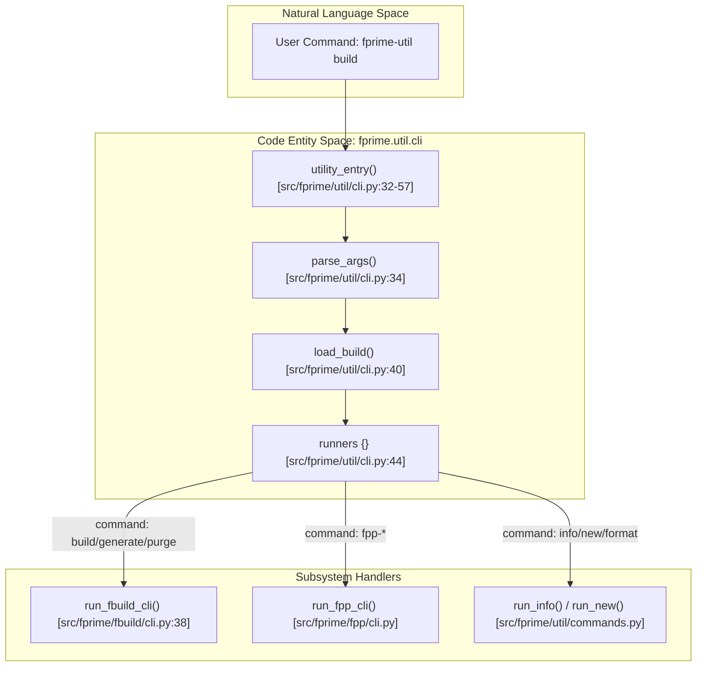

# Page: CLI: fprime-util Command Reference

# CLI: fprime-util Command Reference

Relevant source files

The following files were used as context for generating this wiki page:

- [src/fprime/fbuild/cli.py](src/fprime/fbuild/cli.py)
- [src/fprime/util/cli.py](src/fprime/util/cli.py)
- [src/fprime/util/commands.py](src/fprime/util/commands.py)
- [src/fprime/util/help_text.py](src/fprime/util/help_text.py)

The `fprime-util` command-line interface is the primary entry point for developers interacting with the F´ framework. It provides a unified wrapper around the CMake build system, FPP modeling toolchain, and various project scaffolding utilities. By abstracting the underlying build targets and directory structures, it allows developers to execute context-aware commands (e.g., building a single component or a full deployment) from any directory within an F´ project.

## Dispatch Architecture

The `fprime-util` CLI follows a modular dispatch pattern. The main entry point, `utility_entry`, parses global arguments and then delegates execution to specific "runner" functions based on the subcommand provided.

### Command Execution Flow

The following diagram illustrates how a command is dispatched from the initial shell invocation to the specific subsystem handler.

**CLI Dispatch Pipeline**

**Sources:** [src/fprime/util/cli.py:32-57](), [src/fprime/fbuild/cli.py:38-52](), [src/fprime/util/commands.py:1-12]()

## Argument Parsing and Registration

`fprime-util` uses a hierarchical `argparse` structure. A common parent parser defines global flags like `--path`, `--platform`, and `--ut`, which are then inherited by sub-parsers.

*   **Registration:** Sub-parsers are registered dynamically from different modules. For instance, `add_fbuild_parsers` handles build-related commands [src/fprime/fbuild/cli.py:135](), while `add_special_parsers` handles utility commands like `new` and `hash-to-file` [src/fprime/util/cli.py:84]().
*   **Help System:** The `HelpText` class centralizes all CLI documentation, providing both short summaries and detailed long-form descriptions for every command [src/fprime/util/help_text.py:32]().
*   **Validation:** The `skip_build_cache_validation` function identifies commands (like `purge` or `info`) that can safely run even if the CMake build cache is missing or invalid [src/fprime/util/cli.py:69-81]().

For details on the parsing logic and sub-parser registration, see **[CLI Architecture and Argument Parsing](#2.1)**.

## Build Commands: generate, build, purge

These commands manage the lifecycle of the CMake build directory.

*   **`generate`**: Initializes the CMake cache. It automatically selects the toolchain (e.g., `native` or `raspberrypi`) and the generator (defaulting to `Ninja`) [src/fprime/fbuild/cli.py:53-76]().
*   **`build`**: Executes the build for the current context. It maps the current directory to a specific CMake target (e.g., `Ref_SignalGen`) [src/fprime/fbuild/cli.py:82-91]().
*   **`purge`**: Removes build and installation directories [src/fprime/fbuild/cli.py:94-133]().

For details on toolchain selection and build targets, see **[Build Commands: generate, build, purge](#2.2)**.

## Test and Coverage Commands: check, coverage

The CLI provides integrated support for unit testing and code coverage analysis.

*   **`check`**: Runs unit tests for the current component or deployment. It leverages `CTest` under the hood and implies the `--ut` flag for build cache selection [src/fprime/util/help_text.py:51]().
*   **`coverage`**: Orchestrates `gcovr` to generate coverage reports, automatically applying filters to exclude autocoded files from the results.

For details on testing scopes and coverage filtering, see **[Test and Coverage Commands: check, coverage](#2.3)**.

## Utility Commands

General-purpose utilities support project introspection and maintenance.

| Command | Function | Code Reference |
| :--- | :--- | :--- |
| `info` | Displays available targets and build cache locations for the current path. | `run_info` [src/fprime/util/commands.py:35]() |
| `new` | Dispatches to cookiecutter templates to scaffold components, deployments, or modules. | `run_new` [src/fprime/util/commands.py:126]() |
| `format` | Pipeline for `clang-format` to ensure code style compliance. | `run_code_format` [src/fprime/util/commands.py:151]() |
| `hash-to-file` | Looks up source files in `hashes.txt` using a decimal or hex hash. | `run_hash_to_file` [src/fprime/util/commands.py:103]() |
| `version-check` | Diagnostics tool for checking environment and dependency versions. | `run_version_check` [src/fprime/util/commands.py:214]() |

For details on scaffolding and formatting pipelines, see **[Utility Commands: info, hash-to-file, new, format, version-check](#2.4)**.

**Sources:** [src/fprime/util/cli.py:84-230](), [src/fprime/util/commands.py:1-213](), [src/fprime/util/help_text.py:32-118]()
