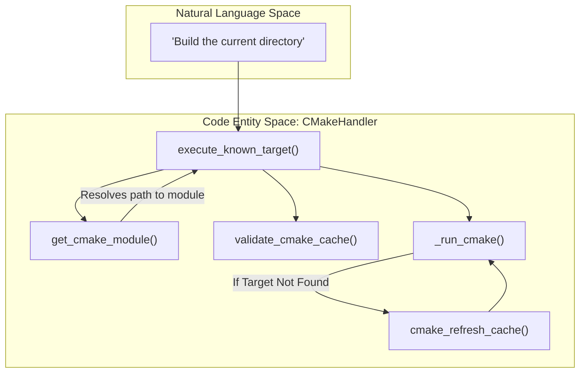
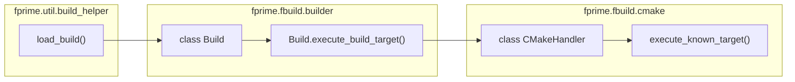

# Page: CMakeHandler: Low-Level CMake Integration

# CMakeHandler: Low-Level CMake Integration

Relevant source files

The following files were used as context for generating this wiki page:

- [src/fprime/fbuild/__init__.py](src/fprime/fbuild/__init__.py)
- [src/fprime/fbuild/cmake.py](src/fprime/fbuild/cmake.py)
- [src/fprime/util/build_helper.py](src/fprime/util/build_helper.py)
- [test/fprime/fbuild/cmake-data/external/CMakeCache.txt](test/fprime/fbuild/cmake-data/external/CMakeCache.txt)
- [test/fprime/fbuild/cmake-data/grand-unified/CMakeCache.txt](test/fprime/fbuild/cmake-data/grand-unified/CMakeCache.txt)
- [test/fprime/fbuild/cmake-data/subdir/CMakeCache.txt](test/fprime/fbuild/cmake-data/subdir/CMakeCache.txt)
- [test/fprime/fbuild/cmake-data/testbuild/subdir1/build-fprime-automatic-abcdefg/CMakeCache.txt](test/fprime/fbuild/cmake-data/testbuild/subdir1/build-fprime-automatic-abcdefg/CMakeCache.txt)
- [test/fprime/fbuild/cmake-data/testbuild/subdir1/subdir2/subdir3/build-fprime-automatic-default/CMakeCache.txt](test/fprime/fbuild/cmake-data/testbuild/subdir1/subdir2/subdir3/build-fprime-automatic-default/CMakeCache.txt)

The `CMakeHandler` class is the primary interface between the `fprime-tools` Python environment and the underlying CMake build system. It encapsulates the complexities of managing CMake caches, resolving module names from filesystem paths, and executing build targets while handling environment propagation and error recovery.

## Core Architecture

`CMakeHandler` serves as a low-level utility used by the `Build` class to perform filesystem-heavy operations. It manages the lifecycle of a CMake build directory, from initial generation to target execution and cache maintenance.

### Key Responsibilities
*   **Target Execution:** Translating high-level target requests (e.g., "build") into specific CMake target strings (e.g., `F-Prime_Svc_Cmd_build`).
*   **Path Resolution:** Mapping absolute filesystem paths to CMake module names based on the project structure.
*   **Cache Management:** Reading, validating, and refreshing the `CMakeCache.txt` to ensure the Python tools stay in sync with the build configuration.
*   **Subprocess Orchestration:** Running `cmake` commands with proper environment variables and capturing output for error analysis.

### CMakeHandler Data Flow
The following diagram illustrates how `CMakeHandler` processes a request to execute a target.

**Diagram: Target Execution Flow**

**Sources:** [src/fprime/fbuild/cmake.py:26-29](), [src/fprime/fbuild/cmake.py:68-160]()

---

## Target Discovery and Execution

### `execute_known_target`
This is the primary entry point for running build actions. It takes a target mnemonic (like `ut` or `impl`) and a directory path, then constructs the full CMake target name.

1.  **Cache Validation:** It first calls `validate_cmake_cache` to ensure the current build directory matches the expected configuration [src/fprime/fbuild/cmake.py:97-97]().
2.  **Module Resolution:** It calls `get_cmake_module(path, build_dir)` to find the CMake name for the provided path [src/fprime/fbuild/cmake.py:114-114]().
3.  **Target Construction:**
    *   If `top_target` is True, the target is used as-is [src/fprime/fbuild/cmake.py:111-112]().
    *   Otherwise, it joins the module name and the target (e.g., `Svc_Cmd` + `ut` becomes `Svc_Cmd_ut`) [src/fprime/fbuild/cmake.py:120-120]().
4.  **Parallelism:** It extracts `--jobs` or `-j` from `make_args` and passes them to CMake's native `-j` flag [src/fprime/fbuild/cmake.py:102-105]().

### `get_cmake_module`
This function identifies the CMake module name associated with a specific directory. It works by querying the CMake build system for the `FPRIME_CURRENT_MODULE` property at that location. This ensures that the Python tools and CMake agree on module naming, especially in complex project structures with nested directories.

**Sources:** [src/fprime/fbuild/cmake.py:68-130](), [src/fprime/fbuild/cmake.py:114-120]()

---

## The `_run_cmake` Pipeline

All CMake interactions eventually pass through the private `_run_cmake` method. This method handles the low-level mechanics of process execution.

| Feature | Implementation Detail |
| :--- | :--- |
| **Environment Merging** | Merges the current `os.environ` with provided overrides. If `verbose` is enabled, it sets `VERBOSE=1` [src/fprime/fbuild/cmake.py:123-124](). |
| **Subprocess Execution** | Uses `subprocess.Popen` to execute the `cmake` binary. It supports real-time output streaming or silent execution [src/fprime/fbuild/cmake.py:20-21](). |
| **Error Propagation** | If a command fails (non-zero return code), it raises a `CMakeExecutionException` containing the captured stderr [src/fprime/fbuild/cmake.py:137-149](). |
| **Dry-Run Support** | Can be configured to print commands without executing them for debugging purposes. |

**Sources:** [src/fprime/fbuild/cmake.py:131-160](), [src/fprime/fbuild/cmake.py:122-125]()

---

## Cache Management and Orphan Detection

### `cmake_refresh_cache`
If a target execution fails with a "No rule to make target" error, `CMakeHandler` attempts an automatic cache refresh [src/fprime/fbuild/cmake.py:143-153](). This is particularly useful for Makefile generators where new files or targets added to `CMakeLists.txt` are not automatically detected without a re-run of the generation step.

### `get_include_locations`
This method extracts critical path information from the CMake cache to help other tools (like FPP or IDE integrators) find source files. It looks for specific fields defined in `CMAKE_LOCATION_FIELDS`:
*   `FPRIME_PROJECT_ROOT`
*   `FPRIME_LIBRARY_LOCATIONS`
*   `FPRIME_FRAMEWORK_PATH`

**Sources:** [src/fprime/fbuild/cmake.py:31-35](), [src/fprime/fbuild/cmake.py:153-153](), [src/fprime/fbuild/cmake.py:161-178]()

---

## Integration with `Build` Class

While `CMakeHandler` performs the work, it is typically orchestrated by the `Build` class located in `src/fprime/fbuild/builder.py`. The `build_helper.py` utility uses `load_build` to instantiate this stack.

**Diagram: System Component Mapping**

**Sources:** [src/fprime/util/build_helper.py:83-119](), [src/fprime/fbuild/cmake.py:26-29]()

### Configuration Validation
During the `load_build` process, `CMakeHandler` is used to ensure that the installed Python package versions match the requirements defined in the F´ project or framework [src/fprime/util/build_helper.py:47-81](). This prevents "version drift" where a developer might be using a version of `fprime-tools` incompatible with the current F´ framework checkout.

**Sources:** [src/fprime/util/build_helper.py:32-45](), [src/fprime/util/build_helper.py:118-118]()
