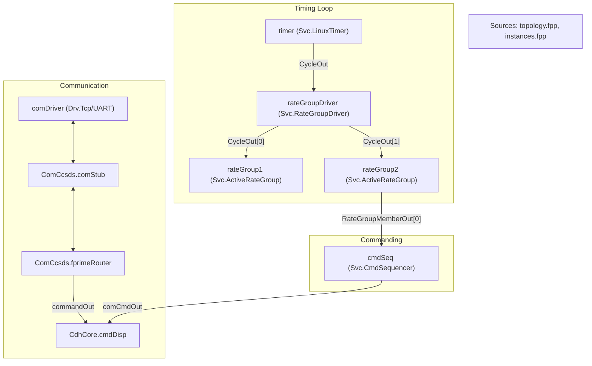
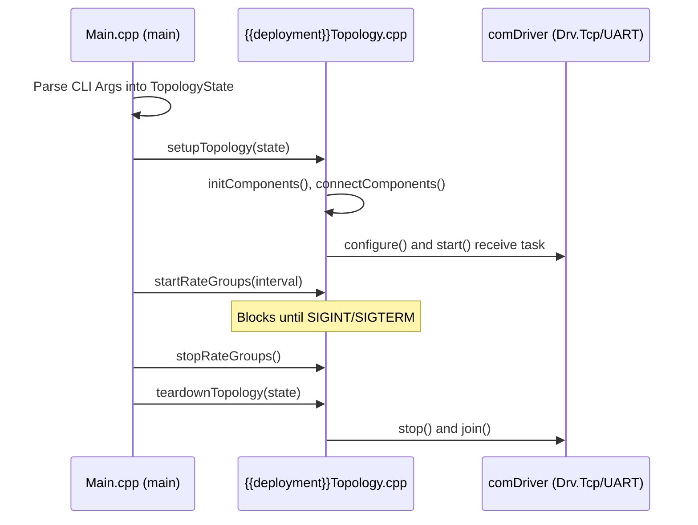

# Page: Deployment Template

# Deployment Template

Relevant source files

The following files were used as context for generating this wiki page:

- [src/fprime/cookiecutter_templates/cookiecutter-fprime-deployment/cookiecutter.json](src/fprime/cookiecutter_templates/cookiecutter-fprime-deployment/cookiecutter.json)
- [src/fprime/cookiecutter_templates/cookiecutter-fprime-deployment/{{cookiecutter.deployment_name}}/CMakeLists.txt](src/fprime/cookiecutter_templates/cookiecutter-fprime-deployment/{{cookiecutter.deployment_name}}/CMakeLists.txt)
- [src/fprime/cookiecutter_templates/cookiecutter-fprime-deployment/{{cookiecutter.deployment_name}}/Main.cpp](src/fprime/cookiecutter_templates/cookiecutter-fprime-deployment/{{cookiecutter.deployment_name}}/Main.cpp)
- [src/fprime/cookiecutter_templates/cookiecutter-fprime-deployment/{{cookiecutter.deployment_name}}/README.md](src/fprime/cookiecutter_templates/cookiecutter-fprime-deployment/{{cookiecutter.deployment_name}}/README.md)
- [src/fprime/cookiecutter_templates/cookiecutter-fprime-deployment/{{cookiecutter.deployment_name}}/Top/instances.fpp](src/fprime/cookiecutter_templates/cookiecutter-fprime-deployment/{{cookiecutter.deployment_name}}/Top/instances.fpp)
- [src/fprime/cookiecutter_templates/cookiecutter-fprime-deployment/{{cookiecutter.deployment_name}}/Top/topology.fpp](src/fprime/cookiecutter_templates/cookiecutter-fprime-deployment/{{cookiecutter.deployment_name}}/Top/topology.fpp)
- [src/fprime/cookiecutter_templates/cookiecutter-fprime-deployment/{{cookiecutter.deployment_name}}/Top/{{cookiecutter.deployment_name}}Packets.fppi](src/fprime/cookiecutter_templates/cookiecutter-fprime-deployment/{{cookiecutter.deployment_name}}/Top/{{cookiecutter.deployment_name}}Packets.fppi)
- [src/fprime/cookiecutter_templates/cookiecutter-fprime-deployment/{{cookiecutter.deployment_name}}/Top/{{cookiecutter.deployment_name}}Topology.cpp](src/fprime/cookiecutter_templates/cookiecutter-fprime-deployment/{{cookiecutter.deployment_name}}/Top/{{cookiecutter.deployment_name}}Topology.cpp)
- [src/fprime/cookiecutter_templates/cookiecutter-fprime-deployment/{{cookiecutter.deployment_name}}/Top/{{cookiecutter.deployment_name}}Topology.hpp](src/fprime/cookiecutter_templates/cookiecutter-fprime-deployment/{{cookiecutter.deployment_name}}/Top/{{cookiecutter.deployment_name}}Topology.hpp)
- [src/fprime/cookiecutter_templates/cookiecutter-fprime-deployment/{{cookiecutter.deployment_name}}/Top/{{cookiecutter.deployment_name}}TopologyDefs.hpp](src/fprime/cookiecutter_templates/cookiecutter-fprime-deployment/{{cookiecutter.deployment_name}}/Top/{{cookiecutter.deployment_name}}TopologyDefs.hpp)
- [src/fprime/cookiecutter_templates/cookiecutter-fprime-deployment/{{cookiecutter.deployment_name}}/fprime-gds.yml](src/fprime/cookiecutter_templates/cookiecutter-fprime-deployment/{{cookiecutter.deployment_name}}/fprime-gds.yml)

The `cookiecutter-fprime-deployment` template provides the standard boilerplate for creating an F´ deployment. A deployment is the top-level executable project that instantiates components, connects them into a topology, and provides the entry point (`main`) for the flight software. This template leverages **subtopologies** (CdhCore, ComCcsds, FileHandling, DataProducts) to provide a modular, reusable architecture [src/fprime/cookiecutter_templates/cookiecutter-fprime-deployment/{{cookiecutter.deployment_name}}/README.md:44-65]().

## Topology Lifecycle

The deployment manages the lifecycle of the software through three primary phases: setup, execution (cycling), and teardown. These are implemented in `{{cookiecutter.deployment_name}}Topology.cpp` within the deployment's namespace [src/fprime/cookiecutter_templates/cookiecutter-fprime-deployment/{{cookiecutter.deployment_name}}/Top/{{cookiecutter.deployment_name}}Topology.cpp:16-130]().

### 1. setupTopology
This function initializes the software state. It executes a sequence of autocoded and manual steps:
1.  **`initComponents(state)`**: Calls the `init` method for every component instance [src/fprime/cookiecutter_templates/cookiecutter-fprime-deployment/{{cookiecutter.deployment_name}}/Top/{{cookiecutter.deployment_name}}Topology.cpp:56-56]().
2.  **`setBaseIds()`**: Assigns unique ID offsets to each component [src/fprime/cookiecutter_templates/cookiecutter-fprime-deployment/{{cookiecutter.deployment_name}}/Top/{{cookiecutter.deployment_name}}Topology.cpp:58-58]().
3.  **`connectComponents()`**: Wires port connections defined in FPP [src/fprime/cookiecutter_templates/cookiecutter-fprime-deployment/{{cookiecutter.deployment_name}}/Top/{{cookiecutter.deployment_name}}Topology.cpp:60-60]().
4.  **`regCommands()`**: Registers commands with the dispatcher [src/fprime/cookiecutter_templates/cookiecutter-fprime-deployment/{{cookiecutter.deployment_name}}/Top/{{cookiecutter.deployment_name}}Topology.cpp:62-62]().
5.  **`configureTopology()`**: A helper function for project-specific setup, such as configuring rate group divisors and allocating buffers for the `CmdSequencer` [src/fprime/cookiecutter_templates/cookiecutter-fprime-deployment/{{cookiecutter.deployment_name}}/Top/{{cookiecutter.deployment_name}}Topology.cpp:41-52]().
6.  **`startTasks(state)`**: Spawns threads for all active components [src/fprime/cookiecutter_templates/cookiecutter-fprime-deployment/{{cookiecutter.deployment_name}}/Top/{{cookiecutter.deployment_name}}Topology.cpp:75-75]().

### 2. startRateGroups
This function drives the system's timing. It typically calls `timer.startTimer(interval)`, which blocks the main thread and dispatches ticks to the `RateGroupDriver` [src/fprime/cookiecutter_templates/cookiecutter-fprime-deployment/{{cookiecutter.deployment_name}}/Top/{{cookiecutter.deployment_name}}Topology.cpp:97-103]().

### 3. teardownTopology
Ensures a clean exit by stopping tasks and freeing resources:
*   **`stopTasks(state)`** and **`freeThreads(state)`**: Stops and joins active component threads [src/fprime/cookiecutter_templates/cookiecutter-fprime-deployment/{{cookiecutter.deployment_name}}/Top/{{cookiecutter.deployment_name}}Topology.cpp:111-112]().
*   **`comDriver` cleanup**: Depending on the driver type (TCP or UART), it terminates the read threads and joins the driver task [src/fprime/cookiecutter_templates/cookiecutter-fprime-deployment/{{cookiecutter.deployment_name}}/Top/{{cookiecutter.deployment_name}}Topology.cpp:115-124]().
*   **`cmdSeq.deallocateBuffer(mallocator)`**: Releases memory used for command sequences [src/fprime/cookiecutter_templates/cookiecutter-fprime-deployment/{{cookiecutter.deployment_name}}/Top/{{cookiecutter.deployment_name}}Topology.cpp:126-126]().

**Sources:**
- [src/fprime/cookiecutter_templates/cookiecutter-fprime-deployment/{{cookiecutter.deployment_name}}/Top/{{cookiecutter.deployment_name}}Topology.cpp:34-129]()
- [src/fprime/cookiecutter_templates/cookiecutter-fprime-deployment/{{cookiecutter.deployment_name}}/Top/{{cookiecutter.deployment_name}}Topology.hpp:12-58]()

---

## Component Instances and Connections

The topology is modeled using FPP (F Prime Prime) files in the `Top/` directory.

### Instance Definitions (`instances.fpp`)
This file defines the specific component instances used in the deployment, their Base IDs, and resource allocations (queue and stack sizes) [src/fprime/cookiecutter_templates/cookiecutter-fprime-deployment/{{cookiecutter.deployment_name}}/Top/instances.fpp:1-72]().

| Instance | Component Type | Role |
| :--- | :--- | :--- |
| `rateGroup1-3` | `Svc.ActiveRateGroup` | Executes periodic tasks at different frequencies [src/fprime/cookiecutter_templates/cookiecutter-fprime-deployment/{{cookiecutter.deployment_name}}/Top/instances.fpp:29-42](). |
| `cmdSeq` | `Svc.CmdSequencer` | Executes sequences of commands from files [src/fprime/cookiecutter_templates/cookiecutter-fprime-deployment/{{cookiecutter.deployment_name}}/Top/instances.fpp:44-47](). |
| `comDriver` | `Drv.TcpClient/Server` or `UART` | Physical communication interface [src/fprime/cookiecutter_templates/cookiecutter-fprime-deployment/{{cookiecutter.deployment_name}}/Top/instances.fpp:65-71](). |
| `timer` | `Svc.LinuxTimer` | Provides the fundamental hardware/OS clock tick [src/fprime/cookiecutter_templates/cookiecutter-fprime-deployment/{{cookiecutter.deployment_name}}/Top/instances.fpp:64-64](). |

### Topology Graph (`topology.fpp`)
Defines how instances are connected. It uses **Pattern Graph Specifiers** for standard F´ services (Events, Telemetry, Commands) and **Direct Graph Specifiers** for custom logic [src/fprime/cookiecutter_templates/cookiecutter-fprime-deployment/{{cookiecutter.deployment_name}}/Top/topology.fpp:37-134]().

**Topology Data Flow Diagram**

**Sources:**
- [src/fprime/cookiecutter_templates/cookiecutter-fprime-deployment/{{cookiecutter.deployment_name}}/Top/instances.fpp:1-72]()
- [src/fprime/cookiecutter_templates/cookiecutter-fprime-deployment/{{cookiecutter.deployment_name}}/Top/topology.fpp:1-136]()

---

## Configuration and Definitions

### TopologyDefs.hpp
This header defines the `TopologyState` struct, which carries command-line arguments (like hostname or UART device path) through the setup process [src/fprime/cookiecutter_templates/cookiecutter-fprime-deployment/{{cookiecutter.deployment_name}}/Top/{{cookiecutter.deployment_name}}TopologyDefs.hpp:64-76](). It also defines health ping thresholds for the `Health` component in the `PingEntries` namespace [src/fprime/cookiecutter_templates/cookiecutter-fprime-deployment/{{cookiecutter.deployment_name}}/Top/{{cookiecutter.deployment_name}}TopologyDefs.hpp:47-52]().

### Packets.fppi
Defines telemetry packet structures for the `Svc::TlmPacketizer`. It groups telemetry channels from various components (e.g., `rateGroup1.RgMaxTime`, `systemResources.CPU`) into named packets with specific IDs to optimize downlink bandwidth [src/fprime/cookiecutter_templates/cookiecutter-fprime-deployment/{{cookiecutter.deployment_name}}/Top/{{cookiecutter.deployment_name}}Packets.fppi:1-163]().

### fprime-gds.yml
Configures the F´ Ground Data System (GDS). For deployments using a `TcpServer` communication driver, it adds the `ip-client` flag to ensure the GDS connects as a client to the flight software [src/fprime/cookiecutter_templates/cookiecutter-fprime-deployment/{{cookiecutter.deployment_name}}/fprime-gds.yml:16-20]().

**Sources:**
- [src/fprime/cookiecutter_templates/cookiecutter-fprime-deployment/{{cookiecutter.deployment_name}}/Top/{{cookiecutter.deployment_name}}TopologyDefs.hpp:1-81]()
- [src/fprime/cookiecutter_templates/cookiecutter-fprime-deployment/{{cookiecutter.deployment_name}}/Top/{{cookiecutter.deployment_name}}Packets.fppi:1-171]()
- [src/fprime/cookiecutter_templates/cookiecutter-fprime-deployment/{{cookiecutter.deployment_name}}/fprime-gds.yml:1-20]()

---

## Execution Entry Point (Main.cpp)

The `Main.cpp` file provides the standard C++ `main` function for Linux/macOS environments.

1.  **Argument Parsing**: Uses `getopt` to parse `-a` (address), `-p` (port), or `-b` (baud), `-d` (device) depending on the selected driver [src/fprime/cookiecutter_templates/cookiecutter-fprime-deployment/{{cookiecutter.deployment_name}}/Main.cpp:67-101]().
2.  **Signal Handling**: Registers a `signalHandler` for `SIGINT` and `SIGTERM` to call `stopRateGroups()`, allowing the application to exit gracefully when the user hits Ctrl-C [src/fprime/cookiecutter_templates/cookiecutter-fprime-deployment/{{cookiecutter.deployment_name}}/Main.cpp:40-42, 113-114]().
3.  **Execution Flow**:
    *   Initializes OSAL via `Os::init()` [src/fprime/cookiecutter_templates/cookiecutter-fprime-deployment/{{cookiecutter.deployment_name}}/Main.cpp:64-64]().
    *   Calls `setupTopology(inputs)` [src/fprime/cookiecutter_templates/cookiecutter-fprime-deployment/{{cookiecutter.deployment_name}}/Main.cpp:118-118]().
    *   Enters the primary execution loop in `startRateGroups()` [src/fprime/cookiecutter_templates/cookiecutter-fprime-deployment/{{cookiecutter.deployment_name}}/Main.cpp:119-119]().
    *   Calls `teardownTopology(inputs)` upon exit [src/fprime/cookiecutter_templates/cookiecutter-fprime-deployment/{{cookiecutter.deployment_name}}/Main.cpp:120-120]().

**Main Entry Logic Diagram**

**Sources:**
- [src/fprime/cookiecutter_templates/cookiecutter-fprime-deployment/{{cookiecutter.deployment_name}}/Main.cpp:1-124]()
- [src/fprime/cookiecutter_templates/cookiecutter-fprime-deployment/{{cookiecutter.deployment_name}}/Top/{{cookiecutter.deployment_name}}Topology.cpp:54-129]()
