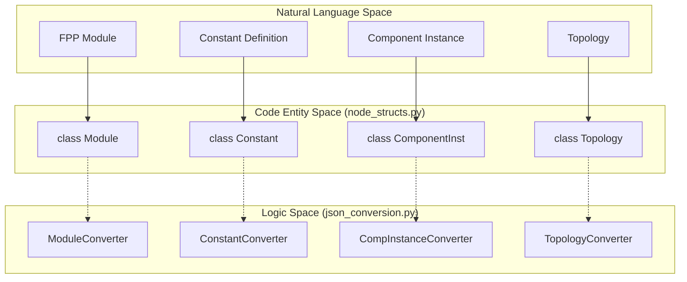
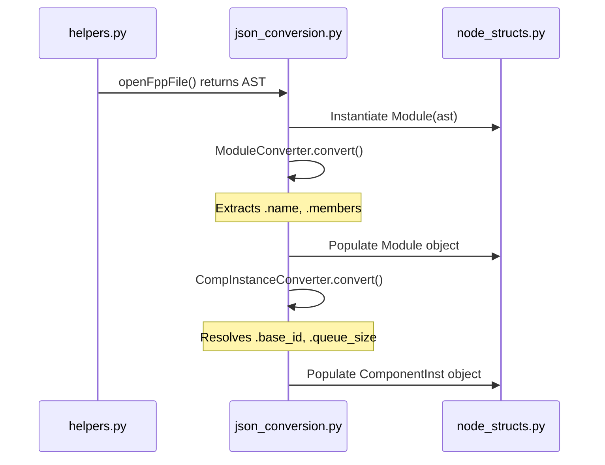

# Page: FPP-to-JSON Utility

# FPP-to-JSON Utility

Relevant source files

The following files were used as context for generating this wiki page:

- [src/fprime/fpp/utils/__init__.py](src/fprime/fpp/utils/__init__.py)
- [src/fprime/fpp/utils/fpp_to_json/__init__.py](src/fprime/fpp/utils/fpp_to_json/__init__.py)
- [src/fprime/fpp/utils/fpp_to_json/example_visitors/example.fpp](src/fprime/fpp/utils/fpp_to_json/example_visitors/example.fpp)
- [src/fprime/fpp/utils/fpp_to_json/example_visitors/example.fpp.ast.json](src/fprime/fpp/utils/fpp_to_json/example_visitors/example.fpp.ast.json)
- [src/fprime/fpp/utils/fpp_to_json/example_visitors/visit.py](src/fprime/fpp/utils/fpp_to_json/example_visitors/visit.py)
- [src/fprime/fpp/utils/fpp_to_json/example_write/write.py](src/fprime/fpp/utils/fpp_to_json/example_write/write.py)
- [src/fprime/fpp/utils/fpp_to_json/fpp_interface.py](src/fprime/fpp/utils/fpp_to_json/fpp_interface.py)
- [src/fprime/fpp/utils/fpp_to_json/helpers.py](src/fprime/fpp/utils/fpp_to_json/helpers.py)
- [src/fprime/fpp/utils/fpp_to_json/node_structs.py](src/fprime/fpp/utils/fpp_to_json/node_structs.py)
- [src/fprime/fpp/utils/fpp_to_json/visitors/__init__.py](src/fprime/fpp/utils/fpp_to_json/visitors/__init__.py)
- [src/fprime/fpp/utils/fpp_to_json/visitors/json_conversion.py](src/fprime/fpp/utils/fpp_to_json/visitors/json_conversion.py)
- [src/fprime/fpp/utils/fpp_to_json/visitors/writer.py](src/fprime/fpp/utils/fpp_to_json/visitors/writer.py)
- [test/fprime/fbuild/echoer.py](test/fprime/fbuild/echoer.py)

The `fpp_to_json` utility is a sub-package within `fprime-tools` designed to bridge the gap between FPP (F Prime Prime) modeling files and Python-based analysis or generation tools. It provides a structured way to invoke the FPP toolchain, parse the resulting JSON Abstract Syntax Tree (AST), and map that AST onto high-level Python data structures using a visitor-like pattern.

## Overview and Data Flow

The utility operates by wrapping the Scala-based FPP binaries (like `fpp-to-json` and `fpp-depend`) and providing a transformation pipeline that converts raw JSON AST nodes into annotated Python objects defined in `node_structs.py`.

### Technical Data Flow
1.  **Invocation**: `fpp_interface.py` calls the external `fpp-to-json` tool via `subprocess` [src/fprime/fpp/utils/fpp_to_json/fpp_interface.py:69-89]().
2.  **AST Loading**: `helpers.py` manages a temporary cache directory, runs the interface, and loads the resulting `fpp-ast.json` [src/fprime/fpp/utils/fpp_to_json/helpers.py:178-207]().
3.  **Conversion**: The `JSONConverter` classes in `json_conversion.py` iterate through the AST, extracting attributes like names, values, and qualified identifiers [src/fprime/fpp/utils/fpp_to_json/visitors/json_conversion.py:5-111]().
4.  **Structural Mapping**: Data is stored in `node_structs.py` classes (e.g., `Module`, `ComponentInst`), which support pre/post annotations and qualified names [src/fprime/fpp/utils/fpp_to_json/node_structs.py:12-199]().

### System Entity Map
This diagram maps the natural language concepts of FPP elements to their corresponding implementation classes and the conversion logic that handles them.

**FPP Entity to Code Mapping**

**Sources**: [src/fprime/fpp/utils/fpp_to_json/node_structs.py:1-200](), [src/fprime/fpp/utils/fpp_to_json/visitors/json_conversion.py:1-111]()

---

## FPP Interface Wrappers

The `fpp_interface.py` module acts as the low-level execution layer for FPP tools. It ensures that the tools are called with the correct flags and that their output is captured for further processing.

| Function | FPP Tool | Purpose |
| :--- | :--- | :--- |
| `fpp_depend` | `fpp-depend` | Calculates dependencies and writes them to specific cache files (direct, missing, framework, etc.) [src/fprime/fpp/utils/fpp_to_json/fpp_interface.py:5-51](). |
| `fpp_to_json` | `fpp-to-json` | Generates the JSON representation of the FPP AST with the `-s` (simple) flag [src/fprime/fpp/utils/fpp_to_json/fpp_interface.py:69-89](). |
| `fpp_format` | `fpp-format` | Formats an FPP file and returns the formatted string [src/fprime/fpp/utils/fpp_to_json/fpp_interface.py:91-113](). |
| `fpp_locate_defs` | `fpp-locate-defs` | Locates definitions within an FPP file relative to a base directory [src/fprime/fpp/utils/fpp_to_json/fpp_interface.py:115-138](). |

**Sources**: [src/fprime/fpp/utils/fpp_to_json/fpp_interface.py:1-139]()

---

## AST Parsing Helpers

Parsing the FPP JSON AST requires handling complex recursive structures, such as nested expressions and qualified names (e.g., `A.B.C`). The `helpers.py` module provides recursive descent utilities to simplify these nodes into Python strings or numbers.

### Key Parsing Functions
*   **`qualifier_calculator`**: Recursively resolves `ExprDot` and `ExprIdent` nodes to reconstruct full FPP namespaces [src/fprime/fpp/utils/fpp_to_json/helpers.py:8-24]().
*   **`value_parser`**: A dispatcher that identifies the type of value (Qualified, Unqualified, Ident, or Constant) and calls the appropriate sub-parser [src/fprime/fpp/utils/fpp_to_json/helpers.py:27-51]().
*   **`parse_constant`**: Handles literals including strings, integers, floats, booleans, and complex types like arrays and structs [src/fprime/fpp/utils/fpp_to_json/helpers.py:100-129]().
*   **`parse_binop`**: Reconstructs mathematical expressions by mapping FPP operator names (e.g., "Add") to symbols (e.g., "+") via the `Binops` helper [src/fprime/fpp/utils/fpp_to_json/helpers.py:53-97]().

**Sources**: [src/fprime/fpp/utils/fpp_to_json/helpers.py:1-176]()

---

## Visitor Pattern and Node Structures

The utility uses a "Converter" pattern to transform raw JSON into the `node_structs`. Each converter class targets a specific AST node type.

### Implementation Architecture
The `visit.py` example demonstrates how to traverse the AST. It uses a recursive "walk" strategy to process modules and topologies, maintaining the state of the Qualified Name (`qf`) as it descends [src/fprime/fpp/utils/fpp_to_json/example_visitors/visit.py:7-62]().

**AST Transformation Logic**

### Node Classes
Defined in `node_structs.py`, these classes serve as the internal data model:
*   **`ComponentInst`**: Captures F´ specific instance data including `base_id`, `queue_size`, `stack_size`, and the eight lifecycle `phases` (e.g., `configComponents`, `startTasks`) [src/fprime/fpp/utils/fpp_to_json/node_structs.py:75-115]().
*   **`ConnectionGraph`**: Stores connection lists and graph types for topologies [src/fprime/fpp/utils/fpp_to_json/node_structs.py:157-178]().
*   **`Module` / `Topology`**: Container classes that hold lists of `members` [src/fprime/fpp/utils/fpp_to_json/node_structs.py:12-31](), [src/fprime/fpp/utils/fpp_to_json/node_structs.py:180-199]().

**Sources**: [src/fprime/fpp/utils/fpp_to_json/node_structs.py:1-199](), [src/fprime/fpp/utils/fpp_to_json/visitors/json_conversion.py:1-111](), [src/fprime/fpp/utils/fpp_to_json/example_visitors/visit.py:1-78]()

---

## Writer Utility

While the converters handle **reading** FPP, the `writer.py` module (demonstrated in `example_write/write.py`) provides the inverse capability: generating FPP source code from `node_structs` objects.

*   **`ModuleWriter`**: Handles `open()` and `close()` to wrap members in `module Name { ... }` [src/fprime/fpp/utils/fpp_to_json/example_write/write.py:7-11]().
*   **`ConstantWriter`**: Writes `constant ID = VALUE` lines [src/fprime/fpp/utils/fpp_to_json/example_write/write.py:14-19]().
*   **`InstanceSpecWriter`**: Generates `instance Name` specifications within topologies [src/fprime/fpp/utils/fpp_to_json/example_write/write.py:29-33]().

**Sources**: [src/fprime/fpp/utils/fpp_to_json/example_write/write.py:1-42]()
