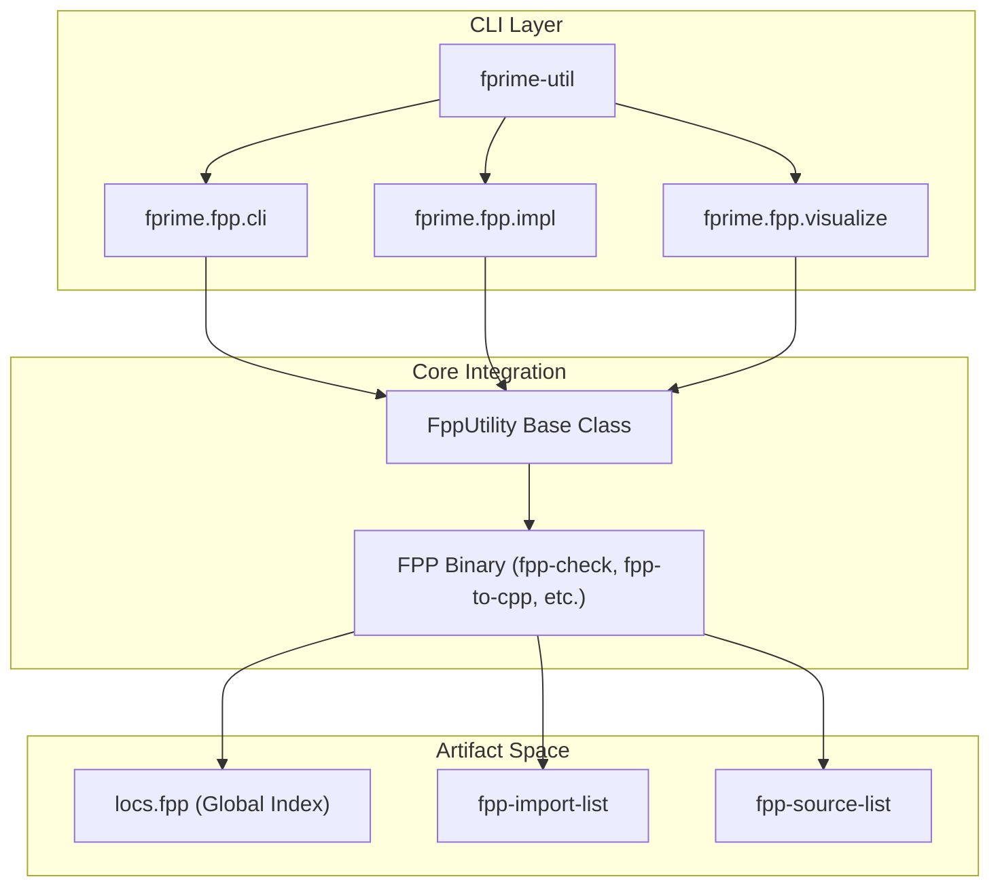

# Page: FPP Tooling Integration

# FPP Tooling Integration

Relevant source files

The following files were used as context for generating this wiki page:

- [src/fprime/common/models/serialize/__init__.py](src/fprime/common/models/serialize/__init__.py)
- [src/fprime/constants.py](src/fprime/constants.py)
- [src/fprime/fpp/__init__.py](src/fprime/fpp/__init__.py)
- [src/fprime/fpp/cli.py](src/fprime/fpp/cli.py)
- [src/fprime/fpp/common.py](src/fprime/fpp/common.py)
- [src/fprime/fpp/impl.py](src/fprime/fpp/impl.py)
- [src/fprime/fpp/visualize.py](src/fprime/fpp/visualize.py)
- [src/fprime/util/code_formatter.py](src/fprime/util/code_formatter.py)

The FPP (F Prime Prime) modeling language is the architectural backbone of modern F´ development. The `fprime-tools` package provides a comprehensive Python wrapper around the FPP toolchain, integrating model-based engineering directly into the `fprime-util` CLI. This integration automates the lifecycle of model validation, code generation, and system visualization.

### FPP Tooling Architecture
The integration is built on a common execution base that handles the complexities of FPP's requirement for global location awareness and dependency resolution.

**Sources:** [src/fprime/fpp/common.py:30-43](), [src/fprime/fpp/cli.py:69-105]()

---

### 4.1 FppUtility Base and Validation
The `FppUtility` class in `fprime.fpp.common` is the base `ExecutableAction` for all FPP-related commands. It abstracts the retrieval of the global `locs.fpp` file and the module-specific `fpp-import-list` and `fpp-source-list` generated during the CMake configure step.

*   **fpp-check**: Wraps the validation tool to ensure model consistency and can optionally output unconnected ports using the `-u` flag.
*   **fpp-to-dict**: Automates the generation of command/telemetry dictionaries for deployments, which are essential for Ground Data System (GDS) integration.

For details, see [FppUtility Base and fpp-check / fpp-to-dict](#4.1).

**Sources:** [src/fprime/fpp/common.py:30-54](), [src/fprime/fpp/cli.py:15-38]()

---

### 4.2 Implementation Generation: `fprime-util impl`
The `fprime-util impl` command automates the generation of C++ implementation templates from FPP component definitions. The pipeline handles path prefix resolution so that FPP can locate inherited types across the framework and project libraries.

*   **Template Generation**: Invokes `fpp-to-cpp --template` to create `.cpp` and `.hpp` files.
*   **Formatting**: Integrates with `ClangFormatter` to ensure generated code matches project style guidelines.
*   **UT Support**: Automatically moves unit test templates to the `test/ut` directory and appends `.template` suffixes to prevent accidental overwrites of existing test logic.

For details, see [Implementation Generation: fprime-util impl](#4.2).

**Sources:** [src/fprime/fpp/impl.py:76-149](), [src/fprime/util/code_formatter.py:32-45]()

---

### 4.3 Topology Visualization: `fprime-util visualize`
The visualization suite provides a graphical representation of component connections within a topology. It orchestrates a multi-stage pipeline:
1.  **Layout Generation**: Uses `fpp-to-layout` to produce connection text files.
2.  **Coordinate Calculation**: Runs `fpl-layout` to convert text descriptions into JSON-formatted coordinate data.
3.  **Web Hosting**: Launches a Flask-based `fprime-visual` server to render the interactive topology graph.

For details, see [Topology Visualization: fprime-util visualize](#4.3).

**Sources:** [src/fprime/fpp/visualize.py:23-50](), [src/fprime/fpp/visualize.py:124-133]()

---

### 4.4 FPP-to-JSON Utility
The `fpp_to_json` sub-package provides a specialized interface for converting FPP models into JSON ASTs (Abstract Syntax Trees). This utility is used by external tools and scripts that need to programmatically inspect FPP models without implementing a full FPP parser. It leverages a visitor pattern to traverse FPP nodes and produce a structured JSON output.

For details, see [FPP-to-JSON Utility](#4.4).

---

### Mapping Code Entities to System Functions

This table bridges the CLI commands to their internal Python implementation classes and the underlying FPP binaries they wrap.

| fprime-util command | Python Entry Point | Primary Class/Utility | Wrapped FPP Binary |
| :--- | :--- | :--- | :--- |
| `fpp-check` | `run_fpp_check` | `FppUtility` | `fpp-check` |
| `fpp-to-dict` | `run_fpp_to_dict` | `FppUtility` | `fpp-to-dict` |
| `impl` | `run_fpp_impl` | `fpp_generate_implementation` | `fpp-to-cpp` |
| `visualize` | `run_fprime_visualize` | `FppUtility` / `construct_app` | `fpp-to-layout`, `fpl-layout` |

**Sources:** [src/fprime/fpp/cli.py:99-105](), [src/fprime/fpp/impl.py:152-177](), [src/fprime/fpp/visualize.py:23-45]()
