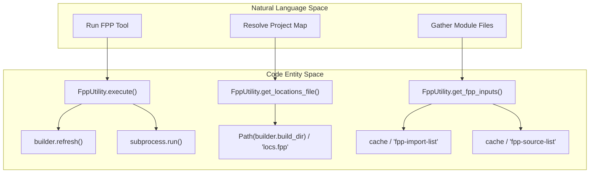
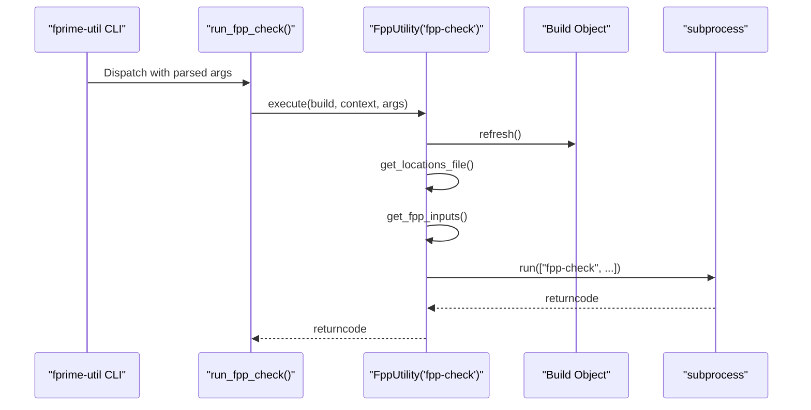

# Page: FppUtility Base and fpp-check / fpp-to-dict

# FppUtility Base and fpp-check / fpp-to-dict

Relevant source files

The following files were used as context for generating this wiki page:

- [src/fprime/fbuild/check.py](src/fprime/fbuild/check.py)
- [src/fprime/fbuild/enumerator.py](src/fprime/fbuild/enumerator.py)
- [src/fprime/fbuild/types.py](src/fprime/fbuild/types.py)
- [src/fprime/fpp/__init__.py](src/fprime/fpp/__init__.py)
- [src/fprime/fpp/cli.py](src/fprime/fpp/cli.py)
- [src/fprime/fpp/common.py](src/fprime/fpp/common.py)
- [src/fprime/fpp/visualize.py](src/fprime/fpp/visualize.py)
- [src/fprime/util/code_formatter.py](src/fprime/util/code_formatter.py)
- [test/fprime/fbuild/test_target.py](test/fprime/fbuild/test_target.py)
- [test/fprime/fpp/test_common.py](test/fprime/fpp/test_common.py)
- [test/fprime/util/test_code_formatter.py](test/fprime/util/test_code_formatter.py)

The `FppUtility` class serves as the foundation for integrating the F Prime Prime (FPP) toolchain into `fprime-tools`. It provides a standardized lifecycle for executing FPP utilities by resolving required system-level files (like `locs.fpp`) and module-specific source lists generated during the CMake build process. This page documents the base utility logic and its primary wrappers: `fpp-check` and `fpp-to-dict`.

## FppUtility Base Class

`FppUtility` inherits from `ExecutableAction` [src/fprime/fpp/common.py:30-30]() and encapsulates the logic for invoking FPP-related subprocesses with the correct environment and file arguments.

### Execution Lifecycle

The `execute` method [src/fprime/fpp/common.py:108-160]() follows a strict sequence to ensure the FPP toolchain has the latest information from the build system:

1.  **Support Check**: Verifies the utility executable exists using `shutil.which` [src/fprime/fpp/common.py:55-57]().
2.  **Cache Refresh**: Calls `builder.refresh()` [src/fprime/fpp/common.py:130-130]() to ensure CMake-generated FPP lists are up to date.
3.  **Support File Resolution**:
    *   **Locations**: Retrieves `locs.fpp` from the build directory [src/fprime/fpp/common.py:60-74]().
    *   **Inputs**: Reads `fpp-import-list` and `fpp-source-list` from the module's build cache [src/fprime/fpp/common.py:77-106]().
4.  **Argument Assembly**: Constructs the command line based on the `imports_as_sources` flag.
5.  **Subprocess Invocation**: Runs the command in the provided `context` directory with an environment merged from the system and `builder.settings` [src/fprime/fpp/common.py:136-160]().

### Support File Resolution Logic

FPP utilities require a global view of the system provided by the locations file and a local view provided by source/import lists.

| File | Purpose | Source Location |
| :--- | :--- | :--- |
| `locs.fpp` | Maps FPP symbols to file paths across the project. | `build_dir/locs.fpp` |
| `fpp-import-list` | List of FPP files imported by the current module. | `build_cache/fpp-import-list` |
| `fpp-source-list` | List of FPP files defining the current module. | `build_cache/fpp-source-list` |

**Sources:** [src/fprime/fpp/common.py:60-106]()

### Natural Language to Code Entity Mapping: FppUtility Execution

This diagram maps the high-level "Run FPP Tool" concept to the specific Python entities and file system artifacts involved.

**Sources:** [src/fprime/fpp/common.py:60-160]()

---

## fpp-check

The `fpp-check` wrapper validates FPP models for semantic correctness. It is particularly used for detecting unconnected ports in a topology.

### Implementation
The `run_fpp_check` function [src/fprime/fpp/cli.py:15-37]() instantiates an `FppUtility` with the name `"fpp-check"`. It supports an optional `--unconnected` (or `-u`) argument which is passed to the underlying tool to write unconnected port reports to a specified file [src/fprime/fpp/cli.py:36-36]().

*   **Command Pattern**: `<fpp-check> [-u <file>] <locations> <imports> <sources>`
*   **Imports**: Passed as sources (default `FppUtility` behavior).

**Sources:** [src/fprime/fpp/cli.py:15-37](), [src/fprime/fpp/cli.py:84-90]()

---

## fpp-to-dict

The `fpp-to-dict` wrapper generates command, event, and telemetry dictionaries used by ground systems and deployments.

### Implementation
The `run_fpp_to_dict` function [src/fprime/fpp/cli.py:40-67]() instantiates `FppUtility` with `imports_as_sources=False` [src/fprime/fpp/cli.py:56-56](). This forces the utility to pass imports via the `-i` flag rather than as positional source arguments [src/fprime/fpp/common.py:149-149]().

### CLI Arguments
It accepts the following specific arguments:
*   `--directory` (`-d`): Specifies the output directory for the generated dictionary files [src/fprime/fpp/cli.py:62-62]().
*   `--size` (`-s`): Sets the default string size for the dictionary generation [src/fprime/fpp/cli.py:63-63]().

**Sources:** [src/fprime/fpp/cli.py:40-67](), [src/fprime/fpp/cli.py:92-98]()

---

## Data Flow: FPP Command Dispatch

This diagram illustrates how a CLI command like `fprime-util fpp-check` flows through the parser to the utility execution.

**Sources:** [src/fprime/fpp/cli.py:15-37](), [src/fprime/fpp/common.py:108-160]()

## Argument Handling Summary

The `FppUtility` class handles the translation of internal Python lists into CLI strings for the subprocess.

| Flag `imports_as_sources` | Argument Format | Example Tool |
| :--- | :--- | :--- |
| `True` (Default) | `[locs] [imports] [sources]` | `fpp-check` |
| `False` | `-i [import1,import2] [locs] [sources]` | `fpp-to-dict` |

**Sources:** [src/fprime/fpp/common.py:144-153]()
