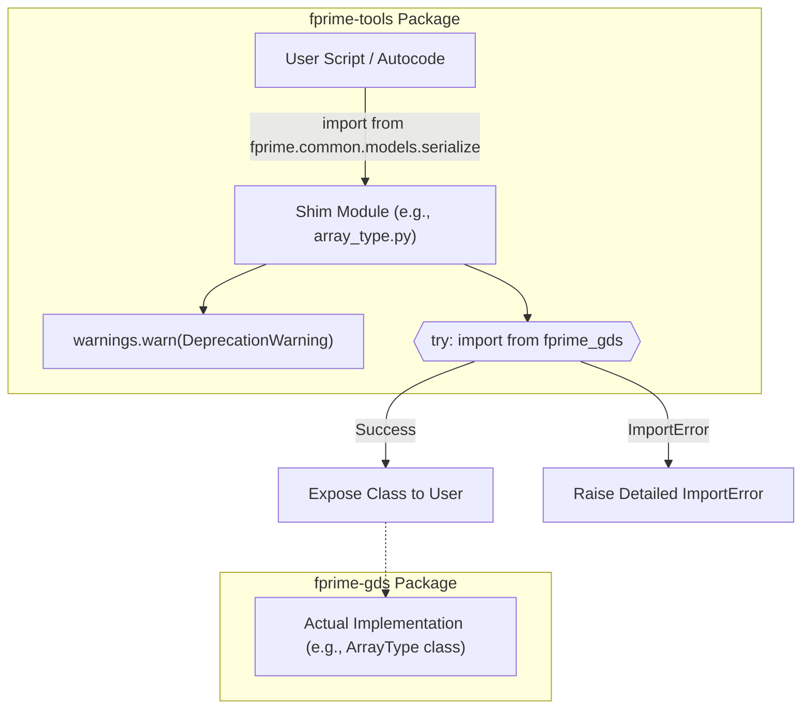
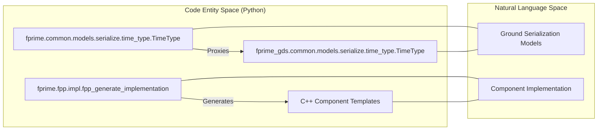

# Page: GDS Migration Shims: ArrayType, SerializableType, TimeType, StringType

# GDS Migration Shims: ArrayType, SerializableType, TimeType, StringType

<details>
<summary>Relevant source files</summary>

The following files were used as context for generating this wiki page:

- [src/fprime/common/models/serialize/__init__.py](src/fprime/common/models/serialize/__init__.py)
- [src/fprime/common/models/serialize/array_type.py](src/fprime/common/models/serialize/array_type.py)
- [src/fprime/common/models/serialize/serializable_type.py](src/fprime/common/models/serialize/serializable_type.py)
- [src/fprime/common/models/serialize/string_type.py](src/fprime/common/models/serialize/string_type.py)
- [src/fprime/common/models/serialize/time_type.py](src/fprime/common/models/serialize/time_type.py)
- [src/fprime/constants.py](src/fprime/constants.py)
- [src/fprime/fpp/impl.py](src/fprime/fpp/impl.py)

</details>


The `fprime-tools` package maintains a set of shim modules within `fprime.common.models.serialize` to facilitate the architectural split between the core F´ tooling and the F´ Ground Data System (GDS). These shims ensure backward compatibility for legacy scripts and autocoded Python generators that expect the ground-side serialization type system to be located within the `fprime` namespace, while the actual implementation now resides in the `fprime-gds` package.

## Architectural Rationale: The fprime/fprime-gds Split

Historically, the serialization classes used to decode telemetry and encode commands on the ground were bundled directly with the F´ framework tools. To improve modularity and allow the GDS to evolve independently of the build tools, these models were migrated to the `fprime-gds` repository.

The shims in `fprime-tools` serve three primary purposes:
1.  **Redirection**: Transparently importing the implementation from `fprime_gds`.
2.  **Deprecation Signaling**: Notifying developers via `DeprecationWarning` that their import paths need updating.
3.  **Dependency Validation**: Providing clear `ImportError` messages if the required `fprime-gds` package is missing from the environment.

## Shim Implementation Pattern

Each shim file follows a standardized structural pattern to handle the proxying of classes. This pattern is applied to `ArrayType`, `SerializableType`, `TimeType`, and `StringType`.

### Redirection Logic Flow

The following diagram illustrates how a call to an `fprime` serialization module is redirected to the `fprime_gds` equivalent.

**Serialization Import Proxy Flow**

Sources: [src/fprime/common/models/serialize/array_type.py:7-23](), [src/fprime/common/models/serialize/time_type.py:20-36]()

### Deprecation Mechanism
Upon importing any of the shimmed modules, a `DeprecationWarning` is issued to `stderr`. This warning includes the specific new path the developer should use.

*   **Global Package Warning**: The `__init__.py` of the serialize package warns that the entire ground type system has migrated [src/fprime/common/models/serialize/__init__.py:1-7]().
*   **Module-Specific Warning**: Each individual shim file issues a targeted warning for its specific class, using `stacklevel=2` to ensure the warning points to the user's import statement rather than the shim itself [src/fprime/common/models/serialize/serializable_type.py:10-14]().

## Impacted Types and Classes

The following table maps the shimmed modules to their new locations in the GDS package.

| Class | Shim File Path | GDS Target Path |
| :--- | :--- | :--- |
| `ArrayType` | `src/fprime/common/models/serialize/array_type.py` | `fprime_gds.common.models.serialize.array_type` |
| `SerializableType` | `src/fprime/common/models/serialize/serializable_type.py` | `fprime_gds.common.models.serialize.serializable_type` |
| `TimeType` | `src/fprime/common/models/serialize/time_type.py` | `fprime_gds.common.models.serialize.time_type` |
| `StringType` | `src/fprime/common/models/serialize/string_type.py` | `fprime_gds.common.models.serialize.string_type` |

Sources: [src/fprime/common/models/serialize/array_type.py:17-17](), [src/fprime/common/models/serialize/serializable_type.py:18-18](), [src/fprime/common/models/serialize/time_type.py:30-30](), [src/fprime/common/models/serialize/string_type.py:18-18]()

## Conditional Import and Error Guidance

The shims use a `try...except ImportError` block to provide actionable feedback to the user. If `fprime-gds` is not installed, the standard `ImportError` is caught and re-raised with a custom message instructing the user to install the missing package.

**Example Implementation (SerializableType):**
```python
try:
    from fprime_gds.common.models.serialize.serializable_type import SerializableType
except ImportError as e:
    raise ImportError(
        "SerializableType has been moved to the fprime-gds package. "
        "Please install fprime-gds and update your imports to use "
        "`from fprime_gds.common.models.serialize.serializable_type import SerializableType`"
    ) from e
```
Sources: [src/fprime/common/models/serialize/serializable_type.py:16-25]()

## Relationship to FPP Implementation Generation

While these shims handle ground-side Python types, the `fprime-util impl` command (handled by `fpp_generate_implementation`) manages the generation of C++ implementation templates. This process uses the `FppUtility` to invoke `fpp-to-cpp --template` [src/fprime/fpp/impl.py:112-129](). 

The serialization shims are primarily relevant when the resulting C++ components are exercised by Python-based integration tests or the GDS, where the Python representation of F´ types (like `TimeType` or `ArrayType`) is required to interpret the binary data stream.

**Entity Association: Serialization and Implementation**

Sources: [src/fprime/common/models/serialize/time_type.py:29-36](), [src/fprime/fpp/impl.py:76-84]()
