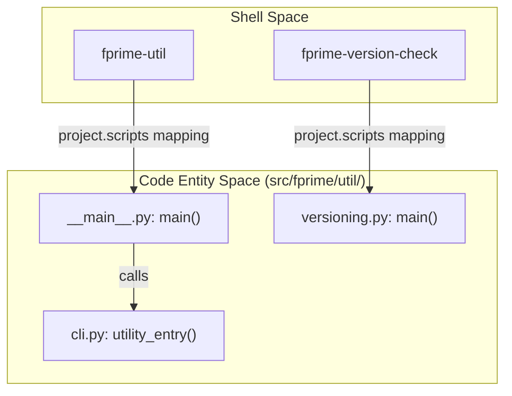
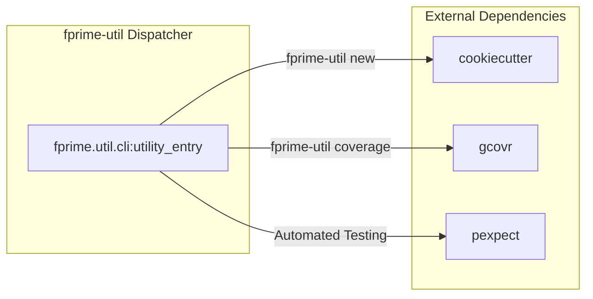

# Page: Getting Started

# Getting Started

<details>
<summary>Relevant source files</summary>

The following files were used as context for generating this wiki page:

- [.github/workflows/fprime-tools-ci.yml](.github/workflows/fprime-tools-ci.yml)
- [.github/workflows/integration-tests.yml](.github/workflows/integration-tests.yml)
- [.github/workflows/publish.yml](.github/workflows/publish.yml)
- [.gitignore](.gitignore)
- [LICENSE.txt](LICENSE.txt)
- [NOTICE.txt](NOTICE.txt)
- [README.md](README.md)
- [pyproject.toml](pyproject.toml)
- [setup.py](setup.py)
- [src/fprime/util/__init__.py](src/fprime/util/__init__.py)
- [src/fprime/util/__main__.py](src/fprime/util/__main__.py)

</details>


This page provides the technical foundation for installing, developing, and understanding the core structure of the `fprime-tools` package. It covers the installation lifecycle, the "src-layout" architecture, and the entry-point scripts that drive the F´ development workflow.

## Installation and Developer Setup

`fprime-tools` is a Python-based suite designed to manage the F´ flight software development lifecycle. It supports Python versions 3.9 through 3.13 [pyproject.toml:10-30]().

### Standard Installation
The package is distributed via PyPI and can be installed using standard Python package managers:
```bash
pip install fprime-tools
```
[README.md:3-7]()

### Developer Installation
For contributors or those testing the `devel` branch, a "link-based" installation is recommended to allow local code changes to take effect immediately without re-installation.

1. **Clone the repository:** `git clone https://github.com/fprime-community/fprime-tools.git` [README.md:30]()
2. **Uninstall existing versions:** `pip uninstall fprime-tools` [README.md:33]()
3. **Editable Install:** `pip install -e .` [README.md:22-24]()

The `-e` flag (editable mode) links the current directory into the site-packages, ensuring that edits to files in `src/fprime/` are reflected in the `fprime-util` command immediately [README.md:22-24]().

**Sources:**
- [README.md:1-37]()
- [pyproject.toml:10-30]()

---

## Package Structure (src-layout)

The repository utilizes the modern **src-layout** for Python packages. This structure separates the code meant for distribution (inside `src/`) from configuration and test files, preventing accidental imports of local development modules [pyproject.toml:89-93]().

### Core Organization
- **`src/fprime/`**: The root namespace for all F´ Python tooling.
- **`fprime.util`**: Contains the CLI entry points and general utility logic [src/fprime/util/__main__.py:1-10]().
- **`setup.py` & `pyproject.toml`**: Manage build metadata and dependencies. `setup.py` is retained primarily for legacy support, while `pyproject.toml` handles modern build-system requirements via `setuptools.build_meta` [setup.py:1-6](), [pyproject.toml:1-3]().

### Data Flow: Installation to Execution
The following diagram illustrates how the `pyproject.toml` configuration maps the CLI commands to specific Python functions within the src-layout.

**CLI Entry Point Mapping**

**Sources:**
- [pyproject.toml:72-74]()
- [pyproject.toml:89-93]()
- [src/fprime/util/__main__.py:13-19]()

---

## Entry-Point Scripts

The package registers two primary executable scripts in the user's path via the `[project.scripts]` configuration [pyproject.toml:72-74]().

### 1. fprime-util
This is the primary developer interface. It acts as a wrapper around the F´ build system (CMake), FPP compilers, and scaffolding tools.
- **Implementation:** The script invokes `fprime.util.__main__:main`, which delegates to `fprime.util.cli.utility_entry` [src/fprime/util/__main__.py:13-15]().
- **Role:** Handles `generate`, `build`, `check`, and `new` commands.

### 2. fprime-version-check
A diagnostic tool used to ensure the development environment (Python, CMake, Compilers) meets the requirements of the specific F´ framework version being used.
- **Implementation:** Maps directly to `fprime.util.versioning:main` [pyproject.toml:74]().

**Sources:**
- [pyproject.toml:72-74]()
- [src/fprime/util/__main__.py:1-19]()

---

## Key Dependencies

`fprime-tools` integrates several third-party libraries to handle specialized tasks within the flight software ecosystem.

| Dependency | Purpose in F´ |
| :--- | :--- |
| `cookiecutter` | Drives the scaffolding system for creating new components, ports, and deployments [pyproject.toml:38](). |
| `gcovr` | Generates HTML and XML code coverage reports from GCC/Clang coverage data during `fprime-util coverage` [pyproject.toml:39](). |
| `pexpect` | Used for automating interactive console applications and testing CLI interactions [pyproject.toml:36](). |
| `pytest` | The primary framework for running unit tests within the `test/` directory [pyproject.toml:37](). |
| `black` | (Optional) Enforces a consistent code style across the Python codebase [README.md:38-47](), [pyproject.toml:49](). |

### Dependency Interaction Diagram
This diagram shows how `fprime-util` coordinates these external entities during a typical developer workflow.

**Tool Orchestration Flow**

**Sources:**
- [pyproject.toml:34-42]()
- [README.md:38-47]()

---

## Continuous Integration and Testing

The repository maintains rigorous quality standards through GitHub Actions, ensuring compatibility across Python versions and F´ framework releases.

- **Unit Tests:** Triggered on every push to `devel`. Runs `pytest` across Python 3.9–3.13 [.github/workflows/fprime-tools-ci.yml:14-20]().
- **Integration Tests:** Validates the tools against multiple F´ framework versions (e.g., `v3.4.3`, `v3.5.1`, `devel`) to ensure that changes in `fprime-util` do not break existing flight software projects [.github/workflows/integration-tests.yml:17-21]().
- **Visualizer Integration:** Specifically tests the `fprime-util visualize` command to ensure the FPP-to-UI pipeline is functional [.github/workflows/integration-tests.yml:69-99]().

**Sources:**
- [.github/workflows/fprime-tools-ci.yml:1-34]()
- [.github/workflows/integration-tests.yml:1-99]()
