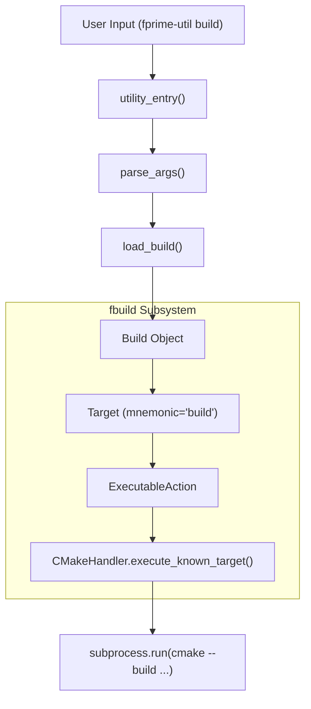
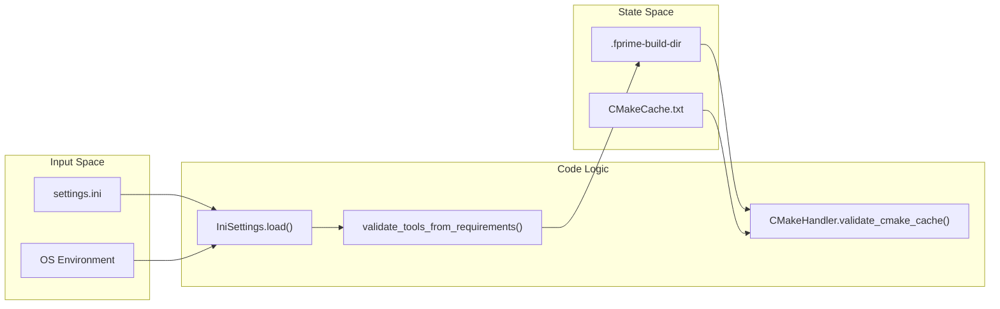

# Page: Glossary

# Glossary

Relevant source files

The following files were used as context for generating this wiki page:

- [.github/actions/spelling/expect.txt](.github/actions/spelling/expect.txt)
- [src/fprime/common/models/serialize/__init__.py](src/fprime/common/models/serialize/__init__.py)
- [src/fprime/constants.py](src/fprime/constants.py)
- [src/fprime/cookiecutter_templates/cookiecutter-fprime-deployment/{{cookiecutter.deployment_name}}/Top/instances.fpp](src/fprime/cookiecutter_templates/cookiecutter-fprime-deployment/{{cookiecutter.deployment_name}}/Top/instances.fpp)
- [src/fprime/cookiecutter_templates/cookiecutter-fprime-deployment/{{cookiecutter.deployment_name}}/Top/{{cookiecutter.deployment_name}}Topology.cpp](src/fprime/cookiecutter_templates/cookiecutter-fprime-deployment/{{cookiecutter.deployment_name}}/Top/{{cookiecutter.deployment_name}}Topology.cpp)
- [src/fprime/fbuild/builder.py](src/fprime/fbuild/builder.py)
- [src/fprime/fbuild/check.py](src/fprime/fbuild/check.py)
- [src/fprime/fbuild/cmake.py](src/fprime/fbuild/cmake.py)
- [src/fprime/fbuild/enumerator.py](src/fprime/fbuild/enumerator.py)
- [src/fprime/fbuild/gcovr.py](src/fprime/fbuild/gcovr.py)
- [src/fprime/fbuild/settings.py](src/fprime/fbuild/settings.py)
- [src/fprime/fbuild/target.py](src/fprime/fbuild/target.py)
- [src/fprime/fbuild/target_definitions.py](src/fprime/fbuild/target_definitions.py)
- [src/fprime/fbuild/types.py](src/fprime/fbuild/types.py)
- [src/fprime/fpp/impl.py](src/fprime/fpp/impl.py)
- [src/fprime/util/build_helper.py](src/fprime/util/build_helper.py)
- [src/fprime/util/cli.py](src/fprime/util/cli.py)
- [src/fprime/util/commands.py](src/fprime/util/commands.py)
- [src/fprime/util/help_text.py](src/fprime/util/help_text.py)
- [test/fprime/fbuild/test_build.py](test/fprime/fbuild/test_build.py)
- [test/fprime/fbuild/test_settings.py](test/fprime/fbuild/test_settings.py)
- [test/fprime/fbuild/test_target.py](test/fprime/fbuild/test_target.py)
- [test/fprime/fpp/test_common.py](test/fprime/fpp/test_common.py)
- [test/fprime/util/test_code_formatter.py](test/fprime/util/test_code_formatter.py)

This page provides definitions for codebase-specific terms, jargon, and domain concepts used throughout the `fprime-tools` repository. It serves as a technical reference for onboarding engineers to understand the relationship between F´ architectural concepts and their Python implementation.

## Core Concepts

### Build Cache
A directory (typically named `build-fprime-automatic-<platform>`) where CMake stores its configuration, generated build files, and compiled artifacts. A build cache must be "invented" via the `generate` command before most other utility commands can function [src/fprime/fbuild/builder.py:77-101]().

### Build Type
An enumeration (`BuildType`) that distinguishes between standard builds and unit testing builds. This affects the selection of the build cache and the targets available [src/fprime/fbuild/types.py:10-15]().
- `BUILD_NORMAL`: Standard flight software build.
- `BUILD_TESTING`: Build including unit tests, usually triggered by the `--ut` flag [src/fprime/util/build_helper.py:90-93]().

### Deployment
A top-level F´ project instance that aggregates multiple components into a single executable. In the build system, a directory is recognized as a deployment if it contains a `CMakeLists.txt` file with a `project()` call [src/fprime/fbuild/builder.py:55-56]().

### Toolchain / Platform
The target architecture for which the software is being compiled (e.g., `native`, `raspberrypi`). The toolchain is resolved via `settings.ini` or passed as a positional argument to `fprime-util` [src/fprime/fbuild/builder.py:77-90]().

---

## Technical Terms and Implementation

### Target and Action Framework
The system uses a decoupled architecture where `Target` objects represent high-level user goals (like `build` or `check`), and `Action` objects (like `ExecutableAction`) define how to fulfill those goals using the underlying build system [src/fprime/fbuild/target.py:13-17]().

**Mapping: Natural Language to Code Entities**

| Concept | Code Entity | File Pointer |
| :--- | :--- | :--- |
| **Command Dispatcher** | `utility_entry` | [src/fprime/util/cli.py:32-57]() |
| **Build Orchestrator** | `Build` class | [src/fprime/fbuild/builder.py:28-53]() |
| **CMake Wrapper** | `CMakeHandler` | [src/fprime/fbuild/cmake.py:26-48]() |
| **Target Definition** | `Target` class | [src/fprime/fbuild/target.py:17-18]() |
| **Coverage Tool** | `Gcovr` class | [src/fprime/fbuild/gcovr.py:41-50]() |

**Diagram: CLI Command to Build Action Flow**

Title: fprime-util Command Execution Flow

Sources: [src/fprime/util/cli.py:32-46](), [src/fprime/util/build_helper.py:83-119](), [src/fprime/fbuild/builder.py:28-53](), [src/fprime/fbuild/cmake.py:68-136]()

---

### Settings and Configuration
The tools use a hierarchical settings system defined in `settings.ini`.

*   **`FPRIME_FIELDS`**: Global settings like `framework_path` and `project_root` [src/fprime/fbuild/settings.py:84-92]().
*   **`PLATFORM_FIELDS`**: Platform-specific settings like `config_directory` and `install_destination` [src/fprime/fbuild/settings.py:94-111]().
*   **Environment Interpolation**: The `EnvironmentVariableInterpolation` class allows using `$VARIABLE` syntax within the `[environment]` section of `settings.ini` [src/fprime/fbuild/settings.py:19-47]().

### Hashing System
F´ assigns a unique 32-bit hash to every file to assist in telemetry/event identification.
*   **`hashes.txt`**: A file generated in the build cache mapping hashes to file paths [src/fprime/fbuild/builder.py:169-175]().
*   **`hash-to-file`**: A utility command that performs a reverse lookup of these hashes [src/fprime/util/commands.py:103-125]().

**Diagram: Settings Resolution and Validation**

Title: Settings and Build Cache Initialization

Sources: [src/fprime/fbuild/settings.py:187-195](), [src/fprime/util/build_helper.py:47-81](), [src/fprime/fbuild/cmake.py:54-67]()

---

## Domain Abbreviations

| Abbreviation | Full Term | Description |
| :--- | :--- | :--- |
| **AC** | Autocode | Code generated automatically from FPP or XML models (e.g., `ComponentAc.cpp`) [src/fprime/fbuild/gcovr.py:95-105](). |
| **FPP** | F Prime Prime | The modeling language used to define components, ports, and topologies [src/fprime/util/cli.py:18-29](). |
| **UT** | Unit Test | Code used to verify the logic of a single component in isolation [src/fprime/fbuild/builder.py:60-65](). |
| **GDS** | Ground Data System | The software used to communicate with the flight software deployment [src/fprime/common/models/serialize/__init__.py:1-10](). |
| **Mnemonic** | Mnemonic | A short string identifier for a build target (e.g., `impl`, `check`, `build`) [src/fprime/util/help_text.py:32-64](). |

Sources: [src/fprime/fbuild/gcovr.py:1-180](), [src/fprime/fbuild/builder.py:1-150](), [src/fprime/util/help_text.py:1-100]()