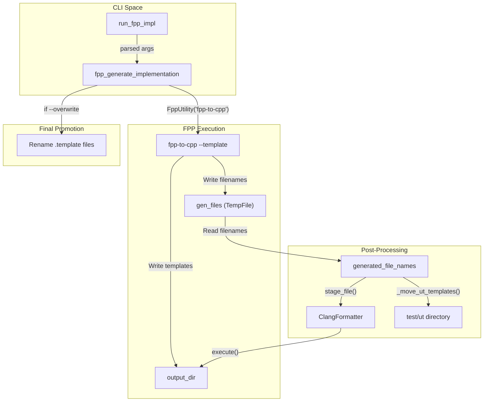
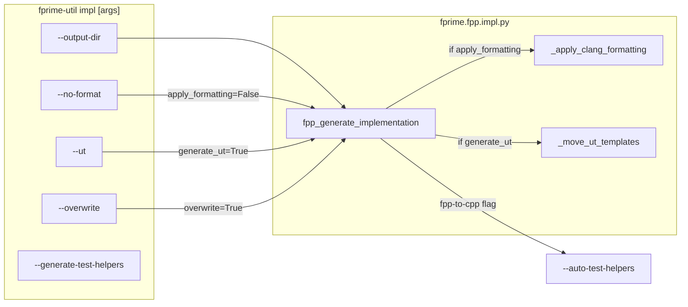

# Page: Implementation Generation: fprime-util impl

# Implementation Generation: fprime-util impl

Relevant source files

The following files were used as context for generating this wiki page:

- [src/fprime/common/models/serialize/__init__.py](src/fprime/common/models/serialize/__init__.py)
- [src/fprime/constants.py](src/fprime/constants.py)
- [src/fprime/fpp/cli.py](src/fprime/fpp/cli.py)
- [src/fprime/fpp/common.py](src/fprime/fpp/common.py)
- [src/fprime/fpp/impl.py](src/fprime/fpp/impl.py)
- [src/fprime/fpp/visualize.py](src/fprime/fpp/visualize.py)
- [src/fprime/util/code_formatter.py](src/fprime/util/code_formatter.py)

The `fprime-util impl` command is a specialized wrapper around the `fpp-to-cpp` utility. Its primary purpose is to generate C++ implementation templates (`.hpp` and `.cpp` files) and Unit Test (UT) templates from FPP models. This tool automates the boilerplate creation process for F´ components, ensuring that the hand-coded implementation matches the generated autocode interfaces.

## The fpp_generate_implementation Pipeline

The core logic resides in the `fpp_generate_implementation` function, which orchestrates path resolution, FPP utility execution, file management, and post-processing.

### 1. Path Prefix Resolution
To ensure that `fpp-to-cpp` can resolve include paths correctly across different library locations and the framework, a list of `prefixes` is constructed. These prefixes are passed to the `--path-prefixes` flag of the FPP utility.

The resolution order for prefixes is:
1. `framework_path` (from settings) [[src/fprime/fpp/impl.py:99-99]()]
2. `library_locations` (from settings) [[src/fprime/fpp/impl.py:100-100]()]
3. `project_root` (from settings) [[src/fprime/fpp/impl.py:101-101]()]
4. `build_dir / "F-Prime"` [[src/fprime/fpp/impl.py:102-102]()]
5. `build_dir` [[src/fprime/fpp/impl.py:103-103]()]

### 2. FPP-to-CPP Invocation
The tool invokes `fpp-to-cpp` using the `FppUtility` base class with `imports_as_sources=False` [[src/fprime/fpp/impl.py:112-112]()]. It uses several key flags:
*   `--template`: Instructs the tool to generate implementation templates rather than autocode [[src/fprime/fpp/impl.py:118-118]()].
*   `--names`: Directs FPP to write the names of all generated files into a temporary file [[src/fprime/fpp/impl.py:121-122]()]. This allows `fprime-util` to track and process the files (e.g., for formatting or moving) without knowing their names beforehand.
*   `--unit-test`: Optional flag to generate UT templates [[src/fprime/fpp/impl.py:119-119]()].

### 3. Implementation Data Flow
The following diagram illustrates how the `fpp_generate_implementation` function coordinates data between the CLI, the FPP toolchain, and the filesystem.

**Data Flow: Implementation Generation**

**Sources:** [[src/fprime/fpp/impl.py:76-149]()], [[src/fprime/fpp/impl.py:152-177]()]

## ClangFormatter Integration

If enabled (default), the tool automatically formats generated files using `clang-format`.

*   **Discovery**: It looks for a `.clang-format` file at the root of the framework path [[src/fprime/fpp/impl.py:38-39]()].
*   **Execution**: The `ClangFormatter` class (an `ExecutableAction`) stages the files identified by the `--names` flag [[src/fprime/fpp/impl.py:42-43]()].
*   **Parameters**: It executes with `-i` (in-place edit) and `--style=file` [[src/fprime/util/code_formatter.py:120-121]()].

**Sources:** [[src/fprime/fpp/impl.py:23-49]()], [[src/fprime/util/code_formatter.py:32-135]()]

## UT Template Organization

When the `--ut` flag is provided, the tool performs specific organization for Unit Test files.

1.  **Directory Creation**: It creates a directory based on `UT_FILES_TARGET_PATH`, which defaults to `test/ut` [[src/fprime/fpp/impl.py:61-62]()], [[src/fprime/constants.py:14-14]()].
2.  **File Renaming**: It appends `UT_TEMPLATE_FILE_SUFFIX` (`.template`) to the filename if not already present [[src/fprime/fpp/impl.py:67-71]()], [[src/fprime/constants.py:8-8]()].
3.  **Relocation**: The files are moved from the initial `output_dir` into the `test/ut` subdirectory [[src/fprime/fpp/impl.py:73-73]()].

**Sources:** [[src/fprime/fpp/impl.py:51-74]()], [[src/fprime/constants.py:1-15]()]

## Overwrite and Promotion Logic

By default, `fpp-to-cpp` generates files with a `.template` extension (e.g., `Component.template.cpp`) to prevent accidental overwriting of existing hand-coded logic.

The `--overwrite` flag triggers a promotion logic:
1.  It uses `glob` to find all `*.template.*pp` files in the output directory [[src/fprime/fpp/impl.py:144-144]()].
2.  It renames these files by removing the `.template` string, effectively overwriting any existing implementation files with the fresh templates [[src/fprime/fpp/impl.py:146-147]()].

**Sources:** [[src/fprime/fpp/impl.py:143-147]()]

## Entity Mapping: CLI to Code

The following diagram maps the CLI arguments to the internal Python functions and FPP flags they control.

**CLI to Code Mapping**

**Sources:** [[src/fprime/fpp/impl.py:152-177]()], [[src/fprime/fpp/impl.py:180-225]()]

## Summary of Key Functions

| Function | File | Role |
| :--- | :--- | :--- |
| `run_fpp_impl` | `src/fprime/fpp/impl.py` | CLI entry point; extracts arguments from `argparse.Namespace`. |
| `fpp_generate_implementation` | `src/fprime/fpp/impl.py` | Orchestrates the full generation, formatting, and moving pipeline. |
| `_apply_clang_formatting` | `src/fprime/fpp/impl.py` | Helper that initializes `ClangFormatter` and processes generated files. |
| `_move_ut_templates` | `src/fprime/fpp/impl.py` | Handles relocation of UT files to the `test/ut` directory. |
| `ClangFormatter.execute` | `src/fprime/util/code_formatter.py` | Wraps the `subprocess.run` call to the system `clang-format` binary. |

**Sources:** [[src/fprime/fpp/impl.py:1-225]()], [[src/fprime/util/code_formatter.py:32-135]()]
