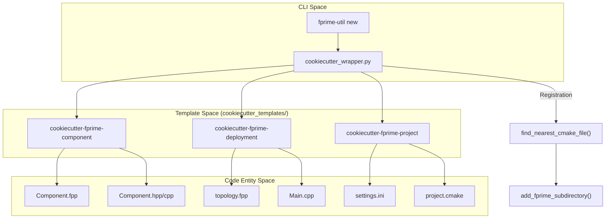

# Page: Project Scaffolding: cookiecutter Templates

# Project Scaffolding: cookiecutter Templates

Relevant source files

The following files were used as context for generating this wiki page:

- [src/fprime/common/utils.py](src/fprime/common/utils.py)
- [src/fprime/cookiecutter_templates/cookiecutter-fprime-component/cookiecutter.json](src/fprime/cookiecutter_templates/cookiecutter-fprime-component/cookiecutter.json)
- [src/fprime/cookiecutter_templates/cookiecutter-fprime-component/hooks/pre_gen_project.py](src/fprime/cookiecutter_templates/cookiecutter-fprime-component/hooks/pre_gen_project.py)
- [src/fprime/cookiecutter_templates/cookiecutter-fprime-component/{{cookiecutter.component_name}}/docs/sdd.md](src/fprime/cookiecutter_templates/cookiecutter-fprime-component/{{cookiecutter.component_name}}/docs/sdd.md)
- [src/fprime/cookiecutter_templates/cookiecutter-fprime-component/{{cookiecutter.component_name}}/{{cookiecutter.component_name}}.cpp](src/fprime/cookiecutter_templates/cookiecutter-fprime-component/{{cookiecutter.component_name}}/{{cookiecutter.component_name}}.cpp)
- [src/fprime/cookiecutter_templates/cookiecutter-fprime-component/{{cookiecutter.component_name}}/{{cookiecutter.component_name}}.hpp](src/fprime/cookiecutter_templates/cookiecutter-fprime-component/{{cookiecutter.component_name}}/{{cookiecutter.component_name}}.hpp)
- [src/fprime/util/cookiecutter_wrapper.py](src/fprime/util/cookiecutter_wrapper.py)

The F´ framework utilizes `cookiecutter` templates to provide a robust scaffolding system for creating new architectural units. This system ensures that new components, deployments, subtopologies, and projects follow the prescribed directory structure and boilerplate requirements of the F´ ecosystem. The orchestration of these templates is managed by `fprime-util` via the `cookiecutter_wrapper.py` module.

### Scaffolding Architecture

The scaffolding system bridges the gap between a user's conceptual design (e.g., "I need an active component with telemetry") and the physical file structure required by the F´ build system. When a user executes a `new` command, the `cookiecutter_wrapper.py` fetches the appropriate template, prompts for configuration variables, and then automatically registers the new unit with the nearest CMake build file.

**Scaffolding Flow: Command to Code**

Sources: [src/fprime/util/cookiecutter_wrapper.py:89-149](), [src/fprime/util/cookiecutter_wrapper.py:165-200]()

---

### Component and Module Templates
The component template allows developers to scaffold Active, Passive, or Queued components. It utilizes a `cookiecutter.json` file to define variables such as `component_kind` and toggles for standard F´ features like commands, telemetry, events, and parameters. 

- **Validation**: Uses `pre_gen_project.py` hooks to ensure naming conventions (no spaces or special characters) are met before generation.
- **Standardization**: Every component includes a Software Design Document (SDD) template in `docs/sdd.md`.
- **Implementation**: After directory creation, the system can automatically run `fpp_generate_implementation` to produce initial C++ headers and source files.

For details, see [Component and Module Templates](#5.1).

Sources: [src/fprime/cookiecutter_templates/cookiecutter-fprime-component/cookiecutter.json:1-20](), [src/fprime/cookiecutter_templates/cookiecutter-fprime-component/hooks/pre_gen_project.py:1-8](), [src/fprime/util/cookiecutter_wrapper.py:24-40]()

---

### Deployment Template
The deployment template creates the top-level executable environment for an F´ application. It sets up the necessary boilerplate for the topology lifecycle, including `setupTopology`, `startRateGroups`, and `teardownTopology`. It also generates the GDS configuration (`fprime-gds.yml`) and packet definitions required for ground station communication.

For details, see [Deployment Template](#5.2).

Sources: [src/fprime/util/cookiecutter_wrapper.py:165-187]()

---

### Subtopology Template
Subtopologies allow for modularizing complex topologies into reusable FPP models. The subtopology template generates the required FPP model files, configuration headers (`TopologyDefs.hpp`), and the necessary `CMakeLists.txt` to include the subtopology in a larger deployment.

For details, see [Subtopology Template](#5.3).

---

### Project Template and CMake Registration
The project template provides the root structure for a new F´ repository, including the `settings.ini` file and the `project.cmake` entry point. A critical feature of the scaffolding system is the **Automatic Registration** mechanism.

- **Discovery**: The `find_nearest_cmake_file` function searches upward from the new unit's location to find the appropriate `CMakeLists.txt` or `project.cmake`.
- **Registration**: Once found, the wrapper uses `add_fprime_subdirectory` to register the new component or module into the build graph automatically.
- **Safety**: The `check_path_is_within_fprime_module` function prevents users from accidentally nesting components within other components, maintaining a clean architectural hierarchy.

**CMake Discovery Logic**

| Priority | Target File | Search Context |
| :--- | :--- | :--- |
| 1 | `CMakeLists.txt` | Closest parent of the new component |
| 2 | `project.cmake` | Project root directory |
| 3 | `CMakeLists.txt` | Deployment parent directory |

For details, see [Project Template and CMake Registration](#5.4).

Sources: [src/fprime/util/cookiecutter_wrapper.py:54-86](), [src/fprime/common/utils.py:31-61](), [src/fprime/util/cookiecutter_wrapper.py:136-140]()
