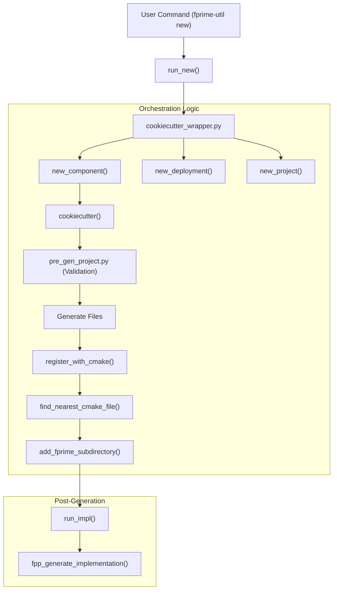
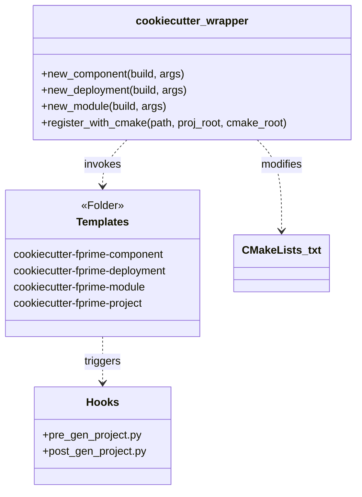

# Page: Project Template and CMake Registration

# Project Template and CMake Registration

Relevant source files

The following files were used as context for generating this wiki page:

- [src/fprime/common/utils.py](src/fprime/common/utils.py)
- [src/fprime/cookiecutter_templates/cookiecutter-fprime-deployment/hooks/pre_gen_project.py](src/fprime/cookiecutter_templates/cookiecutter-fprime-deployment/hooks/pre_gen_project.py)
- [src/fprime/cookiecutter_templates/cookiecutter-fprime-module/hooks/pre_gen_project.py](src/fprime/cookiecutter_templates/cookiecutter-fprime-module/hooks/pre_gen_project.py)
- [src/fprime/util/cookiecutter_wrapper.py](src/fprime/util/cookiecutter_wrapper.py)

This page documents the project scaffolding system in `fprime-tools`, specifically the `cookiecutter-fprime-project` template and the orchestration logic that manages the creation and registration of F´ architectural units (Components, Deployments, Subtopologies, and Modules) within the CMake build system.

## Overview of Project Scaffolding

F´ uses `cookiecutter` to provide standardized templates for new projects and their constituent parts. The `cookiecutter_wrapper.py` module serves as the primary orchestrator, handling template selection, context variable injection, and post-generation tasks such as CMake registration and initial code implementation generation.

### Orchestration Flow

The following diagram illustrates the data flow from a user command to the final registered entity.

**Scaffolding and Registration Pipeline**

Sources: [src/fprime/util/cookiecutter_wrapper.py:89-165](), [src/fprime/util/cookiecutter_wrapper.py:230-245]()

## The Project Template

The `cookiecutter-fprime-project` template provides the foundation for an F´ application. It includes:
*   **`CMakeLists.txt`**: The entry point for the CMake build system.
*   **`project.cmake`**: Defines project-specific CMake settings and toolchain configurations.
*   **`settings.ini`**: The configuration file for `fprime-util`, defining the project root and framework location [src/fprime/util/cookiecutter_wrapper.py:103-112]().
*   **`Components/`**: A default scaffold directory for housing application components.

## CMake Discovery and Registration

A critical feature of the scaffolding system is the automatic registration of new modules into the existing build hierarchy. This is handled by `register_with_cmake` and its helper functions.

### Discovery Algorithm: `find_nearest_cmake_file`

The `find_nearest_cmake_file` function implements a recursive search to identify where a new component or module should be registered. It prioritizes local `CMakeLists.txt` files over the global `project.cmake` [src/fprime/util/cookiecutter_wrapper.py:54-86]().

1.  **Local Search**: It starts at the parent directory of the new component and moves upward until it reaches the project root.
2.  **File Preference**: In each directory, it looks for `project.cmake` first, then `CMakeLists.txt` [src/fprime/util/cookiecutter_wrapper.py:79-84]().
3.  **Deployment Fallback**: If no file is found in the component's path, it performs the same search starting from the deployment directory [src/fprime/util/cookiecutter_wrapper.py:77-78]().

### Registration: `add_fprime_subdirectory`

Once the nearest CMake file is found, `register_with_cmake` appends the new directory to the build system using the `add_fprime_subdirectory` CMake macro [src/fprime/util/cookiecutter_wrapper.py:230-245]().

| Function | Role | Implementation Detail |
| :--- | :--- | :--- |
| `register_with_cmake` | Entry point for registration | Resolves relative paths and calls `add_fprime_subdirectory` [src/fprime/util/cookiecutter_wrapper.py:230-234]() |
| `add_fprime_subdirectory` | String manipulation | Appends `add_fprime_subdirectory("${CMAKE_CURRENT_LIST_DIR}/<path>")` to the target file [src/fprime/util/cookiecutter_wrapper.py:241-244]() |
| `check_path_is_within_fprime_module` | Safety Check | Scans `CMakeLists.txt` for `register_fprime_module` to prevent nested components [src/fprime/common/utils.py:31-61]() |

Sources: [src/fprime/util/cookiecutter_wrapper.py:54-86](), [src/fprime/util/cookiecutter_wrapper.py:230-245](), [src/fprime/common/utils.py:31-61]()

## Orchestration Functions

The `cookiecutter_wrapper.py` defines several "new" functions that map to `fprime-util` subcommands.

### `new_component`
Creates a new F´ component. It determines the `component_namespace` based on the current working directory. If the user is inside a directory named `Components`, it uses the parent directory name as the namespace [src/fprime/util/cookiecutter_wrapper.py:120-127](). After generation, it triggers `run_impl` to create the initial C++ implementation files from FPP [src/fprime/util/cookiecutter_wrapper.py:142-146]().

### `new_deployment`
Creates a new deployment. It enforces a rule that deployments cannot be created within existing components or deployments to maintain a clean architectural hierarchy [src/fprime/util/cookiecutter_wrapper.py:168-172](). It also calculates the `__include_path_prefix` relative to the project root to ensure correct header inclusion [src/fprime/util/cookiecutter_wrapper.py:190-192]().

### `new_module`
Used for generic C++ modules that are not full F´ components. It follows the same registration logic but uses the `cookiecutter-fprime-module` template [src/fprime/util/cookiecutter_wrapper.py:204-228]().

**Entity Mapping: Python to Template**

Sources: [src/fprime/util/cookiecutter_wrapper.py:89-228](), [src/fprime/cookiecutter_templates/cookiecutter-fprime-module/hooks/pre_gen_project.py:1-9]()

## Implementation Generation (`run_impl`)

For components and deployments, the scaffolding process is not complete until the FPP models are translated into C++ boilerplate.

The `run_impl` function [src/fprime/util/cookiecutter_wrapper.py:24-40]():
1.  Prompts the user for confirmation [src/fprime/util/cookiecutter_wrapper.py:26-27]().
2.  Wraps the call in `suppress_stdout()` to keep the CLI output clean [src/fprime/util/cookiecutter_wrapper.py:30-40]().
3.  Calls `fpp_generate_implementation` with `apply_formatting=True` and `overwrite=True` to ensure the initial files match the project's style guidelines [src/fprime/util/cookiecutter_wrapper.py:31-38]().

Sources: [src/fprime/util/cookiecutter_wrapper.py:24-51]()
