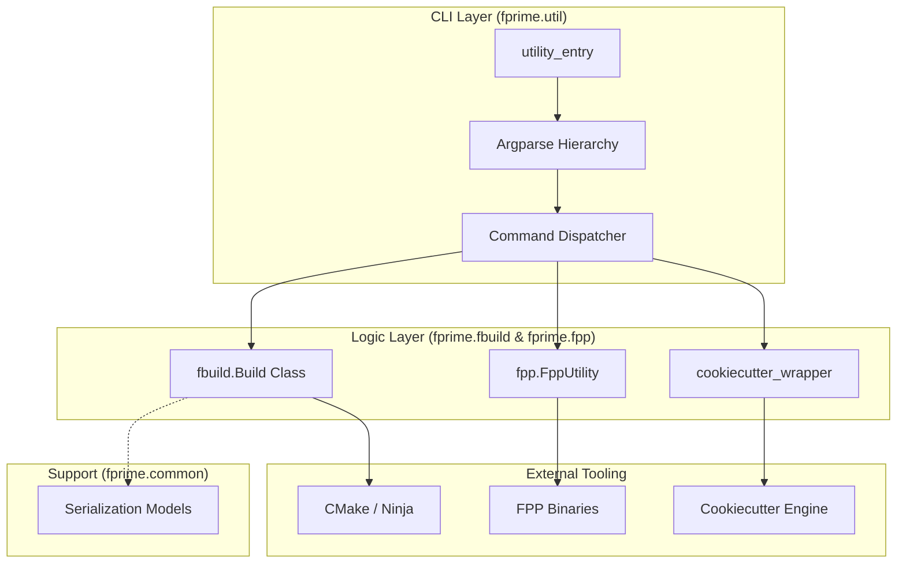
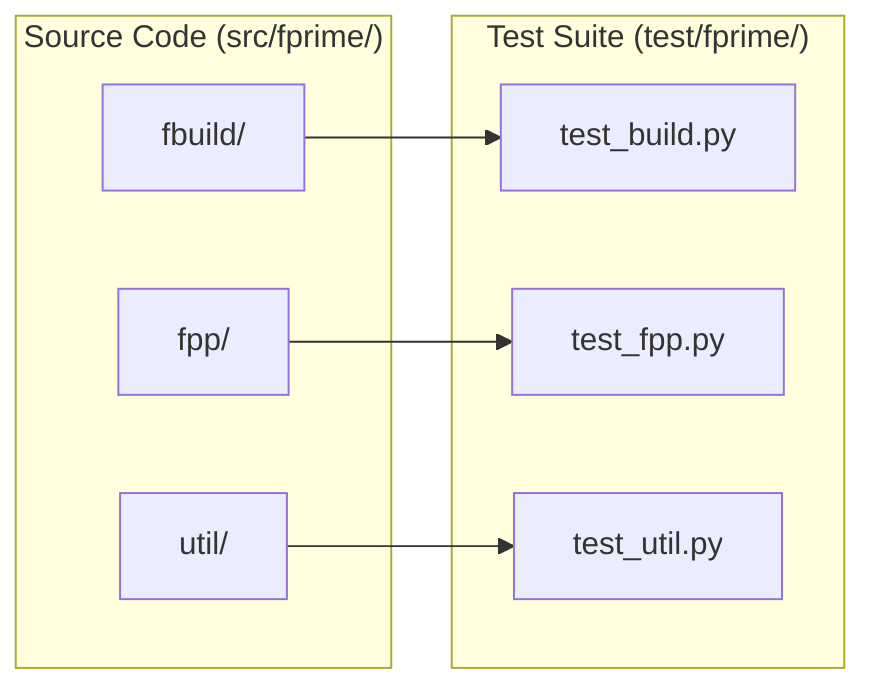

# Page: Repository Layout

# Repository Layout

Relevant source files

The following files were used as context for generating this wiki page:

- [.gitignore](.gitignore)
- [LICENSE.txt](LICENSE.txt)
- [NOTICE.txt](NOTICE.txt)
- [README.md](README.md)
- [docs/_static/css/rtd_width.css](docs/_static/css/rtd_width.css)
- [docs/conf.py](docs/conf.py)
- [docs/gendoc.bash](docs/gendoc.bash)
- [docs/index.rst](docs/index.rst)
- [pylama.cfg](pylama.cfg)
- [src/fprime/__init__.py](src/fprime/__init__.py)
- [src/fprime/common/__init__.py](src/fprime/common/__init__.py)
- [src/fprime/common/models/__init__.py](src/fprime/common/models/__init__.py)

This page provides a detailed technical overview of the `fprime-tools` directory structure. The repository is organized to separate core logic, scaffolding templates, testing infrastructure, and documentation, following a standard Python `src` layout.

## High-Level Directory Structure

The repository is divided into four primary top-level areas:
1.  `src/`: Contains the `fprime` package, housing all functional code for build management, FPP integration, and utility commands.
2.  `test/`: Contains the pytest-based test suite and associated data fixtures.
3.  `docs/`: Contains the Sphinx documentation source and configuration.
4.  `.github/`: Contains CI/CD workflow definitions and GitHub-specific configurations.

### Root Configuration Files
The root directory contains project-wide configuration files for linting, licensing, and installation.
*   `pylama.cfg`: Configures the Pylama linter, specifically setting up `pylint`, `pyflakes`, and `radon` [pylama.cfg:1-22](). It defines global skips for directories like `Ref/` and `Autocoders/` [pylama.cfg:6-6]().
*   `README.md`: Provides installation instructions and developer setup guides, including the use of the `-e` flag for editable installs [README.md:1-47]().
*   `LICENSE.txt` and `NOTICE.txt`: Apache 2.0 license terms and Caltech copyright notices [LICENSE.txt:1-6]() [NOTICE.txt:1-24]().

---

## The `src/fprime/` Package

The `src/fprime/` directory is the core of the repository. It is structured into subsystems that handle specific aspects of the F´ development lifecycle.

### Subsystem Mapping

| Directory | Subsystem | Responsibility |
| :--- | :--- | :--- |
| `fbuild/` | Build System | Python abstraction over CMake; manages build caches and target execution. |
| `fpp/` | FPP Integration | Wrappers for FPP tools (check, locate, layout) and implementation generation. |
| `util/` | CLI & Utilities | Entry points for `fprime-util`, argument parsing, and miscellaneous helpers. |
| `common/` | Compatibility | Serialization models and shims for GDS compatibility. |
| `cookiecutter_templates/` | Scaffolding | Jinja2/Cookiecutter templates for creating new components, modules, and projects. |

### Data Flow and Component Interaction

The following diagram illustrates how the different subsystems in `src/fprime/` interact when a user executes a command via `fprime-util`.

**System Architecture and Data Flow**

**Sources:** [docs/index.rst:9-12](), [docs/conf.py:88-88]()

---

## Documentation and Testing

### `docs/` - Documentation Suite
The documentation is built using Sphinx and is configured to automatically generate API references from the source code.
*   `conf.py`: Configures Sphinx extensions including `autodoc`, `napoleon` (for Google/NumPy style docstrings), and `sphinxcontrib.mermaid` [docs/conf.py:38-52](). It dynamically pulls project metadata using `importlib.metadata` [docs/conf.py:18-33]().
*   `index.rst`: The main entry point for the documentation tree [docs/index.rst:1-28]().
*   `gendoc.bash`: A utility script to trigger the `sphinx-build` process and output HTML to a specific directory [docs/gendoc.bash:1-7]().
*   `_static/css/rtd_width.css`: Custom CSS to override the default ReadTheDocs theme width for better table readability [docs/_static/css/rtd_width.css:1-20]().

### `test/` - Verification Suite
The testing infrastructure mirrors the `src` structure to ensure comprehensive coverage.
*   **Unit Tests**: Located in `test/fprime/`, these tests target specific classes and functions in `fbuild`, `fpp`, and `util`.
*   **Integration Tests**: Validates the interaction between `fprime-tools` and the core F´ framework (often using the `Ref` application).
*   **Data Fixtures**: Directories like `test/fprime/fbuild/cmake-data` provide static CMake outputs used to mock build system behavior during testing.

**Source Code to Test Mapping**

**Sources:** [.gitignore:54-54](), [pylama.cfg:6-6]()

---

## Build and Environment Artifacts
The repository uses `.gitignore` to manage build artifacts and environment-specific files, ensuring they are not committed to version control.
*   **Python Artifacts**: `*.pyc`, `__pycache__`, `.eggs`, and `fprime_tools.egg-info` [.gitignore:3-3, 49-50]().
*   **Build Directories**: `/build/` and various binary outputs like `*-bin` [.gitignore:8-8, 46-46]().
*   **Virtual Environments**: `/venv/`, `/ci-venv/`, and `test/test_env` [.gitignore:47-47, 53-54]().
*   **F´ Specific Exclusions**: Generated files such as `*Ac.*` (Autocoded files), `*ComponentReport.txt`, and `Dict/` directories [.gitignore:5-6, 18-18]().

**Sources:** [.gitignore:1-54]()
