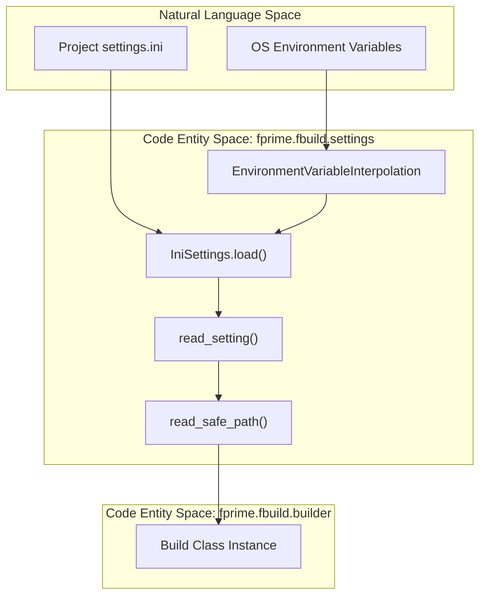
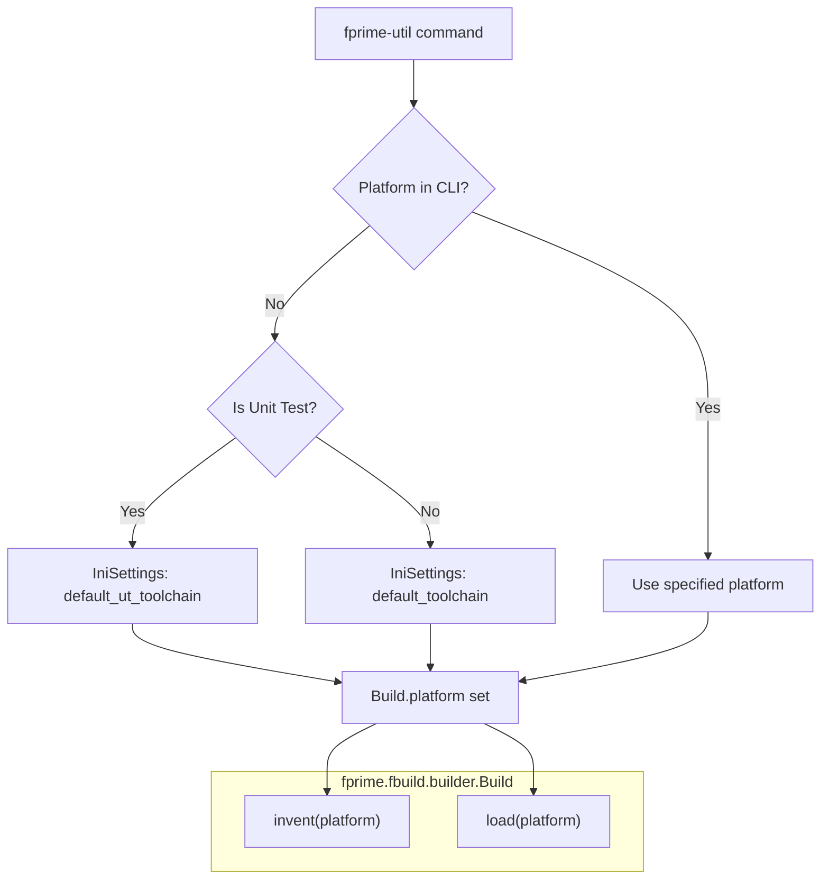

# Page: Settings and Configuration: IniSettings and settings.ini

# Settings and Configuration: IniSettings and settings.ini

Relevant source files

The following files were used as context for generating this wiki page:

- [src/fprime/fbuild/builder.py](src/fprime/fbuild/builder.py)
- [src/fprime/fbuild/settings.py](src/fprime/fbuild/settings.py)
- [test/fprime/fbuild/cmake-data/testbuild/settings.ini](test/fprime/fbuild/cmake-data/testbuild/settings.ini)
- [test/fprime/fbuild/settings-data/settings-custom-install.ini](test/fprime/fbuild/settings-data/settings-custom-install.ini)
- [test/fprime/fbuild/settings-data/settings-custom-toolchain.ini](test/fprime/fbuild/settings-data/settings-custom-toolchain.ini)
- [test/fprime/fbuild/settings-data/settings-empty.ini](test/fprime/fbuild/settings-data/settings-empty.ini)
- [test/fprime/fbuild/settings-data/settings-environment.ini](test/fprime/fbuild/settings-data/settings-environment.ini)
- [test/fprime/fbuild/settings-data/settings-multi-line-default-options.ini](test/fprime/fbuild/settings-data/settings-multi-line-default-options.ini)
- [test/fprime/fbuild/settings-data/settings-outside-cookiecutter.ini](test/fprime/fbuild/settings-data/settings-outside-cookiecutter.ini)
- [test/fprime/fbuild/test_build.py](test/fprime/fbuild/test_build.py)
- [test/fprime/fbuild/test_settings.py](test/fprime/fbuild/test_settings.py)

This section documents the configuration layer of `fprime-tools`, specifically the `IniSettings` class and the `settings.ini` file. This system allows projects to define framework locations, toolchains, library paths, and environment variables without hard-coding them into the build scripts.

## Overview of Configuration Flow

The configuration system is centered around `fprime.fbuild.settings.IniSettings`. When a `Build` object is initialized or "invented," it loads settings to determine how to interact with CMake and where to find project resources [src/fprime/fbuild/builder.py:77-96]().

### Configuration Discovery Logic
The system searches for a `settings.ini` file to populate a settings dictionary. If no file is explicitly provided, it can be specified via the `FPRIME_SETTINGS_FILE` environment variable [src/fprime/fbuild/settings.py:82]().

The following diagram illustrates how `IniSettings` bridges the gap between the physical `settings.ini` file and the `Build` object's internal state.

**Diagram: Configuration Loading Data Flow**

Sources: [src/fprime/fbuild/settings.py:19-48](), [src/fprime/fbuild/settings.py:78-187](), [src/fprime/fbuild/builder.py:67-70]()

---

## IniSettings Implementation

The `IniSettings` class uses `configparser` to process INI files. It distinguishes between global F´ fields and platform-specific overrides.

### Key Fields and Defaults
Settings are categorized into two lists:
1.  **FPRIME_FIELDS**: Core project settings [src/fprime/fbuild/settings.py:84-92]().
2.  **PLATFORM_FIELDS**: Settings that can vary based on the target (e.g., `native`, `raspberrypi`) [src/fprime/fbuild/settings.py:94-111]().

| Field | Type | Default / Discovery Logic |
| :--- | :--- | :--- |
| `framework_path` | `PATH` | `find_fprime()` (recursively searches for `fprime/cmake/FPrime.cmake`) |
| `project_root` | `PATH` | Defaults to `framework_path` |
| `default_toolchain` | `STRING` | `native` |
| `library_locations` | `PATH_LIST` | Empty list `[]` |
| `config_directory` | `PATH` | `{framework_path}/config` |
| `install_destination` | `PATH` | `{project_root}/build-artifacts` |

Sources: [src/fprime/fbuild/settings.py:58-70](), [src/fprime/fbuild/settings.py:84-111]()

### Environment Variable Interpolation
The class `EnvironmentVariableInterpolation` enables the use of `$VAR` or `${VAR}` syntax within the `[environment]` section of `settings.ini` [src/fprime/fbuild/settings.py:19-29]().
*   **Scope**: Substitution is strictly limited to the `[environment]` section to prevent accidental recursion [src/fprime/fbuild/settings.py:47]().
*   **Mechanism**: It utilizes `os.path.expandvars` during the `before_get` hook of the config parser [src/fprime/fbuild/settings.py:31-47]().

### Path Validation and Resolution
Paths in `settings.ini` are handled by `read_safe_path`:
*   **Relative Paths**: Resolved relative to the directory containing the `settings.ini` file [src/fprime/fbuild/settings.py:132-138]().
*   **Validation**: By default, it verifies that paths exist on disk, raising an `FprimeSettingsException` if a path is missing (except for `install_destination`) [src/fprime/fbuild/settings.py:139-142]().
*   **Lists**: Supports colon-separated lists for fields like `library_locations` [src/fprime/fbuild/settings.py:133]().

Sources: [src/fprime/fbuild/settings.py:114-143]()

---

## Toolchain and Platform Resolution

When a build is "invented" or "loaded," the platform (toolchain) is determined. If the user does not provide one via CLI, `Build` queries `IniSettings` for the `default_toolchain` or `default_ut_toolchain` [src/fprime/fbuild/builder.py:77-96]().

**Diagram: Toolchain Resolution Logic**

Sources: [src/fprime/fbuild/builder.py:77-117](), [src/fprime/fbuild/settings.py:87-88]()

---

## Advanced Discovery: _fprime_packages

The configuration system also interacts with `_fprime_packages`. While `settings.ini` provides explicit paths, the build system can discover external F´ libraries.

1.  **Library Discovery**: `library_locations` in `settings.ini` are passed to CMake to find external modules [src/fprime/fbuild/settings.py:89]().
2.  **Package Integration**: The `Build` class and `CMakeHandler` use these settings to resolve include locations and toolchain files [src/fprime/fbuild/builder.py:147-167]().

### Platform-Specific Overrides
`IniSettings` allows sections named after specific platforms (e.g., `[raspberrypi]`) to override global settings in the `[fprime]` section. This is handled by passing the `platform` argument to `IniSettings.load`, which then prioritizes the platform-specific section for `PLATFORM_FIELDS` [src/fprime/fbuild/settings.py:187-210]().

Sources: [src/fprime/fbuild/settings.py:94-111](), [src/fprime/fbuild/settings.py:187-210]()
