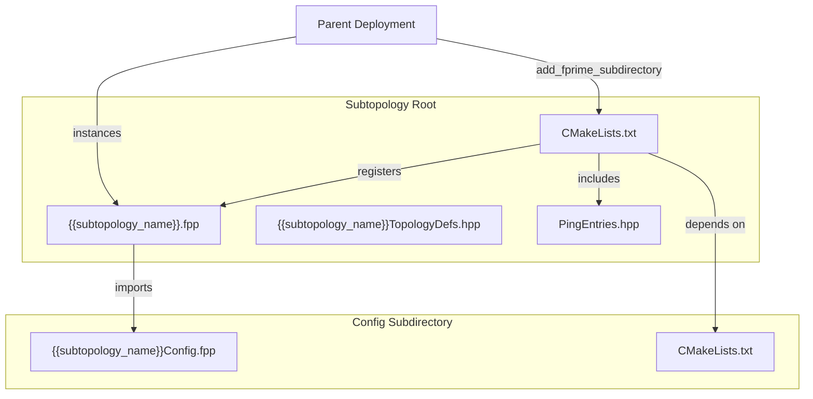
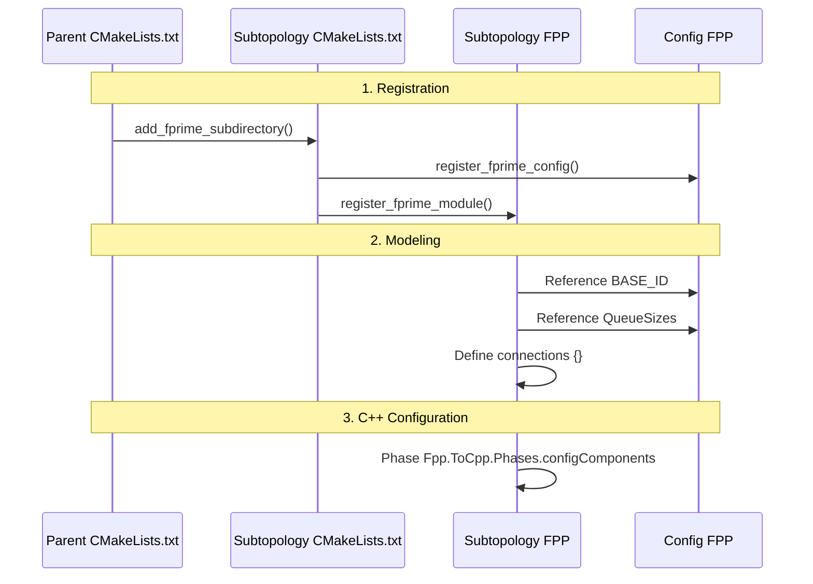

# Page: Subtopology Template

# Subtopology Template

Relevant source files

The following files were used as context for generating this wiki page:

- [src/fprime/cookiecutter_templates/cookiecutter-fprime-subtopology/cookiecutter.json](src/fprime/cookiecutter_templates/cookiecutter-fprime-subtopology/cookiecutter.json)
- [src/fprime/cookiecutter_templates/cookiecutter-fprime-subtopology/hooks/pre_gen_project.py](src/fprime/cookiecutter_templates/cookiecutter-fprime-subtopology/hooks/pre_gen_project.py)
- [src/fprime/cookiecutter_templates/cookiecutter-fprime-subtopology/{{cookiecutter.subtopology_name}}/CMakeLists.txt](src/fprime/cookiecutter_templates/cookiecutter-fprime-subtopology/{{cookiecutter.subtopology_name}}/CMakeLists.txt)
- [src/fprime/cookiecutter_templates/cookiecutter-fprime-subtopology/{{cookiecutter.subtopology_name}}/PingEntries.hpp](src/fprime/cookiecutter_templates/cookiecutter-fprime-subtopology/{{cookiecutter.subtopology_name}}/PingEntries.hpp)
- [src/fprime/cookiecutter_templates/cookiecutter-fprime-subtopology/{{cookiecutter.subtopology_name}}/TODO.md](src/fprime/cookiecutter_templates/cookiecutter-fprime-subtopology/{{cookiecutter.subtopology_name}}/TODO.md)
- [src/fprime/cookiecutter_templates/cookiecutter-fprime-subtopology/{{cookiecutter.subtopology_name}}/{{cookiecutter.subtopology_name}}.fpp](src/fprime/cookiecutter_templates/cookiecutter-fprime-subtopology/{{cookiecutter.subtopology_name}}/{{cookiecutter.subtopology_name}}.fpp)
- [src/fprime/cookiecutter_templates/cookiecutter-fprime-subtopology/{{cookiecutter.subtopology_name}}/{{cookiecutter.subtopology_name}}Config/CMakeLists.txt](src/fprime/cookiecutter_templates/cookiecutter-fprime-subtopology/{{cookiecutter.subtopology_name}}/{{cookiecutter.subtopology_name}}Config/CMakeLists.txt)
- [src/fprime/cookiecutter_templates/cookiecutter-fprime-subtopology/{{cookiecutter.subtopology_name}}/{{cookiecutter.subtopology_name}}Config/{{cookiecutter.subtopology_name}}Config.fpp](src/fprime/cookiecutter_templates/cookiecutter-fprime-subtopology/{{cookiecutter.subtopology_name}}/{{cookiecutter.subtopology_name}}Config/{{cookiecutter.subtopology_name}}Config.fpp)
- [src/fprime/cookiecutter_templates/cookiecutter-fprime-subtopology/{{cookiecutter.subtopology_name}}/{{cookiecutter.subtopology_name}}TopologyDefs.hpp](src/fprime/cookiecutter_templates/cookiecutter-fprime-subtopology/{{cookiecutter.subtopology_name}}/{{cookiecutter.subtopology_name}}TopologyDefs.hpp)

The **Subtopology Template** provides a standardized scaffolding for creating F´ subtopologies. Subtopologies are modular architectural units that group component instances, connections, and configurations, allowing them to be reused across different deployments or to organize complex topologies into manageable sections.

## Overview and Purpose

The template, located in `src/fprime/cookiecutter_templates/cookiecutter-fprime-subtopology/`, automates the creation of a subtopology directory containing FPP models, configuration files, and C++ headers. It ensures that subtopologies follow the F´ "Phase" pattern for initialization and provides a dedicated configuration module for managing Base IDs, stack sizes, and priorities.

### Template Variables
The template uses several `cookiecutter.json` variables to customize the generated files:
* `subtopology_name`: The primary name of the subtopology (e.g., `CdhCore`). [src/fprime/cookiecutter_templates/cookiecutter-fprime-subtopology/cookiecutter.json:2-2]()
* `subtopology_desc`: A brief description used as an FPP annotation. [src/fprime/cookiecutter_templates/cookiecutter-fprime-subtopology/cookiecutter.json:3-3]()
* `base_id`: The starting ID for component instances within this subtopology, typically provided in hex (e.g., `0x10800000`). [src/fprime/cookiecutter_templates/cookiecutter-fprime-subtopology/cookiecutter.json:4-4]()

### Pre-generation Validation
Before files are written, a `pre_gen_project.py` hook executes to validate the `subtopology_name`. It calls `fprime.util.cookiecutter_wrapper.is_valid_name` to ensure the name contains no spaces or special characters that would break C++ or FPP compilation. [src/fprime/cookiecutter_templates/cookiecutter-fprime-subtopology/hooks/pre_gen_project.py:1-9]()

## Structure and Implementation

A generated subtopology consists of two main directories: the root subtopology directory and a nested `Config` directory.

### Subtopology Logic (`.fpp`)
The main FPP file defines the instances and the topology itself. It utilizes the F´ Phase pattern (`Fpp.ToCpp.Phases.configComponents`) to allow inline C++ configuration of components within the modeling language. [src/fprime/cookiecutter_templates/cookiecutter-fprime-subtopology/{{cookiecutter.subtopology_name}}/{{cookiecutter.subtopology_name}}.fpp:12-17]()

### Configuration Module (`Config.fpp`)
The configuration module acts as a central repository for constants that define the subtopology's resource requirements. This separates the architectural definition (instances/connections) from the deployment-specific tuning (queue sizes/priorities). [src/fprime/cookiecutter_templates/cookiecutter-fprime-subtopology/{{cookiecutter.subtopology_name}}/{{cookiecutter.subtopology_name}}Config/{{cookiecutter.subtopology_name}}Config.fpp:1-28]()

| Module | Purpose |
| :--- | :--- |
| `BASE_ID` | The anchor ID from which all component IDs are offset. |
| `QueueSizes` | Constants for active/queued component message queues. |
| `StackSizes` | Constants for active component thread stacks. |
| `Priorities` | Constants for thread scheduling priorities. |

### Data Flow and Dependency Graph

The following diagram illustrates how the subtopology components relate to each other and the parent deployment.

**Subtopology Entity Relationships**

**Sources:** [src/fprime/cookiecutter_templates/cookiecutter-fprime-subtopology/{{cookiecutter.subtopology_name}}/CMakeLists.txt:1-11](), [src/fprime/cookiecutter_templates/cookiecutter-fprime-subtopology/{{cookiecutter.subtopology_name}}/{{cookiecutter.subtopology_name}}.fpp:1-56]()

## Key Files and Components

### CMake Integration
The template uses two `CMakeLists.txt` files to register the subtopology within the F´ build system:
1. **Root CMake**: Calls `register_fprime_module`. It includes `PingEntries.hpp` as a header and declares a dependency on the internal `Config` module. [src/fprime/cookiecutter_templates/cookiecutter-fprime-subtopology/{{cookiecutter.subtopology_name}}/CMakeLists.txt:3-11]()
2. **Config CMake**: Calls `register_fprime_config` to process the `Config.fpp` file. [src/fprime/cookiecutter_templates/cookiecutter-fprime-subtopology/{{cookiecutter.subtopology_name}}/{{cookiecutter.subtopology_name}}Config/CMakeLists.txt:1-6]()

### Topology State and Health
* **`TopologyDefs.hpp`**: Defines a `struct TopologyState` and a subtopology-specific state struct. These are used to pass configuration data (like memory allocators or file paths) during the topology setup phases. [src/fprime/cookiecutter_templates/cookiecutter-fprime-subtopology/{{cookiecutter.subtopology_name}}/{{cookiecutter.subtopology_name}}TopologyDefs.hpp:4-12]()
* **`PingEntries.hpp`**: A placeholder for health monitoring thresholds (WARN/FATAL). Components within the subtopology that implement the `Ping` port should have their watchdog limits defined here. [src/fprime/cookiecutter_templates/cookiecutter-fprime-subtopology/{{cookiecutter.subtopology_name}}/PingEntries.hpp:4-7]()

## Implementation Workflow

When a user generates a subtopology, the `TODO.md` file outlines the manual integration steps required to make the subtopology functional.

**Code Entity Mapping: Subtopology Lifecycle**

**Sources:** [src/fprime/cookiecutter_templates/cookiecutter-fprime-subtopology/{{cookiecutter.subtopology_name}}/TODO.md:1-56](), [src/fprime/cookiecutter_templates/cookiecutter-fprime-subtopology/{{cookiecutter.subtopology_name}}/{{cookiecutter.subtopology_name}}.fpp:1-56]()

### Manual Customization
Users often need to extend the template for specific needs:
* **Custom Allocators**: If the subtopology requires memory management, users add `SubtopologyConfig.cpp/.hpp` and update the `Config` CMake to include them via `SOURCES` and `HEADERS`. [src/fprime/cookiecutter_templates/cookiecutter-fprime-subtopology/{{cookiecutter.subtopology_name}}/TODO.md:21-33]()
* **Additional FPP Configs**: For complex subtopologies (like communication stacks), additional FPP files (e.g., `ComDriverConfig.fpp`) are added to the `Config` directory and registered in the `AUTOCODER_INPUTS`. [src/fprime/cookiecutter_templates/cookiecutter-fprime-subtopology/{{cookiecutter.subtopology_name}}/TODO.md:35-37]()

**Sources:**
* [src/fprime/cookiecutter_templates/cookiecutter-fprime-subtopology/cookiecutter.json:1-11]()
* [src/fprime/cookiecutter_templates/cookiecutter-fprime-subtopology/hooks/pre_gen_project.py:1-9]()
* [src/fprime/cookiecutter_templates/cookiecutter-fprime-subtopology/{{cookiecutter.subtopology_name}}/CMakeLists.txt:1-11]()
* [src/fprime/cookiecutter_templates/cookiecutter-fprime-subtopology/{{cookiecutter.subtopology_name}}/PingEntries.hpp:1-10]()
* [src/fprime/cookiecutter_templates/cookiecutter-fprime-subtopology/{{cookiecutter.subtopology_name}}/TODO.md:1-56]()
* [src/fprime/cookiecutter_templates/cookiecutter-fprime-subtopology/{{cookiecutter.subtopology_name}}/{{cookiecutter.subtopology_name}}.fpp:1-56]()
* [src/fprime/cookiecutter_templates/cookiecutter-fprime-subtopology/{{cookiecutter.subtopology_name}}/{{cookiecutter.subtopology_name}}Config/CMakeLists.txt:1-7]()
* [src/fprime/cookiecutter_templates/cookiecutter-fprime-subtopology/{{cookiecutter.subtopology_name}}/{{cookiecutter.subtopology_name}}Config/{{cookiecutter.subtopology_name}}Config.fpp:1-28]()
* [src/fprime/cookiecutter_templates/cookiecutter-fprime-subtopology/{{cookiecutter.subtopology_name}}/{{cookiecutter.subtopology_name}}TopologyDefs.hpp:1-14]()
