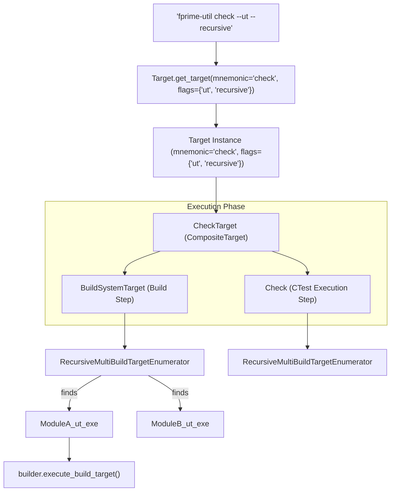
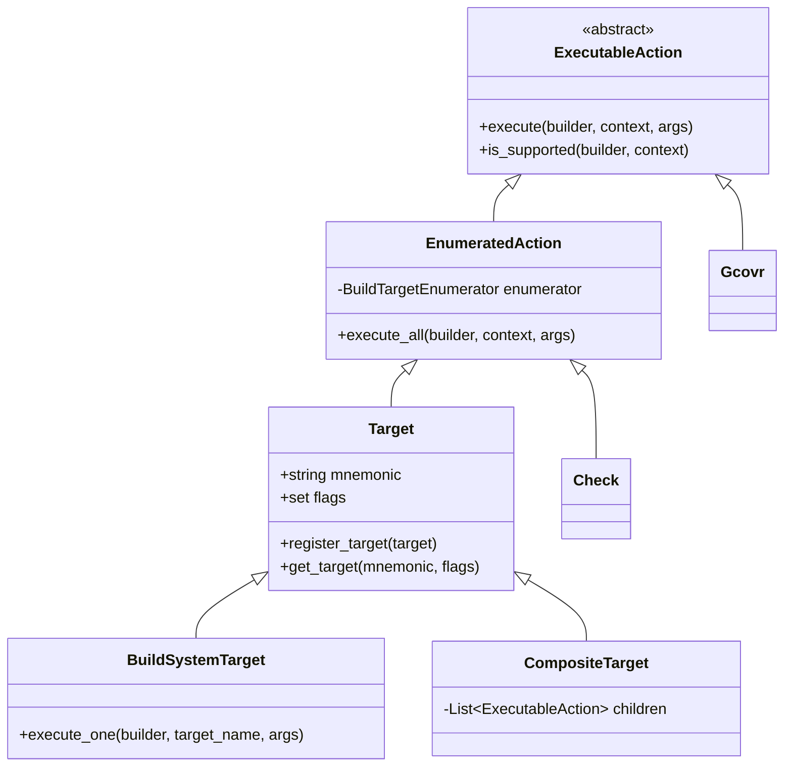

# Page: Target and Action Framework

# Target and Action Framework

<details>
<summary>Relevant source files</summary>

The following files were used as context for generating this wiki page:

- [src/fprime/fbuild/check.py](src/fprime/fbuild/check.py)
- [src/fprime/fbuild/enumerator.py](src/fprime/fbuild/enumerator.py)
- [src/fprime/fbuild/gcovr.py](src/fprime/fbuild/gcovr.py)
- [src/fprime/fbuild/target.py](src/fprime/fbuild/target.py)
- [src/fprime/fbuild/target_definitions.py](src/fprime/fbuild/target_definitions.py)
- [src/fprime/fbuild/types.py](src/fprime/fbuild/types.py)
- [test/fprime/fbuild/enumerator_data/MultiBuildTargetEnumerator/build-targets.fprime-util](test/fprime/fbuild/enumerator_data/MultiBuildTargetEnumerator/build-targets.fprime-util)
- [test/fprime/fbuild/enumerator_data/MultiBuildTargetEnumerator/tests.fprime-util](test/fprime/fbuild/enumerator_data/MultiBuildTargetEnumerator/tests.fprime-util)
- [test/fprime/fbuild/test_enumerators.py](test/fprime/fbuild/test_enumerators.py)
- [test/fprime/fbuild/test_target.py](test/fprime/fbuild/test_target.py)
- [test/fprime/fpp/test_common.py](test/fprime/fpp/test_common.py)
- [test/fprime/util/data/malformed.cpp](test/fprime/util/data/malformed.cpp)
- [test/fprime/util/data/well-formed.cpp](test/fprime/util/data/well-formed.cpp)
- [test/fprime/util/test_code_formatter.py](test/fprime/util/test_code_formatter.py)

</details>


The Target and Action Framework provides an extensible system for defining and executing build operations in `fprime-util`. It abstracts the complexity of different build systems (like CMake) and external utilities (like `gcovr` or `ctest`) into a unified interface based on mnemonics and flags.

## Core Architecture

The framework is built on a hierarchy of classes that separate the definition of a target (what the user types) from the action it performs (what the code does) and the enumeration strategy (what specific items it acts upon).

### Key Classes and Roles

| Class | Role |
| :--- | :--- |
| `ExecutableAction` | The base interface for any logic that can be executed. [src/fprime/fbuild/target.py:36-42]() |
| `EnumeratedAction` | An action that uses a `BuildTargetEnumerator` to find specific targets in a given directory context. [src/fprime/fbuild/target.py:91-99]() |
| `Target` | The primary user-facing entity. Maps a `mnemonic` (e.g., `build`) and `flags` (e.g., `ut`) to an action. [src/fprime/fbuild/target.py:167-180]() |
| `BuildSystemTarget` | A specialized target that delegates execution to the underlying build system (e.g., CMake). [src/fprime/fbuild/target.py:257-261]() |
| `CompositeTarget` | A container that executes multiple child targets in sequence. [src/fprime/fbuild/target.py:289-293]() |

### Target Scoping
Targets operate within a specific `TargetScope`:
*   **LOCAL**: Operates on the current directory context (e.g., building a single component). [src/fprime/fbuild/target.py:32]()
*   **GLOBAL**: Operates on the entire project/deployment (e.g., building the whole system). [src/fprime/fbuild/target.py:31]()
*   **BOTH**: A helper that registers both a LOCAL and a GLOBAL version of the target. [src/fprime/fbuild/target.py:33]()

### Logical Data Flow
The following diagram illustrates how a user command is dispatched through the framework entities.

**User Command to Code Entity Mapping**

Sources: [src/fprime/fbuild/target.py:167-200](), [src/fprime/fbuild/target_definitions.py:113-131](), [src/fprime/fbuild/check.py:99-125]()

## Build Target Enumeration Strategies

Enumerators determine which specific build system targets (e.g., CMake targets) should be invoked based on the current filesystem context.

*   **BasicBuildTargetEnumerator**: Converts a directory path directly into a CMake module name, optionally adding a suffix (e.g., `_ut_exe`). [src/fprime/fbuild/enumerator.py:53-66]()
*   **MultiBuildTargetEnumerator**: Reads target names from a metadata file in the build cache (typically `build-targets.fprime-util` or `tests.fprime-util`). [src/fprime/fbuild/enumerator.py:73-98]()
*   **RecursiveMultiBuildTargetEnumerator**: Traverses the build cache using `sub-directories.fprime-util` to find and aggregate targets from all sub-folders. [src/fprime/fbuild/enumerator.py:109-148]()
*   **SpecificBuildTargetEnumerator**: Always returns a hardcoded list of targets, such as `["all"]`. [src/fprime/fbuild/enumerator.py:161-173]()
*   **CliBuildTargetEnumerator**: Allows the user to specify a custom target via the `--target` CLI flag. [src/fprime/fbuild/enumerator.py:186-192]()

Sources: [src/fprime/fbuild/enumerator.py:44-200]()

## Target Registration Patterns

Targets are registered in `target_definitions.py`. This file acts as the central configuration for all `fprime-util` build behaviors.

### Registration Example: Build Local vs. Recursive
```python
# Local build: looks for targets only in the current directory
Target.register_target(
    BuildSystemTarget(
        mnemonic="build",
        desc="Build components... in current directory",
        scope=TargetScope.LOCAL,
        build_target_enumerator=MultiBuildTargetEnumerator(),
    )
)

# Recursive build: triggered by the 'recursive' flag
Target.register_target(
    BuildSystemTarget(
        mnemonic="build",
        desc="Build components... recursively",
        scope=TargetScope.LOCAL,
        flags={"recursive"},
        build_target_enumerator=RecursiveMultiBuildTargetEnumerator(),
    )
)
```
Sources: [src/fprime/fbuild/target_definitions.py:22-40]()

## Implementation Details: Composite and Executable Actions

### CheckTarget and Check Action
The `check` command is a `CompositeTarget` consisting of a `BuildSystemTarget` (to compile the code) followed by a `Check` action (to run the tests). [src/fprime/fbuild/check.py:99-125]()

The `Check` action invokes the `ctest` executable. It handles parallel execution via the `-j` flag and applies regex filtering using the targets found by its enumerator. [src/fprime/fbuild/check.py:24-96]()

### GcovrTarget
The `GcovrTarget` (triggered by `fprime-util check --coverage`) is another composite target that adds a `Gcovr` action to the pipeline. [src/fprime/fbuild/gcovr.py:187-205]()

The `Gcovr` action:
1.  Calculates exclusion filters for autocoded files (e.g., `*ComponentAc.cpp`) unless specifically included by flags like `--comp-ac`. [src/fprime/fbuild/gcovr.py:89-126]()
2.  Resolves the project root and build cache paths. [src/fprime/fbuild/gcovr.py:128-144]()
3.  Executes the `gcovr` utility to generate HTML and text reports in a `coverage/` directory. [src/fprime/fbuild/gcovr.py:151-185]()

### Implementation Class Hierarchy

Sources: [src/fprime/fbuild/target.py:36-300](), [src/fprime/fbuild/check.py:24-125](), [src/fprime/fbuild/gcovr.py:41-185]()
