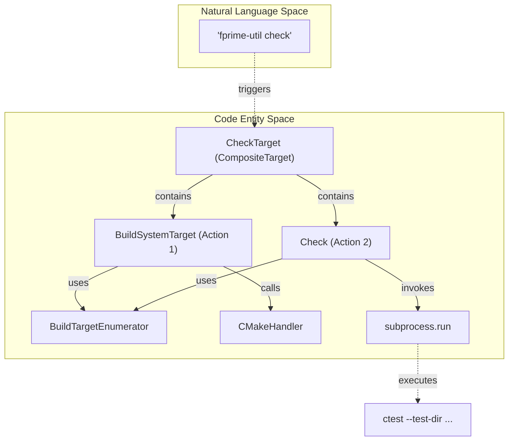
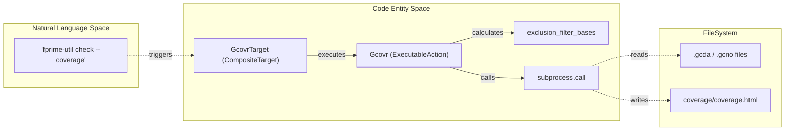

# Page: Test and Coverage Commands: check, coverage

# Test and Coverage Commands: check, coverage

Relevant source files

The following files were used as context for generating this wiki page:

- [src/fprime/fbuild/check.py](src/fprime/fbuild/check.py)
- [src/fprime/fbuild/enumerator.py](src/fprime/fbuild/enumerator.py)
- [src/fprime/fbuild/gcovr.py](src/fprime/fbuild/gcovr.py)
- [src/fprime/fbuild/target.py](src/fprime/fbuild/target.py)
- [src/fprime/fbuild/target_definitions.py](src/fprime/fbuild/target_definitions.py)
- [src/fprime/fbuild/types.py](src/fprime/fbuild/types.py)
- [test/fprime/fbuild/test_target.py](test/fprime/fbuild/test_target.py)
- [test/fprime/fpp/test_common.py](test/fprime/fpp/test_common.py)
- [test/fprime/util/test_code_formatter.py](test/fprime/util/test_code_formatter.py)

The `check` and `coverage` commands provide the primary interface for executing unit tests and analyzing code coverage within the F´ ecosystem. These commands are implemented as composite targets that orchestrate building test executables, running them via `ctest`, and optionally invoking `gcovr` for reporting [src/fprime/fbuild/target_definitions.py:90-188]().

## Check Command: CTest Integration

The `check` command is designed to build and run unit tests. It is a `CompositeTarget` consisting of two primary actions: a `BuildSystemTarget` to compile the tests and a `Check` action to execute them [src/fprime/fbuild/check.py:99-124]().

### Check Implementation and Scopes
The `Check` action wraps the `ctest` executable [src/fprime/fbuild/check.py:27](). It determines which tests to run by using a `BuildTargetEnumerator` to find test targets within the specified context [src/fprime/fbuild/check.py:24-33]().

The behavior of `check` varies based on the `TargetScope`:
*   **LOCAL**: Runs tests in the current directory only. It uses `MultiBuildTargetEnumerator` to look for a `tests.fprime-util` file in the build cache [src/fprime/fbuild/target_definitions.py:91-111]().
*   **RECURSIVE**: Triggered by the `--recursive` flag. It uses `RecursiveMultiBuildTargetEnumerator` to find and run tests in the current directory and all subdirectories [src/fprime/fbuild/target_definitions.py:113-131]().
*   **GLOBAL**: Triggered by the `--all` flag. It executes all tests registered in the entire project by targeting the `all` build target [src/fprime/fbuild/target_definitions.py:132-145]().

### CTest Execution Flow
When executed, the `Check` class constructs a `ctest` command line. If the context is specific (not "all"), it applies a regex filter using the `-R` flag to ensure only the requested tests are run [src/fprime/fbuild/check.py:85-87]().

| Flag | CTest Mapping | Description |
| :--- | :--- | :--- |
| `-j` / `--jobs` | `--parallel` | Number of concurrent test jobs [src/fprime/fbuild/check.py:72-75]() |
| (Automatic) | `--test-dir` | Points to the build directory [src/fprime/fbuild/check.py:65-66]() |
| (Verbose) | `-V` | Enabled if the builder is verbose or specific tests are targeted [src/fprime/fbuild/check.py:79-82]() |

**CTest Integration Architecture**
The following diagram shows how the `CheckTarget` bridges the CLI request to the underlying `ctest` execution.

Sources: [src/fprime/fbuild/check.py:99-124](), [src/fprime/fbuild/target_definitions.py:90-111](), [src/fprime/fbuild/check.py:63-96]()

---

## Coverage Command: Gcovr Integration

The `coverage` command (invoked via `fprime-util check --coverage`) extends the `check` workflow by adding a `Gcovr` action to the composite target [src/fprime/fbuild/target_definitions.py:148-188]().

### GcovrTarget and Exclusion Filters
The `Gcovr` class invokes the `gcovr` utility to calculate recursive coverage [src/fprime/fbuild/gcovr.py:41-50](). A critical feature of this implementation is the automatic filtering of autocoded files to ensure coverage metrics reflect manually written code.

Exclusion filters are applied based on file patterns [src/fprime/fbuild/gcovr.py:95-110]():
*   **Component Autocode**: `.*ComponentAc.[ch]pp`
*   **Port Autocode**: `.*PortAc.[ch]pp`
*   **Serializable/Array/Enum Autocode**: `.*SerializableAc.[ch]pp`, `.*ArrayAc.[ch]pp`, `.*EnumAc.[ch]pp`
*   **Test Helpers**: `.*GTestBase.[ch]pp`, `.*TesterBase.[ch]pp`

Users can override these exclusions using CLI flags:
*   `--all-sources`: Includes all files in the report [src/fprime/fbuild/gcovr.py:89]().
*   `--comp-ac`: Includes component autocode [src/fprime/fbuild/gcovr.py:90]().
*   `--test-sources`: Includes files within `test/` directories [src/fprime/fbuild/gcovr.py:94]().

### Data Flow and Output
`gcovr` is executed within the project root to ensure it can locate source files and their corresponding `.gcda`/`.gcno` artifacts in the build cache [src/fprime/fbuild/gcovr.py:151-183]().

Outputs are generated in a `coverage/` directory relative to the execution context [src/fprime/fbuild/gcovr.py:134-135]():
1.  **summary.txt**: A text-based summary of line and branch coverage [src/fprime/fbuild/gcovr.py:173]().
2.  **coverage.html**: Detailed HTML reports with line-by-line annotations [src/fprime/fbuild/gcovr.py:174-175]().

**Coverage Pipeline Logic**
The following diagram illustrates the data flow from build artifacts to the final coverage report.

Sources: [src/fprime/fbuild/gcovr.py:41-183](), [src/fprime/fbuild/target_definitions.py:148-162]()

---

## Target Enumeration Strategies

Both `check` and `coverage` rely on the `BuildTargetEnumerator` framework to discover what needs to be built or tested.

| Enumerator Class | Logic | Use Case |
| :--- | :--- | :--- |
| `MultiBuildTargetEnumerator` | Reads `tests.fprime-util` or `build-targets.fprime-util` from the build cache [src/fprime/fbuild/enumerator.py:73-85](). | Standard local `check`. |
| `RecursiveMultiBuildTargetEnumerator` | Reads `sub-directories.fprime-util` and recurses into each directory [src/fprime/fbuild/enumerator.py:109-141](). | Recursive `check --recursive`. |
| `SpecificBuildTargetEnumerator` | Returns a hardcoded list (e.g., `["all"]`) [src/fprime/fbuild/enumerator.py:161-172](). | Global `check --all`. |
| `BasicBuildTargetEnumerator` | Converts a path to a CMake module name and appends a suffix (e.g., `_ut_exe`) [src/fprime/fbuild/enumerator.py:53-67](). | Fallback when cache files are missing. |

Sources: [src/fprime/fbuild/enumerator.py:44-172](), [src/fprime/fbuild/target_definitions.py:91-131]()
