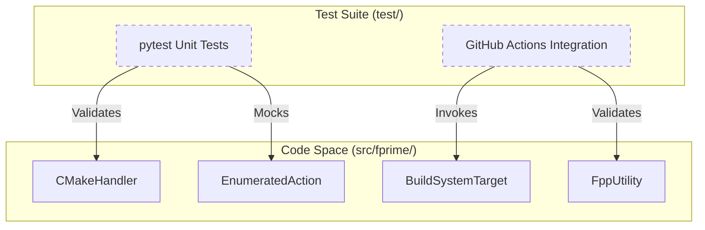
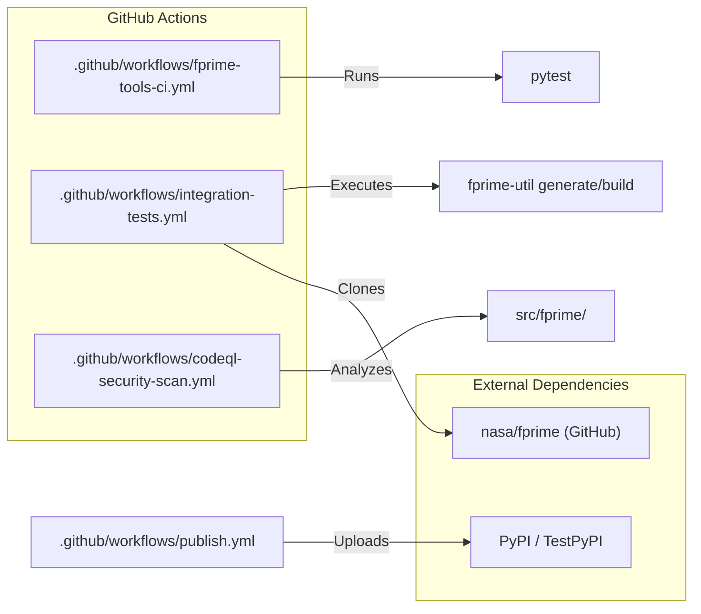

# Page: Testing Infrastructure

# Testing Infrastructure

Relevant source files

The following files were used as context for generating this wiki page:

- [.github/actions/codeql/security-pack.yml](.github/actions/codeql/security-pack.yml)
- [.github/workflows/codeql-security-scan.yml](.github/workflows/codeql-security-scan.yml)
- [.github/workflows/fprime-tools-ci.yml](.github/workflows/fprime-tools-ci.yml)
- [.github/workflows/integration-tests.yml](.github/workflows/integration-tests.yml)
- [.github/workflows/publish.yml](.github/workflows/publish.yml)
- [pyproject.toml](pyproject.toml)
- [setup.py](setup.py)
- [src/fprime/fbuild/check.py](src/fprime/fbuild/check.py)
- [src/fprime/fbuild/enumerator.py](src/fprime/fbuild/enumerator.py)
- [src/fprime/fbuild/types.py](src/fprime/fbuild/types.py)
- [test/fprime/fbuild/test_cmake.py](test/fprime/fbuild/test_cmake.py)
- [test/fprime/fbuild/test_target.py](test/fprime/fbuild/test_target.py)
- [test/fprime/fpp/test_common.py](test/fprime/fpp/test_common.py)
- [test/fprime/util/test_code_formatter.py](test/fprime/util/test_code_formatter.py)

The `fprime-tools` repository maintains a comprehensive testing infrastructure designed to ensure the reliability of F´ flight software tooling across multiple Python versions and F´ framework releases. The infrastructure is divided into a pytest-based unit test suite and a GitHub Actions-driven integration pipeline that validates real-world build scenarios.

## Test Suite Structure

The testing logic is primarily located in the `test/` directory, mirroring the `src/fprime/` package structure to provide isolated validation of each subsystem.

### Subsystem Testing
- **fbuild Testing**: Validates CMake interaction, build cache management, and target execution logic [test/fprime/fbuild/test_cmake.py:1-5]().
- **fpp Testing**: Ensures FPP utility wrappers correctly handle location files, import lists, and source lists [test/fprime/fpp/test_common.py:1-11]().
- **Utility Testing**: Covers CLI entry points, code formatting, and version checking [test/fprime/util/test_code_formatter.py:1-10]().

### Core Testing Entities
The following diagram illustrates the relationship between the testing infrastructure and the core build entities:

**Testing to Code Entity Mapping**

Sources: [test/fprime/fbuild/test_cmake.py:155-160](), [test/fprime/fbuild/test_target.py:61-71](), [test/fprime/fpp/test_common.py:23-32]()

---

## Unit Testing Framework

The unit test suite leverages `pytest` and extensive mocking to isolate components from the filesystem and the actual CMake executable.

- **Mocking Strategy**: Tests use `unittest.mock` to simulate `Build` objects and `CMakeHandler` responses [test/fprime/fpp/test_common.py:13-21]().
- **Target Validation**: Specific tests ensure that `CompositeTarget` and `EnumeratedAction` correctly dispatch commands to their children or enumerators [test/fprime/fbuild/test_target.py:49-59]().
- **CLI Interception**: A `temporary_symbolic_link_context` is used to intercept CLI calls by symlinking an `echoer.py` script, allowing validation of arguments passed to subprocesses without executing them [test/fprime/fbuild/test_cmake.py:27-51]().

For detailed information on unit test implementation and data fixtures, see **[Unit Tests (#7.1)]**.

Sources: [test/fprime/fbuild/test_target.py:73-96](), [test/fprime/fbuild/test_cmake.py:160-175]()

---

## Integration and CI/CD

Integration tests are performed within GitHub Actions to verify compatibility across a matrix of environments.

- **Environment Matrix**: Tests run on Ubuntu across Python versions 3.9 through 3.13 [ .github/workflows/fprime-tools-ci.yml:17-20]().
- **Framework Compatibility**: The `integration-tests` workflow clones the `nasa/fprime` repository and builds the `Ref` application using various versions (v3.4.3 through `devel`) to ensure no regressions in build logic [.github/workflows/integration-tests.yml:17-30]().
- **Build System Validation**: Validates both `make` and `ninja` generators [ .github/workflows/integration-tests.yml:51-59]().

### CI Pipeline Flow
The following diagram maps the CI process to the configuration files and external dependencies:

**CI Pipeline and External Integration**

Sources: [.github/workflows/fprime-tools-ci.yml:31-33](), [.github/workflows/integration-tests.yml:41-46](), [.github/workflows/publish.yml:28-35]()

For detailed information on pipeline configurations and security scans, see **[CI/CD Pipelines (#7.2)]**.

---

## Test Data and Fixtures

The infrastructure relies on several data-driven components to facilitate testing:
- **Build Enumerators**: Strategies like `BasicBuildTargetEnumerator` and `RecursiveMultiBuildTargetEnumerator` are tested for their ability to discover targets in the filesystem [src/fprime/fbuild/enumerator.py:53-158]().
- **Target Definitions**: Tests verify the `CheckTarget` and `Check` action, which integrate with `ctest` to run compiled C++ tests [src/fprime/fbuild/check.py:24-46]().

Sources: [src/fprime/fbuild/check.py:99-125](), [src/fprime/fbuild/enumerator.py:109-121]()
