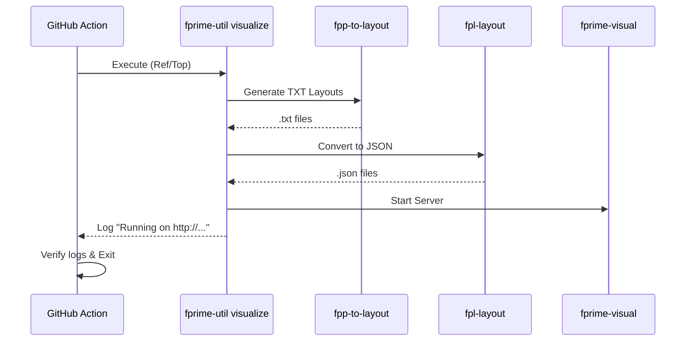

# Page: Topology Visualization: fprime-util visualize

# Topology Visualization: fprime-util visualize

<details>
<summary>Relevant source files</summary>

The following files were used as context for generating this wiki page:

- [.github/workflows/fprime-tools-ci.yml](.github/workflows/fprime-tools-ci.yml)
- [.github/workflows/integration-tests.yml](.github/workflows/integration-tests.yml)
- [.github/workflows/publish.yml](.github/workflows/publish.yml)
- [pyproject.toml](pyproject.toml)
- [setup.py](setup.py)
- [src/fprime/fpp/cli.py](src/fprime/fpp/cli.py)
- [src/fprime/fpp/common.py](src/fprime/fpp/common.py)
- [src/fprime/fpp/visualize.py](src/fprime/fpp/visualize.py)
- [src/fprime/util/code_formatter.py](src/fprime/util/code_formatter.py)

</details>


The `fprime-util visualize` command provides an automated pipeline for generating and serving graphical representations of F´ topologies. It integrates the FPP toolchain (`fpp-to-layout`), the FPL layout engine (`fpl-layout`), and a Flask-based web server (`fprime-visual`) to render interactive diagrams of component connections.

## Visualization Pipeline Architecture

The visualization process is orchestrated by the `run_fprime_visualize` function [src/fprime/fpp/visualize.py:23-134](). It transforms FPP model definitions into JSON layout data and launches a local web server to display the results.

### Data Flow Diagram: FPP to GUI
This diagram maps the transformation of data from FPP source files to the final web representation.

| Stage | Tool/Entity | Input | Output |
| :--- | :--- | :--- | :--- |
| **1. Layout Generation** | `fpp-to-layout` | `locs.fpp`, `*.fpp` | `*Layout/*.txt` files |
| **2. Connection Parsing** | `fpl-layout` | `*.txt` (stdin) | `*.json` (stdout) |
| **3. Aggregation** | `run_fprime_visualize` | Multiple `.txt` contents | `Topology.json` |
| **4. Web Hosting** | `fprime-visual` | `viz_cache` directory | `http://localhost:7000` |

**Sources:** [src/fprime/fpp/visualize.py:30-133](), [src/fprime/fpp/common.py:30-53]()

### Execution Logic
The pipeline follows a strict execution order:

1.  **Environment Setup**: Inherits the build environment from `builder.settings` [src/fprime/fpp/visualize.py:60-61]().
2.  **Cache Initialization**: Creates a `viz_cache_base` directory (either user-specified via `--working-dir` or a temporary directory) [src/fprime/fpp/visualize.py:53-58]().
3.  **fpp-to-layout**: Invokes the FPP utility to produce intermediate text-based layout descriptions in the `txt` sub-cache [src/fprime/fpp/visualize.py:73-80]().
4.  **fpl-layout Conversion**: For every generated `.txt` file, `fpl-layout` is called via `subprocess.run` to convert the text to a JSON graph [src/fprime/fpp/visualize.py:101-112]().
5.  **Aggregation**: All text contents are concatenated into `topology_connections` to generate a single master `Topology.json` file representing the entire deployment [src/fprime/fpp/visualize.py:114-121]().
6.  **Server Launch**: The `fprime_visual.flask.app.construct_app` function is called with the `SOURCE_DIRS` configuration, and the system's default browser is opened to the GUI port [src/fprime/fpp/visualize.py:124-130]().

**Sources:** [src/fprime/fpp/visualize.py:23-134]()

## Implementation Details

### CLI Registration
The command is registered via `add_fpp_viz_parsers` [src/fprime/fpp/visualize.py:136-168]().

| Argument | Description | Default |
| :--- | :--- | :--- |
| `--gui-port` | The port on which the Flask app listens. | `7000` |
| `--working-dir` | Persistent directory for layout JSONs. If omitted, uses `tempfile`. | `None` |

**Sources:** [src/fprime/fpp/visualize.py:157-167]()

### Code Entity Interaction Map
This diagram shows how the `fprime-util` classes interact with external CLI tools and the Flask application.

```mermaid
graph TD
    subgraph "fprime-tools (Python Space)"
        "fprime-util" -- "calls" --> "run_fprime_visualize"["run_fprime_visualize()"]
        "run_fprime_visualize" -- "instantiates" --> "FppUtility"["FppUtility('fpp-to-layout')"]
        "run_fprime_visualize" -- "calls" --> "construct_app"["fprime_visual.flask.app.construct_app()"]
    end

    subgraph "External Executables (System Space)"
        "FppUtility" -- "executes" --> "fpp-to-layout"["fpp-to-layout"]
        "run_fprime_visualize" -- "subprocess.run" --> "fpl-layout"["fpl-layout"]
    end

    subgraph "Output Artifacts (Filesystem)"
        "fpp-to-layout" -- "writes" --> "txt_cache"["viz_cache/txt/*.txt"]
        "fpl-layout" -- "writes" --> "json_cache"["viz_cache/*.json"]
    end

    "construct_app" -- "reads" --> "json_cache"
```

**Sources:** [src/fprime/fpp/visualize.py:73-127](), [src/fprime/fpp/common.py:30-53]()

### Dependency Validation
The utility performs runtime checks for required external packages:
*   **fprime-visual**: Checked via `try...except ImportError` on `fprime_visual.flask.app` [src/fprime/fpp/visualize.py:17-20]().
*   **fpl-layout**: Validated using `shutil.which("fpl-layout")`. Requires `fprime-fpp > 1.2.0` [src/fprime/fpp/visualize.py:47-50]().

## CI and Validation

The visualization pipeline is validated in the `visualizer-integration` job of the GitHub Actions workflow [ .github/workflows/integration-tests.yml:69-99]().

### Integration Test Procedure
1.  **Environment**: Ubuntu-latest with Python 3.12 [ .github/workflows/integration-tests.yml:70-84]().
2.  **Setup**: Clones `nasa/fprime` (devel branch) and installs the current `fprime-tools` in editable mode [ .github/workflows/integration-tests.yml:75-89]().
3.  **Execution**: Runs `fprime-util generate` followed by a timeout-wrapped `fprime-util visualize` in the `fprime/Ref/Top` directory [ .github/workflows/integration-tests.yml:92-95]().
4.  **Verification**: Greps the log output to ensure layout files were generated and the Flask server started successfully [ .github/workflows/integration-tests.yml:97-98]().



**Sources:** [ .github/workflows/integration-tests.yml:69-99](), [src/fprime/fpp/visualize.py:99-124]()
