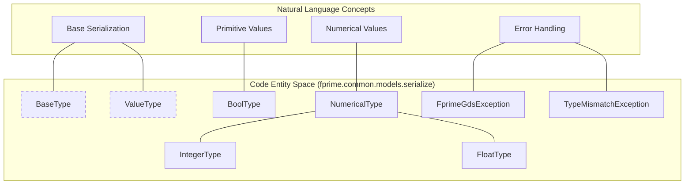
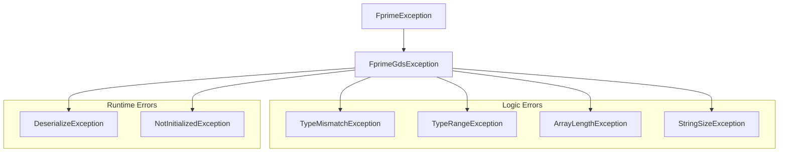

# Page: Type System and Primitive Types

# Type System and Primitive Types

Relevant source files

The following files were used as context for generating this wiki page:

- [src/fprime/common/models/serialize/bool_type.py](src/fprime/common/models/serialize/bool_type.py)
- [src/fprime/common/models/serialize/enum_type.py](src/fprime/common/models/serialize/enum_type.py)
- [src/fprime/common/models/serialize/numerical_types.py](src/fprime/common/models/serialize/numerical_types.py)
- [src/fprime/common/models/serialize/type_base.py](src/fprime/common/models/serialize/type_base.py)
- [src/fprime/common/models/serialize/type_exceptions.py](src/fprime/common/models/serialize/type_exceptions.py)

The `fprime-tools` type system provides a Python-based representation of F´ architectural types, enabling the serialization and deserialization of data exchanged between an F´ deployment and ground software. This system mirrors the C++ types defined in the F´ framework, including primitive integers, floating-point numbers, booleans, and complex structures like arrays and serializables.

Currently, the type system in `fprime-tools` acts as a **compatibility layer**. The core implementation has been migrated to the `fprime-gds` package to centralize ground system logic. The modules within `fprime.common.models.serialize` serve as shims that redirect to `fprime_gds.common.models.serialize` while providing `DeprecationWarning` notices to developers [src/fprime/common/models/serialize/type_base.py:10-14]().

## Type Hierarchy and Base Classes

The foundation of the serialization system is built upon a hierarchical class structure that defines how values are stored, validated, and converted to binary formats.

### Core Base Classes
- **`BaseType`**: The root abstract class for all serializable types in the F´ ecosystem [src/fprime/common/models/serialize/type_base.py:17-21]().
- **`ValueType`**: A base class for types that represent a single value (e.g., primitives) [src/fprime/common/models/serialize/type_base.py:17-21]().
- **`DictionaryType`**: A base class for types that are defined within the F´ dictionary metadata [src/fprime/common/models/serialize/type_base.py:17-21]().

### Type System Entity Mapping
The following diagram illustrates the relationship between the natural language concepts of the F´ type system and the specific Python entities that implement them.

**F´ Type System Entity Mapping**

**Sources:** [src/fprime/common/models/serialize/type_base.py:17-21](), [src/fprime/common/models/serialize/numerical_types.py:20-34](), [src/fprime/common/models/serialize/type_exceptions.py:20-38]()

---

## Numerical Types

F´ supports a specific set of numerical types that map directly to standard C types (e.g., `stdint.h`). These are categorized into `IntegerType` and `FloatType` under the `NumericalType` umbrella [src/fprime/common/models/serialize/numerical_types.py:4-8]().

| F´ Type | Python Class | C++ Equivalent | Description |
| :--- | :--- | :--- | :--- |
| **u8** | `U8Type` | `U8` / `uint8_t` | 8-bit unsigned integer |
| **u16** | `U16Type` | `U16` / `uint16_t` | 16-bit unsigned integer |
| **u32** | `U32Type` | `U32` / `uint32_t` | 32-bit unsigned integer |
| **u64** | `U64Type` | `U64` / `uint64_t` | 64-bit unsigned integer |
| **i8** | `I8Type` | `I8` / `int8_t` | 8-bit signed integer |
| **i16** | `I16Type` | `I16` / `int16_t` | 16-bit signed integer |
| **i32** | `I32Type` | `I32` / `int32_t` | 32-bit signed integer |
| **i64** | `I64Type` | `I64` / `int64_t` | 64-bit signed integer |
| **f32** | `F32Type` | `F32` / `float` | 32-bit floating point |
| **f64** | `F64Type` | `F64` / `double` | 64-bit floating point |

**Sources:** [src/fprime/common/models/serialize/numerical_types.py:20-34]()

---

## Boolean and Enumerated Types

### BoolType
The `BoolType` class handles the serialization of boolean values. In the F´ binary protocol, booleans are typically serialized as a single byte (0 for False, 1 for True), though the Python implementation abstracts this into a standard interface [src/fprime/common/models/serialize/bool_type.py:16]().

### EnumType
The `EnumType` class represents F´ enums. Each `EnumType` instance is associated with a set of valid string representations and their corresponding integer values.
- **`REPRESENTATION_TYPE_MAP`**: A mapping used to determine the underlying integer size (e.g., `I32`) used to serialize the enum value [src/fprime/common/models/serialize/enum_type.py:16-19]().

---

## Type Exceptions

The `type_exceptions` module defines a robust set of errors used by the serialization engine to ensure data integrity during encoding and decoding [src/fprime/common/models/serialize/type_exceptions.py:16-17]().

**Serialization Exception Hierarchy**

**Key Exception Roles:**
- **`TypeMismatchException`**: Raised when a value provided for serialization does not match the expected type [src/fprime/common/models/serialize/type_exceptions.py:25]().
- **`TypeRangeException`**: Raised when a numerical value exceeds the bounds of its type (e.g., assigning 300 to a `U8Type`) [src/fprime/common/models/serialize/type_exceptions.py:23]().
- **`DeserializeException`**: Raised when binary data cannot be correctly parsed into the target type [src/fprime/common/models/serialize/type_exceptions.py:30]().
- **`NotInitializedException`**: Raised when attempting to serialize a type instance that has not been assigned a value [src/fprime/common/models/serialize/type_exceptions.py:32]().

**Sources:** [src/fprime/common/models/serialize/type_exceptions.py:17-38]()

---

## Implementation Redirection Pattern

All modules in the `fprime.common.models.serialize` package follow a standard shim pattern to maintain backward compatibility while the codebase transitions to the GDS-hosted implementation.

1. **Warning**: A `DeprecationWarning` is issued upon import [src/fprime/common/models/serialize/type_base.py:10-14]().
2. **Attempted Import**: The module attempts to import the actual implementation from `fprime_gds.common.models.serialize` [src/fprime/common/models/serialize/type_base.py:16-21]().
3. **Error Handling**: If `fprime-gds` is not installed, an `ImportError` is raised with instructions to install the required package [src/fprime/common/models/serialize/type_base.py:22-27]().

This pattern ensures that existing tools and scripts using `fprime-tools` continue to function without immediate code changes, provided the environment is correctly configured.

**Sources:** [src/fprime/common/models/serialize/type_base.py:10-27](), [src/fprime/common/models/serialize/bool_type.py:8-25](), [src/fprime/common/models/serialize/enum_type.py:8-25]()
