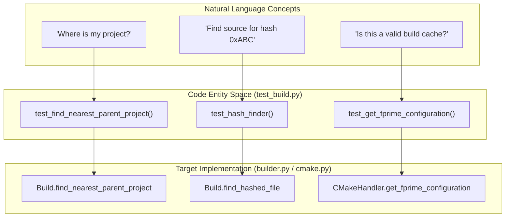
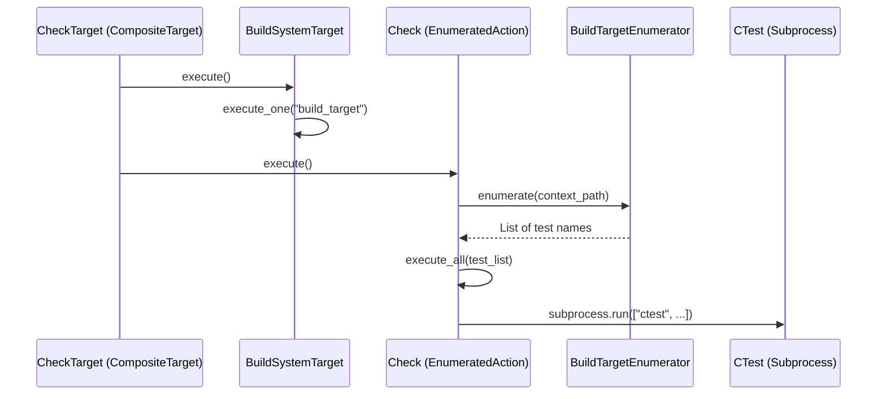

# Page: Unit Tests

# Unit Tests

Relevant source files

The following files were used as context for generating this wiki page:

- [src/fprime/fbuild/__init__.py](src/fprime/fbuild/__init__.py)
- [src/fprime/fbuild/builder.py](src/fprime/fbuild/builder.py)
- [src/fprime/fbuild/check.py](src/fprime/fbuild/check.py)
- [src/fprime/fbuild/enumerator.py](src/fprime/fbuild/enumerator.py)
- [src/fprime/fbuild/settings.py](src/fprime/fbuild/settings.py)
- [src/fprime/fbuild/types.py](src/fprime/fbuild/types.py)
- [src/fprime/util/versioning.py](src/fprime/util/versioning.py)
- [test/fprime/fbuild/cmake-data/external/CMakeCache.txt](test/fprime/fbuild/cmake-data/external/CMakeCache.txt)
- [test/fprime/fbuild/cmake-data/grand-unified/CMakeCache.txt](test/fprime/fbuild/cmake-data/grand-unified/CMakeCache.txt)
- [test/fprime/fbuild/cmake-data/subdir/CMakeCache.txt](test/fprime/fbuild/cmake-data/subdir/CMakeCache.txt)
- [test/fprime/fbuild/cmake-data/testbuild/CMakeLists.txt](test/fprime/fbuild/cmake-data/testbuild/CMakeLists.txt)
- [test/fprime/fbuild/cmake-data/testbuild/settings.ini](test/fprime/fbuild/cmake-data/testbuild/settings.ini)
- [test/fprime/fbuild/cmake-data/testbuild/subdir1/CMakeLists.txt](test/fprime/fbuild/cmake-data/testbuild/subdir1/CMakeLists.txt)
- [test/fprime/fbuild/cmake-data/testbuild/subdir1/build-fprime-automatic-abcdefg/CMakeCache.txt](test/fprime/fbuild/cmake-data/testbuild/subdir1/build-fprime-automatic-abcdefg/CMakeCache.txt)
- [test/fprime/fbuild/cmake-data/testbuild/subdir1/subdir2/subdir3/build-fprime-automatic-default/CMakeCache.txt](test/fprime/fbuild/cmake-data/testbuild/subdir1/subdir2/subdir3/build-fprime-automatic-default/CMakeCache.txt)
- [test/fprime/fbuild/settings-data/settings-custom-install.ini](test/fprime/fbuild/settings-data/settings-custom-install.ini)
- [test/fprime/fbuild/settings-data/settings-custom-toolchain.ini](test/fprime/fbuild/settings-data/settings-custom-toolchain.ini)
- [test/fprime/fbuild/settings-data/settings-empty.ini](test/fprime/fbuild/settings-data/settings-empty.ini)
- [test/fprime/fbuild/settings-data/settings-outside-cookiecutter.ini](test/fprime/fbuild/settings-data/settings-outside-cookiecutter.ini)
- [test/fprime/fbuild/test_build.py](test/fprime/fbuild/test_build.py)
- [test/fprime/fbuild/test_enumerators.py](test/fprime/fbuild/test_enumerators.py)
- [test/fprime/fbuild/test_settings.py](test/fprime/fbuild/test_settings.py)
- [test/fprime/fbuild/test_target.py](test/fprime/fbuild/test_target.py)
- [test/fprime/fpp/test_common.py](test/fprime/fpp/test_common.py)
- [test/fprime/util/commands_unit_test.py](test/fprime/util/commands_unit_test.py)
- [test/fprime/util/data/malformed.cpp](test/fprime/util/data/malformed.cpp)
- [test/fprime/util/data/well-formed.cpp](test/fprime/util/data/well-formed.cpp)
- [test/fprime/util/test_code_formatter.py](test/fprime/util/test_code_formatter.py)
- [test/fprime/util/test_cookiecutter_wrapper.py](test/fprime/util/test_cookiecutter_wrapper.py)

The `fprime-tools` unit test suite is built using the `pytest` framework and is designed to validate the core logic of the build system abstraction, settings management, FPP integration, and utility functions. The tests are located primarily in the `test/fprime/` directory, mirroring the structure of the `src/fprime/` source tree.

## Test Suite Architecture

The testing infrastructure relies on a combination of mock objects (via `unittest.mock`) and static test fixtures (data files) to simulate complex build environments without requiring a full F´ framework installation.

### Core Test Components

| Test Module | Target Component | Key Validations |
|---|---|---|
| `test_build.py` | `fprime.fbuild.builder.Build` | Build cache loading, hash-to-file lookups, project detection. |
| `test_settings.py` | `fprime.fbuild.settings.IniSettings` | INI parsing, environment variable interpolation, path resolution. |
| `test_target.py` | `fprime.fbuild.target.Target` | Target registration, composite target execution, scope validation. |
| `test_common.py` | `fprime.fpp.common.FppUtility` | FPP input resolution (`locs.fpp`), subprocess command generation. |
| `test_code_formatter.py` | `fprime.util.code_formatter` | Clang-format integration, extension filtering, backup logic. |
| `test_enumerators.py` | `fprime.fbuild.enumerator` | Target discovery strategies (Basic, Multi, Recursive). |

**Sources:** `test/fprime/fbuild/test_build.py` [1-54](), `test/fprime/fbuild/test_settings.py` [24-158](), `test/fprime/fbuild/test_target.py` [10-194]().

---

## Build System Testing

The `test_build.py` module validates the `Build` class and its interaction with the `CMakeHandler`. It uses the `cmake-data` directory to simulate different project layouts.

### Build Layout Discovery
The suite tests three primary directory structures defined in `test/fprime/fbuild/cmake-data/`:
1. **Grand-Unified**: Framework and project are in the same tree.
2. **Subdir**: Framework is a subdirectory of the project.
3. **External**: Framework and project are in separate, unrelated paths.

### Natural Language to Code Entity: Build Validation
This diagram shows how user-level concepts (like finding a project) map to specific test functions and the classes they exercise.

**Sources:** `test/fprime/fbuild/test_build.py` [40-55](), [72-96](), [178-195](), `src/fprime/fbuild/builder.py` [28-53]().

---

## Settings and Configuration Testing

The `test_settings.py` module ensures that `settings.ini` files are parsed correctly across various platforms and configurations.

### Interpolation and Path Resolution
A critical part of the test suite is verifying `EnvironmentVariableInterpolation` [src/fprime/fbuild/settings.py:19-48](). The tests set environment variables like `TEST_SETTING_1` and verify that `IniSettings.load` correctly resolves them within the INI structure [test/fprime/fbuild/test_settings.py:150-158]().

### Settings Test Cases
The suite uses a parameterized-style list of dictionaries to test different scenarios:
* **`settings-empty.ini`**: Validates default values for `framework_path` and `install_destination` [test/fprime/fbuild/test_settings.py:27-43]().
* **`settings-custom-install.ini`**: Validates override of `install_destination` [test/fprime/fbuild/test_settings.py:45-63]().
* **`settings-environment.ini`**: Validates the `[environment]` section parsing and interpolation [test/fprime/fbuild/test_settings.py:131-147]().

**Sources:** `src/fprime/fbuild/settings.py` [19-48](), [78-111](), `test/fprime/fbuild/test_settings.py` [24-158]().

---

## Target and Enumerator Logic

The target system uses a registry pattern to manage build actions. Tests in `test_target.py` ensure that targets are correctly registered and that `CompositeTarget` instances dispatch to their children.

### Target Execution Flow
The following diagram illustrates the data flow during a `check` command execution, which involves a `CompositeTarget` and `EnumeratedAction`.

### Key Target Functions Tested
* `Target.register_target`: Validates the internal `__REGISTRY` dictionary [test/fprime/fbuild/test_target.py:37-48]().
* `CompositeTarget.is_supported`: Ensures a composite target is only supported if all its children are supported [test/fprime/fbuild/test_target.py:129-142]().
* `BasicBuildTargetEnumerator.enumerate`: Validates the conversion of filesystem paths to CMake module names via `CMakeHandler.get_cmake_module` [src/fprime/fbuild/enumerator.py:53-71]().

**Sources:** `src/fprime/fbuild/target.py` [10-194](), `src/fprime/fbuild/check.py` [24-98](), `src/fprime/fbuild/enumerator.py` [44-71]().

---

## Utility and FPP Integration Tests

### FPP Utility Logic
`test_common.py` validates how `fprime-tools` invokes FPP binaries. It mocks the `subprocess.run` calls to ensure that the `FppUtility` class correctly handles:
* **Imports as Sources**: Passing all files as positional arguments [test/fprime/fpp/test_common.py:69-90]().
* **Imports as Flags**: Passing files via the `-i` flag (e.g., for `fpp-check`) [test/fprime/fpp/test_common.py:92-114]().

### Code Formatter
`test_code_formatter.py` ensures that `ClangFormatter` correctly filters files by extension.
* `stage_file`: Tests that `.cpp` files are accepted while `.txt` files are rejected unless explicitly allowed via `allow_extension` [test/fprime/util/test_code_formatter.py:27-82]().
* `execute`: Tests both the formatting mode (modifying files) and the check mode (returning non-zero exit codes for malformed files) [test/fprime/util/test_code_formatter.py:103-146]().

**Sources:** `test/fprime/fpp/test_common.py` [23-115](), `test/fprime/util/test_code_formatter.py` [14-146]().
